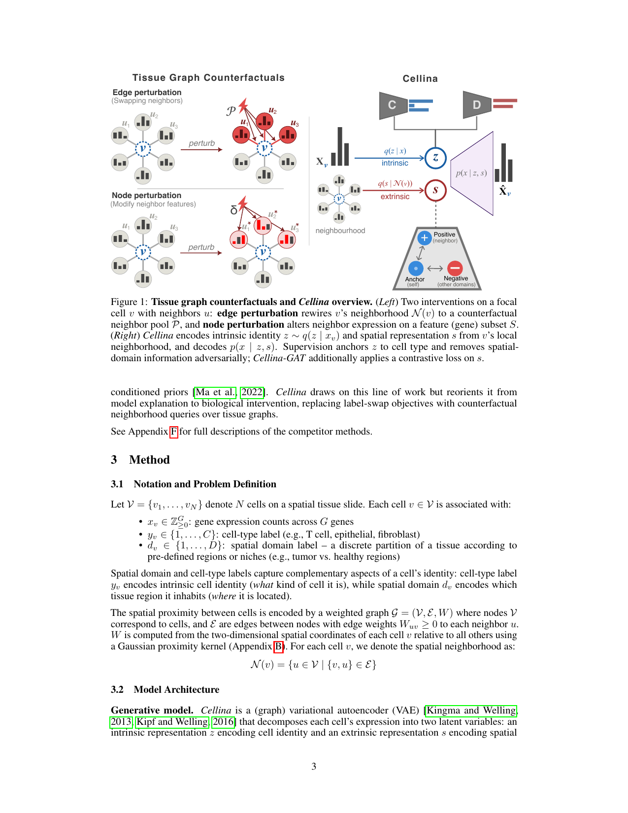
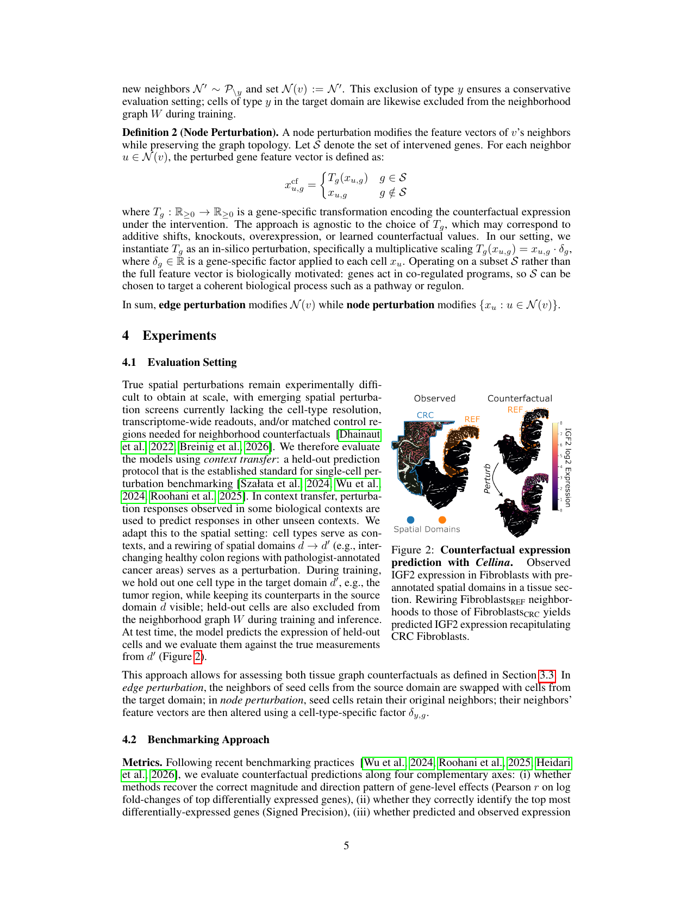
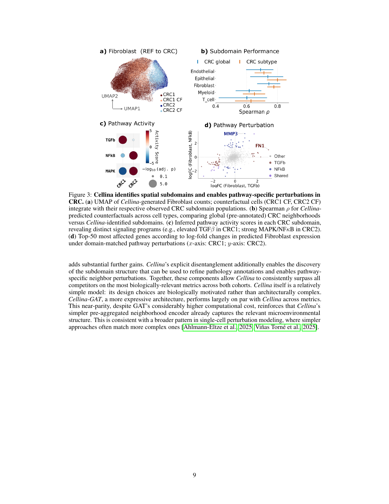

# **Querying Counterfactuals on Tissue Graphs with Supervised Disentanglement** 

**Abdul Moeed****1, 2** **Stefan Schrod****1,3** **Martin Rohbeck****1** **Marc Jan Bonder****4,5** **Pavlo Lutsik****6** **Oliver Stegle****1,3,7,†** **Daniel Dimitrov****1,3,†** 

1Division of Computational Genomics and Systems Genetics, German Cancer Research Center (DKFZ), Heidelberg, Germany 

2Helmholtz Information & Data Science School for Health, Germany 

3Genome Biology Unit, European Molecular Biology Laboratory, Heidelberg, Germany 

4Department of Genetics, University Medical Center Groningen, University of Groningen, Groningen, The Netherlands 

5Oncode Institute, Utrecht, The Netherlands 

6KU Leuven, Leuven, Belgium 

7Wellcome Sanger Institute, Wellcome Genome Campus, Hinxton, UK 

> †Corresponding: `daniel.dimitrov@embl.de` , `o.stegle@dkfz-heidelberg.de` 

## **Abstract** 

_Tissue graph counterfactuals_ ask how a cell’s expression would change under altered spatial neighbor contexts. Such queries are central to predicting cell behavior in tissues, but lack a unified definition, with existing methods targeting specific intervention types or treating cells as i.i.d. In this work, we first formalize _tissue graph counterfactuals_ as a class of spatial interventions that either rewire connections between cells ( _edge perturbation_ ) or modify the expression of their neighbors ( _node perturbation_ ). We then introduce _Cellina_‡ , a framework that uses supervised disentanglement to decompose a cell’s intrinsic state from its spatial context, using the latter as a conditioning input for counterfactual predictions. Across benchmarks spanning over 2.5 million spatially-resolved cells in colorectal cancer and mouse brain, _Cellina_ outperforms spatially-informed and non-spatial competitors in insilico graph perturbations, disentanglement, and scalability. Additionally, we show that _Cellina_ reveals biologically distinct cancer subdomains in an unsupervised manner and enables targeted neighbor perturbation simulations. 

## **1 Introduction** 

A central goal of single-cell biology is to predict how cells respond to perturbations and how these responses transfer to conditions that have not been directly measured [Bunne et al., 2024, Roohani et al., 2025, Dimitrov et al., 2026]. Existing methods typically rely on at least one of two assumptions: (i) that perturbations act as shared stimuli applied uniformly across cells, and (ii) that cells are conditionally independent, giving rise to an effectively i.i.d. learning problem. Tissues violate both assumptions. In living organisms, a cell’s transcriptional state is shaped by its local neighborhood: the composition of nearby cells and the signals they emit [Armingol et al., 2021]. Consequently, modeling tissues requires methods that reason about neighbor-driven stimuli, which are unique to every cell. This motivates two natural prediction tasks: what would a cell express if placed in a different neighborhood, or if its neighbors expressed different genes or pathways? We formalize these as _tissue graph counterfactuals_ : interventions on either the edges of a cell’s neighborhood ( _edge perturbation_ ) or the expression of its neighbors ( _node perturbation_ ), corresponding to the two mutable components of the tissue graph (see Section 3.3). 

> ‡ `https://cellina.readthedocs.io` 

Preprint. 

We present _Cellina_ , a (graph) variational autoencoder (VAE) that renders tissue graph counterfactuals tractable by separating each cell’s gene expression into two latent components: an intrinsic representation _z_ encoding cell identity, and an extrinsic (spatial) representation _s_ encoding the effect of its microenvironment. Purely unsupervised factorization is not identifiable without inductive biases or supervision [Locatello et al., 2019]; we therefore inject biological supervision (cell-type and spatial-domain labels) as an explicit inductive bias. By doing so, we anchor _z_ to cell-type identity and adversarially remove spatial-domain information, routing microenvironmental variation to _s_ by removing it from _z_ . Unlike conditional-prior approaches with formal identifiability guarantees [Khemakhem et al., 2020], this supervision is a biologically motivated soft inductive bias, which we show measurably improves both disentanglement and generalization. We validate this separation under out-of-distribution regimes via in silico neighborhood alterations. A model that conflates intrinsic and extrinsic variation cannot succeed at this task, making it a principled test of whether the representations separate intrinsic from microenvironmental variation [Schölkopf et al., 2021]. 

### **Contributions:** 

1. We formalize _tissue graph counterfactuals_ as a class of spatial interventions encompassing edge and node perturbations; thereby we provide a unified framework for studying neighborhood-driven cell responses. 

2. We introduce _Cellina_ , a dual-encoder graph VAE with supervised disentanglement, and show that it outperforms spatially informed and uninformed baselines on counterfactual prediction. On colorectal cancer data, our best _Cellina_ variant leads the strongest baseline by +0 _._ 17 on both Pearson and Signed Precision; on the whole-mouse-brain cohort, it remains top-ranked across two held-out spatial domains. 

3. We use _Cellina_ ’s disentangled spatial representation to identify biologically distinct cancer subdomains without supervision, and to simulate pathway-targeted neighbor perturbations using existing priors. 

## **2 Related Work** 

**Perturbations and context transfer.** scGen [Lotfollahi et al., 2019] and CPA [Hetzel et al., 2022, Lotfollahi et al., 2023] are standard methods for predicting cellular responses to perturbations. Both models assume i.i.d. data, and neither represents continuous neighbor composition or cellspecific spatial contexts. More recent methods based on optimal transport [Bunne et al., 2023] and flow matching [Klein et al., 2025] model individual cell trajectories, yet still work on the same shared-stimulus intervention assumption. Extending this paradigm to tissue perturbations requires disentangling intrinsic cellular state from extrinsic influence, and reasoning about continuous variation in individual neighborhoods rather than shared or discretized stimuli. 

**Spatially-informed disentanglement.** A related line of work leverages spatial information to separate intrinsic cell states from extrinsic tissue influences. For example, MISTy [Tanevski et al., 2022] and NCEM [Fischer et al., 2023] model neighborhood effects through multi-view regression and graph neural networks, respectively, while SIMVI [Dong et al., 2025] uses a graph VAE with unsupervised disentanglement to isolate spatially-induced variation. These approaches yield interpretable decompositions of spatial scales, but do not support counterfactual queries. 

**Tissue graph perturbations.** The state-of-the-art methods most directly related to modeling tissue graph counterfactuals in spatial omics are MintFlow [Akbarnejad et al., 2025], Concert [Lin et al., 2025], Celcomen [Megas et al., 2025], and SpatialProp [Sun et al., 2025]. Celcomen models spatial in silico perturbations through learned gene-gene interactions, but learns a global interaction matrix shared across the tissue, perturbing gene values rather than nodes or edges. SpatialProp recently proposed modeling the downstream effects of neighbor perturbations, making it directly related to our _node perturbation_ task. MintFlow and Concert both perform _in silico_ perturbations via label conditioning, but MintFlow approaches it via graph operations, enabling adaptation to our _edge perturbation_ task. Critically, none of these methods jointly define edge and node perturbations as distinct instances of tissue graph counterfactuals. 

**Graph counterfactuals.** The broader graph ML literature offers a complementary perspective: counterfactual reasoning over graphs has been explored via instance-level adjacency perturbations for explainability [Lucic et al., 2022, Bajaj et al., 2021], and in generative graph VAEs with input- 

2 

Figure 1: **Tissue graph counterfactuals and** **_Cellina_ overview.** ( _Left_ ) Two interventions on a focal cell _v_ with neighbors _u_ : **edge perturbation** rewires _v_ ’s neighborhood _N_ ( _v_ ) to a counterfactual neighbor pool _P_ , and **node perturbation** alters neighbor expression on a feature (gene) subset _S_ . ( _Right_ ) _Cellina_ encodes intrinsic identity _z ∼ q_ ( _z | xv_ ) and spatial representation _s_ from _v_ ’s local neighborhood, and decodes _p_ ( _x | z, s_ ). Supervision anchors _z_ to cell type and removes spatialdomain information adversarially; _Cellina-GAT_ additionally applies a contrastive loss on _s_ . 

conditioned priors [Ma et al., 2022]. _Cellina_ draws on this line of work but reorients it from model explanation to biological intervention, replacing label-swap objectives with counterfactual neighborhood queries over tissue graphs. 

See Appendix F for full descriptions of the competitor methods. 

## **3 Method** 

### **3.1 Notation and Problem Definition** 

Let _V_ = _{v_ 1 _, . . . , vN }_ denote _N_ cells on a spatial tissue slide. Each cell _v ∈V_ is associated with: 

- _xv ∈_ Z_G_ _≥_ 0:gene expression counts across_G_genes 

- _yv ∈{_ 1 _, . . . , C}_ : cell-type label (e.g., T cell, epithelial, fibroblast) 

- _dv ∈{_ 1 _, . . . , D}_ : spatial domain label – a discrete partition of a tissue according to pre-defined regions or niches (e.g., tumor vs. healthy regions) 

Spatial domain and cell-type labels capture complementary aspects of a cell’s identity: cell-type label _yv_ encodes intrinsic cell identity ( _what_ kind of cell it is), while spatial domain _dv_ encodes which tissue region it inhabits ( _where_ it is located). 

The spatial proximity between cells is encoded by a weighted graph _G_ = ( _V, E, W_ ) where nodes _V_ correspond to cells, and _E_ are edges between nodes with edge weights _Wuv ≥_ 0 to each neighbor _u_ . _W_ is computed from the two-dimensional spatial coordinates of each cell _v_ relative to all others using a Gaussian proximity kernel (Appendix B). For each cell _v_ , we denote the spatial neighborhood as: 

_N_ ( _v_ ) = _{u ∈V | {v, u} ∈E}_ 

### **3.2 Model Architecture** 

**Generative model.** _Cellina_ is a (graph) variational autoencoder (VAE) [Kingma and Welling, 2013, Kipf and Welling, 2016] that decomposes each cell’s expression into two latent variables: an intrinsic representation _z_ encoding cell identity and an extrinsic representation _s_ encoding spatial 

3 

influence. Both have standard normal priors, Normal(0 _, I_ ). The likelihood _p_ ( _x | z, s_ ) is a Negative Binomial distribution, which is common practice in single-cell modeling [Lopez et al., 2018, Gayoso et al., 2022], parametrized by a decoder Dec([ _z_ ; _s_ ]) (where [ _·_ ; _·_ ] denotes concatenation; details in Appendix D.1). The approximate posteriors of both latent variables are diagonal Gaussians and sampled via the reparameterization trick [Kingma and Welling, 2013]. 

**Inference.** We propose two variants of the model, both of which use an MLP encoder Enc _z_ ( _x_ ) to estimate the variational posterior _q_ ( _z | x_ ) = Normal( _µz_ ( _x_ ) _, σz_2(_x_)), and differ in how_s_is encoded: 

- **Cellina** uses a degree-normalized aggregation of neighbor expression _φ_ ( _v_ ) = �� _u∈N_ ( _v_ )_Wuvx_˜_u_ ���� _u∈N_ ( _v_ )_Wuv_ � where _x_ ˜ _u ∈_ R_G_ denotes log-normalized _xu_ ; encoded via an MLP encoder Enc _s_ ( _φ_ ) that outputs _µs, σs_ . 

- **Cellina-GAT** replaces the fixed aggregator with a multi-layer GATv2 [Brody et al., 2021] operating on _v_ ’s local subgraph ( _xv, {xu}u∈N_ ( _v_ ) _, Ev, Wuv_ ) (where _Ev ⊆E_ is an edge set of _N_ ( _v_ )); self-loops are excluded so _v_ ’s own expression is captured by _z_ alone, and _µs, σs_ are linear heads on the focal-node representation. For this variant, we additionally add a modified contrastive loss _L_ spatial (Appendix D). 

These two variants trade off efficiency and expressivity: _Cellina_ ’s linear aggregator decouples neighborhood construction from training and exhibits training-time scaling similar to non-spatial baselines (Figure A6), whereas _Cellina-GAT_ learns attention over each subgraph at additional computational cost per step (Appendix D.2). 

**Supervised disentanglement.** Because optimizing the ELBO of the VAE alone does not prevent _z_ from absorbing spatially-driven variation, we introduce two auxiliary objectives that route spatial signal to _s_ by removing it from _z_ . Specifically, (i) we anchor _z_ to cell-type identity using a cell type classifier with loss _L_ clf , and (ii) adversarially strip spatial-domain information from _z_ through a two-part adversarial objective. First, _L_ disc is optimized to train the discriminator to predict the domain label from _z_ ; second, _L_ adv is optimized to encourage the encoder to render _z_ domaininvariant. For _Cellina-GAT_ , we also add a custom graph-supervised contrastive loss _L_ spatial to _s_ , as a biologically grounded inductive bias that promotes similarity within local neighborhoods, while separating distinct region domains. We show that its addition improves latent informativeness and fit quality (Appendix E). The combined training objective (minimized in step 2 over encoder and decoder parameters) follows as: 

where _α_ are data-adaptive normalization scales fixed after the first training epoch. 

**Training procedure.** We optimize this objective via alternating updates: (1) a discriminator step that updates the discriminator on detached _z_ (encoder parameters frozen), and (2) a VAE step that updates encoder and decoder with the discriminator frozen, using the combined objective above. Alternating updates ensure the discriminator provides informative gradients to the encoder [Goodfellow et al., 2014]; For more details see Appendix D. 

### **3.3 Tissue Graph Counterfactuals** 

A tissue graph counterfactual asks: _what would cell v express if its neighborhood context were altered, while its intrinsic identity remained fixed?_ The tissue graph _G_ has two mutable components: its edges _E_ with associated weights _W_ , encoding neighborhood topology, and the neighbor node feature matrix _X_ , encoding cell expression. This naturally gives rise to two counterfactual queries: 

**Definition 1 (Edge Perturbation).** An edge perturbation intervenes on a cell’s local neighborhood _N_ ( _v_ ), replacing the neighborhood with an alternative _N__′_ : 

This admits arbitrary modifications to neighborhood topology, including the addition, removal, or substitution of neighbors. In this work, we evaluate **edge perturbation** as an in-silico domain edge rewiring. Let _Iy ⊂V_ denote the set of focal cells from the source domain _d_ with cell type _y_ , whose counterfactual expression we wish to predict (here, _counterfactual_ refers to in silico graph perturbations). Let _P\y ⊂V_ be the set of cells in target domain _d__′_ that are observed as spatial neighbors of cell type _y_ in _d__′_ , excluding cells of type _y_ themselves. For a focal cell _v ∈Iy_ , we sample 

4 

shifts agree in absolute magnitude (RMSE of log fold-change vectors), and (iv) overall distributional fit (E-distance). All metrics are assessed for each held-out cell type; formal definitions and an expanded metrics set with per-cell-type breakdown appear in Appendices A and G. 

**Competitor methods.** We consider the following methods (see Appendix F for full descriptions): 

- _Mean shift_ : an average expression shift between domains, applied to each cell type, and motivated by similar baselines [Ahlmann-Eltze et al., 2025, Viñas Torné et al., 2025] 

- _scGen, CPA_ : spatially-uninformed perturbation latent-shift and compositional autoencoders, which treat the spatial domain as a label embedding or shift [Lotfollahi et al., 2019, 2023] 

- _SpatialProp_ : an efficient GNN-based method tailored for in-domain prediction of neighbor perturbations [Sun et al., 2025] 

- _MintFlow_ : a spatially-informed flow-matching model for in-domain tissue perturbations via neighbor cell-type label swapping, adapted to our edge perturbation task [Akbarnejad et al., 2025]. MintFlow is trained on all cells, including held-out cell types. 

SIMVI [Dong et al., 2025] was excluded from our counterfactual evaluations due to a lack of native support for such queries and prohibitive GPU memory requirements (Figure A6); a disentanglement comparison shows _Cellina_ outperforms it (Appendix H). 

We evaluate three variants of Cellina: (1) _Cellina_ is the base model, combining a spatial encoder over pre-aggregated neighborhoods with auxiliary supervision on _z_ : a cell-type classifier and an adversarial domain discriminator, which together encourage the intended factorization of _z_ and _s_ . (2) _Cellina (ablated)_ is a reduced variant of _Cellina_ that does not consider the supervision components, retaining only the dual-encoder architecture and continuous neighborhood encoding in _s_ . (3) _Cellina-GAT_ replaces the pre-aggregated spatial encoder with a graph attention network that models neighborhoods via explicit message passing and a custom contrastive loss on _s_ , yielding a more expressive but computationally expensive variant; see Section 3. 

### **4.3 Results** 

### **Cellina accurately predicts in-silico perturbations in colorectal cancer data.** 

To evaluate counterfactual predictions in a clinically relevant setting, we consider a spatial transcriptomics dataset of approximately 2.4 million cells across six colorectal cancer tissue slides (an 18,000-gene panel, see Appendix B) [Crowell et al., 2025]. We use pathologist-annotated tissue regions, specifically healthy colonic mucosa (REF) and colorectal cancer (CRC), to define the counterfactual task: predict how a REF cell of type _y_ would look under the CRC domain. Concretely, we pair each REF _y_ cell with counterfactual neighbors sampled from CRC cells that neighbor cell type _y_ in the CRC domain. We then evaluate the predicted expression against held-out CRC cells of the same cell type _y_ . Details of dataset pre-processing and splits are provided in Appendix B. 

All three _Cellina_ variants outperform every baseline method with clear margins that hold across individual patient slides and cell types; _Cellina-GAT_ edges ahead on Pearson (0 _._ 85) and RMSELFC (1 _._ 14) while base _Cellina_ matches it on Signed Precision (0 _._ 40) (Table 1). Base _Cellina_ outperforms the strongest non- _Cellina_ baseline by substantial margins (+0 _._ 14 Pearson, +0 _._ 17 Signed Precision, _−_ 0 _._ 21 RMSE). Even _Cellina (ablated)_ , trained without cell-type or domain supervision, leads all non- _Cellina_ methods on correlation and precision, a result we attribute to encoding continuous, cell-resolved neighborhoods. Supervised disentanglement adds a further +0 _._ 12 Pearson in the full model, which more effectively disentangles spatial-domain-related variation in _s_ (Appendix H). MintFlow, which also leverages neighbor information, remains competitive among baselines but still falls short of _Cellina_ . 

The mean shift baseline, which applies a group-average expression change without knowledge of individual neighborhoods is competitive with other methods and slightly outperforms scGen on Pearson _r_ . This is consistent with recent work showing that tailored perturbation models often fail to improve on population averages [Viñas Torné et al., 2025, Ahlmann-Eltze et al., 2025, Wu et al., 2024]. scGen achieves the best E-distance (4.65), followed by _Cellina (ablated)_ , as models that encode variation into unconstrained latents can achieve better sample-level distribution. This points to a potential trade-off between distributional fidelity (E-distance) and gene-level recovery: Pearson _r_ and Signed Precision more directly capture whether the magnitude and direction of the response are 

6 

preserved – a key property when predictions are used to guide downstream biological interpretation and follow-up experiments. 

**Node perturbation evaluation.** Next, we evaluate _Cellina_ in the same (REF _→_ CRC) regime, but under a node-perturbation setting: rather than changing the neighborhood context entirely, we retain each focal cell’s original neighbors and shift their expression by cell-type-specific log-fold vectors _δy,g_ (top 200 genes) that reflects the expression difference between REF and CRC (Appendix J). By design, SpatialProp is the direct alternative to predict the effect of node perturbations; in this evaluation, _Cellina_ outperforms it by a considerable margin across all four metrics. 

Across variants, _Cellina_ under **edge perturbation** performs on par with **node perturbation** on most metrics. We also see that the number of perturbed genes _k_ controls the extent of the feature shift, with performance largely converging at _k ≈_ 200 before declining as noisy gene shifts are applied (Appendix J). Nevertheless, **node perturbations** are more targeted, enabling modeling of scenarios where only specific gene programs in the microenvironment are modified – an _in silico_ intervention we explore in Experiments 4.4. 

Table 1: Leave-one-celltype-out performance (top 50 DEGs) for predicting the counterfactual state of healthy colon cells placed in tumor region (REF _→_ CRC). Mean _±_ std across cell types and patient samples. **node-pert** refers to node perturbation task. Best per metric within each block (edgevs. node-perturbation) in **bold** ; _Cellina_ in gray. _Cellina_ ranks first on Pearson, Signed Precision, and RMSELFC; margins over the best baseline are consistent across slides though within the (high) cross-cell-type standard deviation. 

|Method|Pearson_↑_|Precisionsigned_↑_|E-distance_↓_|RMSELFC_↓_|
|---|---|---|---|---|
|Mean shift|0.51_±_0.26|0.18_±_0.15|29.89_±_10.49|5.08_±_2.51|
|CPA|0.68_±_0.19|0.22_±_0.19|6.44_±_2.27|1.50_±_0.56|
|scGen|0.50_±_0.37|0.19_±_0.20|**4.65**_±_**3.49**|1.99_±_0.84|
|MintFlow|0.65_±_0.31|0.23_±_0.21|13.01_±_1.76|1.51_±_0.43|
|Cellina (ablated)|0.70_±_0.26|0.30_±_0.22|5.07_±_1.71|1.50_±_0.91|
|Cellina|0.82_±_0.18|**0.40**_±_**0.19**|7.55_±_1.14|1.29_±_0.64|
|Cellina-GAT|**0.85**_±_**0.15**|**0.40**_±_**0.18**|9.35_±_1.75|**1.14**_±_**0.62**|
|Cellinanode-pert|**0.85**_±_**0.16**|**0.41**_±_**0.18**|**7.82**_±_**1.23**|**1.23**_±_**0.70**|
|Cellina-GATnode-pert|0.73_±_0.21|0.32_±_0.20|8.32_±_1.80|1.47_±_0.71|
|SpatialPropnode-pert|0.40_±_0.32|0.07_±_0.16|33.07_±_10.46|6.44_±_1.03|

### **Cellina performs competitively across tissue and species in the mouse brain.** 

To further assess multi-domain generalization, we repeat the same evaluation on a whole-adult-mouse MERFISH cohort [Zhang et al., 2023], comprising a 1,122-gene panel with ~146K cells across three slides. Here, two independently annotated spatial domains (Fiber-tracts and Isocortex) were held out, testing whether performance transfers beyond a single disease context. Across held-out domains (Table 2), _Cellina_ variants again outperform all baselines across three of the four metrics; here _Cellina-GAT_ ties or outperforms _Cellina_ on three of the four metrics (excluding E-distance). scGen posts the lowest E-distance (5 _._ 74), followed closely by CPA and _Cellina_ -variants with mean shift and Mintflow far behind. This indicates that _Cellina_ ’s _s_ captures microenvironmental structure across spatial contexts and species without appreciably sacrificing distributional fidelity. The nodeperturbation ranking likewise holds, with _Cellina-GAT_ leading SpatialProp by a safe margin (Pearson +0 _._ 16, Signed Precision +0 _._ 44, RMSELFC _−_ 1 _._ 08). 

### **4.4** **_Cellina_ captures biologically meaningful within-domain heterogeneity.** 

To assess whether _Cellina_ ’s spatial latent _s_ captures biologically meaningful variation, we examine how it differentiates cells within the same domain. We cluster the latent _s_ over CRC cells to discover spatially autocorrelated subdomains [DeTomaso and Yosef, 2021], and select the two most distinct modules (denoted CRC1 and CRC2). In UMAP space, reconstructed Fibroblast counts from CRC1 and CRC2 form clearly separated clusters, and counterfactual Fibroblasts (REF _→_ CRC1/2) integrate well with each respective subdomain (Figure 3(a)). This suggests that _s_ captures meaningful variation across these microenvironments. We confirm this quantitatively: counterfactual predictions 

7 

Table 2: Leave-one-celltype-out performance (top 50 DEGs) for the counterfactuals Thalamus _→_ Isocortex, Fiber-tracts. Mean _±_ std across cell types and slides, averaged over holdout domains; full results in Appendix Table A2. Best per metric within each block (edge- vs. node-perturbation) in **bold** . _Cellina_ <u>generalizes to spatial transcriptomics across tissues and species.</u> 

|Method|Pearson_↑_|Precisionsigned_↑_|E-distance_↓_|RMSELFC _↓_|
|---|---|---|---|---|
|Mean shift|0.43_±_0.23|0.12_±_0.09|25.16_±_4.69|10.98_±_2.78|
|CPA|0.82_±_0.16|0.42_±_0.13|7.02_±_2.33|6.40_±_4.76|
|scGen|0.77_±_0.17|0.21_±_0.13|**5.74**_±_**4.81**|6.53_±_4.05|
|MintFlow|0.81_±_0.17|0.29_±_0.16|19.58_±_1.73|7.24_±_5.41|
|Cellina (ablated)|0.79_±_0.15|0.37_±_0.17|8.96_±_5.31|6.86_±_4.48|
|Cellina|0.83_±_0.16|0.47_±_0.15|8.01_±_1.36|6.25_±_4.81|
|Cellina-GAT|**0.85**_±_**0.15**|**0.52**_±_**0.14**|8.69_±_1.45|**5.80**_±_**4.50**|
|Cellinanode-pert|0.82_±_0.16|0.47_±_0.15|9.07_±_1.86|6.31_±_4.76|
|Cellina-GATnode-pert|**0.85**_±_**0.15**|**0.51**_±_**0.14**|**8.60**_±_**1.43**|**5.86**_±_**4.43**|
|SpatialPropnode-pert|0.69_±_0.14|0.07_±_0.07|22.40_±_3.16|6.94_±_2.56|

conditioned on neighborhoods sampled from the matched subdomain outperform those conditioned on neighborhoods from the global CRC domain, across all five cell types (Figure 3(b)). 

**Subdomains recover interpretable signaling programs.** To interpret CRC1 and CRC2 biologically, we score their gene modules against PROGENy pathway gene sets [Schubert et al., 2018, Badia-i Mompel et al., 2022], recovering distinct signaling profiles (Figure 3(c)): TGF _β_ -dominant for CRC1 and NF _κ_ B/MAPK-dominant for CRC2. These signatures arise without direct supervision and are consistent with the signaling heterogeneity reported by Crowell et al. [2025]. 

**Pathway-specific neighbor perturbations recapitulate biologically grounded responses.** We next ask whether prior pathway knowledge alone suffices to reproduce these subdomain responses (Figure 3(d)). Encouragingly, performing node perturbations with PROGENy pathway weights as alteration vectors _δg_ recovers the subdomain effects to a large extent (Pearson _r_ = 0 _._ 77 (TGF _β→_ CRC1) and _r_ = 0 _._ 76 (NF _κ_ B _→_ CRC2)). Notably, the two most up-regulated genes predicted by our model (FN1 and MMP3) are consistent with established TGF _β_ /NF _κ_ B fibroblast programs: TGF _β_ signalling is a canonical driver of extracellular-matrix production (FN1), while NF _κ_ B activation induces matrixremodelling metalloproteinases (MMP3) - observed hallmarks of cancer-associated fibroblast and immune microenvironments [Crowell et al., 2025]. 

## **5 Discussion and Conclusion** 

Foundational models of single cells are scaling rapidly [Bunne et al., 2024], yet most still treat cells as independent samples [Rood et al., 2024]. For such models to succeed, they must predict how a cell behaves as a function of its neighborhood. Previous work has demonstrated compelling instances of modeling tissue counterfactuals: _in silico_ cell-type depletion and swapping via label manipulation, including regulatory T cell modulation relevant to cellular therapy [Akbarnejad et al., 2025]; combinatorial queries on perturbations and covariates in interventional spatial data [Lin et al., 2025]; and gradual microenvironment steering, paired with causal analyses linking perturbation predictions to downstream response [Sun et al., 2025]. Our formalization of tissue counterfactuals unifies these instances, providing the single-cell genomics community a common language for building and evaluating models that predict how cells respond to altered neighborhoods. While such counterfactuals remain generative hypotheses requiring wet-lab validation, they hold the promise of querying virtual cell responses, not in isolation but in context, and reducing the experimental search space. 

Spatial neighborhoods are continuous, compositionally heterogeneous contexts, and averaging over coarse labels or shifts ignores the variation within them. Two design choices follow directly from this observation and underpin _Cellina_ ’s performance. First, encoding neighborhoods continuously yields a strong prior even without any supervision: _Cellina (ablated)_ , trained without cell-type or domain labels, already outperforms or matches all non- _Cellina_ baselines. Second, supervised disentanglement 

8 

### **Limitations and future directions.** 

_Cellina_ ’s supervised disentanglement objectives rely on cell-type and spatial-domain annotations, themselves simplifications of continuous biology, which bounds how well the spatial latent _s_ can reflect neighborhood variation. The underlying imaging-based spatial transcriptomics data also depend on cell segmentation, which remains error-prone: transcripts are frequently misassigned across cell boundaries and can dominate downstream niche and neighbor-influence analysis [Mitchel et al., 2026]. Future methods that integrate raw imaging signal alongside segmented counts could denoise both the expression signal and the counterfactuals derived from it. 

Moreover, we interpret _counterfactuals_ operationally, as simulated outcomes under altered inputs and contexts, rather than in the strict Pearlian sense, which presupposes a fully specified structural causal model. _Cellina_ ’s latent decomposition is compatible with this interpretation. It does not yet impose the structural assumptions [Khemakhem et al., 2020, Lachapelle et al., 2022] required for identifiability, but its architecture could be extended to incorporate them in future work – for instance, by combining it with sparse mechanism priors [Lachapelle et al., 2022, Lopez et al., 2023]. Finally, emerging spatial perturbation screens [Dhainaut et al., 2022, Breinig et al., 2026], though currently limited in scale and resolution, are beginning to provide spatially resolved interventional readouts that could ground these predictions empirically. 

## **Acknowledgments and Disclosure of Funding** 

The authors’ work is supported through state funds approved by the State Parliament of BadenWürttemberg for the Innovation Campus Health + Life Science alliance Heidelberg Mannheim, the Data Science Collaborative Research Programme 2022 by the Novo Nordisk Foundation (grant NNF22OC0076414), the Priority Program Translational Oncology of the Deutsche Krebshilfe (grant number 70115167), the Helmholtz Association under the joint research school “HIDSS4Health – Helmholtz Information and Data Science School for Health.”, and the European Research Council (Synergy Grant DECODE 810296). We also thank Philipp Sven Lars Schaeffer, Ahmet Rifaioglu, Elyas Heidari, Rama Abdulhamid, Ricardo Ramirez Flores, and Julio Saez-Rodriguez for their feedback. 

## **Code Availability** 

_Cellina_ is available at `https://github.com/PMBio/cellina` . Scripts and configurations required to download all data and reproduce the experiments presented in this work are available at `https: //github.com/PMBio/cellina-reproducibility` . We provide tutorials for _Cellina_ and _CellinaGAT_ , here: `https://cellina.readthedocs.io/` . 

10 

## **A Evaluation Metrics** 

All metrics are computed using library-size–normalized gene expression, with fixed library size _ℓ_ 0 = 104 . Let _c_(obs) _g,v_ denote the observed raw count of gene _g_ in cell _v_ , and _c_(pred) _g,v_ the corresponding model-predicted raw count. We convert both to normalized expression as 

We consider perturbation settings where each gene is evaluated between a control and a perturbed condition. The log-fold change (logFC) for gene _g_ is defined as 

logFC _g_ = log( _p_(pert) _g_ + 1) _−_ log( _p_(ctrl) _g_ + 1) _,_ 

computed either from observed data or from model predictions. 

For observed data, _p_( _g__·_) denotes the empirical mean of normalized expression across cells in the corresponding condition. For model predictions, the model outputs raw counts ˆ _c_(pert) _g,v_ , which are first normalized and then averaged: 

and analogously for the control condition. 

In all cases, _p_ denotes library-size–normalized gene expression, either computed from observed counts, predicted counts, or model-specific mean parameters (e.g., NB mean for generative models or inverse-transformed outputs for log-normalized models such as scGen). The observed and predicted log-fold change vectors are thus defined as: 

We restrict evaluation to the top differentially expressed genes defined as 

**Pearson** _r_ : Pearson correlation between observed and predicted log-fold changes across genes i.e. between **real** and **pred** . 

**Spearman** _ρ_ : Spearman rank correlation between **real** and **pred** . 

**Signed Precision** : This metric represents the sign-coherent overlap of the top- _n_ genes with strongest effects in observed and predicted logFC vectors, where “top- _n_ ” is user-specific (50 in our experiments), and sorted according to the largest absolute values. It counts how many features are selected in both top- _n_ sets and have matching signs, then normalizes that count by _n_ , making it sensitive to directionality of logFC of overlapping differentially expressed genes in predicted and observed vectors. 

**RMSE (counts)** : Root mean squared error between predicted and observed counts on ground-truth differentially expressed (DE) genes 

For better readability, we report log10(RMSEcounts). 

**RMSE (log-fold change)** : This metric evaluates magnitude differences between predicted and ground truth logFC on a selected set of differentially expressed genes. It computes the root mean squared error (RMSE) between the ground-truth and predicted values restricted to that gene set. 

15 

**E-distance (local)** : Energy distance is a widely used distribution-level metric for single-cell data [Peidli et al., 2024], measuring overall distributional difference between _X_ (observed) and _Y_ (predicted) populations. We use a local variant of E-distance proposed in [Heidari et al., 2026], which restricts pairwise comparisons to _k_ -nearest neighborhoods, improving sensitivity to disruptions in gene-gene co-expression patterns that global E-distance may fail to detect. We use _k_ =10 and negated Euclidean distances as the similarity kernel so that higher kernel values correspond to closer cells. Computed as: 

## **B Data Availability and Pre-processing** 

**Colorectal Cancer Patient Cohort.** We downloaded the processed CRC data [Crowell et al., 2025] as AnnData files from Zenodo (https://zenodo.org/records/15574384). On each slide, we apply a standard feature selection procedure (Seurat-flavor) to subset each slide to the 2000 highly variable genes implemented in `scanpy` [Wolf et al., 2018]. The original CRC dataset contains eight slides, two of which (slide IDs 110, 222) were not used in our analyses for the following reasons: slide 110 contained sequencing artefacts in the form of major empty patches disrupting neighborhood computations, while slide 222 did not contain any REF cells. For evaluations, we merged fine-grained subtypes (e.g., epithelial subpopulations annotated as Epi1-Epi4) into broad cell type categories. This was important: such subtypes are typically domain-specific, so retaining them would conflate cell type identity with domain (e.g., cancer vs. healthy Epithelial cells). 

For the disentanglement benchmark, all sections were merged into a single dataset prior to model fitting. For all other evaluations and downstream applications presented in this work, models were instead fit on one section at a time. 

**Whole-brain Mouse Cohort.** We downloaded the MERFISH whole-brain mouse cohort [Zhang et al., 2023] from the CZI CELLxGENE portal (https://datasets.cellxgene.cziscience.com/93c3bb97ea05-4ee0-a760-a1508cd04612.h5ad), from which we selected three adjacent coronal slides from the mid-brain (C57BL6J-2.036, C57BL6J-2.039, C57BL6J-2.041). Given the limited number of genes profiled in this dataset, we retained all features without further selection. We further restricted the analysis to three anatomical domains, selected based on (i) their overall abundance, (ii) their consistent representation across the three selected sections, and (iii) the diversity of cell types they contained. Of these, the Thalamus was used as the source domain, while Fiber-Tracts and Isocortex served as target domains. 

**Graph Pre-processing (shared).** We process each sample independently to compute a spatial neighbor graph using a Gaussian proximity kernel with bandwidth _σ_ = 100 µm, consistent with the physical length scales at which neighboring cells exchange molecular signals [Armingol et al., 2021]: 

where _d_ ( _u, v_ ) is the Euclidean distance between cell centroids. _Wuv_ is set to zero for pairs outside the _k_ = 200 nearest neighbors of either cell or when _Wuv < τ_ = 0 _._ 1; self-loops are excluded ( _Wvv_ = 0). For _Cellina-GAT_ , we use the same graph with _k_ = 50 and use binary edge weights ( _Wuv ∈{_ 0 _,_ 1 _}_ ), letting attention learn edge importance during message passing. 

16 

## **C Hyperparameters, Architecture, and Running Time Details** 

We implement _Cellina_ using the `scvi-tools` API [Gayoso et al., 2022] – a standard framework in single-cell genomics. Hence we adopt the default hyperparameters and best practices recommended by `scvi-tools` . To ensure a consistent comparison, all methods are evaluated using their default settings across experiments and whenever possible using count likelihoods. 

**Compute Resources.** All experiments were conducted on GPU machines with four NVIDIA GeForce RTX 4090, AMD Ryzen Threadripper PRO 7975WX 32-Cores, and 500GB of RAM. 

We provide training times for competitors and _Cellina_ variants in Figure A6. A single training and inference run of _Cellina_ takes approximately one hour on the CRC slides from [Crowell et al., 2025] and approximately 20 minutes on the mouse brain data from [Zhang et al., 2023]. The counterfactual evaluations reported in Tables 1 and 2 are the most expensive experiments, requiring roughly ten and two days of compute, respectively. The ablation sweeps in the Appendix require three to five days, while the remaining appendix experiments each complete within one day. In total, all reported experiments required approximately two to three weeks of GPU time on the hardware described above. 

Table A1: Architecture and training hyperparameters. _Cellina_ uses a VAE architecture, with standard defaults for single-cell data, trained with unit loss weights across all regularization terms. 

|Component|Parameter|Cellina|Cellina-GAT|
|---|---|---|---|
|_z_-encoder|Hidden dim|128|128|
|_z_-encoder|Layers|2|3|
|_z_-encoder|Latent dim_d_|64|64|
|_s_-encoder|Hidden dim|128|128|
|_s_-encoder|Layers|2|3|
|_s_-encoder|Latent dim_d_|64|64|
|Decoder|Hidden dim|128|128|
|Decoder|Layers|2|3|
|Discriminator|Hidden dim|32|32|
|Discriminator|Layers|2|2|
|GNN|Convolution|—|GATv2|
|Training|Batch size|2048|256|
|Training|Max epochs|100 |100 |
|Training|Learning rate|10_−_3|10_−_3 |
|Training|Weight decay|—|10_−_4|
|Training|KL warmup|linear,0_→_1|linear,0_→_1|
|Training|_λ_clf|1|1|
|Training|_λ_disc|1|1|
|Training|_λ_spatial|0|1|
|Spatial graph|Bandwidth|100_µ_m|100_µ_m|
|Spatial graph|Kernel|Gaussian|—|
|Spatial graph|Max neighbours|200|50|
|Spatial graph|Cutoff|0.1|—|
|Count Decoding|Distribution|Negative Binomial|Negative Binomial|

## **D Model Details and Training Objective** 

### **D.1 Generative model** 

_Cellina_ is a (graph) variational autoencoder [Kingma and Welling, 2013, Kipf and Welling, 2016] with two latent variables: 

- _z ∈_ R_k_ : intrinsic cell identity, capturing variation independent of spatial context 

- _s ∈_ R_k_ : spatial niche representation, capturing microenvironmental variation 

The joint generative model is: 

_p_ ( _x, z, s_ ) = _p_ ( _x | z, s_ ) _p_ ( _z_ ) _p_ ( _s_ ) 

17 

with standard normal priors _p_ ( _z_ ) = _p_ ( _s_ ) = Normal(0 _, Ik_ ). 

The likelihood used in the evaluations throughout this study is a Negative Binomial (NB) distribution over counts, a standard choice in modeling single-cell data [Lopez et al., 2018, Gayoso et al., 2022], with parameters produced by a decoder operating on [ _z_ ; _s_ ] _∈_ R2_k_ : 

where _b_ is a one-hot-encoded sequencing batch covariate injected into the decoder, _µθ ∈_ R_G_ _>_ 0, _rθ ∈_ R_G_ _>_ 0are learnable per-gene mean and inverse dispersion parameters, and_ℓ_= log � _g__xg_is the observed log-library size used to scale the NB rate. The decoder input dimensionality is 2 _k_ , reflecting the concatenation of both latent variables. The model supports conditioning on _b_ in both the encoders and the decoder, but all experiments reported in this work use a single batch, so _b_ is fixed and omitted from the main-text notation. 

### **D.2 Inference model** 

Both _Cellina_ variants share the _z_ encoder (an MLP with counts as input); they differ only in how the niche input is constructed and how _s_ is encoded, as detailed below. 

The approximate posterior factorizes differently per variant: 

where _Gv_ = (˜ _xv, {x_ ˜ _u}u∈N_ ( _v_ ) _, Ev_ ) denotes _v_ ’s local subgraph. Both variants share how _z_ is encoded: an MLP parameterizing a diagonal Gaussian over counts, 

**Cellina (base).** The niche input is the degree-normalized aggregation of log-normalized neighbor expression. Let _N_ ( _v_ ) = _{u_ : _Wuv >_ 0 _}_ and _X_˜ _∈_ R_N×G_ the matrix of log-normalized counts, where 

with _ℓu_ denoting the library size (total counts per cell). Spatial weights are given by a Gaussian proximity kernel as described in equation (1). The niche feature vector is then: 

a simple degree-normalized aggregation of neighbor expression. The _s_ encoder is an MLP: 

**Cellina-GAT.** The _s_ encoder is replaced by a graph neural network _fs_ that processes _v_ ’s local subgraph (˜ _xv, {x_ ˜ _u}u∈N_ ( _v_ ) _, Ev_ ) directly, where _Ev_ is the local edge set derived from the same proximity graph _W_ (i.e. _Ev_ = _{{u, v}_ : _Wuv >_ 0 _}_ ); edges are binarized ( _Wuv ∈{_ 0 _,_ 1 _}_ ), so GATv2 receives only the graph topology — attention weights are learned entirely from gene expression. _fs_ is a multi-layer GATv2 [Brody et al., 2021], implemented via `pytorch-geometric` [Fey and Lenssen, 2019]. Self-loops are excluded: _v_ ’s own expression is captured by _z_ ; _fs_ aggregates only neighbor contributions. The posterior conditions on the local subgraph: 

where _µ__G_ _s_and_σ_ _s_2 _G_ are linear projections applied to the seed-node representation after _L_ rounds of message passing. 

Samples are drawn via the reparameterization trick [Kingma and Welling, 2013]. 

18 

### **D.3 Training objective** 

**ELBO.** The variational lower bound is: 

where _βt_ is a KL warmup schedule increasing linearly from 0 to 1 [Gayoso et al., 2022], and for _Cellina-GAT_ , we replace _φv_ with _Gv_ . The size of the library is treated as observed ( _ℓ_ = log� _g__xg_), so no KL term appears in the library. We minimize the negative ELBO: 

**Dual supervised disentanglement on** _z_ **.** Optimizing _L_ VAE alone does not prevent _z_ from absorbing spatial variation. To enforce a meaningful partition, we apply two additional objectives exclusively to _z_ . 

We write ∆_K_ = _{p ∈_ R_K_ _≥_ 0: � _i__pi_= 1_}_for the (_K−_1)-dimensional probability simplex and sg(_·_) for the stop-gradient operator sg. 

A cell-type classifier _f_ clf : R_k_ _→_ ∆_C_ is trained jointly to predict the cell-type label _y_ from _z_ : 

An adversarial domain discriminator _f_ disc : R_k_ _→_ ∆_D_ is trained in a two-step alternating procedure. In step 1 (VAE frozen), the discriminator is trained to predict the spatial domain label _d_ from a detached _z_ : 

In step 2 (discriminator frozen), the VAE is trained to fool the discriminator by maximizing its entropy, that is, minimizing the negated cross-entropy with weight _−_ 1: 

In the base _Cellina_ variant, _s_ is unsupervised; _Cellina-GAT_ additionally applies a graph contrastive loss on _s_ . 

**Spatial contrastive loss for** **_Cellina-GAT_ .** For the _Cellina-GAT_ variant we additionally consider a modified graph-supervised contrastive loss on _s_ . The loss operates on the _ℓ_ 2-normalised spatial-latent posterior mean 

and uses scaled cosine similarity sim _τ_ ( _v, u_ ) = _s_ ˆ_⊤_ _v__s_ˆ_u/τ_with temperature_τ_= 0_._25.For a mini-batch of anchor cells _B ⊆V_ and an anchor _v ∈B_ , define 

_P_ ( _v_ ) = _N_ ( _v_ ) (positives: spatial neighbors of _v_ ) _Q_ ( _v_ ) = _{ u ∈V_ : _du_ = _dv, u ∈N/_ ( _v_ ) _∪{v} }_ (negatives: different-domain non-neighbors) _A_ ( _v_ ) = _P_ ( _v_ ) _∪Q_ ( _v_ ) _._ 

The per-anchor loss is 

and the batch-level loss averages over anchors with at least one valid positive and negative, both subsampled from _B_ : 

19 

This is a variant of SupCon [Khosla et al., 2020], in which positives are induced by the spatial graph _E_ rather than by class label, while supervision enters through the negative set via domain labels _dv_ . Treating local neighborhood membership as the positive criterion encodes a biologically-motivated inductive bias - a cell’s relevant microenvironment is its immediate spatial context, not the coarse domain partition. Same-domain non-neighbors are excluded from both sets, avoiding ambiguous supervision from cells whose spatial relationship to the anchor is uninformative. For example, cells at the extremes of the same domain (or tissue region) may be completely unrelated. 

### **D.4 Loss normalization** 

The user-set weights _λ_ clf , _λ_ disc, _λ_ adv, and _λ_ spatial (Table A1) control the relative importance of each auxiliary objective but do not account for the inherent scale differences between the reconstruction loss and the auxiliary terms. To prevent any auxiliary objective from dominating training, we additionally compute fixed normalization scales _α_ from the raw loss values observed during the first training epoch: 

where overbars denote epoch-0 means and _ϵ_ =1e-8. These scales are fixed after the first epoch. The full training objective in step 2 is then: 

minimized over encoder and decoder parameters, with the discriminator frozen. Ablation studies in Supplementary E show that this normalization substantially reduces sensitivity to the choice of _λ_ clf , _λ_ disc, and _λ_ spatial, with unit weights, used throughout our work, providing a robust default. 

### **D.5 Adversarial training procedure** 

The two-step alternating training is implemented via PyTorch Lightning’s manual optimization ( `https://github.com/Lightning-AI/pytorch-lightning` ). The VAE optimizer covers all parameters except the discriminator head; the discriminator optimizer covers the discriminator head only. In each training step: 

**Step 1.** Freeze VAE. Sample _z_ without gradients. Minimize discriminator cross-entropy: 

**Step 2.** Freeze the discriminator. Minimize VAE + classifier + adversarial loss: 

In step 2, the adversary _λ_ is negated: minimizing _−λ_ adv _·_ E[ _−_ log _f_ adv( _d | z_ )] is equivalent to maximizing the adversary’s cross-entropy - i.e., encoding _z_ such that the adversary cannot recover _d_ . 

## **E Ablation: Loss Weight Sensitivity** 

We ablated each loss weight independently, sweeping one _λ_ at a time over _{_ 0 _,_ 10_−_7 _,_ 10_−_5 _,_ 10_−_3 _,_ 0 _._ 1 _,_ 1 _,_ 10 _,_ 100 _,_ 103 _}_ on a single CRC slide, while holding all other _λ_ values at 10_−_7 . We train five random seeds per setting and evaluate on a 10% holdout via macro-F1 from a logistic regression probe (measuring cell-type and spatial-domain information in the respective latents) and marginal log-likelihood (MLL, _N_ =500 samples). Results are shown in Figure A1. 

**Cell-type classifier (** _λ_ clf **).** As we increase _λ_ clf , cell-type F1 on _z_ improves, indicating that the classifier successfully anchors _z_ to cell identity. We also observe a drop in spatial-domain information carried by _z_ , which we take as evidence that the disentanglement is working as intended. Both effects level off around _λ_ clf = 1, and there is only a modest MLL cost for them. 

**Domain adversary (** _λ_ disc **).** Larger _λ_ disc values push spatial-domain accuracy on _z_ down, showing that the adversary is fulfilling its purpose and stripping domain-level signal from _z_ . We see a small 

20 

accompanying dip in cell-type F1, which is expected due to the entanglement between cell type composition and spatial domain (i.e. domains are to a certain extent defined by their cell type composition). Again, the effect saturates near _λ_ disc = 1, and higher lambdas come at high cost in MLL. 

> **Domain classifier on** loss on _s_ , but it did not improve spatial-domain F1 from _s_ **(** _λ_ domain **_** clf **).** We also experimented with a supervised domain-classification _s_ and introduced a small MLL penalty at _λ_ = 1. We therefore drop this term from _Cellina_ and leave _s_ entirely unsupervised in the base variant. 

**Graph contrastive loss (** _λ_ spatial **,** **_Cellina-GAT_ only).** The modified contrastive loss described above raises spatial-domain F1 from _s_ and gives a slight MLL improvement, which we view as evidence that it provides a useful inductive bias for Cellina’s GAT variant. 

Taken together, MLL stays largely flat around _λ_ = 1 and only degrades for substantially larger values, which suggests that our normalization scheme (Appendix D.4) gives a robust default at unit weights and removes the need for per-dataset tuning. As such, for all experiments reported in this paper, we set _λ_ = 1, and thus omit it from the loss definition in the main text. 

## **F Related Methods** 

**scVI** [Lopez et al., 2018] is a conditional VAE for single-cell RNA-seq data. It models raw counts with a negative binomial (or zero-inflated negative binomial) likelihood, decomposing each cell’s expression into a low-dimensional latent representation and a separately inferred library-size factor. Batch effects (and other covariates) are mitigated by conditioning the encoder and decoder on the corresponding labels, typically encoded as one-hot vectors. scVI is a default choice for dimensionality reduction, and its code base has since been expanded into **scvi-tools** [Gayoso et al., 2022], a probabilistic modeling framework for single-cell omics; several of the related methods in this section, as well as _Cellina_ , are built on scvi-tools. 

**scANVI** [Xu et al., 2021] is a semi-supervised extension of scVI in which the latent space is structured by cell-type identity. On top of scVI’s per-cell latent representation, scANVI introduces a second, label-conditional latent variable and a classifier that predicts the cell-type label from scVI’s latent. During training, labeled cells contribute an additional cross-entropy term, resulting in an explicitly supervised latent. scANVI is widely used for cell-type label transfer, particularly when annotating a query dataset against a labeled reference. 

**scGen** [Lotfollahi et al., 2019] is a VAE that predicts perturbation responses via latent-space arithmetics. The model is trained to reconstruct normalized gene expression profiles through a lowdimensional latent space; the effect of a perturbation is then summarized by a difference vector _δ_ , calculated as the difference between the mean latent representations of perturbed and unperturbed training cells. To predict the response of an unseen (test) cell-type population, _δ_ is added to the latent representation of each unperturbed test cell, and the resulting vector is decoded back to gene expression space. For the two largest slides (120 and 210), scGen’s `predict` functions failed with internal errors which resolved when training on subsets of the slides; we therefore sub-sampled the data for scGen to 30% in these slides. 

**CPA** [Lotfollahi et al., 2023] models single-cell gene expression as additive compositions of disentangled latent factors: a basal cell state plus separate embeddings for each perturbation and covariate (e.g., cell type, drug). Only the basal state is produced by the encoder; perturbation and covariate embeddings are learned per label (or dosage) and added before decoding. Disentanglement is enforced adversarially: auxiliary classifiers are trained to recover the labels from the basal embedding, and the encoder is penalized whenever they succeed. 

**scVIVA** [Levy et al., 2025] is a VAE-based model designed for spatial transcriptomics data. It learns a shared embedding that captures both intrinsic cell state and microenvironment context. To effectively add spatial information in the latent embedding, scVIVA predicts niche gene expression and neighbor composition (proportion of each cell type in a given neighborhood) in addition to denoised gene expression of query cells. It has no mechanism for disentanglement and cannot answer counterfactual questions. 

**SIMVI** [Dong et al., 2025] is a spatially-informed VAE that disentangles gene expression variability into two latent factors: an intrinsic variable _z_ and a spatial variable s. The spatial latent _s_ is inferred 

21 

by aggregating intrinsic representations of neighboring cells via a Graph Attention Network. To promote independence between _z_ and _s_ , SIMVI uses an additional unsupervised regularization: an MMD-based term that promotes independence between ( _z, s_ ) or, alternatively, a mutual-information penalty. We excluded SIMVI from our counterfactual benchmarks because it exceeds available memory at 105 cells on an NVIDIA GeForce RTX 4090 (24 GB VRAM) in our scalability tests (Figure A6), well below our slide _N_ sizes, and does not natively support counterfactual donor-swap or neighbor-feature interventions. 

**MintFlow** [Akbarnejad et al., 2025] is a flow-matching-based generative model with an underlying graphVAE-style encoding and count-specific decoding that disentangles single-cell gene expression into intrinsic and microenvironment-induced components. It learns three latent variables per cell (an intrinsic state and incoming/outgoing spatial signals). MintFlow supports in-domain counterfactual queries via in silico perturbation of the tissue (e.g., relabeling or deleting cells and re-sampling from the generative model), but cannot extrapolate to cell types or contexts unseen during training. Consequently, we provide MintFlow with all cells, including those held out for other methods during training, giving it a strictly in-domain evaluation setting that constitutes an advantage over the other benchmarked approaches. Because MintFlow does not natively support edge swapping of neighbors, we adapted its inference procedure to align it as closely as possible with _Cellina_ : for each target cell, we replace its gene expression vector with that of a randomly selected control cell of the same cell type and then call `generate_insilico_ST_data()` to produce counterfactual counts (matching _Cellina_ ’s sampling procedure). We note that certain trained models raised an internal memory error ( `Expected parameter rate to satisfy the constraint GreaterThan(lower_bound=0.0)` ) at arbitrary checkpoints; in these cases, we evaluated on the last stable checkpoint preceding the error. 

**SpatialProp** [Sun et al., 2025] is a graph neural network model that predicts how perturbations to neighboring cells propagate to a center cell by inferring its gene expression from masked k- hop (2-hop by default) neighborhood graphs. SpatialProp is tailored to in-domain predictions, and its SparseRenorm post-processing calibrates predictions using an empirical error distribution derived from unperturbed (in-distribution) base predictions, which we omit for out-of-distribution perturbation evaluated in this work. Like Cellina, SpatialProp provides functionality to predict downstream effects of perturbations on the spatial microenvironment, enabling direct comparison in neighbor node perturbation setting, via adaptation of this vignette: `https://github.com/ abuendia/spatial-prop/blob/main/notebooks/api_demo.ipynb` . 

**Concert** [Lin et al., 2025] predicts spatially-resolved perturbation responses by disentangling spotlevel expression into learnable embeddings for basal cell state and perturbation or covariate identities, following the LORD framework [Gabbay and Hoshen, 2019, Piran et al., 2024]. Perturbation effects are propagated across the tissue via Gaussian process priors with perturbation-specific Cauchy kernels. Unlike Cellina, Concert simulates perturbations by swapping embeddings for categorical attributes (e.g., perturbation identity, disease state) or interpolating learned projections of continuous attributes (e.g., time, dose), rather than perturbing the continuous neighborhood of seed cells. 

**Celcomen** [Megas et al., 2025] is a generative graph neural network model that disentangles intraand inter-cellular gene regulation in spatial transcriptomics via a maximum-entropy formulation. The model’s parameters are guaranteed to yield identifiability for the gene-gene interaction matrices. It consists of an inference module that learns intra- and inter-cellular gene-gene interaction matrices (under an acyclic regulatory assumption), and a generative simulation module that produces counterfactual spatial samples by intervening on selected nodes (e.g., gene knockouts in specific tissue locations). As such, unlike _Cellina_ , Celcomen targets in silico gene-level perturbations rather than perturbations directly on tissue graphs. 

**Additional notes.** All competing methods are evaluated using their default parameters under the same protocol as _Cellina_ (Section 4.2): identical leave-one-cell-type-out splits and donor pool construction, except for MintFlow as described in Section F where no cells are held-out. Each method receives the input modalities its formulation supports: scGen and CPA are given only cell expression and domain labels, as in their original formulations, and are not provided neighbor composition features. SpatialProp, which does take spatial neighborhoods as input, is evaluated in _node perturbation_ task: a partial neighbor-node perturbation restricted to the top 200 genes, matching the setting used for _Cellina_ node-pert is applied at inference. 

22 

## **G Extended Results** 

**Extended Metrics for Cell-Type Leave-One-Out Evaluation.** Here, we discuss results at the cell-type level for CRC and Merfish datasets across an extended list of metrics. As a reminder, for the colorectal cancer data, we design our experiments around the counterfactual query of predicting the effect of the cancer region on healthy cells (REF _→_ CRC). We employ a leave-one-celltype-out strategy for a comprehensive evaluation of models across samples from six patients. In CRC, _Cellina_ consistently achieves the best performance across all held-out cell types on _Pearson_ and _Spearman ρ_ , with the exception of Epithelial, where MintFlow is competitive, likely because this is the most abundant cell type, and MintFlow observes it during training. On _Signed Precision_ and RMSELFC, _Cellina_ ’s variants demonstrate a clear advantage over all competing methods across all cell types. RMSEcounts and E-distance yield more uniform results across methods, though MintFlow performs slightly worse (Figure A2). All models including _Cellina_ -variants had their best performance for Endothelial cells. To further assess whether _Cellina_ ’s advantage over competitors generalizes to other datasets, we repeat the same evaluation strategy on a whole mouse brain dataset (3 slides chosen, most abundant cell types). We use Thalamus as the control region, while Fiber-tracts and Isocortex are held-out. Both settings are discussed in the main text. Similar results are seen on the MERFISH mouse brain data (Figures A3 and A4), suggesting that _Cellina_ maintains the highest scores in correlation metrics of log-fold changes (as measured by Spearman and Pearson) as well as Signed Precision and RMSELFC, while remaining competitive in distributional metrics (RMSEcounts and E-distance). 

**Biological Application.** We apply _Cellina_ to the CRC 210 tissue section in-domain, then extract the spatial latent representations _s_ for all cells and run Hotspot [DeTomaso and Yosef, 2021] on the tumour sub-population to identify co-expressed gene modules. These modules are subsequently used to label spatially coherent tumour microenvironments, with module-level pathway activity scored against PROGENy [Schubert et al., 2018] gene sets via `decoupler` [Badia-i Mompel et al., 2022] to assign biological identities to each microenvironment. To probe how cellular context shapes gene expression, we then apply neighbourhood perturbations and edge-swapping counterfactuals per cell type, both globally across the tumor and within individual microenvironments, evaluating predictions against observed differential expression. 

## **H Disentanglement Benchmark** 

One of our core claims in this work is that supervised disentanglement improves counterfactual inference on graph-structured data. To demonstrate that _Cellina_ ’s latent factors _z_ and _s_ accordingly absorb cell type and spatial domain information, respectively, we use the single-cell integration benchmark (scIB) package [Luecken et al., 2022] – a comprehensive benchmarking tool for latent factors of single-cell data. Given a categorical label, such as cell type, scIB assigns an aggregate "Bio Conservation" score summarizing multiple clustering metrics such as K-means Normalized Mutual Information (NMI), K-means Adjusted Rand Index (ARI) and Silhouette score. We use the CRC cohort to assess both cell type and spatial domain (niche) conservation (Figure A5). As points of comparison, we take standard single-cell methods such as scVI [Lopez et al., 2018], scANVI [Xu et al., 2021] and scVIVA [Levy et al., 2025] (details in F). Additionally, we compare to MintFlow [Akbarnejad et al., 2025] and SIMVI [Dong et al., 2025], which are designed for disentanglement of spatial and non-spatial variation in single-cells. Each model is trained once on the entirety of CRC data (all six slides together) and aggregate scores for each label are reported on the training set, except for SIMVI, which does not scale to millions of cells (see Section 4 and Appendix F). For SIMVI, we take coherent regions of two slides (231, 242) containing all 3 domain labels, for a total of 40K cells. As SIMVI is evaluated on a smaller and distinct subset, this comparison is not directly controlled; we include it as the best available evidence given its scalability constraints. We observe that not only do _Cellina_ ’s latent _z_ and _s_ encode the desired source of variation, but they also adequately remove the nuisance sources of variation – i.e., _z_ scoring low on niche conservation while _s_ scoring low on cell type clustering. The advantage over SIMVI and MintFlow is particularly notable as all three methods are spatially-informed models designed for exactly this task. This suggests that _Cellina_ ’s explicitly supervised disentanglement adds notable benefits in each latent space as opposed to the implicit or unsupervised disentanglement strategies adopted by MintFlow and SIMVI, respectively. 

23 

## **I Scalability Benchmark** 

Training models on emerging spatial datasets which capture millions of cells can incur major costs in user wall-clock time. It is therefore important that models are not only relatively quick to train, but also able to scale as the number of cells increases. We assess the scalability of all models shown in this work and report findings on three CRC slides (221, 242, 232) with subsampling to 103 , 104 and 105 cells (Figure A6). For a fair comparison, we set the same batch size and number of epochs for each model and only compare the train loop (without pre-processing workloads). _Cellina_ comes out as one of the fastest-to-train models in the benchmark suite, owing to the efficient pseudobulk-based _φ_ ( _v_ ) computed a priori, omitting the expensive message passing from model training over graphs. Training then proceeds with the same complexity as standard scVI with no graph-structure overhead at training time. This contrasts with GAT-based methods (including _Cellina-GAT_ , MintFlow, and SIMVI) that require subgraph sampling during training. 

All methods were trained and evaluated on the same GPU machine with NVIDIA GeForce RTX 4090 GPUs, AMD Ryzen Threadripper PRO 7975WX 32-Cores, and 500GB of RAM. 

## **J Empirical convergence of node perturbation toward edge perturbation** 

Recall that node perturbation modifies a subset _S_ of _k_ genes per neighbor cell. In our experiments, we alter the genes of neighbors in source domains by the log fold-change (logFC) shift _δ_ , representing the average difference between pseudobulked cell populations. Concretely, _δ_ is added to the lognormalized count _x_ ˜ _u,g_ of each neighbor _u_ , i.e. _x_ ˜cf _u,g_=_x_˜_u,g_+_δu,g_for_g∈S_.Specifically,we calculate a **global** and a **cell-type-specific** _δ_ . Let _ℓ_ 0 = 104 denote the target library size, _C__d_ the set of cells in domain _d ∈{_ REF _,_ CRC _}_ , _Cy__d⊆Cd_its restriction to cell type_y_, and_xi,g_the raw count of gene _g_ in cell _i_ . 

- **Global.** Pseudobulk across all cells per domain, _b__d_ _g_= � _i∈C__d xi,g_, library-normalize, and log-transform:˜ _b__d_ _g_= log �1 + _ℓ_ 0 _b__d_ _g__/_� _g__′ b_ _g__d′_ �. The global shift is _δg_ =˜ _bg_CRC _−_˜ _bg_REF . 

- **Cell-type-specific.** Pseudobulk within each cell type _y_ and domain, _b__d_ _y,g_=� _i∈Cy__dxi,g_, library-normalize, and log-transform:˜ _b__d_ _y,g_=log �1 + _ℓ_ 0 _b__d_ _y,g__/_� _g__′ b_ _y,g__d′_ �. The cell-typespecific shift is _δy,g_ =˜ _by,g_CRC_−_˜_b_REF _y,g_. 

Note that _Cellina_ ’s neighborhoods aggregate log1p-normalized expression, while _Cellina-GAT_ operates on raw count data. Accordingly, for Cellina the perturbation is an additive shift in lognormalized space ( _x_ ˜cf = _x_ ˜ + _δ_ ), whereas for _Cellina-GAT_ the equivalent operation is a multiplicative scaling on counts ( _x_cf = _x · e__δ_ ), obtained by exponentiating the logFC shift. As such, _Cellina-GAT_ preserves the gene-specific transformation in counts space _Tg_ : Z _≥_ 0 _→_ Z _≥_ 0. Also, to preserve a strict counterfactual setting, for the held out cell type _y_ , we assign a global _δ\y_ , which excludes that cell type from the calculation. 

In our convergence analyses (Figure A7), we tested the performance of _Cellina_ as _k_ approaches the total number of genes of _G_ , i.e. every gene of every neighbor is altered by _δ_ or _δg,y_ , producing a transcriptome-wide shift for all neighborhoods toward the target domain profile. Here, we see that all four metrics improve with _k_ for both logFC variants and saturate by _k ≈_ 100–200, collapsing shortly after (Figure A7). At _k_ = 200 (in-distribution), the cell-type-specific variant consistently outperforms the global one and reaches Pearson _r ≈_ 0 _._ 89, Signed Precision _≈_ 0 _._ 56, energy distance _≈_ 1 _._ 05, and RMSELFC of 0 _._ 66, compared with the edge perturbation ceiling of 0 _._ 95, 0 _._ 69, 0 _._ 50, and 0 _._ 49 respectively. We assume that this is a biologically-meaningful result: biological perturbations are often assumed to elicit relatively sparse shifts on a few genes, rather than in full expression space [Lopez et al., 2023]. 

24 

Table A2: Leave-one-celltype-out performance (top 50 DEGs). For each slide we first average over the held-out cell types, then report mean _±_ std across 3 slides. Best per metric within each block (edge- vs. node-perturbation) in **bold** . **-np** refers to node perturbation task. 

|Holdout|Method|Pearson _↑_|Precisionsigned _↑_|E-dist _↓_|RMSELFC _↓_|
|---|---|---|---|---|---|
||Mean shift|0.31_±_0.26|0.05_±_0.05|21.32_±_5.59|11.71_±_3.64|
||CPA|0.80_±_0.15|0.31_±_0.13|7.25_±_2.70|7.65_±_5.81|
|Fiber-|scGen|0.72_±_0.20|0.15_±_0.09|**5.28**_±_**4.38**|7.51_±_5.14|
|tracts|MintFlow|0.78_±_0.18|0.21_±_0.16|19.99_±_1.49|8.47_±_6.55|
||Cellina-ablated|0.77_±_0.15|0.27_±_0.15|8.25_±_3.86|7.93_±_5.55|
||Cellina|0.80_±_0.15|0.37_±_0.17|8.16_±_1.46|**7.43**_±_**5.84**|
||Cellina-GAT|**0.81**_±_**0.16**|**0.39**_±_**0.18**|8.49_±_1.87|7.69_±_6.18|
||Cellinanp|0.80_±_0.14|0.39_±_0.18|9.26_±_1.97|7.46_±_5.87|
||Cellina-GATnp|**0.81**_±_**0.16**|**0.40**_±_**0.18**|**8.71**_±_**1.96**|7.59_±_6.20|
||SpatialPropnp|0.65_±_0.18|0.07_±_0.07|22.35_±_3.99|**7.44**_±_**3.15**|
||Mean shift|0.54_±_0.20|0.20_±_0.14|28.99_±_3.78|10.25_±_1.92|
||CPA|0.84_±_0.17|0.53_±_0.14|6.80_±_1.96|5.16_±_3.70|
||scGen|0.82_±_0.14|0.27_±_0.16|**6.21**_±_**5.23**|5.54_±_2.97|
|Isocortex|MintFlow|0.84_±_0.16|0.37_±_0.16|19.17_±_1.96|6.01_±_4.26|
||Cellina-ablated|0.81_±_0.15|0.46_±_0.18|9.67_±_6.75|5.80_±_3.41|
||Cellina|0.85_±_0.17|0.57_±_0.14|7.87_±_1.25|5.07_±_3.78|
||Cellina-GAT|**0.89**_±_**0.15**|**0.65**_±_**0.11**|8.90_±_1.04|**3.92**_±_**2.82**|
||Cellinanp|0.85_±_0.17|0.54_±_0.13|8.88_±_1.75|5.16_±_3.66|
||Cellina-GATnp|**0.88**_±_**0.15**|**0.61**_±_**0.11**|**8.50**_±_**0.90**|**4.13**_±_**2.65**|
||SpatialPropnp|0.74_±_0.10|0.08_±_0.07|22.45_±_2.33|6.43_±_1.97|

25 

