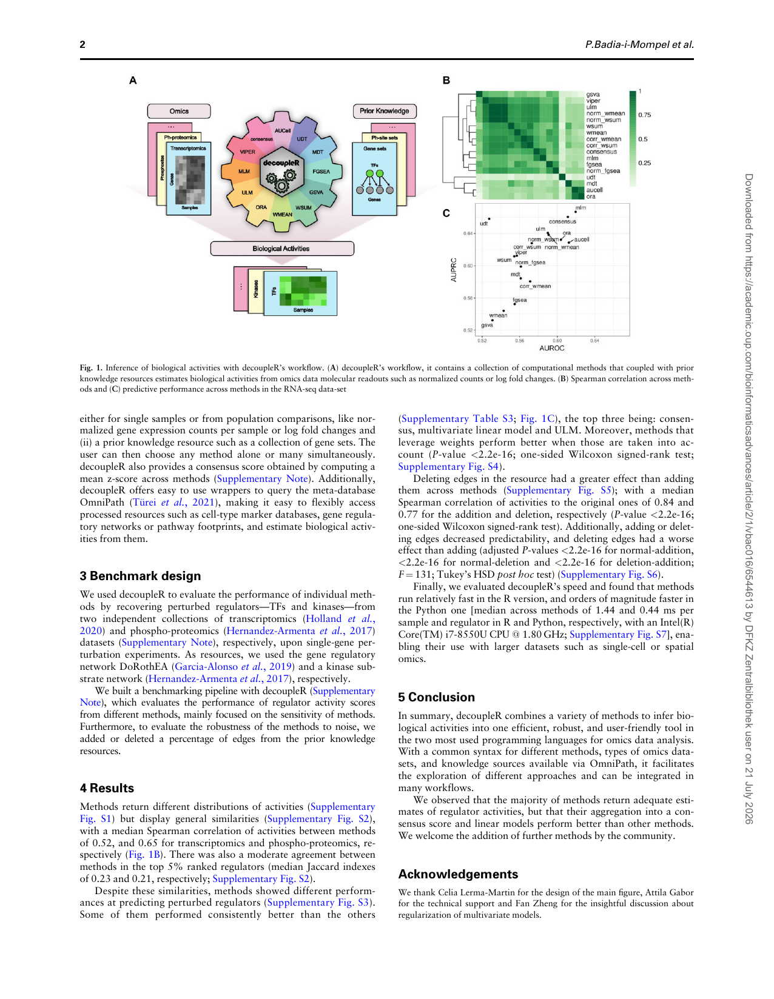

## **decoupleR: ensemble of computational methods to infer biological activities from omics data** 

Pau Badia-i-Mompel, Jesús Vélez Santiago, Jana Braunger, Celina Geiss, Daniel Dimitrov, Sophia Müller-Dott, Petr Taus, Aurelien Dugourd, Christian H Holland, Ricardo O Ramirez Flores, Julio Saez-Rodriguez 

Bioinformatics Advances, 2022, 1–3 https://doi.org/10.1093/bioadv/vbac016 Advance Access Publication Date: 8 March 2022 Application Note 

### Gene regulation 

# decoupleR: ensemble of computational methods to infer biological activities from omics data 

Pau Badia-i-Mompel 1,2, Jesu´ s Velez Santiago� 1,2, Jana Braunger1,2, Celina Geiss1,2, Daniel Dimitrov1,2 , Sophia Mu¨ ller-Dott1,2 , Petr Taus3 , Aurelien Dugourd1,2 , Christian H. Holland1,2 , Ricardo O. Ramirez Flores1,2 and Julio Saez-Rodriguez1,2, * 

> 1Heidelberg University, Faculty of Medicine, and Heidelberg University Hospital, Institute for Computational Biomedicine, BioQuant, Heidelberg 69120, Germany,2 Institute for Computational Biomedicine, Heidelberg University Hospital, BioQuant, Heidelberg 69120, Germany and3 Central European Institute of Technology, Masaryk University, Brno 601, Czechia 

*To whom correspondence should be addressed. Associate Editor: Marieke Lydia Kuijjer 

Received on January 25, 2022; revised on February 28, 2022; editorial decision on March 1, 2022; accepted on March 4, 2022 

#### Abstract 

Summary: Many methods allow us to extract biological activities from omics data using information from prior knowledge resources, reducing the dimensionality for increased statistical power and better interpretability. Here, we present decoupleR, a Bioconductor and Python package containing computational methods to extract these activities within a unified framework. decoupleR allows us to flexibly run any method with a given resource, including methods that leverage mode of regulation and weights of interactions, which are not present in other frameworks. Moreover, it leverages OmniPath, a meta-resource comprising over 100 databases of prior knowledge. Using decoupleR, we evaluated the performance of methods on transcriptomic and phospho-proteomic perturbation experiments. Our findings suggest that simple linear models and the consensus score across top methods perform better than other methods at predicting perturbed regulators. 

Availability and implementation: decoupleR’s open-source code is available in Bioconductor (https://www.bio conductor.org/packages/release/bioc/html/decoupleR.html) for R and in GitHub (https://github.com/saezlab/ decoupler-py) for Python. The code to reproduce the results is in GitHub (https://github.com/saezlab/decoupleR_ manuscript) and the data in Zenodo (https://zenodo.org/record/5645208). Contact: pub.saez@uni-heidelberg.de 

Supplementary information: Supplementary data are available at Bioinformatics Advances online. 

#### 1 Introduction 

Omics datasets, such as transcriptomics or phospho-proteomics, provide unbiased high-dimensional molecular profiles. However, their big dimensionality, combined with the highly connected nature of the molecules that are measured, makes it difficult to interpret them in a mechanistically relevant manner. Leveraging prior knowledge, we can use computational methods to infer which biological activities are relevant. For example, the activity of transcription factors (TFs) and kinases can be inferred robustly from downstream transcripts and phosphosite targets, respectively (Dugourd and SaezRodriguez, 2019). Over the past decade, a plethora of methods that infer biological activity has emerged, each with its own assumptions and biases. 

Although comparisons and collections of these methods exist (Alhamdoosh et al., 2017; Geistlinger et al., 2016; Va¨remo et al., 

2013; Supplementary Table S1), they do not incorporate recent methodological developments, such as modeling activities based on weighted mode of regulation (Supplementary Table S2). Here, we present decoupleR, an R and Python package containing a collection of methods adapted for biological activity estimation in bulk, singlecell and spatial omics data. 

#### 2 Implementation 

Currently, decoupleR contains 11 different methods (Fig. 1A), these include popular methods such as AUCell (Aibar et al., 2017), fast GSEA (Korotkevich et al., 2021), GSVA (Ha¨nzelmann et al., 2013), over-representation analysis, univariate linear model (ULM) adapted from Teschendorff and Wang (2020), VIPER (Alvarez et al., 2016) and others (Supplementary Table S1). The inputs of decoupleR are: (i) a matrix containing molecular feature values, 

1 

> VC The Author(s) 2022. Published by Oxford University Press. 1 This is an Open Access article distributed under the terms of the Creative Commons Attribution License (https://creativecommons.org/licenses/by/4.0/), which permits unrestricted reuse, distribution, and reproduction in any medium, provided the original work is properly cited. 

##### A 

decoupleR: ensemble of computational methods to infer biological activities from omics data 

3 

#### Funding 

- D.D. was supported by the European Union’s Horizon 2020 research and innovation program (860329 Marie-Curie ITN ‘STRATEGY-CKD’). 

- Conflict of Interest: J.S.-R. reports funding from GSK and Sanofi and consultant fees from Travere Therapeutics and Astex Pharmaceutical. 
