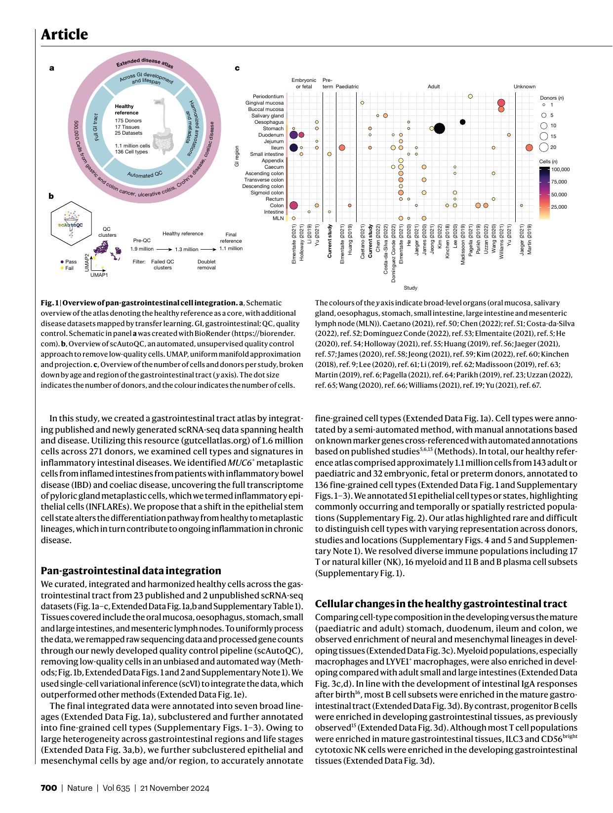
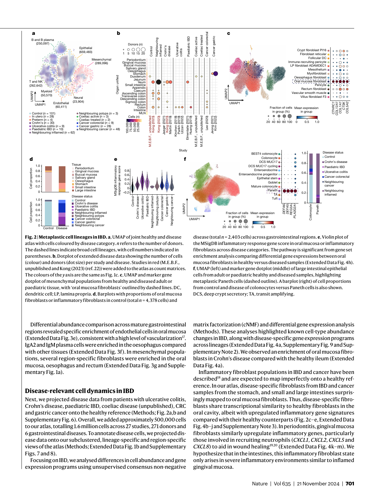
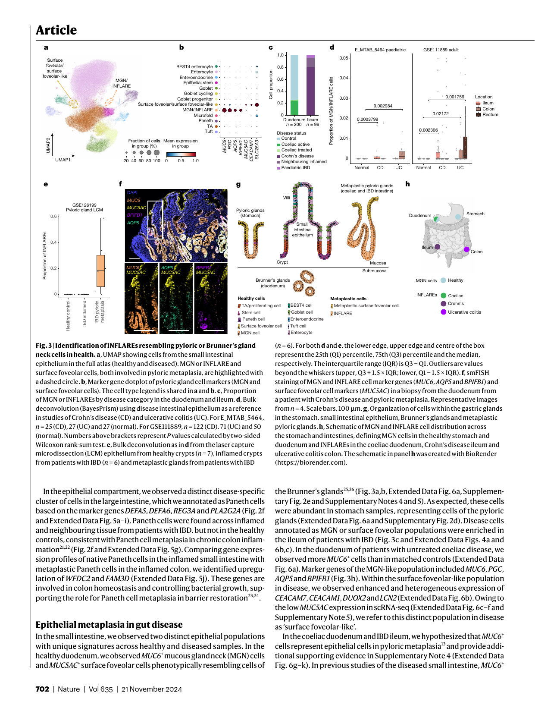
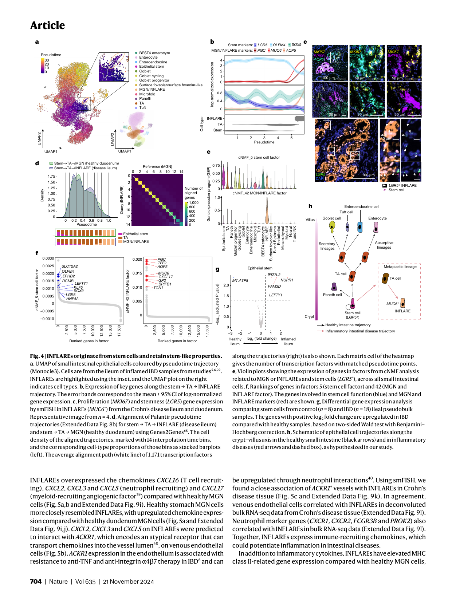
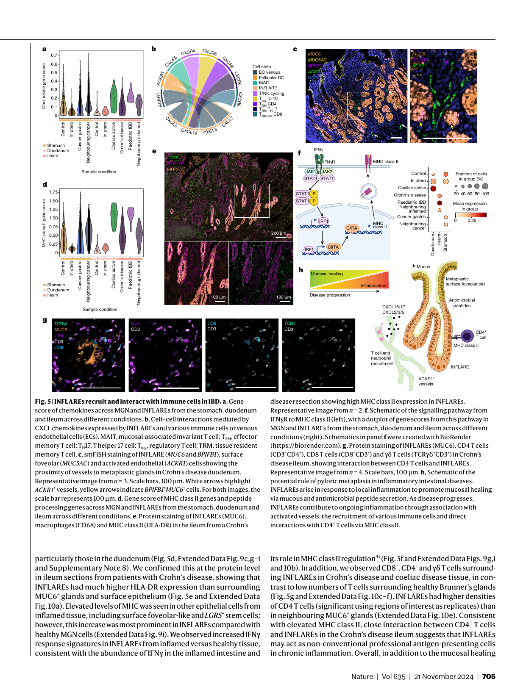

## Article 

# **Single-cell integration reveals metaplasia in inflammatory gut diseases** 

https://doi.org/10.1038/s41586-024-07571-1 **Amanda J. Oliver****1** **, Ni Huang****1** **, Raquel Bartolome-Casado****1,2** **, Ruoyan Li****1,3** **, Simon Koplev****1** **, Hogne R. Nilsen****2** **, Madelyn Moy****1** **, Batuhan Cakir****1** **, Krzysztof Polanski****1** **, Victoria Gudiño****4,5** **,** Received: 26 September 2023 **Elisa Melón-Ardanaz****4,5** **, Dinithi Sumanaweera****1** **, Daniel Dimitrov****6** **, Lisa Marie Milchsack****1** **,** Accepted: 15 May 2024 **Michael E. B. FitzPatrick****7** **, Nicholas M. Provine****7** **, Jacqueline M. Boccacino****1** **, Emma Dann****1** **, Alexander V. Predeus****1** **, Ken To****1** **, Martin Prete****1** **, Jonathan A. Chapman****8** **, Andrea C. Masi****8** **,** Published online: 20 November 2024 **Emily Stephenson****1,8** **, Justin Engelbert****1,8** **, Sebastian Lobentanzer****6** **, Shani Perera****1** **,** Open access **Laura Richardson****1** **, Rakeshlal Kapuge****1** **, Anna Wilbrey-Clark****1** **, Claudia I. Semprich****1** **, Sophie Ellams****1** **, Catherine Tudor****1** **, Philomeena Joseph****1** **, Alba Garrido-Trigo****4,5** **, Ana M. Corraliza****4,5** **,** Check for updates **Thomas R. W. Oliver****9** **, C. Elizabeth Hook****10** **, Kylie R. James****11,12** **, Krishnaa T. Mahbubani****13,14,15** **, Kourosh Saeb-Parsy****13,14** **, Matthias Zilbauer****16,17,18** **, Julio Saez-Rodriguez****6** **, Marte Lie Høivik****19,20** **, Espen S. Bækkevold****2** **, Christopher J. Stewart****8** **, Janet E. Berrington****8** **, Kerstin B. Meyer****1** **, Paul Klenerman****7,21,22** **, Azucena Salas****4,5** **, Muzlifah Haniffa****1,23,24** **, Frode L. Jahnsen****2** **, Rasa Elmentaite****1,25,29** **& Sarah A. Teichmann****1,16,25,26,27,28,29**✉ 

The gastrointestinal tract is a multi-organ system crucial for efficient nutrient uptake and barrier immunity. Advances in genomics and a surge in gastrointestinal diseases1,2 has fuelled efforts to catalogue cells constituting gastrointestinal tissues in health and disease3 . Here we present systematic integration of 25 single-cell RNA sequencing datasets spanning the entire healthy gastrointestinal tract in development and in adulthood. We uniformly processed 385 samples from 189 healthy controls using a newly developed automated quality control approach (scAutoQC), leading to a healthy reference atlas with approximately 1.1 million cells and 136 fine-grained cell states. We anchor 12 gastrointestinal disease datasets spanning gastrointestinal cancers, coeliac disease, ulcerative colitis and Crohn’s disease to this reference. Utilizing this 1.6 million cell resource (gutcellatlas.org), we discover epithelial cell metaplasia originating from stem cells in intestinal inflammatory diseases with transcriptional similarity to cells found in pyloric and Brunner’s glands. Although previously linked to mucosal healing4 , we now implicate pyloric gland metaplastic cells in inflammation through recruitment of immune cells including T cells and neutrophils. Overall, we describe inflammation-induced changes in stem cells that alter mucosal tissue architecture and promote further inflammation, a concept applicable to other tissues and diseases. 

The human gastrointestinal tract is a complex system comprising several organs that work together to absorb nutrients while simultaneously providing an immunologically active barrier. Diseases of the gastrointestinal tract are prevalent: ulcerative colitis and Crohn’s disease affect over 7 million people worldwide, and 2 million new colorectal cancer (CRC) cases are diagnosed annually1,2 . Single-cell transcriptomics has offered unprecedented molecular insights of gastrointestinal homeostasis, development and disease5–9 . Over 25 single-cell RNA sequencing (scRNA-seq) studies of the human gastrointestinal tract have been published to date, primarily focused on specific organs and/or cell types. The integration of these publicly available datasets provides a valuable resource for the Human Cell Atlas community and beyond3 , and enables cross-regional comparisons of gastrointestinal cell types. 

The epithelial cells lining the gastrointestinal tract lumen arise from a common endoderm progenitor and acquire their regional identity 

early in embryogenesis10 . This regional identity can be altered in adulthood leading to metaplasia, where mature tissue is replaced by cells normally occurring in other anatomical regions4 . Intestinal metaplasia is well described in the stomach and in patients with Barrett’s oesophagus where the mucosa is transformed to intestinal epithelial cells, increasing the risk of gastric and oesophageal adenocarcinomas11,12 . Conversely, pyloric metaplasia of intestinal tissue, comprising cells expressing _MUC6_ and _MUC5AC_4 , is less well characterized (also known as pseudopyloric metaplasia, gastric metaplasia, ulcer-associated cell lineage and spasmolytic polypeptide-expressing metaplasia). Histological studies4,13,14 have suggested that pyloric metaplasia may arise as part of the mucosal healing process and can transition to neoplasia4 . However, the origin and functional role of metaplastic cells in acute and chronic tissue damage remain unresolved. 

A list of affiliations appears at the end of the paper. 

Nature | Vol 635 | 21 November 2024 | **699** 

cells were either annotated as a mixture of cell types (including microfold cells, _OLFM4_+ stem cells and goblet cells) or excluded entirely (Supplementary Fig. 10). By contrast, here we identified _MUC6_+ cells in the coeliac duodenum and IBD ileum as epithelial cells in pyloric metaplasia. This discovery reflects the power of data integration to classify rare cell types (for supporting evidence, see Supplementary Note 4). We henceforth refer to _MUC6_+ cells in disease as INFLAREs to distinguish them from healthy MGN cells. We next investigated the molecular and cellular roles of this metaplastic lineage in disease. 

Pyloric metaplasia has been reported in approximately 28% of patients with IBD via histology13,27,28 (Supplementary Table 3). In our atlas, we found INFLAREs in only a small number of patients, potentially due to sampling biases (Extended Data Fig. 6h). To generalize our findings, we investigated bulk RNA-seq datasets of mucosal biopsies from paediatric and adult patients with IBD. Using bulk deconvolution with our single-cell data as a reference (Methods), we found significantly higher proportions of INFLAREs in Crohn’s disease and ulcerative colitis samples and microdissected metaplastic tissue than in healthy tissue, which agreed with previously reported prevalence and validated INFLARE marker genes (Fig. 3d,e, Extended Data Fig. 7a–d and Supplementary Note 6). INFLAREs were present across the intestines in Crohn’s disease but only in the large intestines of patients with ulcerative colitis, consistent with the aetiology and site of inflammation (Fig. 3d), and also detected in patients with coeliac disease and in patients with CRC with microsatellite instability (Extended Data Fig. 7e,f and Supplementary Note 6). MUC6 expression is associated with colonic neoplasms in ulcerative colitis, suggesting that INFLAREs may have a direct role in colitis-associated CRC29,30 . 

To validate the presence of INFLAREs in patients with IBD and coeliac disease, we performed immunohistochemistry and multiplexed single-molecule fluorescence in situ hybridization (smFISH) in patient samples (Supplementary Table 4). We located INFLAREs ( _MUC6_+ _AQP5_+ _BPIFB1_+ ) at the crypt base and surface foveolar cells ( _MUC5AC_+ ) at the crypt top of metaplastic glands in Crohn’s disease mucosa (Fig. 3f–h and Extended Data Fig. 7g,h). We noted heterogeneity in INFLAREs based on co-expression of _AQP5_ and _BPIFB1_ (Extended Data Fig. 7i) and observed their close association with ulcerated regions and tertiary lymphoid structures (Extended Data Fig. 7g). We also validated INFLAREs in disease tissue from untreated patients with coeliac and ulcerative colitis (Extended Data Fig. 7j,k). In untreated patients with coeliac disease, MUC6+ INFLARE metaplastic glands were distinguished from healthy MUC6+ Brunner’s gland cells by their mucosal localization (Extended Data Fig. 7k, left panel). MUC6+ or MUC5AC+ cells were not found in the healthy ileum (Extended Data Fig. 7l). Thus, INFLAREs are found across the intestines during chronic inflammation and share transcriptional similarities to healthy MGN cells, which are restricted to the stomach and duodenum (with important differences discussed below) (Fig. 3g). We describe INFLAREs, _MUC6_+ cells of pyloric metaplasia, at single-cell resolution for the first time, to our knowledge. 

#### **Origin of INFLAREs** 

To interrogate the origin of INFLAREs, we performed trajectory analysis (Methods) on small intestinal epithelial cells (Fig. 4a and Extended Data Fig. 8a,b). INFLAREs branched from _LGR5_+ stem cells (Fig. 4a) and retained expression of stemness genes along the trajectory (Fig. 4b and Extended Data Fig. 8c). Using smFISH, we found _LGR5_ and _MKI67_ expression in INFLAREs in tissue from the ileum of individuals with Crohn’s disease (Fig. 4c), validating a stemness and proliferative phenotype. 

To identify drivers of the INFLARE trajectory, we performed gene-level pseudotime trajectory alignment of stem cells to either MGNs or INFLAREs (Fig. 4d) or to other inflamed lineages (enterocytes and goblet cells) from the duodenum (Methods; Extended Data Fig. 8b–d). We focused our analysis on transcription factors, due to their importance in determining cell fates, and found 19 mismatched transcription factors (potentially involved in determining INFLARE 

cell fate) (Extended Data Fig. 8e and Supplementary Note 7). These transcription factors have been implicated in the regulation of stem cells, intestinal development and secretory programs, the epithelial injury response and metaplasia (Supplementary Note 5). In addition, we found mismatches across two of three comparisons in _NME2_ , which is implicated in maintaining gastric cancer stemness31 , and _ATF3_ , _ATF4_ , _CREB3L1_ and _CREB3L2_ , which encode cAMP response element-binding proteins implicated in injury responses and metaplasia in the stomach and pancreas32,33 . These mismatched transcription factors highlight potentially conserved molecular mechanisms (inflammatory stress responses and tissue regeneration programs) for mucous cell metaplasia across tissues. 

Applying cNMF analysis to diseased cells in the small intestine, we identified transcriptional programs shared between epithelial populations and INFLAREs. A stem cell gene program (Fig. 4e, factor 5) with high-ranking genes including _SLC12A2_ , _RGMB_ and _LGR5_ (Fig. 4f) was highly expressed in INFLAREs. Other factors distinguished MGN and INFLAREs from other mucous-secreting cells, such as the INFLARE signature itself (factor 42), surface foveolar-like (factors 15 and 25) and goblet signatures (factor 10; Fig. 4e,f and Extended Data Fig. 8f), with the latter two including expected cell-type-specific genes (Extended Data Fig. 8f–h). INFLAREs are thus a distinct cell type with unique transcriptional signatures and expression of stemness genes. 

Comparing stem cell gene expression, _LEFTY1_ , a marker of intestinal metaplasia progenitors in the stomach and oesophagus, was enriched in inflamed versus healthy ileum (Fig. 4g, Extended Data Fig. 8i and Supplementary Note 8). _REG1A_ , _OLFM4_ and _SLC12A2_ were also enriched in IBD (Extended Data Fig. 8j), suggesting that inflamed stem cells differ from those in healthy tissue, which may explain their potential to give rise to metaplastic cells. Cell–cell communication analysis highlighted differentially regulated stem cell factors that may contribute to a metaplastic niche. In particular, we identified the ligands _NGR1_ , _AREG_ and _EREG_ , which were upregulated in oral mucosa/inflammatory fibroblasts and signalled to stem cells and INFLAREs via _EGFR_ , _ERBB2_ and _ERBB3_ (Extended Data Fig. 8k–m and Supplementary Note 9). 

Together, our data suggest that metaplasia can arise from inflammation-induced changes within crypt-based stem cells giving rise to INFLAREs, the major lineage of pyloric metaplasia (Fig. 4h). Moreover, INFLAREs retain stem-like properties in intestinal disease, representing a plastic population. 

#### **Dual role of INFLAREs in disease** 

Previous studies have suggested that metaplasia is an adaptation in mucosal tissues in response to injury and healing4,34 . Supporting this hypothesis, INFLAREs expressed _TFF3_ , a trefoil factor normally expressed by goblet cells, which has a key role in mucosal healing35 and causes mucinous metaplasia and neutrophil infiltration in fundic glands when overexpressed in mice36 . By contrast, healthy MGN cells in the stomach and duodenum expressed mostly _TFF2_ (Extended Data Fig. 9a,b). INFLAREs had significantly decreased _TFF2_ expression and also increased expression of _PLA2G2A_ , which encodes an antibacterial protein important for the stem cell niche37,38 (Extended Data Fig. 9c). 

However, INFLAREs also expressed programs that may contribute to chronic intestinal inflammation. We compared MGN and INFLAREs across different tissues, life stages and diseases in our atlas, identifying distinct features depending on the context (Extended Data Fig. 9d). We found greater similarity between diseased INFLAREs and healthy MGN cells in the stomach than in the healthy duodenum (Extended Data Fig. 9e,f). Compared with MGN cells in the healthy duodenum and stomach, INFLAREs upregulated cytokine-induced inflammatory programs and IFNγ-mediated pathway genes, similar to ileal stem cells from patients with Crohn’s disease (Extended Data Fig. 9c,g,h). 

To interrogate inflammatory signalling from INFLAREs in disease, we performed cell–cell interaction analysis (Methods). 

Nature | Vol 635 | 21 November 2024 | **703** 

## Article 

hypothesis for pyloric metaplasia, INFLAREs can exacerbate chronic inflammation through interactions with immune cells with known roles in IBD and coeliac pathogenesis (Fig. 5h). 

#### **Discussion** 

Here we present an integrated single-cell atlas covering the whole human gastrointestinal tract and a workflow including bioinformatic tools (scAutoQC) that can aid the assembly of other large-scale atlases. Systematic regional comparisons between health and disease revealed metaplastic lineages with cellular identities of other gastrointestinal regions in chronic disease, including Paneth cells, oral mucosa/inflammatory fibroblasts and INFLAREs. 

MGN cells, the healthy counterpart of INFLAREs, are best described in the healthy stomach and healthy duodenal Brunner’s glands26 . A scRNA-seq study of paediatric treatment-naive patients with Crohn’s disease identified _MUC6_+ _TFF2_+ and _BPIFB1_+ _AQP5_+ populations, albeit annotated as goblet cells42 . Similarly, another study of Crohn’s disease and ulcerative colitis identified INFLAREs as _MUC6_+ _PGC_+ _DUOX2_+ enterocytes, enriched in the inflamed Crohn’s disease ileum43 . Pyloric metaplasia in patients with Crohn’s disease has been reported extensively from histology13 and we now annotate and interrogate pyloric metaplasia at the single-cell level, with full transcriptional resolution for the first time. We highlight distinguishing features of INFLAREs from their healthy counterparts and define changes both in stem cells and in mature, differentiated cells across intestinal inflammatory diseases. 

Our observations support the view that metaplasia arises due to alterations in stem cell identity and differentiation. Recent studies in the oesophagus12 and stomach44 have proposed that metaplastic lineages emerge from altered undifferentiated stem cells. In the ileum of patients with IBD, we propose a similar change, in which intestinal injury promotes stem cell differentiation to INFLAREs. We provide multiple lines of evidence for stem-like features in INFLAREs. The mechanisms of pyloric metaplasia may partly mirror the mechanisms of intestinal metaplasia of the oesophagus and stomach45 . We found that INFLAREs express genes and pathways implicated in intestinal metaplasia, for instance, _LEFTY1_ and _NRG1_ – _ERBB3_ . Although the precise mechanisms of stem cell transition to INFLAREs will be the focus of future research, we highlight potential mechanisms, including inflammatory signalling pathways, stem and tissue regeneration factors and cell–cell communication pathways. 

Pyloric metaplasia may arise to repair the mucosal barrier after injury4 . Our results build on these observations, proposing that INFLAREs also recruit and interact with immune cells. Increased MHC class II expression on intestinal epithelial cells in patients with IBD has been described, along with functional interactions between epithelial cells and CD4+ T cells via MHC class II46,47 . We propose that INFLAREs similarly interact directly with CD4+ T cells under inflammatory conditions. In addition, INFLAREs can recruit neutrophils, similar to inflammatory fibroblasts48 , using a cellular circuit probably aided by the close association with _ACKR1_+ vessels. In support of a disease-promoting role, many genes expressed by INFLAREs have been implicated in genome-wide association studies of IBD, including chemokines _CXCL1_ , _CXCL2_ , _CXCL3_ and _CXCL5_ and IFNγ signalling genes49 . 

In conclusion, we present an integrated single-cell atlas along the gastrointestinal tract as a resource to study gastrointestinal cell populations in health, development and disease. Using our atlas, we identify and interrogate pyloric metaplasia, informing the origin and role of metaplastic cells in intestinal inflammation and potential progression to neoplasia. 

#### **Online content** 

Any methods, additional references, Nature Portfolio reporting summaries, source data, extended data, supplementary information, 

acknowledgements, peer review information; details of author contributions and competing interests; and statements of data and code availability are available at https://doi.org/10.1038/s41586-024-07571-1. 

1. Morgan, E. et al. Global burden of colorectal cancer in 2020 and 2040: incidence and mortality estimates from GLOBOCAN. _Gut_ **72** , 338–344 (2023). 

2. Jairath, V. & Feagan, B. G. Global burden of inflammatory bowel disease. _Lancet Gastroenterol. Hepatol._ **5** , 2–3 (2020). 

3. Zilbauer, M. et al. A roadmap for the human gut cell atlas. _Nat. Rev. Gastroenterol. Hepatol._ https://doi.org/10.1038/s41575-023-00784-1 (2023). 

4. Goldenring, J. R. Pyloric metaplasia, pseudopyloric metaplasia, ulcer-associated cell lineage and spasmolytic polypeptide-expressing metaplasia: reparative lineages in the gastrointestinal mucosa. _J. Pathol._ **245** , 132–137 (2018). 

5. Elmentaite, R. et al. Cells of the human intestinal tract mapped across space and time. _Nature_ **597** , 250–255 (2021). 

6. Martin, J. C. et al. Single-cell analysis of Crohn’s disease lesions identifies a pathogenic cellular module associated with resistance to anti-TNF therapy. _Cell_ **178** , 1493–1508.e20 (2019). 

7. Elmentaite, R. et al. Single-cell sequencing of developing human gut reveals transcriptional links to childhood Crohn’s disease. _Dev. Cell_ **55** , 771–783.e5 (2020). 

8. Smillie, C. S. et al. Intra- and inter-cellular rewiring of the human colon during ulcerative colitis. _Cell_ **178** , 714–730.e22 (2019). 

9. Kinchen, J. et al. Structural remodeling of the human colonic mesenchyme in inflammatory bowel disease. _Cell_ **175** , 372–386.e17 (2018). 

10. Grosse, A. S. et al. Cell dynamics in fetal intestinal epithelium: implications for intestinal growth and morphogenesis. _Development_ **138** , 4423–4432 (2011). 

11. Jencks, D. S. et al. Overview of current concepts in gastric intestinal metaplasia and gastric cancer. _Gastroenterol. Hepatol._ **14** , 92–101 (2018). 

12. Nowicki-Osuch, K. et al. Molecular phenotyping reveals the identity of Barrett’s esophagus and its malignant transition. _Science_ https://doi.org/10.1126/science.abd1449 (2021). 

13. Buisine, M. P. et al. Mucin gene expression in intestinal epithelial cells in Crohn’s disease. _Gut_ **49** , 544–551 (2001). 

14. Thorsvik, S. et al. Ulcer-associated cell lineage expresses genes involved in regeneration and is hallmarked by high neutrophil gelatinase-associated lipocalin (NGAL) levels. _J. Pathol._ **248** , 316–325 (2019). 

15. Suo, C. et al. Mapping the developing human immune system across organs. _Science_ **376** , eabo0510 (2022). 

16. Jahnsen, F. L., Bækkevold, E. S., Hov, J. R. & Landsverk, O. J. Do long-lived plasma cells maintain a healthy microbiota in the gut? _Trends Immunol._ **39** , 196–208 (2018). 

17. Zhang, H., Zhang, J. & Streisand, J. B. Oral mucosal drug delivery: clinical pharmacokinetics and therapeutic applications. _Clin. Pharmacokinet._ **41** , 661–680 (2002). 

18. Buechler, M. B. et al. Cross-tissue organization of the fibroblast lineage. _Nature_ **593** , 575–579 (2021). 

19. Williams, D. W. et al. Human oral mucosa cell atlas reveals a stromal–neutrophil axis regulating tissue immunity. _Cell_ **184** , 4090–4104.e15 (2021). 

20. Waasdorp, M. et al. The bigger picture: why oral mucosa heals better than skin. _Biomolecules_ **11** , 1165 (2021). 

21. Tanaka, M. et al. Spatial distribution and histogenesis of colorectal Paneth cell metaplasia in idiopathic inflammatory bowel disease. _J. Gastroenterol. Hepatol._ **16** , 1353–1359 (2001). 

22. Kong, L. et al. The landscape of immune dysregulation in Crohn’s disease revealed through single-cell transcriptomic profiling in the ileum and colon. _Immunity_ **56** , 444–458.e5 (2023). 

23. Parikh, K. et al. Colonic epithelial cell diversity in health and inflammatory bowel disease. _Nature_ **567** , 49–55 (2019). 

24. Liang, W. et al. FAM3D is essential for colon homeostasis and host defense against inflammation associated carcinogenesis. _Nat. Commun._ **11** , 5912 (2020). 

25. Zhang, P. et al. Dissecting the single-cell transcriptome network underlying gastric premalignant lesions and early gastric cancer. _Cell Rep._ **30** , 1934–1947.e5 (2019). 

26. Hickey, J. W. et al. Organization of the human intestine at single-cell resolution. _Nature_ **619** , 572–584 (2023). 

27. Yokoyama, I., Kozuka, S., Ito, K., Kubota, K. & Yokoyama, Y. Gastric gland metaplasia in the small and large intestine. _Gut_ **18** , 214–218 (1977). 

28. Kariv, R. et al. Pyloric gland metaplasia and pouchitis in patients with ileal pouch-anal anastomoses. _Aliment. Pharmacol. Ther._ **31** , 862–873 (2010). 

29. Tatsumi, N. et al. Cytokeratin 7/20 and mucin core protein expression in ulcerative colitis-associated colorectal neoplasms. _Virchows Arch._ **448** , 756–762 (2006). 

30. Borralho, P., Vieira, A., Freitas, J., Chaves, P. & Soares, J. Aberrant gastric apomucin expression in ulcerative colitis and associated neoplasia. _J. Crohns Colitis_ **1** , 35–40 (2007). 

31. Qi, Y., Wei, J. & Zhang, X. Requirement of transcription factor NME2 for the maintenance of the stemness of gastric cancer stem-like cells. _Cell Death Dis._ **12** , 924 (2021). 

32. Ma, Z. et al. Single-cell transcriptomics reveals a conserved metaplasia program in pancreatic injury. _Gastroenterology_ **162** , 604–620.e20 (2022). 

33. Fazio, E. N. et al. Activating transcription factor 3 promotes loss of the acinar cell phenotype in response to cerulein-induced pancreatitis in mice. _Mol. Biol. Cell_ **28** , 2347–2359 (2017). 

34. Morrissey, S. M., Ward, P. M., Jayaraj, A. P., Tovey, F. I. & Clark, C. G. Histochemical changes in mucus in duodenal ulceration. _Gut_ **24** , 909–913 (1983). 

35. Yang, Y., Lin, Z., Lin, Q., Bei, W. & Guo, J. Pathological and therapeutic roles of bioactive peptide trefoil factor 3 in diverse diseases: recent progress and perspective. _Cell Death Dis._ **13** , 62 (2022). 

36. Ge, H. et al. Trefoil factor 3 (TFF3) is regulated by food intake, improves glucose tolerance and induces mucinous metaplasia. _PLoS ONE_ **10** , e0126924 (2015). 

**706** | Nature | Vol 635 | 21 November 2024 

37. Schewe, M. et al. Secreted phospholipases A2 are intestinal stem cell niche factors with distinct roles in homeostasis, inflammation, and cancer. _Cell Stem Cell_ **19** , 38–51 (2016). 

38. Laine, V. J., Grass, D. S. & Nevalainen, T. J. Protection by group II phospholipase A2 against _Staphylococcus aureus_ . _J. Immunol._ **162** , 7402–7408 (1999). 

39. Xiao, S., Xie, W. & Zhou, L. Mucosal chemokine CXCL17: what is known and not known. _Scand. J. Immunol._ **93** , e12965 (2021). 

40. Guo, X. et al. Endothelial ACKR1 is induced by neutrophil contact and down-regulated by secretion in extracellular vesicles. _Front. Immunol._ **14** , 1181016 (2023). 

41. Niessner, M. & Volk, B. A. Altered Th1/Th2 cytokine profiles in the intestinal mucosa of patients with inflammatory bowel disease as assessed by quantitative reversed transcribed polymerase chain reaction (RT-PCR). _Clin. Exp. Immunol._ **101** , 428–435 (2008). 

42. Zheng, H. B. et al. Concerted changes in the pediatric single-cell intestinal ecosystem before and after anti-TNF blockade. _eLife_ **12** , RP91792 (2023). 

43. Thomas, T. et al. A longitudinal single-cell therapeutic atlas of anti-tumour necrosis factor treatment in inflammatory bowel disease. Preprint at _bioRxiv_ https://doi.org/10.1101/ 2023.05.05.539635 (2023). 

44. Tsubosaka, A. et al. Stomach encyclopedia: combined single-cell and spatial transcriptomics reveal cell diversity and homeostatic regulation of human stomach. _Cell Rep._ **42** , 113236 (2023). 

45. Nowicki-Osuch, K. et al. Single-cell RNA sequencing unifies developmental programs of esophageal and gastric intestinal metaplasia. _Cancer Discov._ **13** , 1346–1363 (2023). 

46. Dotan, I. et al. Intestinal epithelial cells from inflammatory bowel disease patients preferentially stimulate CD4+ T cells to proliferate and secrete interferon-γ. _Am. J. Physiol. Gastrointest. Liver Physiol._ **292** , G1630–G1640 (2007). 

47. Wosen, J. E., Mukhopadhyay, D., Macaubas, C. & Mellins, E. D. Epithelial MHC class II expression and its role in antigen presentation in the gastrointestinal and respiratory tracts. _Front. Immunol._ **9** , 2144 (2018). 

48. Friedrich, M. et al. IL-1-driven stromal–neutrophil interactions define a subset of patients with inflammatory bowel disease that does not respond to therapies. _Nat. Med._ **27** , 1970–1981 (2021). 

49. Jostins, L. et al. Host–microbe interactions have shaped the genetic architecture of inflammatory bowel disease. _Nature_ **491** , 119–124 (2012). 

50. Caetano, A. J. et al. Defining human mesenchymal and epithelial heterogeneity in response to oral inflammatory disease. _eLife_ **10** , e62810 (2021). 

51. Chen, M. et al. Transcriptomic mapping of human parotid gland at single-cell resolution. _J. Dent. Res._ **101** , 972–982 (2022). 

52. Costa-da-Silva, A. C. et al. Salivary ZG16B expression loss follows exocrine gland dysfunction related to oral chronic graft-versus-host disease. _iScience_ **25** , 103592 (2022). 

53. Domínguez Conde, C. et al. Cross-tissue immune cell analysis reveals tissue-specific features in humans. _Science_ **376** , eabl5197 (2022). 

54. He, S. et al. Single-cell transcriptome profiling of an adult human cell atlas of 15 major organs. _Genome Biol._ **21** , 294 (2020). 

55. Holloway, E. M. et al. Mapping development of the human intestinal niche at single-cell resolution. _Cell Stem Cell_ **28** , 568–580.e4 (2021). 

56. Huang, B. et al. Mucosal profiling of pediatric-onset colitis and IBD reveals common pathogenics and therapeutic pathways. _Cell_ **179** , 1160–1176.e24 (2019). 

57. Jaeger, N. et al. Single-cell analyses of Crohn’s disease tissues reveal intestinal intraepithelial T cells heterogeneity and altered subset distributions. _Nat. Commun._ **12** , 1921 (2021). 

58. James, K. R. et al. Distinct microbial and immune niches of the human colon. _Nat. Immunol._ **21** , 343–353 (2020). 

59. Jeong, H. Y. et al. Spatially distinct reprogramming of the tumor microenvironment based on tumor invasion in diffuse-type gastric cancers. _Clin. Cancer Res._ **27** , 6529–6542 (2021). 

60. Kim, J. et al. Single-cell analysis of gastric pre-cancerous and cancer lesions reveals cell lineage diversity and intratumoral heterogeneity. _NPJ Precis. Oncol._ **6** , 9 (2022). 

61. Lee, H.-O. et al. Lineage-dependent gene expression programs influence the immune landscape of colorectal cancer. _Nat. Genet._ **52** , 594–603 (2020). 

62. Li, N. et al. Memory CD4 T cells are generated in the human fetal intestine. _Nat. Immunol._ **20** , 301–312 (2019). 

63. Madissoon, E. et al. scRNA-seq assessment of the human lung, spleen, and esophagus tissue stability after cold preservation. _Genome Biol._ **21** , 1 (2019). 

64. Pagella, P., de Vargas Roditi, L., Stadlinger, B., Moor, A. E. & Mitsiadis, T. A. A single-cell atlas of human teeth. _iScience_ **24** , 102405 (2021). 

65. Uzzan, M. et al. Ulcerative colitis is characterized by a plasmablast-skewed humoral response associated with disease activity. _Nat. Med._ **28** , 766–779 (2022). 

66. Wang, Y. et al. Single-cell transcriptome analysis reveals differential nutrient absorption functions in human intestine. _J. Exp. Med._ **217** , e20191130 (2020). 

67. Yu, Q. et al. Charting human development using a multi-endodermal organ atlas and organoid models. _Cell_ **184** , 3281–3298.e22 (2021). 

68. Sumanaweera, D. et al. Gene-level alignment of single-cell trajectories. _Nat. Methods_ https://doi.org/10.1038/s41592-024-02378-4 (2024). 

69. Hca, O., Provine, N., FitzPatrick, M. & Irwin, S. Isolation of cells from the epithelial layer of frozen human intestinal biopsies v1. _Protocols_ https://doi.org/10.17504/protocols.io. bcb6isre (2020). 

70. Damjanov, I. & Linder, J. _Anderson’s Pathology_ (Mosby, 1996). 

71. Bankhead, P. et al. QuPath: open source software for digital pathology image analysis. _Sci. Rep._ **7** , 16878 (2017). 

72. Pachitariu, M. & Stringer, C. Cellpose 2.0: how to train your own model. _Nat. Methods_ **19** , 1634–1641 (2022). 

**Publisher’s note** Springer Nature remains neutral with regard to jurisdictional claims in published maps and institutional affiliations. 

**Open Access** This article is licensed under a Creative Commons Attribution 4.0 International License, which permits use, sharing, adaptation, distribution and reproduction in any medium or format, as long as you give appropriate credit to the original author(s) and the source, provide a link to the Creative Commons licence, and indicate if changes were made. The images or other third party material in this article are included in the article’s Creative Commons licence, unless indicated otherwise in a credit line to the material. If material is not included in the article’s Creative Commons licence and your intended use is not permitted by statutory regulation or exceeds the permitted use, you will need to obtain permission directly from the copyright holder. To view a copy of this licence, visit http://creativecommons.org/licenses/by/4.0/. 

###### © The Author(s) 2024, corrected publication 2025 

1Wellcome Sanger Institute, Wellcome Genome Campus, Cambridge, UK. 2Department of Pathology, University of Oslo and Oslo University Hospital–Rikshospitalet, Oslo, Norway. 3Department of Systems Biology, The University of Texas MD Anderson Cancer Center, Houston, US.4 Inflammatory Bowel Disease Unit, Institut d’Investigacions Biomèdiques August Pi I Sunyer (IDIBAPS), Hospital Clínic, Barcelona, Spain.5 Centro de Investigación Biomédica en Red de Enfermedades Hepáticas y Digestivas (CIBEREHD), Barcelona, Spain.6 Institute for Computational Biomedicine, Heidelberg University, Faculty of Medicine, Heidelberg University Hospital, Bioquant, Heidelberg, Germany.7 Translational Gastroenterology and Liver Unit, Nuffield Department of Medicine, University of Oxford, Oxford, UK.8 Translational and Clinical Research Institute, Newcastle University, Newcastle, UK.9 Department of Histopathology and Cytology, Cambridge University Hospitals, Cambridge, UK.10 Department of Pathology, University of Cambridge, Cambridge, UK.11 Translational Genomics, Garvan Institute of Medical Research, Sydney, New South Wales, Australia.12 School of Biomedical Sciences, University of New South Wales, Sydney, New South Wales, Australia.13 Department of Surgery, University of Cambridge, Cambridge, UK.14 Cambridge Biorepository for Translational Medicine, Cambridge NIHR Biomedical Research Centre, Cambridge, UK. 15Department of Haematology, Cambridge Stem Cell Institute, Cambridge, UK. 16Cambridge Stem Cell Institute, University of Cambridge, Cambridge, UK.17 University Department of Paediatrics, University of Cambridge, Cambridge, UK.18 Department of Paediatric Gastroenterology, Hepatology and Nutrition, Cambridge University Hospitals, Cambridge, UK.19 Department of Gastroenterology, Oslo University Hospital, Oslo, Norway.20 Institute of Clinical Medicine, University of Oslo, Oslo, Norway.21 Peter Medawar Building for Pathogen Research, Nuffield Department of Clinical Medicine, University of Oxford, Oxford, UK. 22NIHR Oxford Biomedical Research Centre, Oxford University Hospitals NHS Foundation Trust, Oxford, UK.23 Biosciences Institute, Newcastle University, Newcastle upon Tyne, UK. 24Department of Dermatology and National Institute for Health Research (NIHR) Newcastle Biomedical Research Centre, Newcastle upon Tyne Hospitals NHS Foundation Trust, Newcastle upon Tyne, UK.25 Ensocell Therapeutics, BioData Innovation Centre, Wellcome Genome Campus, Cambridge, UK.26 Theory of Condensed Matter, Cavendish Laboratory/ Department of Physics, University of Cambridge, Cambridge, UK.27 Department of Medicine, University of Cambridge, Cambridge, UK.28 CIFAR Macmillan Multi-scale Human Program, CIFAR, Toronto, Ontario, Canada.29 These authors contributed equally: Rasa Elmentaite, Sarah A. Teichmann.✉ e-mail: sat1003@cam.ac.uk 

Nature | Vol 635 | 21 November 2024 | **707** 

Article 

### **Methods** 

##### **Patient samples and tissue processing** 

**Healthy tissue from adults.** Healthy adult gastrointestinal tissue was obtained by the Cambridge Biorepository of Translational Medicine (CBTM) from deceased transplant organ donors ( _n_ = 2) after ethical approval (REC 15/EE/0152, East of England–Cambridge South Research Ethics Committee) and informed consent from the donor families. Details of the gastrointestinal regions processed and donor information are compiled in Supplementary Table 5. Donors were perfused with cold University of Wisconsin (UW) solution, fresh tissue was collected from the distal stomach (antrum/pylorus), duodenum and terminal ileum within 1 h of circulatory arrest, and tissue was stored in HypoThermosol FRS preservation solution (H4416, Sigma) at 4 °C until processing. Intestinal tissue was open longitudinally and rinsed with D-PBS and then processed to single-cell suspensions following standard protocols5,58 . For tissues from donor A68/759B (D105), epithelium and lamina propria were separated into different fractions by dissection. Epithelial cells were removed by washing the intestinal mucosa twice in Hank’s balanced salt solution (HBSS) medium (Sigma-Aldrich) containing 5 mM EDTA (15575020, Thermo Fisher), 10 mM HEPES (42401042, Gibco), 2% (v/v) FCS supplemented with 10 mM ROCK inhibitor (Y-27632 (Y0503, Merck)) while shaking at 4 °C for 20 min. Epithelial wash-offs were centrifuged at 300 _g_ for 7 min at 4 °C and incubated at 37 °C with TrypLE (Thermo Fisher) supplemented with 0.1 mg ml−1 DNase I (11284932001, Sigma) for 5 min. Cells were pelleted and filtered through a 40-µm cell strainer and resuspended in Advanced DMEM F12 (12634028, Thermo Fisher) with 10% (v/v) FCS. The remaining epithelium-depleted tissue was minced and incubated in digestion media (HBSS medium, 0.25 mg ml−1 Liberase TL (5401020001, Roche) and 0.1 mg ml−1 DNase I (11284932001, Sigma)) on a shaker at 37 °C for up to 45 min. The tissue was gently homogenized using a P1000 pipette every 15 min. For tissues from donor A68/770C (D99), full-thickness tissue was diced with a scalpel and digested in digestion media, as described above. Cells were pelleted and filtered through a 70-µm strainer before proceeding to Chromium 10x Genomics single cell 5′ v2 protocol as per the manufacturer’s instructions. Libraries were prepared according to the manufacturer’s protocol and sequenced on an Illumina NovaSeq 6000 S2 flow cell with 50-bp paired-end reads. 

**Control tissue from preterm infants.** Uninvolved tissue from preterm infants, between 23 and 31 post-conception weeks (pcw), with necrotizing enterocolitis (NEC), focal intestinal perforation or intestinal fistula ( _n_ = 4) were collected at the Neonatal Department of Newcastle upon Tyne Hospitals NHS Foundation Trust with consent and ethical approval as part of the SERVIS study (REC 10/H0908/39). Tissue was resected from the infant and placed immediately into ice-cold PBS. Within 3 h, samples were enzymatically dissociated into a single-cell suspension using collagenase type IV (Worthington) for 30 min at 37 °C. Cells were filtered with 100-µm cell strainer, treated with red blood cell lysis and filtered through a 35-µm strainer. Cells were stained with DAPI before FACS sorting, selecting only for live, single cells and separating CD45-positive and CD45-negative cells. Sorted cells were then loaded onto the Chromium Controller (10x Genomics) using the Single Cell Immune Profiling kits and subsequently sequenced as per the manufacturer’s protocol. 

**Disease tissue from patients with Crohn’s disease, ulcerative colitis and coeliac disease.** Crohn’s disease tissue used for validations was obtained from multiple sites. Adult Crohn’s disease surgical resections were collected from patients in the IBSEN III (Inflammatory Bowel Disease in South Eastern Norway) at Oslo University Hospital ( _n_ = 4) or Hospital Clinic Barcelona ( _n_ = 9), and biopsy material was collected from patients undergoing colonoscopy at Addenbrookes Hospital Cambridge ( _n_ = 4); all patients gave informed written consent. Fresh tissue was fixed in formalin and embedded in paraffin for subsequent 

immunostaining. Ulcerative colitis tissue was also collected from Hospital Clinic Barcelona ( _n_ = 3) during colonic resections, with the same consent and tissue processing procedure. Coeliac disease tissue was obtained from Oslo University Hospital ( _n_ = 2) or the Oxford University Hospitals NHS Foundation Trust (OUHFT) coeliac disease clinic ( _n_ = 2 treated coeliac, _n_ = 3 untreated coeliac). As controls, healthy tissue was also collected at Oslo University Hospital from the proximal duodenum (during pancreaticoduodenectomy for patients with pancreatic cancer, _n_ = 2) and the terminal ileum ( _n_ = 4). 

Duodenal biopsies from Oslo University Hospital were collected from newly diagnosed untreated patients with coeliac disease ( _n_ = 2) and subsequently fixed in formalin and embedded in paraffin for immunostaining. Mucosal pinch biopsies from the second part of the duodenum from the OUHFT were obtained during gastroscopy of untreated patients with coeliac disease ( _n_ = 3) and treated patients with coeliac on a gluten-free diet ( _n_ = 2). Equivalent healthy control samples from the OUHFT ( _n_ = 3) were obtained from patients undergoing gastroscopy with gastrointestinal symptoms without coeliac disease. Biopsies were stored in MACS tissue storage solution (Miltenyi Biotec) before cryopreservation in freezing medium (Cryostor Cs10, Sigma-Aldrich). Samples were later recovered by thawing in a 37 °C water bath and washed in 20 ml R10 (90% RPMI (Sigma-Aldrich) and 10% FBS) before tissue dissociation. Epithelial cells were isolated using v1.11 of the published protocol (https://doi.org/10.17504/protocols.io.bcb6isre)69 . After isolation, epithelial cells proceeded to single-cell sequencing (10x Genomics Next GEM 5′ v1.1) as per the manufacturer’s protocol. Details of samples and metadata are available in Supplementary Table 4. 

**Ethical approval for collection of disease tissue.** Tissue collected at Oslo University Hospital was approved by the Regional Committee for Medical Research Ethics (REK 20521/6544, REK 2015/946 and REK 2018/703, Health Region South-East, Norway) and comply with the Declaration of Helsinki. Tissue collected at Hospital Clinic Barcelona was approved by the Ethics Committee of Hospital Clinic Barcelona (HCB/2016/0389). Tissue from Addenbrookes Hospital was collected through the Addenbrookes–Human Research Tissue Bank HTA research licence no: 12315 (Cambridge University Hospitals Trust). Tissue collected at the OUHFT was collected under the Oxford Gastrointestinal Illnesses Biobank (REC 21/TH/0206). 

##### **Single-molecule fluorescence in situ hybridization** 

Intestinal tissue was embedded in OCT and frozen on an isopentane-dry ice slurry at −60 °C, and then cryosectioned onto SuperFrost Plus slides at a thickness of 10 µm. Before staining, tissue sections were post-fixed in 4% paraformaldehyde in PBS for 15 min at 4 °C, then dehydrated through a series of 50%, 70% and 100% ethanol, for 5 min each. Staining with the RNAscope Multiplex Fluorescent Reagent Kit v2 Assay (Bio-Techne, Advanced Cell Diagnostics) was automated using a Leica BOND RX, according to the manufacturers’ instructions. After manual pre-treatment, automated processing included epitope retrieval by protease digestion with Protease IV for 30 min before RNAscope probe hybridization and channel development with Opal 520, Opal 570 and Opal 650 dyes (Akoya Biosciences). Stained sections were imaged with a Perkin Elmer Opera Phenix High-Content Screening System, in confocal mode with 1-µm _z_ -step size, using a 20× water-immersion objective (NA 0.16, 0.299 µm per pixel). Channels were: DAPI (excitation 375 nm, emission 435–480 nm), Opal 520 (excitation 488 nm, emission 500–550 nm), Opal 570 (excitation 561 nm, emission 570–630 nm) and Opal 650 (excitation 640 nm, emission 650–760 nm). The fourth channel was developed using TSA-biotin (TSA Plus Biotin Kit, Perkin Elmer) and streptavidin-conjugated Atto 425 (Sigma-Aldrich). 

##### **Immunohistochemistry** 

For samples collected at Oslo University Hospital, sections of formalin-fixed, paraffin-embedded tissue were cut in series at 4 µm and 

mounted on Superfrost Plus object glasses (Thermo Fisher Scientific). Haematoxylin–eosin staining was performed on the first sections and reviewed by an expert pathologist (F.L.J.) and the following sections were used for immunohistochemical studies. AB-PAS staining was performed by dewaxing formalin-fixed, paraffin-embedded samples and staining with Alcian blue (8GX) (AB) at pH 2.5 for acidic mucins and periodic acid-Schiff reagent (PAS) staining for neutral mucins, as previously described70 . 

Multiplex immunostaining was performed sequentially using a Ventana Discovery Ultra automated slide stainer (Ventana Medical System, 750-601, Roche). After deparaffinization of the sections, heat-induced epitope retrieval was performed by boiling the sections for 48 min with cell conditioning 1 buffer (DISC CC1 RUO, 6414575001, Roche) followed by incubation with DISC inhibitor (7017944001, Roche) for 8 min. The following primary antibodies were used: anti-human MUC6 clone CLH5 dilution 1:400 (RA0224-C.1, Scytek), anti-human MUC5AC clone CLH2 dilution 1:100 (MAB2011, Sigma), anti-human CD3 rabbit polyclonal dilution 1:50 (A0452, Dako), anti-human CD8 clone 4B11 dilution 1:30 (MA1-80231, Leica Biosystems, Invitrogen), anti-human CD4 clone SP35 dilution 1:30 (MA5-16338, Thermo Fisher), anti-TCRδ clone H-41 dilution 1:100 (sc-100289, Santa Cruz Biotechnology), anti-human FOXP3 clone 236A/E7 dilution 1:1,000 (NBP-43316, Novus Biologicals), anti-human HLA-DRα-chain clone TAL.1B5 dilution 1:200 (M0746, Dako), anti-human CD68 clone PG-M1 dilution 1:100 (M0876, Dako), anti-human CD20 clone L26 dilution 1:200 (M0755, Dako), anti-human TFF2 clone #366508 dilution 1:1,000 (MAB4077, RnD), anti-human TFF3 clone BSB-181 dilution 1:1,000 (BSB-3820-01, BioSB) and anti-human pan-CK clone AE1/AE3/PCK26, ready to use reagent (RTU) (Ventana Medical System, 760–2595, Roche). 

Each primary antibody was diluted in antibody diluent (5266319001, Roche), incubated for 32 min and then washed in a 1× reaction buffer (Concentrate (10X), 5353955001, Roche). OmniMap anti-mouse horseradish peroxidase (HRP) RTU (5269652001, Roche) secondary antibody was incubated for 16 min followed by 12-min incubation with diluted opal fluorophores (Opal 6-Plex Detection Kit for Whole Slide Imaging formerly Opal Polaris 7 Color IHC Automated Detection Kit NEL871001KT) following the manufacturer’s instructions. After that, bound antibodies were denatured and HRP was quenched using Ribo CC solution (DISC CC2, 5266297001, Roche) and DISC inhibitor (7017944001, Roche). Sections were then counterstained with DAPI (DISC QD DAPI RUO, 5268826001, Roche) for 8 min and mounted with ProLong Glass Antifade mountant (Molecular Probes). Imaging was performed using a Vectra Polaris multispectral whole-slide scanner (PerkinElmer). Irrelevant, concentration-matched primary antibodies were used as negative controls. For some tissue sections, bound anti-CD3, anti-CD20, anti-MUC6 and anti-MUC5AC primary antibodies were detected with secondary antibodies conjugated with peroxidase, using the automated Ventana Discovery Ultra system and DAB, purple-responsive, yellow-responsive or teal-responsive chromogens (ChromoMap DAB Detection Kit, 5266645001; DISCOVERY Purple Kit, 07053983001; DISCOVERY Yellow Kit, 07698445001; and Discovery Teal-HRP detection kit) all from Ventana Medical System. 

For samples collected at Hospital Clinic Barcelona, sections of formalin-fixed, paraffin-embedded tissue were cut into 3.5-µm sections. Immunohistochemistry was conducted for the following commercially available antibodies: anti-human MUC5AC (1:4,000; MAB2011, Sigma-Aldrich) and anti-human MUC6 (1:4,000; RA0224-C.1, ScyTek). Deparaffinization, rehydration and epitope retrieval of the sections were automatedly performed with PT link (Agilent) using Envision Flex Target Retrieval Solution Low pH (Dako). Samples were blocked with 20% of goat serum (Vector) in a PBS and 0.5% BSA solution. Biotinylated anti-mouse secondary antibodies were used (1:200; Vector). Positivity was detected with the DAB Substrate kit (K3468, Dako). Image acquisition was performed on a Nikon Ti microscope (Japan) using Nis-Elements Basic Research Software (v5.30.05). 

##### **Image quantification** 

For quantification of T cell density in MUC6+ and neighbouring control epithelium, tissue sections from patients with Crohn’s disease ( _n_ = 5 sections, 3 donors) and patients with coeliac disease ( _n_ = 2 sections, 2 donors) stained with antibodies to MUC6, CD3, CD4, CD8 and TCRδ (see above) were used. Individual glands/epithelium (either MUC6+ or MUC6− ) were annotated manually using PathViewer v3.4.0 freehand region-of-interest tool outlining the entire gland cross-section. We subtracted 3 × 3 pixel averages of autofluorescence measurement per channel with subtraction coefficients of: DAPI (1.5), TCRγδ (0.5), MUC6 (1.0), CD4 (0.25), CD3 (0.25) and CD8 (0.25). We next used QuPath71 v0.5 with the cellpose72 v2.2.3 extension to segment T cells with the ‘cyto2’ model from maximum projection of CD3, CD4, CD8 and TCRγδ, with DAPI as the nuclear marker, an expected median diameter of 10 µm and excluding cells with diameters of less than 5 µm. Segmented cells were thresholded for mean intensity expression of T cell markers by manual inspection with cut-offs of more than 25 (CD3), more than 20 (CD4), more than 10 (CD8) and more than 10 (TCRδ) and classified into subsets based on positive and negative marker expression as indicated. Using the centroid position of cells, we counted T cells per gland if the majority of the cell area was within the region of interest and quantified the T cell density per gland area comparing MUC6+ and control epithelium. 

##### **Data curation and mapping** 

Datasets (Supplementary Table 1) were chosen from a literature search of scRNA-seq studies5–7,9,19,22,23,50–67 . Studies were included when there was raw scRNA-seq data (FASTQ) from human gastrointestinal tract tissues (oral cavity (excluding tongue), salivary glands, oesophagus, stomach, and small and large intestine). 

Available metadata from each sample were collated from various data repositories and harmonized for consistent nomenclature. Metadata related to sample retrieval methods, tissue processing and cell enrichment methods were retrieved from the methods section of the original study. Where possible, the suggestions of sample metadata from the Gut Cell Atlas Roadmap manuscript were considered3 . An explanation and overview of metadata included and harmonized in the atlas are available in Supplementary Table 2. 

For public datasets deposited to ArrayExpress, archived paired-end FASTQ files were downloaded from the European Nucleotide Archive (ENA) or ArrayExpress. For public datasets deposited to the Gene Expression Omnibus (GEO), if the Sequence Read Archive (SRA) archive did not contain the barcode read, URLs for the submitted 10X bam files - were obtained using srapath v2.11.0. The bam files were then down loaded and converted to FASTQ files using 10x bamtofastq v1.3.2. If the SRA archive did contain the barcode read, the SRA archives were downloaded from the ENA and converted to FASTQ files using fastq-dump v2.11.0. Sample metadata were gathered from the abstracts deposited to the GEO or ArrayExpress, and supplementary files from publications. 

Following the FASTQ file generation, 10X Chromium scRNA-seq experiments were processed using the STARsolo pipeline v1.0 detailed in https://github.com/cellgeni/STARsolo. In brief, STAR v2.7.9a was used. Transcriptome reference exactly matching Cell Ranger 2020-A for human was prepared as described in the 10X online protocol (https:// support.10xgenomics.com/single-cell-gene-expression/software/ release-notes/build#header). Automated script ‘starsolo_10x_auto. sh’ was used to automatically infer sample type (3′ or 5′, 10X kit version, among others). STARsolo command optimized to generate the results maximally similar to Cell Ranger v6 was used. To this end, the following parameters were used to specify unique molecular identifiers (UMI) collapsing, barcode collapsing and read clipping algorithms: ‘--soloUMIdedup 1MM_CR --soloCBmatchWLtype 1MM_multi_Nbase_ pseudocounts --soloUMIfiltering MultiGeneUMI_CR --clipAdapterType CellRanger4 --outFilterScoreMin 30’. For cell filtering, the EmptyDrops algorithm used in Cell Ranger v4 and above was invoked using 

## Article 

‘--soloCellFilter EmptyDrops_CR’ options. Options ‘--soloFeatures Gene GeneFull Velocyto’ were used to generate both exon-only and full-length (pre-mRNA) gene counts, as well as RNA velocity output matrices. 

Following read alignment and quantification, Cellbender v0.2.0 with default parameters was used to remove ambient RNA (soup). In cases where the model learning curve did not indicate convergence, the script was re-run with ‘--learning-rate 0.00005 --epochs 300’ parameters. For certain large datasets or datasets with low UMI counts, ‘--expected-cells’ and ‘--low-count-threshold’ parameters had to be adjusted individually for each sample. 

##### **scAutoQC** 

On a per sample basis, scAutoQC calculated the following metrics: logarithmized numbers of counts per cell (log1p_n_counts), logarithmized numbers of genes per cell (log1p_n_genes) and the percentages of total genes expressed that are mitochondrial genes (percent_mito), ribosomal genes (percent_ribo), haemoglobin genes (percent_hb), within the top 50 genes expressed in a given cell (percent_top50), classified as soup by CellBender (percent_soup) and spliced genes (percent_spliced) (Extended Data Fig. 2). The dimensions of these eight metrics were reduced to generate a neighbourhood graph and UMAP for each sample, which was then clustered at low resolution; these clusters are referred to as quality control (QC) clusters. Classification of cells/droplets as passing or failing QC was then performed in a two-step process, first by classifying each cell as passing or failing QC based on four-metric parameters and thresholds set by a Gaussian mixture model (GMM). For the atlas, the number of GMM components was set to 10 for an overfit model. scAutoQC was subsequently improved to automate the best model fit between 1 and 10 components based on the Bayesian information criterion. Then, whole clusters were classified as passing QC if 50% or more of individual cells within the cluster passed - QC. The benefits of the approach include the automated nature, remov ing most manually set thresholds and limiting hands-on analysis. Our unbiased approach exploits both the distribution of individual metrics and their correlations. Although there are some parameters that are set up-front, they only serve as guidance for the final flagging of low quality cells and are not sensitive to small changes in the starting points (for example, setting an initial per cent of mitochondrial genes to 15% or 20% is likely to flag the same clusters). An overview of the pipeline is in Extended Data Fig. 2, and the code (https://github.com/Teichlab/sctk/ blob/master/sctk/_pipeline.py v0.1.1) and example workflow (https:// teichlab.github.io/sctk/index.html) can be found in GitHub. 

##### **Assembly of the healthy reference** 

After samples were run through scAutoQC, they were pooled and cells were flagged as failing QC, along with samples where less than 10% of cells or 100 cells total passed QC (18 samples). In total, we removed 596,449 (31.22%) low-quality cells during this initial filtering step. Cells were further filtered through automated doublet removal based on scrublet scores, removing a further 67,846 from the healthy reference (Extended Data Fig. 2). Cells from healthy/control samples were integrated using scVI73–75 (v0.16.4) with donorID_unified as batch key, log1p_n_counts and percent_mito as continuous covariates, cell cycle genes removed and 7,500 highly variable genes. For comparison, we integrated with Harmony76 (v0.1.7) and BBKNN77 (v1.4.1) using donorID_unified as the batch key and ran through the standard scIB benchmarking pipeline78 (v1.1.4), assessing batch correction metrics based on donorID_unified as batch key. 

##### **Annotations of the healthy reference** 

Cells from the core atlas were grouped by Scanpy (v1.8.0) leiden clustering into seven broad lineages based on marker gene expression (annotation level 1; Extended Data Fig. 1a). Each lineage was split, and reintegrated with scVI (using the settings above but selecting for 5,000 highly variable genes with lineage-dependent gene list exclusions: 

cell cycle genes removed for all non-epithelial subsets, ribosomal genes removed for all epithelial subsets and variable immunoglobulin genes removed for B/B plasma cells) to annotate cells at fine resolution (annotation level 3). Mesenchymal populations were further split by developmental age group (first trimester fetal, second trimester fetal/preterm and adult/paediatric). Epithelial cells were further split by gastrointestinal region and/or developmental age group (oral all ages, oesophagus all ages, stomach all ages, small intestine first trimester fetal, small intestine second trimester fetal/preterm, small intestine adult/paediatric, large intestine first trimester, large intestine second trimester fetal/preterm, large intestine adult/paediatric). For fine-grained annotations of objects by broad compartment (and age/ region if applicable), a combined approach including automated annotation with leiden clustering and marker gene analysis was used. Celltypist53 predicted labels were calculated for the entire core atlas using various relevant models (Cells_Intestinal_Tract v2, Immune_All_Low v2 and Pan_Fetal_Human v2 based on studies5,15,53 ) and custom-label transfer models based on intestinal6 and salivary gland79 datasets. During annotation, further doublets were manually removed based on a combinatorial approach considering factors such as coexpression of different cell-type marker genes, scrublet scores, gene counts, positioning relative to other cells and CellTypist predictions. Notebooks for all annotations are available via our GitHub (https://github.com/ Teichlab/PanGIAtlas). MGN cells (MUC6+ ) in the healthy reference in the small intestine were identified in the healthy duodenum with leiden clustering resolution 0.5, and further refined to remove any residual doublets or MUC6− cells by subclustering. 

##### **Data projection and label prediction for diseased data** 

To include the disease data, we started from the raw data, remapped and applied scAutoQC to the disease data, ensuring that the healthy and disease references are comparable. Models for disease projection were made on the full healthy reference dataset (without doublets) using scANVI80 incorporating broad (level 1) annotations, based on the healthy reference scVI model. We projected disease data using scArches81 with the scANVI model. To annotate at fine resolution, we first predicted broad (level 1) lineages in the projected disease data using a label transfer method based on majority voting from _k_ -nearest neighbour (kNN). Broad lineages were then split as for the healthy reference. For all lineages except epithelial, lineage-specific disease cells were projected onto the respective healthy reference lineage-specific latent space and fine-grained annotations predicted using the same method as for broad lineage predictions. Owing to an underrepresentation of epithelial cells, we added additional epithelial cell data from coeliac disease duodenum (unpublished data from the Klenerman laboratory (M.E.B.F., unpublished) and Crohn’s disease ileum and colon22 , increasing the amount of diseased epithelial cells from 57,406 to 92,342 cells plus an additional 219,472 cells from healthy controls/ non-inflamed tissue. These additional datasets were not remapped, instead these studies were added based on the raw counts matrix. Split epithelial cells from the original disease set (remapped data) and the additional disease sets (from count matrices) were concatenated and reduced to a common gene set of 18,485 genes. The resulting epithelial dataset was further split by region (stomach, small intestine and large intestine), prepared for projection using scANVI_prepare_anndata function (fills 0s for non-overlapping genes) and projected onto the respective healthy reference epithelial region-specific latent space embeddings. 

To refine level 3 annotations on disease cells, we utilized the scArches weighted kNN uncertainty metric. We labelled cells as unknown if they had an ‘uncertainty score’ greater than the 90th quantile for each lineage. For epithelial cells, the 90th quantile was calculated separately for cancer cells and non-cancer cells to account for high uncertainty labelling of tumour cells. To refine the labels of these unknown cells, we performed leiden clustering (resolution = 1) and reassigned the label 

based on both majority voting of the higher certainty cells (above the cut-off) and marker genes. In stomach epithelium, there was one cluster of unknown cells, likely to be cancer cells, which could not be assigned a label and was therefore left annotated as unknown. In large intestinal epithelium, we found a cluster that corresponded to metaplastic Paneth cells (a cell type not present in the healthy reference), which were reannotated based on the distinct marker genes (Extended Data Fig. 4). 

##### **Technical and biological variation** 

To determine the contribution of different metadata covariates to the integrated embedding of the healthy reference data, we performed linear regression for each latent component of the embedding with each covariate as previously described82 . We performed the analysis per cell type based on level_1_annot (broad level) and level_2_annot (medium level) annotations, and for all ages or adult/paediatric only (excluding developing and preterm samples). It should be noted that although this analysis can be informative, many of the covariates included in our atlas are correlated, for example, specific studies with tissue processing methods, diseases, ages or organs. Therefore, multiple covariates can explain the same variance in the data. 

##### **Differential abundance analysis** 

To identify differentially abundant cell populations, we used Milo83 (Milopy v0.0.999), which tests for differentially abundant neighbourhoods from kNN graphs. For comparisons between healthy developing (6–31 pcw, including preterm infants ex utero) and adult/paediatric gut, Milo was run separately per tissue with more than two donors for each group (stomach, duodenum, ileum and colon) using default parameters. For comparisons between organs in the healthy adult gut (18 years of age or older), Milo was run for each organ (oral mucosa, salivary gland, oesophagus, stomach, small intestine, large intestine and mesenteric lymph node) versus the others combined with the covariates of tissue_fraction and cell_fraction_unified and otherwise default parameters. For comparisons between disease and healthy adult samples, Milo was run comparing disease and controls from an individual study, rather than all disease and controls in the atlas, on the kNN graph from joint embedding, which has been shown to have greater sensitivity for detecting disease-associated cell states84 . We focused comparing inflamed with neighbouring inflamed tissue from the Martin (2019)6 dataset. 

##### **Differential gene expression analysis** 

Differential gene expression (DGE) analysis was performed using Scanpy rank gene groups function (Wilcoxon rank-sum test with default parameters) and/or by pseudobulking (decoupler85 ) and DESeq2 (ref. 86) analysis. For Scanpy DGE analysis, samples were preprocessed by downsampling to 200 cells per cell type per donor and removing ribosomal-related and mitochondrial-related genes to limit unwanted batch and technical effects. Decoupler pseudobulking (v1.5.0) was performed combining donor-cell-type combinations, summing raw counts per gene across cells for each combination. DGE analysis was then performed with DESeq2 (v1.38.0), with log2(fold change) (log2FC) shrinkage calculated using the ashr (v2.2_63) estimator. Genes were classified as differentially expressed when log2FC ≥ 0.5 or log2FC ≤ −0.5 and adjusted _P_ ≤ 0.05. For comparison of metaplastic Paneth cells, INFLAREs and oral mucosa fibroblasts with healthy counterparts, minimum cells per donor-cell-type combination for pseudobulking was 2 and DESeq2 was run without covariates. For oral mucosa fibroblasts, comparison was between oral mucosa fibroblasts in healthy oral mucosa versus inflammatory fibroblasts annotated as oral mucosa fibroblasts in diseased ileum. For all other comparisons, minimum cells were 10 and study was included as a covariate, and comparison was between small intestinal cells in IBD versus healthy controls. DESeq2 run on bulk data from the GSE126299 LCM dataset compared metaplastic glands and inflamed epithelium from patients with IBD using 

default settings, without covariates. For gene set analysis, the output from Scanpy rank gene groups was filtered to contain genes with a minimum log fold change of 0.25 and a _P_ value cut-off of 0.05. The resulting gene list was used for gene set analysis using the GSEApy (v1.0.4) enrichr function with relevant gene sets such as MSigDB, KEGG and GO Biological Process examined. Gene scores for epithelial cells were calculated using Drug2Cell87 score function with default parameters. Gene scores for fibroblasts were calculated using the Scanpy score_genes function with default parameters. Full gene lists used for gene scores are available in Supplementary Table 6. Odds ratio and _P_ value of gene overlap for MGN and INFLARE marker genes in different gastrointestinal regions were calculated using GeneOverlap88 (v0.99.0), with the genomic background set to 18,485 genes as the total number of genes used in the marker gene analysis. 

##### **Cell–cell interaction analysis** 

Cell–cell interaction analysis was performed using LIANA+ (v1.0.4)89 , CellChat (v1.1.1)90 and CellPhoneDB v3 (statistical_method)91 to determine cell–cell interactions occurring in the small intestine during Crohn’s disease. Interaction analysis was performed on remapped data, to avoid loss of genes or interactions lost when merging additional count matrices (see ‘Data projection and label prediction for diseased data’ for more detail). Before analysis, data were preprocessed by downsampling to 50 cells per cell type per donor. Normalized count matrix with cell annotation metadata were processed through the standard CellChat and CellPhoneDB pipeline, with the communication probability truncated mean/threshold set to 0.1. Output of LIANA+ analysis was further analysed using NMF with ligand–receptor mean expression and considering only interactions expressed in at least 5% of cells. This analysis resulted in 10 interaction programmes by an automatic elbow selection procedure. Pathway enrichment analysis on the resultant ligand–receptor loadings was performed using decoupler’s univariate linear model method with pathway prior knowledge from PROGENy92 ; only factors in which at least one pathway was significantly enriched (false discovery rate ≤ 0.05) were included for analysis. Using the differential analysis statistics from DESeq2, as described above, we generated a list of deregulated ligand–receptor interactions in IBD versus healthy, or for INFLAREs and oral mucosa fibroblasts, comparing the disease cells to the appropriate healthy counterparts (see above). 

##### **cNMF analysis** 

To identify shared activity and cell identity gene programs cells from diseased small intestine (Crohn’s disease, paediatric IBD and coeliac disease with a total of 99,465 cells), we analysed raw counts with cNMF (v1.3.4)93 . We used the default processing and normalization of cNMF, which considers 2,000 highly variable genes along with 100 iterations of NMF. All other parameters were set at default values. We tested hyperparameter values of _K_ , the number of factors, ranging in steps of 1 from 5 to 80, and picked on inspection a favourable tradeoff between factor stability and overall model error at _K_ = 44. For determining consensus clusters, we excluded 6% of fitted cNMF spectra with a mean distance to kNNs above 0.3. The resulting per-cell gene program usage was compared across fine-grained cell annotations, identifying gene programs corresponding to the identity of MGN cells and other relevant cell types (goblet, stem and surface foveolar cells). To assess programs specific to health or disease, we performed analysis on all cells from small and large intestines using identical parameters, downsampled randomly to 200 cells per cell type per donor (resulting in 313,879 cells). In this case, we tested for values of _K_ in steps of 2 from 10 to 80, choosing an optimal _K_ = 64. 

##### **Trajectory analysis** 

**Monocle3.** To infer the developmental trajectory giving rise to MGN or INFLAREs in the ileum IBD, we used monocle3 (v1.3.1)94 on a 
