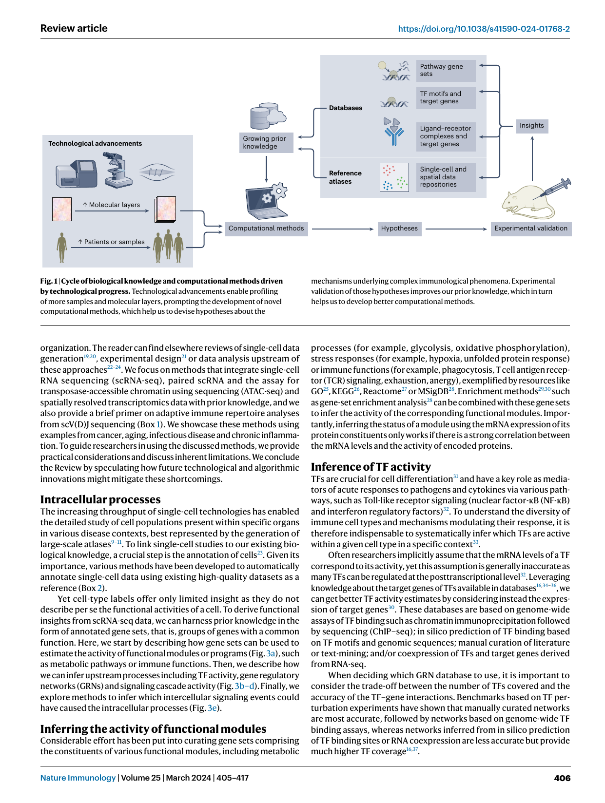
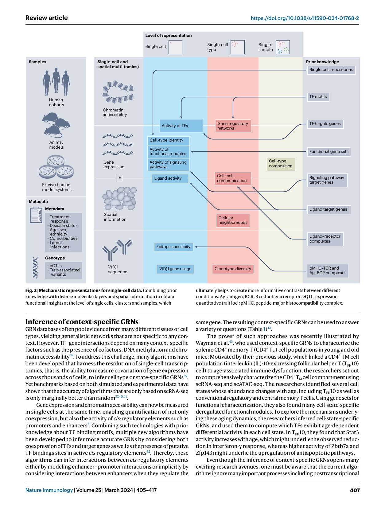
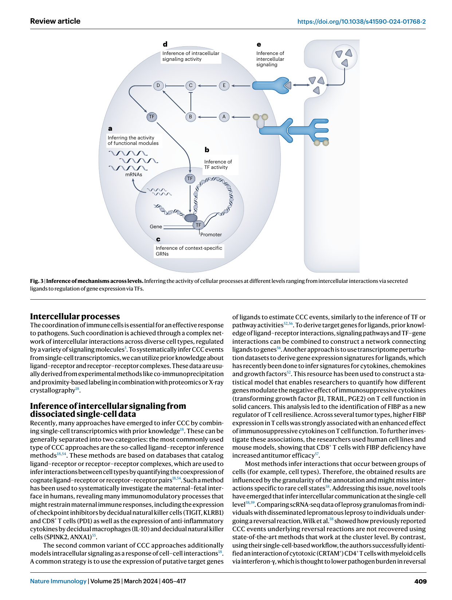
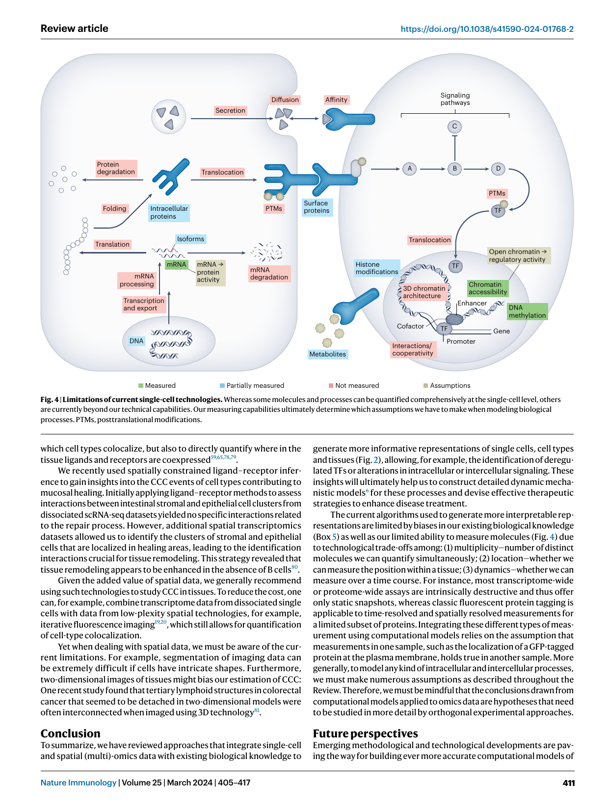

https://doi.org/10.1038/s41590-024-01768-2 

## **nature immunology** 

##### **Review article** 

# **Integrating single-cell multi-omics and prior biological knowledge for a functional characterization of the immune system** 

Received: 31 May 2023 **Philipp Sven Lars Schäfer****1** **, Daniel Dimitrov****1** **, Eduardo J. Villablanca****2,3** **& Julio Saez-Rodriguez****1** Accepted: 16 January 2024 Published online: 27 February 2024 The immune system comprises diverse specialized cell types that cooperate Check for updates to defend the host against a wide range of pathogenic threats. Recent advancements in single-cell and spatial multi-omics technologies provide rich information about the molecular state of immune cells. Here, we review how the integration of single-cell and spatial multi-omics data with prior knowledge—gathered from decades of detailed biochemical studies—allows us to obtain functional insights, focusing on gene regulatory processes and cell– cell interactions. We present diverse applications in immunology and critically assess underlying assumptions and limitations. Finally, we offer a perspective on the ongoing technological and algorithmic developments that promise to get us closer to a systemic mechanistic understanding of the immune system. 

The immune system serves as a prime example of a complex adaptive system, encompassing numerous components whose interactions facilitate appropriate responses to a broad array of pathogenic challenges while maintaining immunological tolerance to harmless and self-antigens. This complexity makes it difficult to quantitatively describe how genetic and environmental factors give rise to the heterogeneity in human responses to pathogens1 , vaccines2 , other immunotherapies3 or harmless antigens in the case of autoimmune disease4 . Which immune processes might underlie such variations can be inferred from the analysis of omics data, thereby informing hypothesis generation and computational mechanistic modeling, which ultimately guides further experimental studies5,6 . 

In recent years, the omics toolbox has gained powerful additions driven by innovations in the single-cell and spatial multi-omics field (Fig. 1). These innovations are expanding the scope of studies in at least two dimensions: (1) increasing the breadth and depth of information we get for each cell as we can jointly measure several molecular layers, such as the transcriptome and chromatin accessibility7 , or measure molecular layers while preserving the spatial context8 ; (2) decreasing the cost and effort required to perform single-cell experiments, enabling the study of larger patient cohorts9–11 . 

However, merely increasing the number of data points does not improve our understanding of immunology. Instead, we need algorithms that transform raw data into human-interpretable representations and actionable hypotheses. One computational strategy is to systematically leverage existing biological knowledge from decades of molecular and genomic research. Biological databases catalog a vast amount of knowledge ranging from information about genes (for example, variants and orthology relationships)12 and proteins (for example, structure, binding partners, subcellular localization and catalyzed reactions)13–15 to information on cell types and tissues (for example, marker genes and location)9,11 (Fig. 1). Leveraging this knowledge, we can generate human-interpretable representations (Fig. 2). Instead of using a 20,000-dimensional gene expression vector, we can, for example, describe cells, clusters or samples by inferring the activity of key transcription factors (TFs)16 , signaling pathways17 or cell–cell communication (CCC) events18 , ultimately helping us to better understand what drives different functional outcomes. 

Here, we review the use of these strategies, to examine immune system function from two intertwined angles: (1) intracellular processes, focusing on transcriptional regulation and signaling, and (2) intercellular processes, emphasizing cell–cell interactions and spatial 

> 1Institute for Computational Bioscience, Faculty of Medicine and Heidelberg University Hospital, Heidelberg University, Heidelberg, Germany. 

> 2Division of Immunology and Allergy, Department of Medicine Solna, Karolinska Institute and Karolinska University Hospital, Stockholm, Sweden. 

> 3Center of Molecular Medicine, Stockholm, Sweden. e-mail: pub.saez@uni-heidelberg.de 

Nature Immunology | Volume 25 | March 2024 | 405–417 

**405** 

**Review article** 

https://doi.org/10.1038/s41590-024-01768-2 

**Fig. 1 | Cycle of biological knowledge and computational methods driven by technological progress.** Technological advancements enable profiling of more samples and molecular layers, prompting the development of novel computational methods, which help us to devise hypotheses about the 

mechanisms underlying complex immunological phenomena. Experimental validation of those hypotheses improves our prior knowledge, which in turn helps us to develop better computational methods. 

organization. The reader can find elsewhere reviews of single-cell data generation19,20 , experimental design21 or data analysis upstream of these approaches22–24 . We focus on methods that integrate single-cell RNA sequencing (scRNA-seq), paired scRNA and the assay for transposase-accessible chromatin using sequencing (ATAC-seq) and spatially resolved transcriptomics data with prior knowledge, and we also provide a brief primer on adaptive immune repertoire analyses from scV(D)J sequencing (Box 1). We showcase these methods using examples from cancer, aging, infectious disease and chronic inflammation. To guide researchers in using the discussed methods, we provide practical considerations and discuss inherent limitations. We conclude the Review by speculating how future technological and algorithmic innovations might mitigate these shortcomings. 

#### **Intracellular processes** 

The increasing throughput of single-cell technologies has enabled the detailed study of cell populations present within specific organs in various disease contexts, best represented by the generation of large-scale atlases9–11 . To link single-cell studies to our existing biological knowledge, a crucial step is the annotation of cells23 . Given its importance, various methods have been developed to automatically annotate single-cell data using existing high-quality datasets as a reference (Box 2). 

Yet cell-type labels offer only limited insight as they do not describe per se the functional activities of a cell. To derive functional insights from scRNA-seq data, we can harness prior knowledge in the form of annotated gene sets, that is, groups of genes with a common function. Here, we start by describing how gene sets can be used to estimate the activity of functional modules or programs (Fig. 3a), such as metabolic pathways or immune functions. Then, we describe how we can infer upstream processes including TF activity, gene regulatory networks (GRNs) and signaling cascade activity (Fig. 3b–d). Finally, we explore methods to infer which intercellular signaling events could have caused the intracellular processes (Fig. 3e). 

#### **Inferring the activity of functional modules** 

Considerable effort has been put into curating gene sets comprising the constituents of various functional modules, including metabolic 

processes (for example, glycolysis, oxidative phosphorylation), stress responses (for example, hypoxia, unfolded protein response) or immune functions (for example, phagocytosis, T cell antigen receptor (TCR) signaling, exhaustion, anergy), exemplified by resources like GO25 , KEGG26 , Reactome27 or MSigDB28 . Enrichment methods29,30 such as gene-set enrichment analysis28 can be combined with these gene sets to infer the activity of the corresponding functional modules. Importantly, inferring the status of a module using the mRNA expression of its protein constituents only works if there is a strong correlation between the mRNA levels and the activity of encoded proteins. 

#### **Inference of TF activity** 

TFs are crucial for cell differentiation31 and have a key role as mediators of acute responses to pathogens and cytokines via various pathways, such as Toll-like receptor signaling (nuclear factor-κB (NF-κB) and interferon regulatory factors)32 . To understand the diversity of immune cell types and mechanisms modulating their response, it is therefore indispensable to systematically infer which TFs are active within a given cell type in a specific context33 . 

Often researchers implicitly assume that the mRNA levels of a TF correspond to its activity, yet this assumption is generally inaccurate as many TFs can be regulated at the posttranscriptional level32 . Leveraging knowledge about the target genes of TFs available in databases16,34–36 , we can get better TF activity estimates by considering instead the expression of target genes30 . These databases are based on genome-wide assays of TF binding such as chromatin immunoprecipitation followed by sequencing (ChIP–seq); in silico prediction of TF binding based on TF motifs and genomic sequences; manual curation of literature or text-mining; and/or coexpression of TFs and target genes derived from RNA-seq. 

When deciding which GRN database to use, it is important to consider the trade-off between the number of TFs covered and the accuracy of the TF–gene interactions. Benchmarks based on TF perturbation experiments have shown that manually curated networks are most accurate, followed by networks based on genome-wide TF binding assays, whereas networks inferred from in silico prediction of TF binding sites or RNA coexpression are less accurate but provide much higher TF coverage16,37 . 

Nature Immunology | Volume 25 | March 2024 | 405–417 

**406** 

**Review article** 

https://doi.org/10.1038/s41590-024-01768-2 

**Fig. 2 | Mechanistic representations for single-cell data.** Combining prior knowledge with diverse molecular layers and spatial information to obtain functional insights at the level of single cells, clusters and samples, which 

ultimately helps to create more informative contrasts between different conditions. Ag, antigen; BCR, B cell antigen receptor; eQTL, expression quantitative trait loci; pMHC, peptide-major histocompatibility complex. 

#### **Inference of context-specific GRNs** 

GRN databases often pool evidence from many different tissues or cell types, yielding generalistic networks that are not specific to any context. However, TF–gene interactions depend on many context-specific factors such as the presence of cofactors, DNA methylation and chromatin accessibility38 . To address this challenge, many algorithms have been developed that harness the resolution of single-cell transcriptomics, that is, the ability to measure covariation of gene expression across thousands of cells, to infer cell type or state-specific GRNs39 . Yet benchmarks based on both simulated and experimental data have shown that the accuracy of algorithms that are only based on scRNA-seq is only marginally better than random37,40,41 . 

Gene expression and chromatin accessibility can now be measured in single cells at the same time, enabling quantification of not only coexpression, but also the activity of _cis_ -regulatory elements such as promoters and enhancers7 . Combining such technologies with prior knowledge about TF binding motifs, multiple new algorithms have been developed to infer more accurate GRNs by considering both coexpression of TFs and target genes as well as the presence of putative TF bindings sites in active _cis_ -regulatory elements42 . Thereby, these algorithms can infer interactions between _cis_ -regulatory elements either by modeling enhancer–promoter interactions or implicitly by considering interactions between enhancers when they regulate the 

same gene. The resulting context-specific GRNs can be used to answer a variety of questions (Table 1)42 . 

The power of such approaches was recently illustrated by Wayman et al.43 , who used context-specific GRNs to characterize the splenic CD4+ memory T (CD4+ TM) cell populations in young and old mice: Motivated by their previous study, which linked a CD4+ TM cell population (interleukin (IL)-10-expressing follicular helper T (TFH10) cell) to age-associated immune dysfunction, the researchers set out to comprehensively characterize the CD4+ TM cell compartment using scRNA-seq and scATAC-seq. The researchers identified several cell states whose abundance changes with age, including TFH10 as well as conventional regulatory and central memory T cells. Using gene sets for functional characterization, they also found many cell-state-specific deregulated functional modules. To explore the mechanisms underlying these aging dynamics, the researchers inferred cell-state-specific GRNs, and used them to compute which TFs exhibit age-dependent differential activity in each cell state. In TFH10, they found that Stat3 activity increases with age, which might underlie the observed reduction in interferon-γ response, whereas higher activity of Zbtb7a and Zfp143 might underlie the upregulation of antiapoptotic pathways. 

Even though the inference of context-specific GRNs opens many exciting research avenues, one must be aware that the current algorithms ignore many important processes including posttranscriptional 

Nature Immunology | Volume 25 | March 2024 | 405–417 

**407** 

**Review article** 

https://doi.org/10.1038/s41590-024-01768-2 

### **Box 1** 

## Using single-cell repertoire analysis to learn about lymphocyte biology 

Through DNA rearrangement, B cells and T cells acquire unique antigen receptors. Unlike bulk sequencing of populations isolated based on a few dozen surface markers, paired single-cell sequencing of antigen receptor sequences and the transcriptome (scV(D)J-seq)113 allows us to associate single receptor sequences with phenotypic information in an unbiased way114,115 . This technology can be combined with profiling of antigen specificities using DNA-barcoded pMHC tetramers116 . scV(D)J-seq greatly improves our ability to investigate repertoire dynamics upon treatment or disease. We can ask how repertoire features such as diversity, V(D)J usage or amino acid motifs117 change within the same or different cell types or states across conditions118 . We can also group cells based on their antigen receptor sequence similarity119,120 or based on whether their clonotype expanded or contracted, and analyze these groups with much higher molecular resolution121 . 

scV(D)J-seq not only is useful to illuminate disease or treatment responses but also provides valuable insights into lymphocyte development, as the antigen receptor sequence can be used to trace clonal relationships, whereas the transcriptome can be used to infer differentiation states. This approach recently provided support for the lineage model of B1 origination in humans, as researchers found that some pre–pro-B and B1 cells but not pro-B or pre-B cells express nonproductive TCR β-chains. This supports the hypothesis that B1 cells differentiate from distinct fetal pre–pro-B cells, bypassing the pre-B and pro-B cell stages. This could explain why B1 cells are often self-reactive because they evade the pre-B cell antigen receptor selection step122 . 

Apart from enabling a detailed annotation of lymphocytes, the transcriptome can also be directly associated with antigen receptor sequences to learn more fine-grained dependencies between functional characteristics and the receptor sequence123–126 . In a proof of principle, Zhang et al.123 used their model to compare the association between TCR sequences and gene expression of CD8+ T cells in control and tumor samples, finding that the association is generally reduced in cancer contexts. This reduction probably reflects the elevated presence of signaling molecules in the tumor microenvironment, which influences gene expression independently of the TCR sequence, resulting in similar gene expression patterns across different T cell clones. 

Similarly to the analysis of transcriptome data, prior knowledge is valuable when analyzing scV(D)J-seq, in particular to infer information on the epitope specificity from antigen receptor sequences. For example, databases cataloging TCR– pMHC complexes help us in at least three ways: (1) available 3D structures help us to determine which amino acids in the TCR sequence are most important for binding119 ; (2) databases cataloging TCR–pMHC complexes can be queried to find putative epitopes for a given TCR sequence127 ; (3) the same databases can be used to train machine learning models to predict whether a given TCR binds a known epitope128 . 

processes affecting the activity of TFs, such as splicing, chemical modifications, translocation into the nucleus and TF cross-talk44 (Fig. 4). Additionally, many other regulatory components such as 

### **Box 2** 

## Annotating cells into biologically meaningful groups 

A common step in single-cell omics is the annotation of measured cells into groups corresponding to known cell types. This process has been typically done by making use of known marker genes, carried out in a discordant manner by independent groups129 . Yet when studying different cell types or states, we—as a research community—have to make sure that we talk about the same entity when using a certain label. This is especially important since the increasing resolution of single-cell technologies has revealed a large variability of functional phenotypes even within the same cell type. To harmonize annotations, preliminary work proposes the use of cell ontologies129 . Complementary, different algorithms have been proposed to automatically annotate single-cell data10,130–132 based on the plethora of high-quality datasets that have been annotated by experts9,11 . 

noncoding RNAs, the three-dimensional (3D) chromatin structure and very distant _cis_ -regulatory elements are not considered in the current models42 . Furthermore, to date, there is no independent benchmark comparing recent GRN inference algorithms, which is challenging due to the limited ground truth data, so that one cannot recommend one approach over another42 . Apart from the algorithm, the choice of TF motif database can have a substantial impact on the resulting GRNs because the databases have varying coverage of TFs. The most comprehensive database is the SCENIC+ motif collection, created by pooling information from 29 other databases45 . Owing to the aforementioned lack of benchmarks, we advise validating the plausibility of the inferred networks by comparing with available experimental data for the context of interest and by checking whether known regulators have been recovered. 

#### **Inference of intracellular signaling activity** 

Signaling cascades integrate external stimuli with the internal state of the cell to generate appropriate cellular responses46 , which are often connected to gene regulation via TFs47 . These cascades are commonly summarized as canonical signaling pathways, such as the JAK–STAT pathway27 . Quantifying the activity of signaling pathways is challenging, as the information is frequently mediated via short-lived posttranslational modifications48 that are difficult to measure at scale—especially at the single-cell level49 . To circumvent these limitations, we can instead use transcriptome data to quantify the activity of signaling pathways by considering the expression of genes that are regulated by a given pathway50 , similarly to the inference of TF activity. To that end, large numbers of published perturbation experiments have been compiled to derive gene expression signatures for canonical signaling pathways17,51 and cytokines52 . 

Given that signaling pathways do not operate in isolation, accurate descriptions of how signals are propagated require analyzing the signaling network as a whole, as done by methods that combine prior knowledge of protein–protein interaction networks with omics data53 . These network-based approaches are typically computationally more expensive than signature-based methods. Both types of approaches to infer signaling activity are affected by research bias (Box 5): Some proteins are much more studied than others, leading to systematic biases in the annotated interactions, which network-based approaches rely on53 , whereas signature-based approaches rely on perturbation data from a limited set of contexts, comprising mostly cancer cell lines17 . 

Nature Immunology | Volume 25 | March 2024 | 405–417 

**408** 

**Review article** 

https://doi.org/10.1038/s41590-024-01768-2 

**Fig. 3 | Inference of mechanisms across levels.** Inferring the activity of cellular processes at different levels ranging from intercellular interactions via secreted ligands to regulation of gene expression via TFs. 

#### **Intercellular processes** 

The coordination of immune cells is essential for an effective response - to pathogens. Such coordination is achieved through a complex net work of intercellular interactions across diverse cell types, regulated by a variety of signaling molecules5 . To systematically infer CCC events from single-cell transcriptomics, we can utilize prior knowledge about ligand–receptor and receptor–receptor complexes. These data are usually derived from experimental methods like co-immunoprecipitation and proximity-based labeling in combination with proteomics or X-ray crystallography18 . 

#### **Inference of intercellular signaling from dissociated single-cell data** 

Recently, many approaches have emerged to infer CCC by combining single-cell transcriptomics with prior knowledge18 . These can be generally separated into two categories: the most commonly used type of CCC approaches are the so-called ligand–receptor inference methods18,54 . These methods are based on databases that catalog ligand–receptor or receptor–receptor complexes, which are used to infer interactions between cell types by quantifying the coexpression of cognate ligand–receptor or receptor–receptor pairs18,54 . Such a method has been used to systematically investigate the maternal–fetal interface in humans, revealing many immunomodulatory processes that might restrain maternal immune responses, including the expression of checkpoint inhibitors by decidual natural killer cells (TIGIT, KLRB1) and CD8+ T cells (PD1) as well as the expression of anti-inflammatory cytokines by decidual macrophages (IL-10) and decidual natural killer cells (SPINK2, ANXA1)55 . 

The second common variant of CCC approaches additionally models intracellular signaling as a response of cell–cell interactions18 . A common strategy is to use the expression of putative target genes 

of ligands to estimate CCC events, similarly to the inference of TF or pathway activities52,56 . To derive target genes for ligands, prior knowledge of ligand–receptor interactions, signaling pathways and TF–gene interactions can be combined to construct a network connecting ligands to genes56 . Another approach is to use transcriptome perturbation datasets to derive gene expression signatures for ligands, which has recently been done to infer signatures for cytokines, chemokines and growth factors52 . This resource has been used to construct a statistical model that enables researchers to quantify how different genes modulate the negative effect of immunosuppressive cytokines (transforming growth factor β1, TRAIL, PGE2) on T cell function in solid cancers. This analysis led to the identification of FIBP as a new regulator of T cell resilience. Across several tumor types, higher FIBP expression in T cells was strongly associated with an enhanced effect of immunosuppressive cytokines on T cell function. To further investigate these associations, the researchers used human cell lines and mouse models, showing that CD8+ T cells with FIBP deficiency have increased antitumor efficacy57 . 

Most methods infer interactions that occur between groups of cells (for example, cell types). Therefore, the obtained results are influenced by the granularity of the annotation and might miss interactions specific to rare cell states58 . Addressing this issue, novel tools have emerged that infer intercellular communication at the single-cell level58,59 . Comparing scRNA-seq data of leprosy granulomas from individuals with disseminated lepromatous leprosy to individuals undergoing a reversal reaction, Wilk et al.58 showed how previously reported CCC events underlying reversal reactions are not recovered using state-of-the-art methods that work at the cluster level. By contrast, using their single-cell-based workflow, the authors successfully identified an interaction of cytotoxic (CRTAM+ ) CD4+ T cells with myeloid cells via interferon-γ, which is thought to lower pathogen burden in reversal 

Nature Immunology | Volume 25 | March 2024 | 405–417 

**409** 

**Review article** 

https://doi.org/10.1038/s41590-024-01768-2 

**Table 1 | Questions that can be addressed using GRNs** 

|**Description**|**Publication example**|
|---|---|
|TF activity inference: GRNs can be used to infer TF activity based on the expression of their target genes. This can also be done in spatial transcriptomics datasets to see how the cellular neighborhood shapes TF activity45.|Used to identify TFs that have age-dependent differential activity in CD4+T cells, which might underlie age-associated immune dysfunction in the spleen43.|
|Identification of differential TF–gene edges: Comparing the edges of GRNs allows for assessing the rewiring of TF–gene connections in different cell types and/or conditions. Alternatively, one can identify the TFs that drive different cell states by identifying the TFs that are strongly connected to differentially expressed genes between those cell states.|Used to identify TFs that might underlie the remission-associated expansion of precursor exhausted T cells in response to immunotherapy treatment in chronic myelogenous leukemia108.|
|Identification of master regulators: Network centrality measures such as the eigenvector centrality can be used to identify the most important TFs in a given network.|Used to identify potential master regulators of myofibroblast differentiation in human myocardial infarction109.|
|Identification of gene modules: Graph-based clustering (for example, Louvain clustering) can be used to identify modules of co-regulated genes.|Used to characterize a GRN of naive macrophages, yielding gene modules underlying the potential to polarize into M1 or M2 states110.|
|In silico perturbation: Some GRN inference tools additionally offer methods to simulate the effects of TF expression changes on differentiation dynamics45,111.|Used to characterize a cluster of hematopoietic stem cells associated with severe sepsis outcomes, showing that the cluster is driven by CEBPB and STAT3, which are known drivers of emergency granulopoiesis112.|
|Interpretation of genomic variants: Many disease-associated genetic variants are in noncoding regions. GRN inference could help to interpret those variants by linking noncoding regions to the genes they might regulate and to cell states or types in which they are active.|Cell-state-specific macrophage GRNs were used to pinpoint the particular cell state in which fine-mapped GWAS variants associated with autoimmune disease might have a role110.|

reactions by upregulating inflammatory mediators (for example, L1B, CCL3 and tumor necrosis factor). 

Although these examples illustrate the potential power of communication inference from dissociated single-cell data, there are many things commonly omitted: Cells communicate not only via protein ligands, but also via mechanical or electric signals, extracellular vesicles and metabolites60,61 , which are especially important in host–microbiome62 and immune cell interactions63 . First, approaches have been developed to model metabolite-mediated CCC from transcriptomics data64–67 , but the accuracy of these methods remains to be established. Furthermore, the models we use to infer protein-mediated communication are limited in many ways: Ligand–receptor methods ignore secretion and diffusion processes, and assume a high correlation of mRNA levels and activity of the encoded proteins (Fig. 4). By contrast, methods that model the downstream effects of CCC events suffer from biases in our prior knowledge on protein–protein interaction networks or the generalistic nature of gene expression signatures derived from many different contexts (Box 5). Addressing the latter problem, cell-type-specific signatures have recently been generated for more than 80 cytokines using scRNA-seq to profile mouse immune cells in lymph nodes after cytokine injection, revealing highly specific responses in many immune cell types68 . 

Given that direct measurement of CCC events in a high-throughput manner is challenging, existing benchmarks rely on indirect information such as spatial information or the expression of putative target genes of ligands to evaluate the plausibility of inferred interactions54,69 . These benchmarks have shown that most ligand– receptor methods seem to perform better than random54,69 , and that the inferred predictions are very sensitive to the choice of ligand– receptor resource and statistical model, resulting in discordant predictions across methods54 . 

Considering the absence of ground truth to benchmark methods, it is hard to determine which tool works better. We strongly suggest checking whether there is literature support for some of the highly scored interactions as curation practices vary between ligand–receptor resources54 . Additionally, two main strategies have emerged to reduce the large number of potential interactions that we elaborate below: (1) prioritize CCC events that exhibit large variation between conditions65,70,71 ; (2) prioritize CCC events in which the corresponding cell groups and ligand–receptor complexes colocalize in situ. 

#### **Inference of intercellular signaling from cross-condition data** 

Two main strategies have emerged to extract deregulated CCC events across conditions, related to recently developed methods that identify coordinated gene expression programs across cell types and samples (Box 3). The first class of methods uses differential gene expression analysis65,70 to prioritize ligand–receptor complexes whose expression robustly changes between conditions. The second class of methods uses higher-order factorization approaches65,71 , which enables the identification of coordinated CCC events involving multiple cell types and ligand–receptor complexes. One such approach71 was used to analyze bronchoalveolar lavage fluid samples from healthy individuals and individuals with coronavirus - disease 2019 (COVID-19), leading to the identification of CCC pat terns across individuals that were strongly associated with disease severity. Consistent with previous reports72 , the analysis identified deregulated cross-talk between epithelial cells and a broad array of immune cells, including B cells and T cells as well as macrophages and dendritic cells. 

#### **Inference of intercellular signaling from spatially resolved data** 

Intercellular communication, except for endocrine signaling, depends on spatial proximity. Thus, the emergence of diverse spatial (multi)-omics technologies19,20 offers a promising avenue to study CCC. Given the current technological trade-off between spatial resolution and transcriptome coverage, most technologies with single-cell resolution only measure tens to hundreds of markers, whereas whole-transcriptome measurements are limited to spots containing several cells19,20 . On the one hand, this dilemma led to the development of tools that use low-plexity, high-resolution spatial data to infer intercellular interactions by quantifying the colocalization of cell groups without considering which ligands or receptors might underlie those interactions (Box 4)73 . On the other hand, tools were developed to identify CCC events from high-plexity, low-resolution spatial data by first identifying the main cell type in a given spot, or by working with cell-type fractions per spot74 . Such spatial information was initially used to extend classical ligand–receptor methods by constraining the inferred interactions to cell-type pairs that colocalize75,76 . Akin to network-based methods, more recent methods additionally consider prior knowledge networks that connect receptors to TFs and their target genes65,77 . Furthermore, spatial data allow us not only to infer 

Nature Immunology | Volume 25 | March 2024 | 405–417 

**410** 

**Review article** 

https://doi.org/10.1038/s41590-024-01768-2 

### **Box 3** 

## Identification of multicellular programs from cross-condition scRNA-seq datasets 

Assuming that cellular coordination creates recurring gene expression patterns, novel algorithms have been developed that leverage the increasing availability of large, cross-condition single-cell datasets to identify covarying gene programs in multiple cell types133–135 . These gene expression programs that involve multiple cell types are often called multicellular programs. For example, applying such an approach to scRNA-seq samples from colonoscopies of healthy individuals and individuals with ulcerative colitis led to the identification of a multicellular program whose activity is strongly associated with ulcerative colitis. This program involved not only immune cells (macrophages, T cells) but also two intestinal epithelial cell types. Whereas the epithelial programs were enriched in markers for leukocyte migration, the macrophage program was characterized by upregulation of genes associated with leukocyte and lymphocyte activation, and the T cell program by genes associated with effector T cell function133 . In summary, these approaches provide an opportunity to capture the interplay between different cell types. 

biological processes, consequently deepening our understanding of the immune system. 

Gaps and biases in our prior knowledge will be reduced by advances in experimental technologies. For example, CRISPR screens have been combined with high-content read-outs like scRNA-seq or multiplexed imaging, allowing detailed assessment of single-gene perturbations in a high-throughput manner82 . Functional proteomics technologies such as crosslinking mass spectrometry or thermal proteome profiling are promising to reveal protein interactions for neglected proteins83 . Immunopeptidomics enables the identification of thousands of peptides with the capacity to bind human leukocyte antigen class II on antigen-presenting cells, representing a powerful technology for antigen discovery84 . 

Additionally, our measurement capabilities at the single-cell level are rapidly improving. While the transcriptome has been the focus for many years, it is now becoming increasingly feasible to measure the proteome at single-cell resolution85 while also preserving spatial context86 . In line with this, there has been tremendous progress in spatial metabolomics, with some technologies being able to measure more than 100 metabolites in single cells87 , and other technologies pioneering the co-profiling of metabolites and the transcriptome88 . We anticipate that combining these technological advancements with recent progress in inferring small-molecule-mediated CCC from transcriptomic data64–67 will soon enable the reliable inference of such communication events. More generally, our understanding of how cell–cell interactions and spatial organization shape cellular phenotypes is set to improve given the emerging array of spatial multi-omics technologies19,20 . Recently published technologies include the co-profiling of the transcriptome together with chromatin accessibility89 , histone modifications90 , adaptive immune receptor sequences91 , metabolites88 , surface proteins92 and microbiome taxa93,94 . Such technologies hold the promise for identifying metabolite-mediated immune cell– microbiome interaction. Besides spatial profiling, there are multiple emerging technologies poised to improve our understanding of CCC. One study recently reported how hydrogel nanovials could be used to 

### **Box 4** 

## Cell–cell interactions from spatial data without relying on prior knowledge 

Many spatial profiling technologies, especially those with high resolution, are limited in the number of markers that can be measured. To allow for the integration with existing knowledge and other data modalities, most probes or antibodies are usually chosen to identify cell types, limiting the systems-level inference of CCC. By assuming that interacting cell types colocalize more often than expected by chance, some methods infer pairwise cell–cell interactions using only the spatial distribution of cell types75,136–138 . Other methods go beyond pairwise interactions and aim to identify niches or microenvironments that are characterized by certain cell-type compositions75,139–141 . Such approaches have been used to analyze how cellular interactions define the response to immunotherapy in patients with triple-negative breast cancer, revealing for instance that an increased colocalization of CD20+ B cells and GZMB+ CD8+ T cells with tumor cells is highly associated with response to immune checkpoint blockade142 . 

If some of the measured markers provide functional information, then considering solely cell-type labels disregards information that could be used to infer cell–cell interactions. Specifically, one can assume that interactions between cells lead to coordinated changes in gene expression. Based on this assumption, machine learning models have been developed that model gene expression based on features of the spatial neighborhood, which allows for the inference of cell–cell interactions143–145 . 

simultaneously profile the transcriptome and the secretion of VEGF-A95 . Other emerging technologies use synthetic pathways96 or engineered viral systems97 to trace cell–cell contact histories. 

As previously mentioned, it is crucial to consider not only what we can measure and at what resolution but also whether we can track quantities over time to study the dynamics of biological processes. Here, the combination of multiphoton intravital microscopy followed by static 3D immunofluorescence microscopy has been proposed as a way to measure the dynamics of immune cells while also capturing some aspects of the phenotypic diversity98 . Integrating the multiplexed immunofluorescence data with scRNA-seq to impute the full transcriptome, one could enhance the power of that approach even further74 . Additionally, a recent study pioneered the use of fluidic force microscopy to extract RNA from living cells, which enables time-resolved transcriptome-wide measurements in vitro99 . The authors demonstrated the value of their technology by measuring the transcriptome of individual macrophages before and after stimulation with lipopolysaccharide, revealing key determinants of the response heterogeneity. 

Throughout this Review, we have described that gene expression signatures and other gene sets are limited based on the tissues and cell types they have been derived from. To address the generalistic nature of gene sets, new computational approaches are emerging that leverage the large variability of single-cell gene expression profiles to modify gene sets such that they better explain the observed variance in specific contexts100–102 . This concept was used in the analysis of non-metastatic breast cancer samples to refine the gene set indicating tumor-reactive T cells100 , helping to identify a population of tumor-reactive CD8+ T cells that was highly enriched in patients responding to anti-PD1 treatment. 

Nature Immunology | Volume 25 | March 2024 | 405–417 

**412** 

**Review article** 

https://doi.org/10.1038/s41590-024-01768-2 

### **Box 5** 

## Limitations of prior biological knowledge 

**Research bias:** Some genes (for example, _TP53_ ) and some contexts (for example, common cancer types) receive disproportionate attention47,53,83 , to the point that more than 90% of life science literature pertaining to genes and their functions is focused on fewer than 5,000 proteins146 . This bias can arise from factors ranging from funding policies to inherent challenges in investigating certain biological processes. Consequently, there is a higher likelihood of rediscovering well-studied elements, potentially hindering the discovery of novel immunological mechanisms. Even for well-studied groups of proteins such as TFs, there is a strong research bias47,147 , as more than 10% of all human TFs currently lack a binding motif147 . 

**Lack of context specificity** : Pathway annotations and gene expression signatures are often derived from many different tissues, cell types and disease contexts. Thus, the annotation of pathways or expression signatures found in databases often do not reflect the conditions at hand. The same signal (for example, IL-6 signaling) can have different responses in target cells46,56,68 depending on which receptor subunits are expressed148,149 , which chromatin regions are accessible and whether certain signaling and transcriptional regulators are present. For example, IL-6 signaling during naive CD4+ T cell activation may result in IL-17-producing T cells or TFH cell differentiation depending on the presence or absence of transforming growth factor beta150 . 

**Quantity–quality trade-off** : There is often a trade-off between coverage and quality when it comes to prior knowledge as demonstrated by the comparison of manually curated GRNs with networks that are based on in silico prediction of TF binding sites or RNA coexpression16 . 

Emerging modeling paradigms inspired by the success of large language models (for example, GPT-4)103 can substantially impact biological research. Deep learning models that are trained on millions of scRNA-seq profiles can learn intricate relationships between genes, surpassing the capabilities of classical coexpression analysis104,105 . These models can be fine-tuned for many tasks ranging from predicting the effect of unseen drug or genetic perturbation to cell annotation, although their ability to outperform task-specific models has yet to be shown. 

In summary, the application of computational methods that integrate single-cell and spatial multi-omics with existing biological knowledge is valuable in deciphering which cells and molecules of the immune system and which interactions underlie different functional outcomes. Thereby, these approaches help to define a scaffold from which more refined computational models can be built6 , in particular dynamic quantitative models (for example, based on differential equations and agent-based modeling), which enable the simulation of unobserved scenarios, and consequently the generation of specific testable hypotheses106,107 . 

#### **Acknowledgements** 

P.S.L.S. has received funding from the Deutsche Forschungsgemeinschaft under grant agreement SPP 2395. D.D. is supported by the European Union’s Horizon 2020 research and innovation program (860329 Marie-Curie ITN ‘STRATEGY-CKD’). We thank R. O. R. Flores, P. Badia-i- Mompel, J. Tanevski, L. Küchenhoff, M. Garrido-Rodriguez, C. Lu and K. Mikulik for the helpful discussions. 

Nature Immunology | Volume 25 | March 2024 | 405–417 

**416** 

**Review article** 

https://doi.org/10.1038/s41590-024-01768-2 

#### **Author contributions** 

P.S.L.S., D.D. and J.S.-R. developed the concept based on starting ideas from J.S.-R. P.S.L.S. designed the figures. P.S.L.S., with assistance from D.D., wrote the original draft, with the supervision of J.S.-R. E.J.V. contributed immunological expertise. All authors reviewed and edited the manuscript. 

#### **Competing interests** 

J.S.-R. reports funding from GSK, Pfizer and Sanofi and fees/ honoraria from Travere Therapeutics, Stadapharm, Astex, Pfizer, Owkin and Grunenthal. E.J.V. has received research grants from F. Hoffmann-La Roche. All other authors declare no competing interests. 

#### **Additional information** 

**Correspondence and requests for materials** should be addressed to Julio Saez-Rodriguez. 

**Peer review information** _Nature Immunology_ thanks Jishnu Das and Yvan Saeys for their contribution to the peer review of this work. Primary Handling Editor: L. A. Dempsey, in collaboration with the _Nature Immunology_ team. 

**Reprints and permissions information** is available at www.nature.com/reprints. 

**Publisher’s note** Springer Nature remains neutral with regard to jurisdictional claims in published maps and institutional affiliations. 

Springer Nature or its licensor (e.g. a society or other partner) holds exclusive rights to this article under a publishing agreement with the author(s) or other rightsholder(s); author self-archiving of the accepted manuscript version of this article is solely governed by the terms of such publishing agreement and applicable law. 

© Springer Nature America, Inc. 2024 

Nature Immunology | Volume 25 | March 2024 | 405–417 

**417** 
