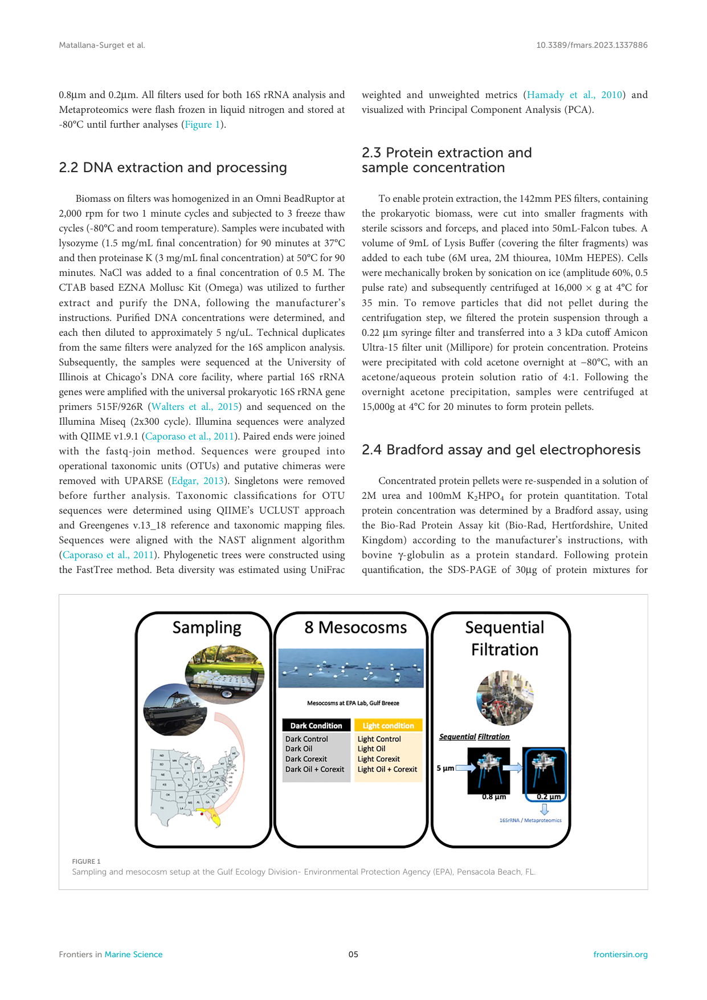
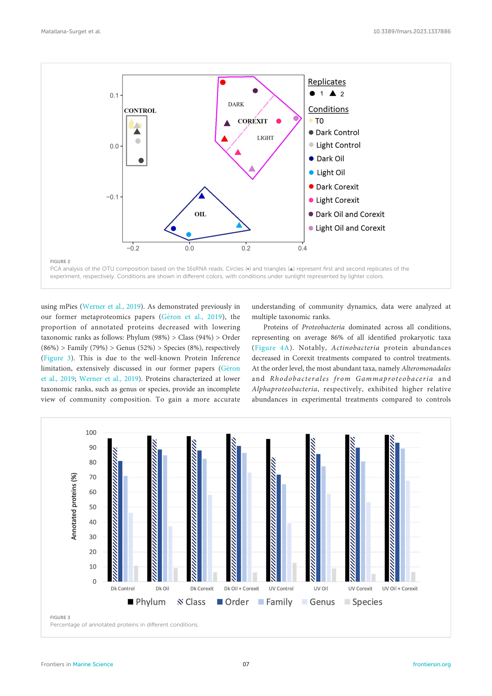
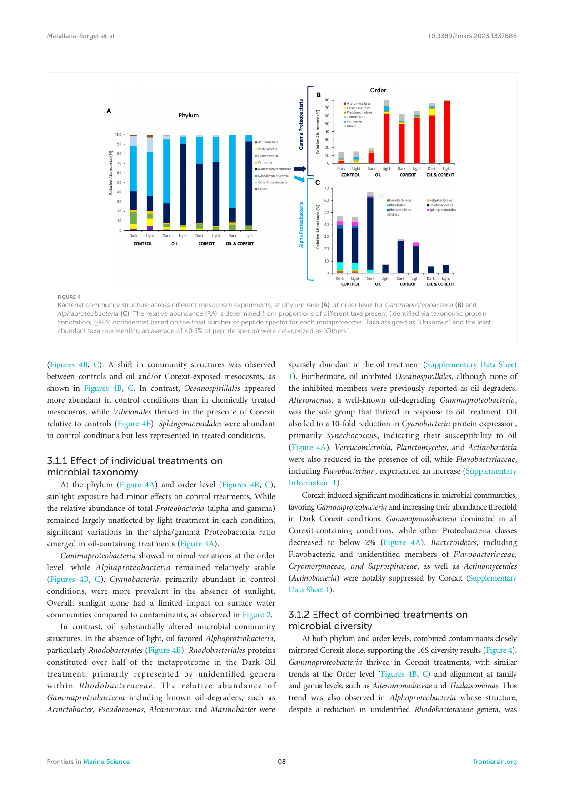
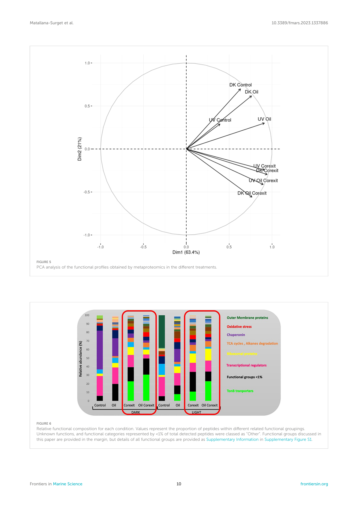
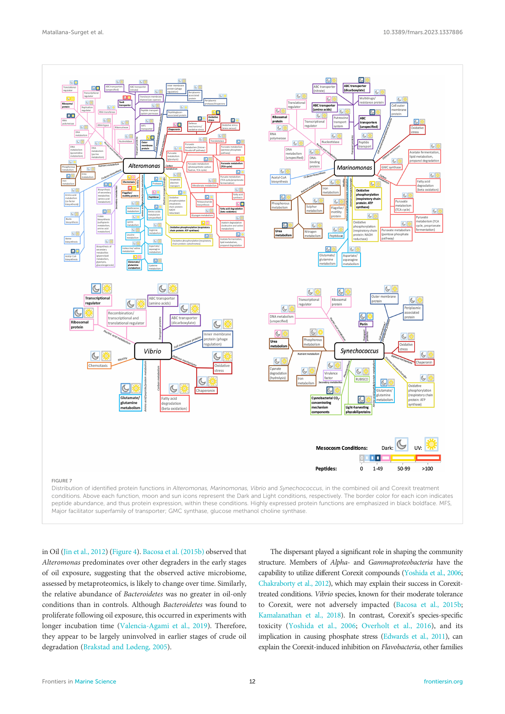

TYPE Original Research PUBLISHED 17 January 2024 DOI 10.3389/fmars.2023.1337886 

##### OPEN ACCESS 

###### EDITED BY 

Hao Zhang, Chinese Academy of Sciences (CAS), China 

###### REVIEWED BY 

Rossanna Rodriguez-Canul, Center for Research and Advanced Studies - Me´ rida Unit, Mexico Li Tangcheng, Shantou University, China 

*CORRESPONDENCE 

Sabine Matallana-Surget sabine.matallanasurget@stir.ac.uk 

RECEIVED 13 November 2023 ACCEPTED 27 December 2023 PUBLISHED 17 January 2024 

###### CITATION 

<mark>Matallana-Surget S</mark> , <mark>Nigro LM</mark> , <mark>Waidner LA, Lebaron P</mark> , <mark>Wattiez R</mark> , <mark>Werner J, Fraser R</mark> , <mark>Dimitrov D</mark> , <mark>Watt R</mark> and <mark>Jeffrey WH</mark> (2024) Clarifying the murk: unveiling bacterial dynamics in response to crude oil pollution, Corexit-dispersant, and natural sunlight in the Gulf of Mexico. Front. Mar. Sci. 10:1337886. doi: 10.3389/fmars.2023.1337886 

###### COPYRIGHT 

© 2024 Matallana-Surget, Nigro, Waidner, Lebaron, Wattiez, Werner, Fraser, Dimitrov, Watt and Jeffrey. This is an open-access article distributed under the terms of the Creative Commons Attribution License (CC BY). The 

use, distribution or reproduction in other forums is permitted, provided the original author(s) and the copyright owner(s) are credited and that the original publication in this journal is cited, in accordance with accepted academic practice. No use, distribution or reproduction is permitted which does not comply with these terms. 

# Clarifying the murk: unveiling bacterial in dynamics response to crude oil pollution, Corexitdispersant, and natural sunlight in the Gulf of Mexico 

Sabine Matallana-Surget1* , Lisa M. Nigro2 , Lisa A. Waidner2 , Philippe Lebaron3 , Ruddy Wattiez4 , Johannes Werner5 , Rosie Fraser1 , Daniel Dimitrov1 , Rowan Watt1 and Wade H. Jeffrey2 

> 1Division of Biological and Environmental Sciences, Faculty of Natural Sciences, University of Stirling, Stirling, United Kingdom,2 Center for Environmental Diagnostics and Bioremediation, University of West Florida, Pensacola, FL, United States,3 Sorbonne University, CNRS, Laboratoire de Biodiversite´ et Biotechnologies Microbiennes, USR3579, Observatoire Oce´ anologique, Sorbonne Universite´ , Banyulssur-mer, France,4 Proteomic and Microbiology Department, University of Mons, Mons, Belgium,5 High Performance and Cloud Computing Group, Zentrum für Datenverarbeitung (ZDV), University of Tübingen, Tübingen, Germany 

The 2010 Deepwater Horizon (DwH) Oil spill released an enormous volume of oil into the Gulf of Mexico (GoM), prompting the widespread use of chemical dispersants like Corexit® EC9500A. The ecological consequences of this treatment, especially when combined with natural factors such as sunlight, remain unexplored in the context of marine bacterial communities’ dynamics. To address this knowledge gap, our study employed a unique metaproteomic approach, investigating the combined effects of sunlight, crude Macondo surrogate oil, and Corexit on GoM microbiome across different mesocosms. Exposure to oil and/or Corexit caused a marked change in community composition, with a decrease in taxonomic diversity relative to controls in only 24 hours. Hydrocarbon (HC) degraders, particularly those more tolerant to Corexit and phototoxic properties of crude oil and/or Corexit, proliferated at the expense of more sensitive taxa. Solar radiation exacerbated these effects in most taxa. We demonstrated that sunlight increased the dispersant’s toxicity, impacting on community structure and functioning. These functional changes were primarily directed by oxidative stress with upregulated proteins and enzymes involved in protein turnover, general stress response, DNA replication and repair, chromosome condensation, and cell division. These factors were more abundant in chemically treated conditions, especially in the presence of Corexit compared to controls. Oil treatment significantly enhanced the relative abundance of Alteromonas, an oil-degrading Gammaproteobacteria. In combined oil-Corexit treatments, the majority of identified protein functions were assigned to Alteromonas, with strongly expressed proteins involved in membrane transport, motility, carbon and amino acid metabolism and cellular defense mechanisms. Marinomonas, one of the most active genera in dark conditions, was absent from the light treatment. Numerous metabolic pathways and HC-degrading genes provided insights into bacterial community adaptation to oil spills. Key enzymes of the glyoxylate bypass, enriched in 

Frontiers in Marine Science 

01 

frontiersin.org 

10.3389/fmars.2023.1337886 

Matallana-Surget et al. 

contaminant-containing treatments, were predominantly associated with Rhodobacterales and Alteromonadales. Several proteins related to outer membrane transport, photosynthesis, and nutrient metabolisms were characterized, allowing predictions of the various treatments on biogeochemical cycles. The study also presents novel perspectives for future oil spill clean-up processes. 

###### KEYWORDS 

oil spill, dispersant, solar radiation, marine microbiome, hydrocarbondegraders, metaproteomics 

## 1 Introduction 

The Deepwater Horizon (DwH) spill occurred in the Gulf of Mexico (GoM) in spring 2010, a season characterized by intense sunlight in that region. Over 4.9 million barrels of crude oil were released into the surrounding waters, making this marine oil spill the largest one in history (Crone and Tolstoy, 2010; Lamendella et al., 2014). The acute pollution that occurred during the DwH oil spill posed an unparalleled threat to the GoM biota. Indigenous microorganisms in the GoM were significantly impacted by the oil spill (Lamendella et al., 2014). Any alterations in marine bacterial functioning are of great ecological impact. Indeed, bacteria are at the bottom of the oceanic food chain, regulate key biogeochemical cycles and play an essential role in the degradation of complex organic substances (Azam et al., 1983). The bacterial community can respond rapidly to environmental changes. In this way, understanding bacterial responses to oil spill is urgently needed, because of their large population sizes and short generation times. 

### 1.1 Consequences of crude oil pollution 

Crude oil is a complex mixture primarily composed of HC, roughly two-thirds of which are alkanes, cycloalkanes, and their derivatives, while polycyclic aromatic hydrocarbons (PAHs) and their derivatives make up the remainder (Tissot and Welte, 1984). Aromatic hydrocarbons such as PAHs are thought to be the most toxic compounds of oil (Neff and Anderson, 1981). The impact of an oil spill varies according to several factors. Environmental conditions such as mixing (Sterling et al., 2004), temperature, available nutrients, salinity (Horel et al., 2014), pressure (Marietou et al., 2018), and UV exposure (Liu et al., 2012; Bridges et al., 2018) affect the weathering process of crude oil, thus alter oil spill properties and the composition of microbial communities (Valencia-Agami et al., 2019). 

The solubility of HCs determines their bioavailability to microorganisms. The water accessible fraction (WAF) of crude oil generally contains more volatile, and therefore more toxic, HCs, including low molecular weight (LMW) PAHs (Ghosal et al., 2016). 

High molecular weight (HMW) or more complex HCs, such as branched or polyaromatic HCs, are more persistent, their degradation sometimes require consortia of bacterial or microalgal strains (Ghosal et al., 2016; Ma et al., 2021). Petroleum toxicity may be stronger for smaller microorganisms, with a high surface/volume ratio (Urakawa et al., 2012). In our study, we used Macondo oil, also identified by its well designation MC-252 (from the Deepwater Horizon oil spill), which is a light crude oil. Light crude oils generally have lower density and viscosity compared to heavy crude oils, affecting their toxic impact on marine bacteria. 

Most marine HCs, including PAHs, undergo biodegradation by HC-degrading microorganisms (Leahy and Colwell, 1990; Prince, 2010). Alkane-degrading enzymes, called alkane hydroxylases, are present in various bacteria, yeast, fungal, and algal species (Peixoto et al., 2011). Microorganisms often harbor multiple hydroxylases to degrade a diverse range of HCs, spanning from low to high molecular weight compounds, in addition to other enzymes like dioxygenases for PAH degradation, facilitating the breakdown of compounds found in crude oil (Van Beilen et al., 2003). 

The diversity of microbial communities was found to be reduced as a consequence of oil exposure with a rapid shift in community composition, selecting for successive consortia of HCdegrading bacteria (Miralles et al., 2007; Orcutt et al., 2010; Hamdan and Fulmer, 2011; Bae et al., 2018; Valencia-Agami et al., 2019). Overall oil exposure enhanced oil-degrading heterotroph populations, but inhibited nitrifiers and denitrifiers (Urakawa et al., 2012; Pietroski et al., 2015; Levine et al., 2017; Bae et al., 2018). The GoM region is exposed to a significant quantity of HCs annually, from both anthropogenic and natural sources (Mason and Hazen, 2011). The GoM features an extensive natural hydrocarbon (HC) seepage, with over 600 occurrences, leading to an annual release of approximately 80,000 to 200,000 tonnes of crude oil. Consequently, microorganisms inhabiting regions with chronic HC exposure are believed to possess the capability for rapid responses to crude oil spills (Hill et al., 2006). Biodegradation played a pivotal role in determining the fate of the oil within the DwH resulting from subsurface dispersant application (Hill et al., 2006; Dubinsky et al., 2013). Within the GoM, HC-degrading microorganisms were characterized, including 

Frontiers in Marine Science 

02 

frontiersin.org 

10.3389/fmars.2023.1337886 

Matallana-Surget et al. 

representatives from Oceanospirillales and Colwellia sp, all of which were notably enriched in the water column (Chakraborty et al., 2012). 

### 1.2 Chemical dispersants - Corexit® EC9500A 

The DwH spill witnessed an unprecedented scale of dispersant application, with 7 million liters mainly comprising Corexit® EC9500A sprayed onto surface slicks and injected into the wellhead (Chakraborty et al., 2012; Zuijdgeest and Huettel, 2012). Corexit accelerates oil weathering by reducing surface tension, breaking slicks into smaller droplets, thus facilitating bacterial aggregation rates (Sterling et al., 2004; Techtmann et al., 2017; Doyle et al., 2018). This dispersion process not only enhances microbial access to the oil but also promotes the diffusion and dilution of oil concentrations, providing sufficient oxygen, nitrogen, and phosphorus for microbial growth and oil consumption (Prince et al., 2013). 

While some heterotrophs metabolized these components, stimulating aerobic oil biodegradation (Bruheim et al., 1999; Kujawinski et al., 2011; Chakraborty et al., 2012), other studies reported the toxicity of Corexit® EC9500A components, such as ethoxylated sorbitan monooleate, sorbitan monooleate, and dioctyl sodium sulfosuccinate (DOSS; Radniecki et al., 2013), toward numerous marine microorganisms (Rosal et al., 2010; Hamdan and Fulmer, 2011; Kujawinski et al., 2011; Zuijdgeest and Huettel, 2012; Kleindienst et al., 2015). Corexit increases the immediate presence of toxic HCs in the water accessible fraction (WAF), particularly HMW PAHs (Radniecki et al., 2013). 

The impact of dispersants on microbial communities is speciesspecific (Kleindienst et al., 2015; Overholt et al., 2016) and remains a topic of debate. The efficiency of dispersants can also be inconsistent, influenced by various factors, including chemical structure, hydrocarbon concentration, and the metabolic potential of microbial populations (Overholt et al., 2016) as natural environmental factors such as sunlight. 

### 1.3 Effect of solar radiation on oil spill and HC-degrading bacteria 

The GoM surface waters are subjected to intense solar radiation, particularly during the Deepwater Horizon (DwH) oil spill (Liu et al., 2016). This strong solar irradiance significantly influences the weathering of oil, playing a pivotal role in photooxidation and enhancing oil dispersion within the water column (Liu et al., 2016; Bridges et al., 2018; Snyder et al., 2021). The penetration of UV radiation into the water is influenced by the optical properties of both the surface oil slick and the water itself (King et al., 2014; Bridges et al., 2018; Quigg et al., 2021). The composition of hydrocarbons (HCs) in water changes as weathering progresses, affecting its bioavailability and toxicity, thus leading to varying 

pressures and responses among aquatic microorganisms (King et al., 2014; Zito et al., 2014; Tarr et al., 2016; Snyder et al., 2021). 

Aromatic HCs are generally more susceptible to UV radiation and photodegradation than aliphatic HCs (King et al., 2014; Zito et al., 2014; Bacosa et al., 2015a). Sunlight not only alters the chemical structure of oil but also produces significant amounts of singlet oxygen, hydroxyl radicals, and various oxygenated compounds (Ray and Tarr, 2014; Zito et al., 2014) as well as increased reactive oxygen species (ROS) known to cause DNA, protein, and lipid damage (Sinha and Häder, 2002), that can indirectly impact marine microbial communities (Bertilsson and Widenfalk, 2002; Matallana-Surget and Wattiez, 2013). Some of these UV-induced photoproducts are even more toxic to microbial communities than the original compounds (Lacaze and Villedon de Naïde, 1976; Vaughan et al., 2016; Bridges et al., 2018). 

While sunlight intensifies the adverse effects of crude oil on diversity in the GoM and contributes to changes in community structure (Bacosa et al., 2015b), our knowledge of how microbial degradation of HCs changes under these GoM conditions remains limited. The specific metabolic pathways affected during oil degradation under high solar radiation doses are yet to be fully characterized. 

### 1.4 The combined effects of three factors: crude oil, Corexit and solar radiation 

The combined impact of HCs, dispersant and solar radiation on microbial communities has received limited attention. It was first reported that sunlight exposure increased chemical toxicity by a staggering factor of 30 in an equal mixture of weathered crude oil and Corexit 8666 (Lacaze and Villedon de Naïde, 1976). More recent research has shed light on the pivotal role of solar radiation in shaping the response of GoM bacterial communities to oil, Corexit® EC9500A, or their combination (Bacosa et al., 2015b). While it is worth noting that solar radiation may amplify the toxicity of Corexit through photooxidation processes (Lacaze and Villedon de Naïde, 1976; Bacosa et al., 2015b), sunlight did not enhance degradation of dispersed HCs (Bacosa et al., 2015a). In summary, sufficient light exposure promotes dispersion and dissolution of crude oil, however it can also increase the toxicity of HCs and Corexit. To date, the combined effects of solar radiation, oil, and dispersant have not been thoroughly examined in terms of protein regulation, which is crucial for understanding microbial activity and responses in the context of an oil spill accident. 

### 1.5 (Meta)proteomics methods to study the molecular effects of oil spill on marine microorganisms 

The great power of proteomics is the identification of enzymes and proteins expressed by organisms, which provides accurate biochemical responses to oil/dispersant inputs and physical 

Frontiers in Marine Science 

03 

frontiersin.org 

10.3389/fmars.2023.1337886 

Matallana-Surget et al. 

effects. Proteomic studies of individual oil-degrading bacteria gave an insight into proteins involved in the degradation of a range of HC-alkanes (Sabirova et al., 2006; Feng et al., 2007). The proteome of Alcanivorax borkumensis showed that alkanes were degraded by several routes involving AlkB hydroxylases, a putative Flavinbinding monooxygenase and P450 cytochromes (Sabirova et al., 2006). This organism adapted to the influx of alkanes in many ways including inducing glyoxylate bypass and gluconeogenesis routes to adapt the cell to produce key cellular precursor metabolites directly from the fatty acids produced by alkane oxidation (Sabirova et al., 2006). Feng and colleagues gave an account of the genome and proteome of Geobacillus thermodenitrificans NG80-2 and how it can adapt in oil reservoirs due to it possessing genes for a broad range of energy sources (Feng et al., 2007). The proteome revealed a long-chain alkane degrading pathway with a key enzyme LadA which could be used for treating environmental oil pollutions and biosynthesizing complex molecules (Feng et al., 2007). It was also found to have the ability to carry out denitrification which is a survival advantage in an oil reservoir. 

Microorganisms function as a consortium within their natural habitat, owing to cell-cell communication and syntrophism. Therefore, focusing on one or few microorganisms in controlled conditions could never predict the microbial response that would occur in the natural environment (Little et al., 2008). Metaproteomic approaches aim to identify the complex microbial protein profile within a given environment at a specific point of time. This gives metaproteomic approaches a unique advantage over other ‘omics’ approaches, as they can determine the functional expression of proteins (Rudney et al., 2015), and thus enables to further the understanding of the relationships between microbial diversity, functioning of an ecosystem and the networks of interactions (Allen and Banfield, 2005; DeLong, 2005). Until now, only one metaproteomics study has successfully described a list of proteins involved in the response to oil (Bargiela et al., 2015). Since then, environmental metaproteomics has been greatly improved thanks to development of high resolution mass spectrometry, protein search database construction, and bioinformatic tools to accurately annotate and link the taxonomy and functions of identified proteins, limiting the well-known protein inference issue (Matallana-Surget et al., 2018; Geron et al., 2019; Saito et al., 2019; Werner et al., 2019). 

The objective of this study is to examine, for the first time, the combined impact of oil, Corexit® EC9500A, and solar radiation on marine microbial communities using a comparative metaproteomic technique. We used the most up to date methodological workflow and provide unique insights into the interactive effects of sunlight, oil, and Corexit-dispersant on natural bacterial communities in GoM. Identifying the functional responses of the microbial community, and the degradation pathways observed in situ provides essential metadata for bioremediation strategies. Our approach goes beyond mere descriptive analysis of microbial diversity and taxonomic structure; it provides specific details about which bacteria are involved in various biogeochemical processes and the pathways of those key players. This metaproteomics study introduces new proxies that can enhance 

the oil spill model for more accurate risk identification. Additionally, considering the importance of cleaning up accidental oil spills, our approach allows for the prediction of key proteins involved in bioremediation, reducing the need for chemical use and lowering associated costs. 

## 2 Materials and methods 

### 2.1 Mesocosms incubations and sample collection 

Surface waters were collected off Pensacola Beach, FL (30.29° N; 87.28°W) in July 2016 and incubated in 70L-mesocosms with amendments of crude oil with and without Corexit-dispersant for 24 hours under sunlight as well as in the dark condition. Before addition to the mesocosms, sampled indigenous communities of microorganisms were filtered through 5µm filters, to remove grazing zooplankton and larger phytoplankton. The 8 mesocosm conditions were incubated in Tedlar® PVF bags, DuPont, with dark condition bags covered in black plastic sheeting before incubation, and “full sun” (UV+PAR) conditions in Tedlar® bags left uncovered, allowing for approximately 40-60% transmission of wavelengths 300-400 nm and approximately 60% of radiation transmitted in wavelengths >400 nm. For each dataset consisting of dark or sunlight-exposed variants for seawater controls, other condition variables included oil-only treatments, dispersant-only treatments, and combined oil and dispersant treatments. A Water Accommodated Fraction (WAF) was prepared using Macondo oil, a light crude oil also known by its well designation MC-252 surrogate (from the Deepwater Horizon oil spill), at a concentration of 1%, with sterile seawater as previously described (Headrick et al., 2023). This WAF was subsequently added to the mesocosms treated with oil. Oil-only mesocosms had a total concentration of approximately 1.1-2.2 x 10-3 % Macondo oil by volume. Corexit-only mesocosms contained 0.1% Corexit by volume. The combined treatment mesocosm had both 1.1-2.2 x 10-3 % Macondo oil and 0.1% Corexit by volume. Mesocosm bags were either transparent (uncovered) to allow sunlight exposure, or opaque for dark conditions. All mesocosms were incubated in surface waters of Santa Rosa Sound (30.34° N; 87.16° W) at the US EPA Gulf Ecology Division laboratory for 24 hours, of which “Light Condition” mesocosms were exposed to solar radiation for approximately 12 hours. For 16S amplicon analysis, a total of 500 mL to 2 L of water from each mesocosm were filtered through a 0.22 µM Millipore Durapore GVWP filter then placed in cryo-tubes with sterile 0.1 mm silica and 0.5 mm glass beads and sucrose buffer (20 mM EDTA, 400 mM NaCl, 0.75 M sucrose, 50 mM Tris-HCl pH 9.0). For metaproteomics analysis, large volumes of seawater are required, as detailed previously (Matallana-Surget et al., 2018; Geron et al., 2019). Consequently, the complete volume of each bag (~60 to 68L) was filtered to guarantee a high-quality proteomics dataset. In this process, microbial biomass was collected through sequential in-line filtration of the seawater sample using two successive 142mm PES-filters with the following cut-off sizes: 

Frontiers in Marine Science 

04 

frontiersin.org 

10.3389/fmars.2023.1337886 

Matallana-Surget et al. 

each condition was conducted using 4–12% precast Bis-Tris polyacrylamide mini-gels (NuPage, Thermo Fisher Scientific). The protein bands were visualized with staining using the Imperial Protein Stain (Thermo Fisher Scientific) according to the manufacturer’s instructions. The gel electrophoresis was used to assess the accuracy of the Bradford protein concentration prior to gel-free proteomic shotgun analysis, described below. 

### 2.5 Gel-free shotgun metaproteomic and liquid chromatography tandem mass spectrometry analysis 

Based on the results of the Bradford assay and the NuPAGE gels, acetone precipitations were further performed on a total of 200mg of proteins for the eight conditions, using cold acetone precipitation at a ratio of 1:4 of sample/acetone. The samples were then re-suspended in a suspension buffer consisting of 1M Guanidine HCL and 25mM NH4 HCO3, and then reduced with 25mM dithiothreitol (DTT) for 30 minutes at 60°C and alkylated with 50mM iodoacetamide for 30 minutes at 25°C. Proteins were digested with a solution of trypsin at a ratio of 1:25 (enzyme: substrate) and incubated overnight at 37°C. Trypsin digest was then stopped with 1ml 5% (v/v) formic acid. Tryptic peptides were analyzed by liquid chromatography tandem mass spectrometry. Peptide samples were analyzed on an ultra-high-performance liquid chromatography–high-resolution tandem mass spectroscopy (UHPLC-HRMS/MS) system, including a Eksigent NanoLC 400 and AB SCIEX TripleTOF 5600. Two micrograms of peptides were analyzed using acquisition parameters previously reported (Geron et al., 2019), and MS/MS spectra were acquired with the instrument operating in data-dependent acquisition (DDA), with micro injection (75 min LC separation) modes. The metaproteomic raw data are available in the iProx public platform (Project ID: PXD048022). 

### 2.6 Protein searches database construction and protein identification 

Protein searches were performed using ProteinPilot (ProteinPilot Software 5.0.1; Revision: 4895; Paragon Algorithm: 5.0.1.0.4874; AB SCIEX, Framingham, MA, United States) (Matrix Science, London, United Kingdom; v. 2.2). Paragon searches were conducted using LC MS/MS Triple TOF 5600 System instrument settings. Other parameters used for the search were as follows: Sample Type: Identification, Cys alkylation: Iodoacetamide, Digestion: Trypsin, ID Focus: Biological Modifications and Amino acid substitutions, Search effort: Thorough ID, Detected Protein Threshold [Unused ProtScore (Conf)]>: 0.05 (10.0%). 

The OTU tables obtained by the 16S rRNA reads were used to create the protein search databases for the analysis of the 8 metaproteomes. Those fasta files were generated with mPies v 0.9, our recently in house developed mPies program is freely available at https://github.com/johanneswerner/mPies/(Werner et al., 2019), following the same TAX-DB workflow, as previously described in 

our recent methodological publications (Geron et al., 2019; Werner et al., 2019). Taxonomic classification based on the 16S amplicon sequencing for this metaproteomics workflow is only needed as a guide for the phylum, class, or order level, as previously described (Geron et al., 2019; Werner et al., 2019). The database searching with Protein Pilot was done against 8 distinct databases (one for each condition). A FDR threshold of 1%, calculated at the protein level, was used for each protein searches. Proteins identified with one single peptide were validated by manual inspection of the MS/ MS spectra, ensuring that a series of at least five consecutive sequence-specific b-and y-type ions was observed. 

Identified proteins were further annotated using mPies as previously described in our former papers (Geron et al., 2019; Werner et al., 2019). For taxonomic and functional annotation, mPies used Diamond to align each identified protein sequences against the non-redundant NCBI DB and the UniProt DB (SwissProt), respectively, and retrieved up to 20 best hits based on alignment score (>80). For taxonomic annotation, mPies returned the LCA among the best hits via MEGAN (bit score >80) (Werner et al., 2019). For functional annotation, mPies returned the most frequent protein name, with a consensus tolerance threshold >80% of similarity among the 20 best blast hits. Proteins annotated with a score below this threshold were manually validated. Manual validation was straightforward as the main reasons leading to low annotation score were often explained by the characterization of protein isoforms or different sub-units of the same protein. 

## 3 Results 

### 3.1 Taxonomic composition of the active microbial communities 

This study presents extensive datasets, encompassing thousands of proteins identified under eight different treatments. To ensure clarity, we will primarily concentrate on both the taxonomic composition and functions of microbial communities assessed through metaproteomics, representing active communities in the mesocosms. It is essential to emphasize here that we used 16S rRNA gene reads to construct a Protein Search Database for our metaproteomics workflow (Geron et al., 2019; Werner et al., 2019). As a result, the 16S diversity obtained in this study will only be briefly discussed in terms of treatment clustering. 

A Principal Component Analysis (PCA) of the microbial diversity based on the 16S rRNA sequences revealed three major clusters of microbial communities: Control, Corexit, and Oil alone. Community compositions of control samples were the closest to the initial communities (T0), regardless of the presence of sunlight (Figure 2). Interestingly, all samples treated with Corexit grouped together including both treatments namely: Corexit alone and Oil and Corexit. Furthermore, subclusters emerged among mesocosms exposed to the dispersant, suggesting that sunlight influenced microbial diversity when combined with Corexit. 

The taxonomic composition obtained by Metaproteomic allows for the characterization of active taxa and will be referenced as such throughout the manuscript. Identified proteins were annotated 

Frontiers in Marine Science 

06 

frontiersin.org 

10.3389/fmars.2023.1337886 

Matallana-Surget et al. 

similar than in the Corexit treatments (Figure 4). Furthermore, as in Corexit treatments, the combined contaminants reduced the abundance of every other phylum below 3%, besides Cyanobacteria in the absence of sunlight. Cyanobacteria were almost equally represented in both Dark Corexit-containing treatments, and they were indistinguishable at the order level. The distinct, relative abundances observed for Alphaproteobacteria, Gammaproteobacteria, and Cyanobacteria concur that Corexit was the driving factor for the variance in combined contaminant treatments. 

The combination of contaminants and sunlight induced significant variations in microbial communities in Light treatments versus their Dark counterparts. Gammaproteobacteria were exceptionally efficient in coping with these combined effects, as their numbers increased substantially (Figure 4B). The positive effects of sunlight were particularly evident on Alteromonas and other unidentified members of family Alteromonadaceae. On the contrary, Alphaproteobacteria declined in the presence of light and oil, mainly due to the inhibition of Rickettsiales and unspecified Alphaproteobacteria. Light and Corexit favored both Alpha- and Gammaproteobacteria, particularly when combined (93% microbial abundance; Figure 4). Additionally, sunlight and dispersant inhibited Synechococcus (Cyanobacteria; Supplementary Information 1). Light and chemicals negatively impacted other phyla, notably in Light Oil & Corexit (<2% abundance). Bacteroidetes responded positively, increasing Flavobacteriaceae, Marinomonas, Vibrio, but reducing Marinobacter (absent in the Light condition). This underscores solar radiation’s role in shaping dispersant-containing community structures. Sunlight, combined with contaminants, influenced active community structures (characterized by metaproteomics), although less markedly than in 16S analysis of Corexit-containing treatments. 

### 3.2 Functional trait variations in response to oil, Corexit and sunlight 

In both the Dark and Light conditions, the total number of proteins was 1792 and 1383, leading to 573 unique protein functions. A small core metaproteome, consisting of only 12 proteins, was found to be common in all metaproteomes, and these proteins were primarily ribosomal proteins, constitutively expressed chaperones, ATPase, flagellin, and transporters (Supplementary Information 2; Venn Diagram Data Sheet). Among all conditions, the Corexit-containing conditions exhibited the highest diversity of unique protein functions, regardless of the light treatments, with the lowest diversity observed in the control treatments. This demonstrates the active response of microbial communities to chemicals, including both oil and Corexit. A PCA analysis of the metaproteomics functional diversity mirrored the clustering observed in the 16S rRNA analysis (Figure 5). Notably, Corexit induced similar protein regulation compared to combined Oil and Corexit treatments, irrespective of light conditions. 

All non-redundant protein functions were classified into functional groups for all conditions as presented in Figure 6. The most consistently abundant functional proteins were involved in the metabolism of nucleic acids and protein synthesis (Figure 6; Supplementary S1). The vast majority of these were involved in transcription or translation (averaging 25% of total identified peptides for each condition), such as transcriptional regulators (15%) or ribosomal protein (7%). 

Transporters were the next most abundant group, with slightly higher expression in all Corexit-exposed conditions (Supplementary Information 2). TonB-dependent transporters increased in oil and/or Corexit conditions (30% in the dark combined condition), while ABC transporters showed variable abundance across conditions (Figure 6). Amino acid transport was more abundant in Light Control than Dark Control but less abundant in irradiated conditions. Nitrate and dicarboxylate ABC transporters were upregulated in Dark Corexit and/or Oil treatments. Proteins associated with electron transport and transfer processes were consistently expressed, with the highest abundance in Oil-only conditions (11.01% and 8.34%, respectively), and the lowest in Corexit-exposed conditions (3.57-5.46%). These proteins were primarily associated with oxidative phosphorylation, including cytochromes (~5.9%). 

Chaperonins were most abundant in the Dark Control (~45%) but absent in the Light Control. They were more abundant in response to oil-only exposure than Corexit treatments, and less abundant in UV-exposed conditions. Proteins associated with oxidative stress responses were more abundant in Corexitexposed conditions compared to controls (Figure 6). 

Carbon metabolism was upregulated in all Corexit and/or oilexposed communities, in both dark and light conditions. Pyruvate metabolism, including the tricarboxylic acid (TCA) cycle, contributed significantly (~4.4%) (Figure 6). Carbon fixation processes were generally more abundant in treated dark conditions compared to UV. In combined treatments, the pentose phosphate, carbon fixation, and Entner-Doudoroff pathways were all overrepresented in the dark. Other less abundant proteins included amino and nucleotide sugar metabolism, polysaccharide biosynthesis, methylotrophic pathways, and other HC-degradation (Supplementary Figure S1). Photosynthesis-related proteins were more abundant in dark conditions, with the highest expression in the Dark Control (5.31%). They were also well-expressed in dark treatment conditions, particularly in oil-only and combined treatments, mainly for light-harvesting phycobiliproteins (~0.73%) and CO2-concentrating mechanisms associated with Cyanobacteria (~0.56%). On average, 1.2% of identified proteins were associated with nitrogen metabolism, 0.59% with phosphorus metabolism, and 0.42% with iron metabolism, with no clear pattern observed. Proteins associated with sulfur metabolism were identified in Corexit-associated conditions only. 

Motility-associated protein responses varied across different treatment conditions, with flagellar/motility proteins overrepresented in Light control or Oil-only conditions (~3.47% overall). Chemotaxis- 

Frontiers in Marine Science 

09 

frontiersin.org 

10.3389/fmars.2023.1337886 

Matallana-Surget et al. 

associated proteins were absent in control conditions but present (~1.05%) in Oil and/or Corexit-treated conditions. 

### 3.3 Who’s doing what? Linking taxonomy and function of key players during an oil spill 

Control conditions exhibited a diverse taxonomic composition enriched with essential housekeeping functions such as like photosynthesis, respiratory chain proteins, transcriptional factors, transporters, and chaperonins (Supplementary Heatmaps 1-2). Conversely, the Dark Oil treatment exhibited the most extensive diversity, both in terms of taxa and non-redundant protein functions (Supplementary Heatmaps 3-4). Interestingly, Corexit and Oil+Corexit conditions displayed similar diversity patterns (Supplementary Heatmaps 5-8). In the Oil and/or Corexit treatments, the majority of identified protein functions were assigned to Alteromonas, and the detailed regulations for this genus are presented below for the combined treatments. 

In the combined oil and Corexit treatment, a wide diversity of functional categories was assigned to Alteromonas - a versatile responder under combined treatments (Figure 7). Highly expressed proteins included those related to TonB-dependent transporters, chemotaxis, motility, ribosomal proteins, aspects of carbon metabolism, and cellular defense mechanisms. Outer membrane proteins, various forms of amino acid, peptide and protein metabolism, and respiratory chain protein ATP synthase also displayed high expression. Generally, proteins were more abundant in the dark than in UV conditions, except for transcriptional and translational regulators, which were more prevalent in the light. 

Marinomonas was one of the most active genera present in the dark condition but was absent from mesocosms exposed to sunlight. The most represented protein functions were involved in oxidative phosphorylation, various ABC transporters, nutrient metabolism, and ribosomal protein (Figure 7). 

Vibrio, which remained active not in the dark but in the light conditions, exhibited a diverse range of protein functions (Figure 7). Among these functions, transcriptional regulators, ribosomal proteins, and amino acid metabolism, particularly related to glutamate and glutamine, showed the highest levels of expression. 

Synechococcus harbored diverse protein functions (Figure 7). These were primarily those involved in photosynthesis, and in nutrient metabolism. Most functions were expressed in the dark, except for porins and phosphorus metabolism. Carbon metabolism was not characterized in Synechococcus in either condition. Synechococcus displayed few proteins involved in cellular defense mechanism as shown in Figure 7. 

## 4 Discussion 

The 16S rRNA analysis provides insights into complex microbial community composition, while metaproteomics allows us to decode microbial functioning and identify the most active and abundant taxa. Both methods, 16S rRNA and metaproteomics, 

revealed that the chemicals used in this study—oil and dispersant —significantly influenced microbial composition and activities. Notably, the taxonomy identified through 16S analysis closely mirrored the results obtained from metaproteomics, indicating that the most abundant bacterial groups were also the most active. Among these chemicals, Corexit (either alone or in combined treatments) exerted a more pronounced influence on community structure than oil treatment. Interestingly, while 16S diversity suggested that irradiance primarily affected the taxonomic composition of Corexit-treated communities, metaproteomic data revealed consistent impacts of sunlight exposure on the relative abundance of dominant taxa (including Alteromonadales, Oceanospirillales, and Synechococcales) and overall diversity. As expected, sunlight exposure impacted the relative abundance and diversity of Rhodobacteraceae, a major group that includes copiotrophic photoheterotrophs, confirming previous findings (Gomez-Consarnau et al., 2019). 

### – 4.1 Impact of the chemicals oil and - Corexit on the composition of the active microbiome 

Microbial communities respond rapidly to oil and/or Corexit in warm GoM surface waters (Doyle et al., 2018). In our study, our mesocosm experiment ran for 24 hours, thus assessing the initial responses to oil and/or Corexit exposure. Multiple studies reported a pattern of succession in oil-exposed communities in surface waters (Doyle et al., 2018; Valencia-Agami et al., 2019) and at depth (Mason et al., 2012; Techtmann et al., 2017; Marietou et al., 2018). A number of studies found that, similar to our results, diversity rapidly decreased in response to oil (Miralles et al., 2007; Orcutt et al., 2010; Mason et al., 2012; Bae et al., 2018) or Corexit treatment (Bacosa et al., 2015b). 

Oil increased the abundance of HC-degrading microorganisms, but simultaneously reduced microbial diversity, thus disrupting the interdependence within the microbial consortia (Nyman, 1999). This disruption is primarily attributed to the toxicity exerted by oil on specific microbial clades, and a notable illustration of this is the suppression of Synechococcus and Pelagibacteraceae. This inhibition of Synechococcus was also supported by Liu and Liu (2013) and Bacosa et al. (2015b). Alphaproteobacteria adapted quicker to oil than Gammaproteobacteria. The increase in abundance in Rhodobacteriales is not surprising (Figure 4), since members of that order are known HC-degraders and were extensively implicated in DwH spill-related studies (Redmond et al., 2010; Dubinsky et al., 2013; Liu and Liu, 2013). Other studies observed the same results, serving as proof that Rhodobacteraceae members are crucial to oil degradation (Brakstad and Lødeng, 2005; Kostka et al., 2011). The greatest increase in diversity between the control and the oil samples were Vibrio species which were highly expressed in samples containing oil and/or Corexit in both the dark and UV conditions (Figure 4). Vibrio species are ubiquitous and abundant in marine ecosystems and are associated with HC degradation (Chakraborty et al., 2012). In addition, Alteromonas was the only oil-degrading Gammaproteobacterium whose abundance increased 

Frontiers in Marine Science 

frontiersin.org 

11 

10.3389/fmars.2023.1337886 

Matallana-Surget et al. 

of Bacteroidetes, Pelagibacteraceae, and Actinomycetales (Figure 4). Natural formation of marine-snow-like particles upon the addition of Corexit to seawater (Quigg et al., 2021) would also potentially lead to an increase in particle-associated copiotrophs like those in Rhodobacteraceae and Vibrio, naturally found at higher abundance associated with particles (Crump et al., 1999; Gomez-Consarnau et al., 2019). Interestingly, the Phylum Bacteroidetes generally appeared sensitive to Corexit but not oil and further research is needed to investigate the impact of Corexit on Bacteroidetes species. 

In the combined chemical treatments, Corexit accounted for most of the community structure variation. Relative abundance of the orders Sphingomonadales and Betaproteobacteria, and of the phylum Firmicutes, was reduced across all treated conditions, indicating sensitivity to oil and to Corexit. In the PCA analyses of both 16sRNA and metaproteomics, Oil & Corexit treatments grouped together with Corexit alone, regardless of sunlight (Figures 3, 6). Even though the community structures were very similar in Corexit-containing conditions, their functioning was distinct. A hypothesis would be that the dispersant acts as a preferred carbon source (Kleindienst et al., 2015), thus delaying oil-induced variation. However, the microbial composition is anticipated to change over time in favor of an oil-driven structure, as Bacosa et al. (2015b) showed that in Dark conditions the concentrations of n-alkanes, PAHs, and alkylated PAHs did not decline prior to the 5th day, regardless of the addition of dispersant. This implies that more than a day’s cycle would be needed to notice changes induced by oil degradation. Pseudomonas was also highly expressed in all the samples containing oil and/or Corexit in both the dark and sunlight conditions (Figure 3). The order of Pseudomonadales, which was best represented in oil-treated conditions, is known to include HC-degraders (Lamendella et al., 2014), and to have some tolerance of Corexit (Kamalanathan et al., 2018), indicating its importance in an oil spill. 

### 4.2 Sunlight amplifies oil and Corexit toxicity 

Sunlight alone caused only minor alterations in the community structure (Figure 4), likely due to microorganisms’ efficient radiation coping mechanisms (Ruiz-Gonzalez et al., 2013). Previous studies demonstrated that the combination of oil and Corexit (Doyle et al., 2018) and additional sunlight exposure (Bacosa et al., 2015a; Bacosa et al., 2015b) led to a more significant reduction in diversity compared to oil alone. Combining oil, Corexit, and sunlight led to significant diversity reduction, suggesting strong interactions between contaminants and solar radiation. This interaction affected the relative abundance of Alpha- and Gammaproteobacteria, with Vibrio absent from light exposed combined treatments. Members of Alpha- and Gammaproteobacteria would outgrow other bacteria by utilizing UV-degraded contaminant compounds as a carbon source. This is supported by photooxidation playing a major role in oil weathering and degradation (Aeppli et al., 2014; Bacosa et al., 2015b). In this way, in our study, Vibrio was absent from the light 

exposed and chemical treatments. Interestingly, a related taxa Aliivibrio fischeri is known to be susceptible to toxic water-soluble photoproducts of crude oil (Griffiths et al., 2014). 

Oceanospirillales, primarily represented by Marinomonas, appeared sensitive to phototoxic effects, as did Actinobacteria (Chakraborty et al., 2012; Bacosa et al., 2015b; Gomez-Consarnau et al., 2019). Actinobacteria has previously been found to represent a significant proportion of oil and Corexit-exposed microbial communities, especially in deeper waters rather than surface conditions in the GoM (Chakraborty et al., 2012). 

### 4.3 Functional traits and their regulation to environmental stressors 

Many of the identified functional protein categories were associated with essential cellular processes, including nucleic acid metabolism (including gene expression, replication, and repair), cellular defense mechanisms, carbon metabolism, amino acid metabolism, nutrient metabolism, transport proteins, and co-factors. While shifts in community structure were evident across conditions, changes in protein expression were generally less pronounced. Notably, proteins related to nucleic acid metabolism exhibited consistent high expression levels across all conditions. In this study, we also observed the presence of numerous proteins associated with hydrocarbon (HC) degradation pathways, consistent with previous analyses of samples from the DwH plume that revealed expression of proteins related to hydrocarbon degradation, carbon metabolism, and methanogenesis (Lu et al., 2012; Mason et al., 2012). 

#### 4.3.1 Hydrocarbon degraders: insights into their roles and adaptations to sunlight and Corexit 

Alkane hydrocarbon (HC) degradation involves alkane monooxygenases to convert alkanes into primary alcohols. These primary alcohols are further oxidized to fatty acids by aldehyde and alcohol dehydrogenases, which can enter the beta-oxidation pathway (Van Beilen et al., 2003). Interestingly, we observed the expression of monooxygenases in presence of oil, Corexit or control treatment, for the mesocosms kept in the dark. The Alkane-1monoxygenase was characterized in the Dark-Corexit treatment. Those results could indicate ongoing alkane degradation in those conditions, even in the control treatment possibly due to natural HC seepage in the GoM (Joye et al., 2014; Kleindienst et al., 2015). The monooxygenases were annotated as being expressed by Thioclava spp. (DK Corexit), Neptuniibacter (DK Control) and Clostridium Paraputrificum (DK Oil) (Supplementary Figure S1; Supplementary Information 2). Sulfur oxidizing bacteria, including Thioclava spp. were previously characterized in water flooded petroleum reservoir in China (Tian et al., 2017). Bacosa et al. (2021) also reported an increase of Neptuniibacter in presence of oil, making those bacteria novel potential candidate for environmental oil pollution treatment. Methylmalonyl-coA epimerase, an enzyme known to be used by bacteria such as Desulfatibacillum alkenivorans for alkane degradation (Callaghan et al., 2012), was expressed in the Dark Oil and Light Corexit 

Frontiers in Marine Science 

frontiersin.org 

13 

10.3389/fmars.2023.1337886 

Matallana-Surget et al. 

samples by Ebipacterium multivorans and a bacterium from the family of Rhodobacteraceae (Supplementary Information 2). 

Enzymes related to the glyoxylate bypass (isocitrate lyase, malate synthase, and succinate dehydrogenase), an alternative pathway for growth solely on alkanes, were enriched in all contaminant-containing treatments, primarily associated with Rhodobacterales and Alteromonadales. This enrichment may be a response to suppress oxidative stress, indicating the importance of boosting DNA repair mechanisms, oxidative stress resistance, and utilization of newly supplied carbon sources (Liu et al., 2003). These adaptations could contribute to an increased relative abundance of Proteobacterial orders, although a substantial reduction in bacterial diversity was observed (Figure 4). Furthermore, enzymes indicating a complete TCA cycle were enriched in contaminant-containing treatments, possibly due to bacteria utilizing newly supplied carbon sources. This includes malate dehydrogenase, which converts malate to pyruvate or oxaloacetate. These enzymes were more abundant in dark conditions than in light, suggesting sunlight’s influence on HC-degrading enzymes. Dehydrogenases, vital for PAH degradation (Van Beilen et al., 2003; Ghosal et al., 2016), were more prevalent in oil and/or Corexit-containing treatments, indicating potential short-term biodegradation of PAHs within 24 hours. 

HC-degrading taxa were consistently present across treatment conditions, with a higher relative abundance in response to oil exposure. Alteromonadales increased significantly in response to oil, Corexit, and UV exposure. These findings indicate the rapid response of Alteromonadales to spills (Techtmann et al., 2017), including Corexit-treated conditions (Kamalanathan et al., 2018). Alteromonas and Marinobacter, known hydrocarbonoclasts, are among the first to proliferate in crude oil degradation, typically within days of exposure (Techtmann et al., 2017; Valencia-Agami et al., 2019). Extracellular polymeric substance (EPS) production may contribute to their resilience, aiding in biofilm formation and aggregation around oil droplets, which helps protect against environmental stressors such as PAHs or Corexit. Members of Alteromonadaceae are known to upregulate EPS production and extracellular enzyme activity in response to Corexit and oil exposure (Kamalanathan et al., 2018), as well as UV exposure (Sun et al., 2018). In our study, Alteromonas expressed protein functions potentially involved in EPS production, including polysaccharide biosynthesis, secondary metabolite biosynthesis, and transport. Additionally, some Alteromonadaceae may have the ability to degrade Corexit components (Kamalanathan et al., 2018). However, further experiments are needed to determine the toxicity of dispersant-oil mixtures compared to dispersants alone (Overholt et al., 2016). 

#### 4.3.2 Corexit unveiled: evidence of enhanced oxidative stress 

Oxidative stress responses were upregulated in treated conditions compared to controls. UV exposure further increased the expression of oxidative stress responses in the presence of oil or Corexit, leading to the production of more toxic metabolites and 

reactive oxygen species (ROS) from these contaminants (Bacosa et al., 2015b). Understanding the regulation of these proteins in response to stressors can provide insights into bacterial adaptation mechanisms, which may be relevant for bioremediation in oil spill cleanups. Our study revealed that oil and especially Corexit triggered various responses to maintain DNA integrity and protect cells from damage. 

Peptidases and proteases were abundant in contaminantcontaining treatments, indicating protein damage and breakdown. Sunlight and contaminants showed higher enrichment of those enzymes suggesting an elevated level of oxidative stress in these conditions. Chaperonin proteins, including the 60 kDa, 10 kDa, and DnaK chaperonins, were consistently abundant in all mesocosms exposed to the challenging environmental conditions in the Gulf of Mexico (regular oil seepages, high doses of UV irradiation), indicating their crucial role in preventing cellular damage. These proteins play a crucial role in preventing cellular damage by averting the accumulation of misfolded or unfolded proteins that have lost their function. This observation implies the necessity for a stringent regulation of critical protein folding within the microbial community in this region to deal with the accumulation of carbonylated amino acids, a characteristic indicator of oxidative protein damage (Matallana-Surget et al., 2013; Chang et al., 2020). 

The presence of Corexit led to an increase in the expression of TonB-dependent transport proteins. These proteins are known to be associated with either oil exposure (Knapik et al., 2020) or the application of Corexit (Peña-Montenegro et al., 2023). Starvationrelated proteins were expressed in Corexit-containing treatments, indicating potential stress in nutrient-limited waters. 

Proteins involved in cell redox homeostasis, such as peroxiredoxins, thioredoxins, hydroperoxide reductases, catalaseperoxidases, and superoxide dismutases were significantly more abundant in the presence of contaminants in comparison to the controls, highlighting the presence of ROS. Three proteins of peroxiredoxin and six catalase-peroxidases were abundant in Light Corexit (Supplementary Information 2). Glutathione reductase, another indicator of oxidative stress response, was abundant in Light Corexit-treated conditions. Its role is to maintain a strong reducing environment in the cell in response to ROS (Ziegelhoffer and Donohue, 2009). 

DNA replication and repair protein Endonuclease MutS2 (DK Oil Corexit), DNA gyrase subunit B (Light Corexit, Light Oil Corexit), RecA (Light Oil, Light Corexit), LexA (DK Oil) and RecBCD enzyme subunit RecC (DK Oil Corexit), UvrABC system protein A (UvrA; Light Corexit, Light Oil Corexit) were absent in control samples and prevalent in contaminant-containing conditions, especially Corexit treatments, indicating acute stress responses that includes DNA damage repair and protection against oxidative stress (Morita et al., 2010). It was striking to observe numerous enzymes involved in distinct types of DNA repair pathways in presence of Corexit and/or Oil (absent in controls) that are essential for maintaining DNA integrity and preventing mutations. The DNA repair pathways involved DNA mismatch repair (Endonuclease MutS2), DNA homologous recombination (RecA, RecBCD), SOS Response (Lex A, 

Frontiers in Marine Science 

frontiersin.org 

14 

10.3389/fmars.2023.1337886 

Matallana-Surget et al. 

transcriptional repressor regulating the SOS response), Nucleotide Excision Repair (NER) (UvrABC system) (Morita et al., 2010). Moreover, RecA was expressed in Light Corexit and Light Oil, while RecBCD enzyme subunit RecC was found in Light Oil & Corexit. Both RecA and RecBCD are part of a DNA lesion repair system (Anderson and Kowalczykowski, 1997), indicating the necessity for DNA damage repair under these conditions. 

Numerous proteins responsible for maintaining chromosome integrity and DNA stability compaction were identified almost exclusively in the contaminants-containing conditions that included: DNA gyrase, DNA topoisomerases, Nucleoid occlusion factor SlmA, and several Histone Binding HU proteins. Divalent cations such as (Ca2+ or Mg2+ ) enriched in petroleum-containing waters are known to inhibit DNA compaction induced by trivalent cation such as spermidine (Gao et al., 2019). In other words, in the absence of spermidine, divalent cations, cause DNA condensation (Gao et al., 2019). Interestingly, we also characterized a high number of spermidine/putrescine ABS transporter proteins (44 proteins), exclusively present in contaminant-containing mesocosms, suggesting a role in balancing increased divalent cation concentrations and maintaining DNA stability, in a context of enhanced oxidative stress. 

Cell Division FtsZ protein was prevalent in oil and/or Corexit treated samples, indicating its role in cell division under stress conditions. Under stress conditions, the SOS response may be activated, leading to the inhibition of cell division to allow time for DNA repair. FtsZ proteins can be regulated by diverse stressinduced pathways. Interestingly, it was demonstrated in E. coli that the nucleoid occlusion SlmA interferes with FtsZ polymerization and blocks the Z-ring formation over the nucleoid and help coordinate cell division with chromosome segregation (Cho et al., 2011; Monterroso et al., 2019; Robles-Ramos et al., 2021). 

#### 4.3.3 Nutrient cycling in the presence of light, oil, and Corexit 

The oceanic environment is primarily limited by nitrogen, phosphorus, and iron availability (Moore et al., 2013). Picocyanobacteria, such as Synechococcus, play a significant role by producing dissolved organic matter (DOM), rich in nitrogen and phosphorus. Heterotrophic microorganisms contribute to nutrient cycling by regenerating inorganic nutrients, thus making them readily available to cyanobacteria in mutualistic consortia (Buchan et al., 2014; Christie-Oleza et al., 2017). Previous research conducted at the DwH plume site identified gene expressions associated with nitrogen assimilation, sulfate reduction, and phosphorus transport (Lu et al., 2012). 

Synechococcus exhibited active metabolism involving iron, phosphorus, and nitrogen, primarily in the form of urea, a common nitrogen source for primary producers (Solomon et al., 2010). However, the presence of oil and Corexit, especially in irradiated conditions, had inhibitory effects on photosynthesis and the most abundant and active order of Cyanoabacteria (Synechococcales). This outcome is unsurprising, given that hydrocarbons (HCs) found in oil have inhibitory effects on most Cyanobacteria (Megharaj et al., 2000), including photosynthesis (Gordon and Prouse, 1973; Karydis, 1979). Corexit® 9500 is toxic to Synechococcus, and many other phytoplankton species, either alone or in 

combination with oil (Bacosa et al., 2015b; Quigg et al., 2021). The reduced representation and activity of Cyanobacteria, particularly Synechococcus, in irradiated conditions, likely result from the additional phototoxicity induced by crude oil and Corexit (Lacaze and Villedon de Naïde, 1976; Bacosa et al., 2015b). While Cyanobacteria fix carbon through photosynthesis and perform dark respiration (Shinde et al., 2020), no specific forms of carbon metabolism were observed in Synechococcus, Prochlorococcus, or Nostoc. However, ATP synthase required for respiration was detected in Synechococcus. 

Marinomonas also expressed a range of nutrient acquisition strategies which aligns with the findings of Mason and colleagues (2012). Most of the expressed proteins were involved in transport and metabolism of nitrogen, phosphorus, iron, and sulfur, albeit to a lesser extent in the presence of sunlight. Additionally, metabolic pathways responsible for converting phosphonates (a common component of the oceanic organic phosphorous reservoir; Villarreal-Chiu et al., 2012) to phosphates were expressed at low levels in all conditions, as were pathways related to iron metabolism. Macondo oil has a low sulphur content, and sulphur metabolism was exclusively expressed at low levels in the Corexit treatment conditions. This is likely due to heterotrophic metabolism of the Corexit component DOSS. Sulphur metabolism was expressed in Marinomonas, although Oceanospirillales are not known for Corexit degradation. 

Glutamate and glutamine metabolism were highly expressed relative to other forms of amino acid, peptide and protein metabolism, and strongly expressed across various taxa, including Alteromonas, Pseudoalteromonas, Marinomonas, Vibrio, and Synechococcus, indicating their role in nitrogen assimilation and biosynthesis of essential cellular components (Walker and van der Donk, 2016). Species-specific responses to oil and Corexit exposure have been observed in relation to glutamate and glutamine metabolism (Peña-Montenegro et al., 2023). 

## 5 Conclusion 

This study unveils novel insights into the remarkable abilities of indigenous bacteria in the GoM to biodegrade oil, even in the presence of Corexit dispersant and intense UV irradiation. Leveraging advanced metaproteomic techniques, we have delved deeper into the intricate functioning of marine microbial communities. For the first time, we harnessed metaproteomics to decipher the combined repercussions of oil pollution, the dispersant Corexit, and UV radiation on the natural microbial communities in the GoM, in the aftermath of the 2010 Deepwater Horizon oil spill. 

Exposure to oil and/or Corexit initiates a profound transformation in the taxonomic structure of bacterioplankton communities, a transformation that sunlight further exacerbates due to enhanced oxidative stress. In the presence of oil, the growth of hydrocarbonoclastic heterotrophs such as Alteromonadales and Oceanospirillales was enhanced, while other less-adapted heterotrophs were inhibited. Consequently, the dominance of Alpha- and Gammaproteobacteria under sunlight exposure and with contaminant treatments was explained by their efficient DNA repair mechanisms, tolerance to oxidative stress, and the 

Frontiers in Marine Science 

frontiersin.org 

15 

10.3389/fmars.2023.1337886 

Matallana-Surget et al. 

switch to alternative metabolic pathways. We observed a surge in carbon and amino acid metabolism in response to oil or Corexit. In our study, we demonstrated that Corexit does affect the expression of HC-degrading enzymes and enhanced oxidative stress. 

Moreover, we provide compelling evidence that sunlight plays a pivotal role in the response and activity of the marine indigenous microbiome in the GoM. In the presence of sunlight and oil, the diversity of many crucial HC-degrading bacteria, such as Rhodovulum and Roseobacter, was significantly reduced compared to the dark and oil-only samples. This suggests that sunlight can alter the chemical structure of oil, making it more toxic to specific bacterial species. We also reported that cyanobacterial photosynthesis was impacted by the phototoxicity of oil and Corexit. 

As a perspective, we advocate for further studies to incorporate a time series approach, comparing short-term versus longer incubations, while also assessing the impact of varying concentrations of crude oil and Corexit. Enhanced understanding of these factors would be invaluable in shaping future oil spill cleanup procedures, which are indispensable for preserving the health of our oceans. 

## Funding 

The author(s) declare financial support was received for the research, authorship, and/or publication of this article. This research was made possible in part by a grant from BP/The Gulf of Mexico Research Initiative as part of the C-IMAGEII Consortium and the Belgian Fund for Scientific Research (Grand equipment - F.R.S - FNRS). Open access was funded by the University of Stirling. 

## Acknowledgments 

We thank Melissa Brock, Melissa Egerington-Hagy, and Rachel Richardson for assistance with field sampling. We are indebted to Mike Murrell for hosting us at the EPA laboratory facilities. 

## Con ict of interest 

The authors declare that the research was conducted in the absence of any commercial or financial relationships that could be construed as a potential conflict of interest. 

## Data availability statement 

The mass spectrometry proteomics data have been deposited to the ProteomeXchange Consortium (https://proteomecentral. proteomexchange.org/) via the iProX partner repository (Ma et al., 2019; Chen et al, 2021) with the dataset identifier PXD048022. 

## Author contributions 

SM: Conceptualization, Investigation, Methodology, Supervision, Validation, Visualization, Writing – original draft, Writing – review & editing, Data curation, Formal analysis, Project administration, Software. LN: Data curation, Formal analysis, Methodology, Writing – review & editing. LW: Data curation, Formal Analysis, Methodology, Writing – review & editing. PL: Data curation, Methodology, Writing – review & editing. RuW: Formal analysis, Methodology, Resources, Writing – review & editing. JW: Data curation, Formal analysis, Software, Visualization, Writing – review & editing. RF: Data curation, Writing – review & editing. DD: Data curation, Formal analysis, Methodology, Visualization, Writing – review & editing. RoW: Data curation, Formal analysis, Methodology, Visualization, Writing – review & editing. WJ: Funding acquisition, Methodology, Project administration, Resources, Supervision, Writing – review & editing. 

## Publisher’s note 

All claims expressed in this article are solely those of the authors and do not necessarily represent those of their affiliated organizations, or those of the publisher, the editors and the reviewers. Any product that may be evaluated in this article, or claim that may be made by its manufacturer, is not guaranteed or endorsed by the publisher. 

## Supplementary material 

The Supplementary Material for this article can be found online at: https://www.frontiersin.org/articles/10.3389/fmars.2023. 1337886/full#supplementary-material 

###### SUPPLEMENTARY FIGURE 1 

Functional composition for each experimental condition based on the percentage of proteins annotated and associated with a function. Functions where the number of proteins annotated represented less than 1% of the total number of proteins in an experimental group were labelled as other. 

###### SUPPLEMENTARY HEATMAPS 1-8 

Heatmaps of the taxonomic (bottom clusters) and the functional (right clusters) linkages for each methodology. Proteins annotated at both order and functional levels were ranked according to the number of identified peptides. Protein isoforms and/or sub-unit were grouped under the same function. Clusters were determined using complete linkage hierarchical clustering and Euclidean distance metric. 

Frontiers in Marine Science 

16 

frontiersin.org 

10.3389/fmars.2023.1337886 

Matallana-Surget et al. 
