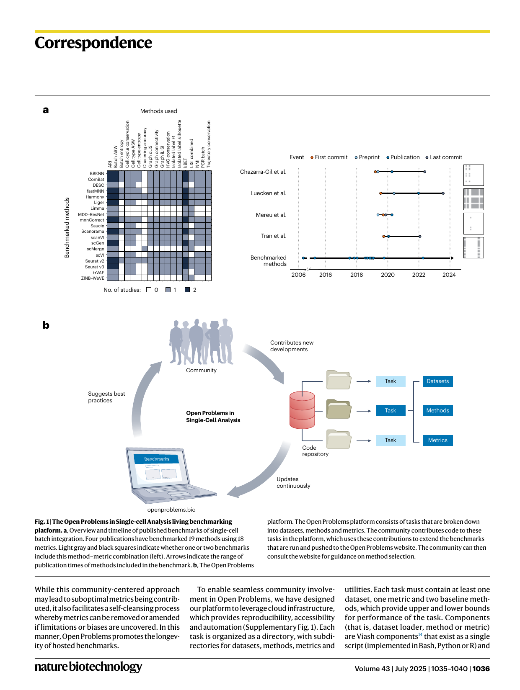
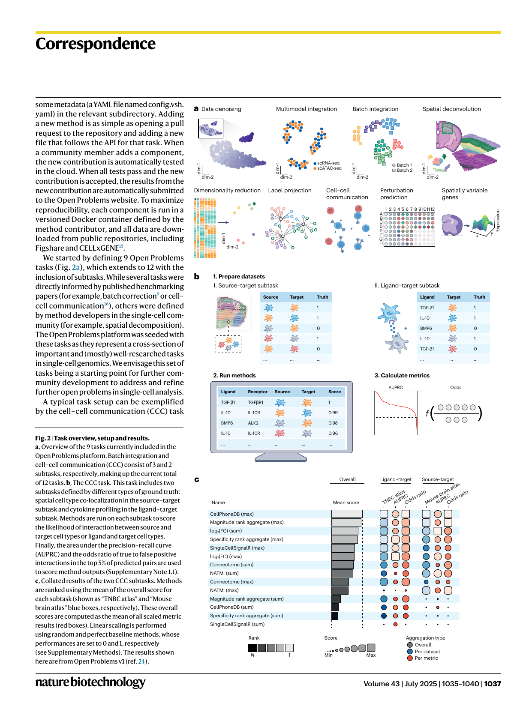

https://doi.org/10.1038/s41587-025-02694-w 

## **Correspondence** 

# Defining and benchmarking open problems in single-cell analysis 

ingle-cell genomics has enabled the study of biological processes at an unprecedented scale and resolution. These studies were enabled by innoSvative data generation technologies coupled with emerging computational tools specialized for single-cell data. As single-cell technologies have become more prevalent, so has the development of new analysis tools, which has resulted in over 1,700 published algorithms1 (as of February 2024). Thus, there is an increasing need to continually evaluate which algorithm performs best in which context to inform best practices2,3 that evolve with the field. 

In many fields of quantitative science, public competitions and benchmarks address this need by evaluating state-of-the-art methods against known criteria, following the concept of a common task framework4 . Here, we present Open Problems, a living, extensive, community-guided platform including 12 current single-cell tasks that we envisage raising standards for the selection, evaluation and development of methods in single-cell analysis. 

In single-cell genomics, as in many other domains, it is typical for analysis algorithms to be evaluated using benchmarks. However, such benchmarks are often of limited use as the field suffers from a lack of standardized procedures for benchmarking5 , leading to different assessments of the same method and producing different outcomes. Bespoke benchmarks set up by method developers to evaluate newly developed algorithms often include datasets and metrics chosen to highlight the advantages of their tools, which has been shown to lead to less objective assessments6,7 . Even if datasets and metrics are standardized, historical analysis shows that when benchmarks are implemented by the same groups introducing new methods, the evaluations tend to inflate performance of the newest models via custom hyperparameter selection and data processing8 . 

To provide more uniform and neutral assessment, groups can perform specialized benchmarking studies independently of method development. Tools such as 

registered reports, which promote neutrality of benchmarking results by design, have recently gained in popularity to enable such studies. These efforts aim to systematically evaluate the current state of the art in a given area and may be less biased. However, their results are static and inevitably age. These frameworks are typically not designed for extensibility or interoperability, limiting the value of reusing a framework to perform additional systematic benchmarks5 . This inability to reuse infrastructure leads to repeats of non-standardized benchmarks that cannot provide the guidance that users need. For example, at least four benchmarks of batch integration methods exist9–12 , each of which uses different sets of datasets and metrics and suggests different optimal methods (Fig. 1a). Similar issues have been reported across other single-cell topics, where datasets and metrics typically have less than 10% overlap between benchmarks13 . 

Ideally, benchmarks that guide users and promote method innovation use consistently applied datasets and metrics that are established independently of method development and with ongoing community participation5,6,13 . Such community participation around quantified tasks requires continual updates, a process that is hard to realize in the typical result–paper framework that defines the modern scientific process. 

To achieve this goal, we developed the Open Problems in Single-Cell Analysis (Open Problems) platform. The Open Problems platform is an open-source, extensible, living benchmarking framework that enables quantitative evaluation of best practices in single-cell analysis. It combines a permissively licensed GitHub repository (https://github. com/openproblems-bio/openproblems) with community-defined tasks, an automated benchmarking workflow, and a website to explore the results. Currently, Open Problems includes 12 defined tasks, in which 81 datasets are used to evaluate 171 methods using 37 metrics. These tasks were defined by community engagement, including on the public GitHub repository, in weekly community meetings, and at a hackathon in March 2021 with over 

##### Check for updates 

50 participants. This broad involvement has already led to new benchmarking insights and best practice recommendations while improving and standardizing previously published benchmarks. We envisage Open Problems’ community-defined standards for progress in single-cell data science raising the bar for the selection and evaluation of methods, providing targets for method innovation, and enabling developers without single-cell expertise to contribute to the field. 

To enable truly living benchmarks, we designed a standardized and automated infrastructure that allows members of the single-cell community to contribute to Open Problems in a seamless manner (Supplementary Methods). Each Open Problems task consists of datasets, methods and metrics (Fig. 1b). Datasets define both the input and the ground truth for a task, methods attempt to solve the task, and metrics evaluate the success of a method on a given dataset. We provide cloud infrastructure to enable centralized benchmarking when new methods, datasets or metrics are added to our platform. Within each task, every method is evaluated on every dataset using every metric, and each method is then ranked on a per-dataset basis by the average normalized metric score and presented in a summary table on the Open Problems website (https://openproblems. bio). Normalization is used to make metric ranges comparable for comparison and visualization of method results without affecting - the metric’s ability to highlight method outli ers (Supplementary Methods). 

Community engagement on the platform is centered around an open discussion forum, open code contribution opportunities, and task leadership. Task leaders are community members who have contributed substantially to a task, assume organizational responsibilities for the task, and are ultimately responsible for task definition, task maintenance and facilitation of community contributions. Task definitions, choices of metrics and implementations of methods are discussed on our GitHub repository and can be easily amended by pull requests, which are reviewed by task leaders and the core infrastructure team. 

### **nature biotechnology** 

Volume 43 | July 2025 | 1035–1040 | **1035** 

## **Correspondence** 

**Fig. 1 | The Open Problems in Single-cell Analysis living benchmarking platform. a** , Overview and timeline of published benchmarks of single-cell batch integration. Four publications have benchmarked 19 methods using 18 metrics. Light gray and black squares indicate whether one or two benchmarks include this method–metric combination (left). Arrows indicate the range of publication times of methods included in the benchmark. **b** , The Open Problems 

platform. The Open Problems platform consists of tasks that are broken down into datasets, methods and metrics. The community contributes code to these tasks in the platform, which uses these contributions to extend the benchmarks that are run and pushed to the Open Problems website. The community can then consult the website for guidance on method selection. 

While this community-centered approach may lead to suboptimal metrics being contributed, it also facilitates a self-cleansing process whereby metrics can be removed or amended if limitations or biases are uncovered. In this - manner, Open Problems promotes the longev ity of hosted benchmarks. 

To enable seamless community involvement in Open Problems, we have designed our platform to leverage cloud infrastructure, which provides reproducibility, accessibility and automation (Supplementary Fig. 1). Each task is organized as a directory, with subdirectories for datasets, methods, metrics and 

utilities. Each task must contain at least one dataset, one metric and two baseline methods, which provide upper and lower bounds for performance of the task. Components (that is, dataset loader, method or metric) are Viash components14 that exist as a single script (implemented in Bash, Python or R) and 

### **nature biotechnology** 

Volume 43 | July 2025 | 1035–1040 | **1036** 

## **Correspondence** 

(Fig. 2b and Supplementary Note 1.1). The goal of cell–cell communication inference methods is to infer which cell types are communicating within a tissue to mediate tissue function. Typical algorithms base predictions on the expression of ligand and receptor genes in dissociated single-cell data17 . Ground-truth data for cellular communication are challenging to obtain. Thus, this task is divided into two subtasks that use different proxies for this ground truth: spatial colocalization (source–target subtask) and cytokine activity (ligand–target subtask). As the CCC methods included in this task (Supplementary Methods)18–21 typically score ligand–receptor pairs using either their expression magnitude or cell-type specificity, _mean_ and _max_ aggregation functions are used to score interaction strengths between source and target cell types (source–target task) or ligands and target cell types (ligand–target task). The outputs of these methods are finally evaluated using the area under the precision–recall curve and odds ratios. These metrics measure how well ground truth source–target (co-localized cell types) or ligand–target (cytokine activity within a cell type) pairs are prioritized when ranking all interactions and how many true pairs are found in the top 5%, respectively. 

While the CCC task was contributed to Open Problems on the basis of a published benchmark16 , the task definition and metrics evolved with input from the community and the Open Problems team. This process has enabled the Open Problems results to generate insight beyond the initial publication (Fig. 2c), which focused predominantly on the comparison of CCC databases and showed variable method performance across tasks. In the CCC Open Problems task, we find that methods that rely on expression magnitude outperform approaches that rely on expression specificity. Indeed, the top performers across tasks are CellPhoneDB and LIANA’s ensemble model of expression magnitude scoring methods. Furthermore, _max_ aggregation of ligand–receptor scores outperformed _mean_ aggregation across tasks and methods. This improved inference of cellular communication using only the top-predicted interactions suggests that methods are better at prioritizing a small fraction of relevant interactions while being prone to noise when their full interaction rankings are considered. Thus, analysts interpreting CCC results may likewise want to focus only on the most high-scoring predictions when inferring which cell types interact (Supplementary Note 1.1). 

Using this combination of expert knowledge and community input, in this manuscript we also provide best-practice recommendations for preprocessing and method selection for label projection, dimensionality reduction for 2D visualization, batch integration, spatial decomposition, denoising and matching of cellular profiles across modalities (Supplementary Note 1). For example, on all four reference datasets currently included in the Open Problems label projection task, a simple logistic regression model outperforms more complex methods that explicitly model batch effects, even when noise is added to the training data (Supplementary Note 1.2). Moreover, we also show that it is easier to correct for batch effects in single-cell graphs than in latent embeddings or expression matrices (Supplementary Note 1.4), that denoising methods perform best with non-standard preprocessing approaches that better stabilize variance (Supplementary Note 1.6) and that simple models tend to outperform more complex ones for perturbation prediction (Supplementary Note 1.8). 

Overall, Open Problems tasks are continually updated benchmarks that increase in robustness as new methods are developed and more complex datasets become available. Our vision is that these benchmarks will form the basis for best-practice recommendations by groups such as Single-Cell Best Practices (https://www.sc-best-practices.org/). 

Open Problems living benchmarking tasks also function as a quantifiable target for the development of new methods. This problem definition is particularly useful for the wider machine learning community that may lack domain knowledge (that is, single-cell expertise). Leveraging the batch integration and matching modality tasks as a basis, we previously set up popular competitions for multimodal data integration at NeurIPS 2021 (refs. 22,23) and 2022, with over 260 and 1,600 participants, respectively. In these competitions, the developers of multiple top performers had no previous experience with single-cell data, yet were able to submit solutions that substantially outperformed state-of-the-art methods22 . We envisage the Open Problems platform driving method development by improving the accessibility of open challenges in single-cell analysis via defined tasks. To promote this, Open Problems enables method developers to submit both prototype and final solutions to the platform for automated evaluation against the current state of the art. Open Problems results, which are made available under a Creative Commons Attribution 

(CC-BY) license, can then be included in the respective method papers. Similarly, entirely new benchmarks can be implemented as tasks, run via Open Problems, and published separately while remaining updatable. 

Taken together, the Open Problems platform is a community resource that quantitatively defines open challenges in single-cell analysis, determines the current state-of-the-art solutions, promotes method development to improve on these solutions, and monitors progress toward these goals. Open Problems addresses issues observed in custom and decentralized benchmarking by providing standardized but flexible infrastructure and task definitions. Thereby, Open Problems enables broader accessibility for scientists to contribute to the advancement of the field of single-cell analysis. We envisage Open Problems bringing about a shift in perspective on method selection for data analysts and method evaluation for developers, supporting a transition toward higher standards for methods in single-cell data science. 

#### **Code availability** 

All Open Problems code is publicly available at https://www.github.com/openproblems-bio/ openproblems. This code includes data loaders for all datasets used, with associated metadata on where this data came from. Code to reproduce the figures is publicly available at https://github.com/openproblems-bio/ nbt2025-manuscript. Detailed information on all datasets is available at https://openproblems.bio/datasets. Documentation for the platform and contribution guides can be found at https://openproblems.bio/documentation. 

**Malte D. Luecken****1,2,55** **, Scott Gigante****3,55** **, Daniel B. Burkhardt****4,55** **, Robrecht Cannoodt****5,6,7,55** **, Daniel C. Strobl****1,8,9** **, Nikolay S. Markov****10** **, Luke Zappia****1,5,11** **, Giovanni Palla****1,9** **, Wesley Lewis****12** **, Daniel Dimitrov****13** **,** 

**Michael E. Vinyard****14,15,16** **, D. S. Magruder****17** **, Michaela F. Mueller****1,2,9** **, Alma Andersson****18,19,20** **, Emma Dann****21** **, Qian Qin****15** **, Dominik J. Otto****22,23,24** **, Michal Klein****25** **, Olga Borisovna Botvinnik****26,27** **, Louise Deconinck****6,7** **, Kai Waldrant****5** **, Sai Nirmayi Yasa****5** **, Artur Szałata****1,11** **, Andrew Benz****28** **, Zhijian Li****15,16** **, Open** 

**Problems Jamboree Members*, Jonathan M. Bloom****29** **, Angela Oliveira Pisco****26,30** **,** 

**Julio Saez-Rodriguez****13** **, Drausin Wulsin****3** **, Luca Pinello****16** **, Yvan Saeys****6,7,31** **,** 

### **nature biotechnology** 

Volume 43 | July 2025 | 1035–1040 | **1038** 

## **Correspondence** 

> **1,11,32,56** **&** 

##### **Fabian J. Theis** 

> **12,17,33,56** 

##### **Smita Krishnaswamy** 

1Institute of Computational Biology, Helmholtz Munich, Neuherberg, Germany. 2Institute of Lung Health & Immunity, Helmholtz Munich; Member of the German Center for Lung Research (DZL), Munich, Germany.3 Immunai, New York, USA.4 NVIDIA, Santa Clara, CA, USA.5 Data Intuitive, Lebbeke, Belgium.6 Data Mining and Modelling for Biomedicine group, VIB Center for Inflammation Research, Ghent, Belgium. 7Department of Applied Mathematics, Computer Science, and Statistics, Ghent University, Ghent, Belgium.8 Institute of Clinical Chemistry and Pathobiochemistry, School of Medicine, Technical University of Munich, Munich, Germany.9 TUM School of Life Sciences Weihenstephan, Technical University of Munich, Munich, Germany. 10Division of Pulmonary and Critical Care Medicine, Feinberg School of Medicine, Northwestern University, Chicago, IL, USA. 11Department of Mathematics, School of Computing, Information and Technology, Technical University of Munich, Munich, Germany.12 Interdepartmental Program in Computational Biology and Bioinformatics, Yale University, New Haven, CT, USA.13 Faculty of Medicine and Heidelberg University Hospital, Institute for Computational Biomedicine, Heidelberg University, Heidelberg, Germany.14 Department of Chemistry and Chemical Biology, Harvard University, Cambridge, MA, USA.15 Broad Institute of MIT and Harvard, Cambridge, MA, USA.16 Molecular Pathology Unit, Center for Cancer Research, Massachusetts General Hospital, Boston, MA, USA.17 Department of Computer Science, Yale University, New Haven, CT, USA.18 Genentech Inc, South San Francisco, CA, USA.19 Gene Technology, Royal Institute of Technology (KTH), Stockholm, Sweden.20 Science for Life Laboratory (SciLifeLab), Solna, Sweden.21 Wellcome Sanger Institute, Cambridge, UK.22 Basic Sciences Division, Fred Hutchinson Cancer Center, Seattle, WA, USA.23 Computational Biology Program, Public Health Sciences Division, Fred Hutchinson Cancer Center, Seattle, WA, USA.24 Translational Data Science IRC, Fred Hutchinson Cancer Center, Seattle, WA, USA.25 Apple, Paris, France.26 Data Sciences Platform, Chan Zuckerberg Biohub, San Francisco, CA, USA.27 Bridge Bio Pharma, Palo Alto, CA, USA.28 Cellarity, Inc, Somerville, MA, USA.29 Department of Mathematics, Massachusetts Institute of 

Technology, Cambridge, MA, USA.30 Insitro, South San Francisco, USA.31 VIB Center for AI & Computational Biology (VIB.AI), Ghent, Belgium.32 Cellular Genetics Programme, Wellcome Sanger Institute, Hinxton, UK. 33Department of Genetics, Yale University, New Haven, CT, USA.55 These authors contributed equally: Malte D. Luecken, Scott Gigante, Daniel B. Burkhardt, Robrecht Cannoodt. 

56These authors jointly supervised this work: Fabian J. Theis, Smita Krishnaswamy. 

*A list of authors and their affiliations appears at the end of the paper. 

e-mail: fabian.theis@helmholtz-munich.de; smita.krishnaswamy@yale.edu 

Published online: 1 July 2025 

##### **Acknowledgements** 

We received continual support in many ways from Jonah Cool, Ivana Williams and Fiona Griffin from the Chan Zuckerberg Initiative for this project, without whom we would not have come this far. We would also like to thank Mohammad Lotfollahi for early discussions 

on Open Problems. E.V.B. would like to thank the Caltech Bioengineering Graduate program and Paul W. Sternberg for support. This work was supported by the Chan Zuckerberg Initiative Foundation (grant CZIF2022007488, Human Cell Atlas Data Ecosystem) and the Chan Zuckerberg Initiative DAF, an advised fund of the Silicon Valley Community Foundation (grant number 2021-235155) awarded to M.D.L., D.B.B., S.G., F.J.T. and S.K. This work was co-funded by the European Union (ERC, DeepCell -101054957, to A.S. and F.J.T.). Views and opinions expressed are, however, those of the authors only and do not necessarily reflect those of the European Union or the European Research Council. Neither the European Union nor the granting authority can be held responsible for them. G.P. is supported by the Helmholtz Association under the joint research school Munich School for Data Science and by the Joachim Herz Foundation. Throughout this work, W.L. was supported by the US National Institutes of Health under Continuing Education Training Grants (T15). D.D. was supported by the European Union’s Horizon 2020 Research and Innovation Program (860329 Marie-Curie ITN “STRATEGY-CKD”). M.E.V. is supported by the US National Institutes of Health under a Ruth L. Kirschstein National Research Service Award (1F31CA257625) from the National Cancer Institute. E.D. is supported by Wellcome Sanger core funding (WT206194). This work was supported by the Research Foundation Flanders (FWO) (1SF3822N to L.D.). B.R. is supported by the Bavarian state government with funds from the Hightech Agenda Bavaria. This research received funding from the Flemish Government under the “Onderzoeksprogramma Artificiele Intelligentie (AI) Vlaanderen” programme. C.B.G.-B. was supported by a PhD fellowship from Fonds Wetenschappelijk Onderzoek (FWO, 11F1519N). V.K. was supported by Wellcome Sanger core funding. G.L.M. received support from Swiss National Science Foundation grant PZ00P3_193445 and Chan Zuckerberg Initiative grants number 2022-249212 and 2019002427. D.R. was supported by the National Cancer Institute of the US National Institutes of Health (2U24CA180996). 

##### **Author contributions** 

M.D.L., S.G., and D.B.B. conceived the idea. M.D.L., S.G., D.B.B., R.C., and O.B.B. developed the infrastructure. M.D.L., S.G., D.B.B., R.C., D.C.S., N.S.M., L.Z., G.P., W.L., D.D., M.E.V., M.F.M., A.A., E.D., Q.Q., A.S., A.B., and Z.L. formalized a benchmarking task. M.D.L., S.G., D.B.B., R.C., D.C.S., N.S.M., L.Z., G.P., W.L., D.D., M.E.V., D.S.M., M.F.M., A.A., E.D., Q.Q., D.J.O., M.K., O.B.B., K.W., S.N.Y., A.S., A.B., Z.L., C.A-E., E.d.V.B., A.T.C., B.D., C.E., V.K., H.S., V.S. and A.T. contributed to the codebase. M.D.L., S.G., R.C., D.C.S., N.S.M., L.Z., G.P., W.L., D.D., L.D. and K.W. analyzed the results. M.D.L., S.G., D.B.B., J.M.B., A.O.P., J.S.-R., D.W., L.P., Y.S., F.J.T. and S.K. provided resources and supervised the work. M.D.L., S.G., D.B.B., R.C., D.C.S., N.S.M., L.Z., G.P., W.L. and D.D. coordinated the research. M.D.L., S.G., D.B.B., F.J.T. and S.K. acquired funding for the work. M.D.L., S.G., D.B.B., R.C., D.C.S., N.S.M., L.Z., G.P., W.L., D.D., M.E.V., M.F.M., A.A., E.D., Q.Q., D.J.O., M.K., O.B.B., A.S., A.B., Z.L., B.R., J.M.B., A.O.P., C.A-E., E.d.V.B., A.B., C.B.G-B., A.T.C., B.D., C.E., S.F., A.G., S.H., Y.J., V.K., G.L.M., M.G.L., R.L., D.R., H.S., V.S., A.T., G.X. and C.X. contributed to benchmarking task definition. M.D.L., S.G., D.B.B., R.C., D.C.S., N.S.M., L.Z., G.P., W.L., D.D., M.E.V. and D.S.M. prepared the manuscript. D.C.S., N.S.M., L.Z., G.P., W.L., D.D., M.E.V., D.S.M. and M.F.M. contributed equally as second authors. All authors reviewed the manuscript. 

##### **Competing interests** 

M.D.L. consults for CatalYm GmbH, contracted for the Chan Zuckerberg Initiative and received speaker fees from Pfizer and Janssen Pharmaceuticals. S.G. has equity interest in Immunai Inc. D.B.B. is a paid employee of and has equity interest in NVIDIA. R.C. has equity interest in Data Intuitive BV. L.Z. has consulted for Lamin Labs GmbH. W.L. contracted for Protein Evolution Incorporated. From 2019 to 2022, A.A. was a consultant for 10x Genomics. From October 2023, E.D. has been a consultant for EnsoCell Therapeutics. O.B.B is currently an employee of Bridge Bio Pharma. A.S. consults for Cellarity Inc. and Exvivo Labs Inc. A.B. is a paid employee of and has equity interest in Cellarity, Inc. J.B. has equity interest 

### **nature biotechnology** 

Volume 43 | July 2025 | 1035–1040 | **1039** 

## **Correspondence** 

in Cellarity, Inc. J.S.-R. reports funding from GSK, Pfizer and Sanofi and fees or honoraria from Travere Therapeutics, Stadapharm, Astex, Owkin, Pfizer and Grunenthal. D.W. has equity interest in Immunai Inc. F.J.T. consults for Immunai Inc., Singularity Bio B.V., CytoReason Ltd and Cellarity, and has ownership interest in Dermagnostix GmbH and Cellarity. S.K. is a visiting professor at Meta and scientific advisor at Ascent 

Bio, Inc. E.d.V.B has ownership interest in Retro Biosciences V.S. has ownership interest in Altos Labs and Vesalius and ImYoo Inc and is employed by ImYoo Inc. A.T.C. is an Therapeutics. A.T. has an ownership interest in Dreamfold. employee of Orion Medicines. B.D. is a paid employee of and has equity interest in Cellarity Inc. A.G. is currently an **Additional information** employee of Google DeepMind. Google DeepMind has not **Supplementary information** The online version directed any aspect of this study nor exerts any commercial contains supplementary material available at rights over the results. R.L. is an employee of Genentech. https://doi.org/10.1038/s41587-025-02694-w. 

#### **Open Problems Jamboree Members** 

**Bastian Rieck****34,35** **, Constantin Ahlmann-Eltze****36** **, Eduardo da Veiga Beltrame****37** **, Carmen Bravo González-Blas****38** **, Ann T. Chen****26,39** **, Benjamin DeMeo****28,40** **, Can Ergen****41** **, Swann Floc’hlay****38** **, Adam Gayoso****41** **, Stephanie Hicks****42,43,44** **, Yuge Ji****1** **, Vitalii Kleshchevnikov****21** **, Gioele La Manno****45** **, Maximilian G. Lombardo****46** **, Romain Lopez****18,47** **, Dario Righelli****48** **, Hirak Sarkar****49,50** **, Valentine Svensson****51** **, Alexander Tong****17,52,53** **, Galen Xing****41,54** **& Chenling Xu****41** 

34Institute of AI for Health, Helmholtz Munich, Neuherberg, Germany. 35Department of Informatics, University of Fribourg, Fribourg, Switzerland. 36Genome Biology Unit, EMBL, Heidelberg, Germany. 37Mohamed bin Zayed University of Artificial Intelligence (MBZUAI), Abu Dhabi, United Arab Emirates.38 VIB Center for Brain & Disease Research, Leuven, Belgium.39 Orion Medicines, Foster City, CA, USA.40 Department of Biomedical Informatics, Harvard University, Cambridge, MA, USA.41 Center for Computational Biology, University of California, Berkeley, Berkeley, CA, USA.42 Department of Biostatistics, Johns Hopkins Bloomberg School of Public Health, Baltimore, MD, USA.43 Department of Biomedical Engineering, Johns Hopkins University, Baltimore, MD, USA.44 Malone Center for Engineering in Healthcare, Johns Hopkins University, Baltimore, MD, USA.45 Brain Mind Institute, School of Life Sciences, École Polytechnique Fédérale de Lausanne (EPFL), Lausanne, Switzerland.46 Chan Zuckerberg Initiative, Redwood City, CA, USA.47 Department of Genetics, Stanford University, Stanford, CA, USA.48 Department of Statistical Sciences, University of Padua, Padua, Italy.49 Department of Computer Science, Princeton University, Princeton, NJ, USA.50 Princeton Ludwig Institute, Princeton University, Princeton, NJ, USA.51 Altos Labs, San Diego, CA, USA. 52Mila–Quebec AI Institute, Montreal, Quebec, Canada. 53Université de Montréal, Montréal, Quebec, Canada. 54Gladstone–UCSF Institute of Genomic Immunology, San Francisco, CA, USA. 

**nature biotechnology** 

Volume 43 | July 2025 | 1035–1040 | **1040** 
