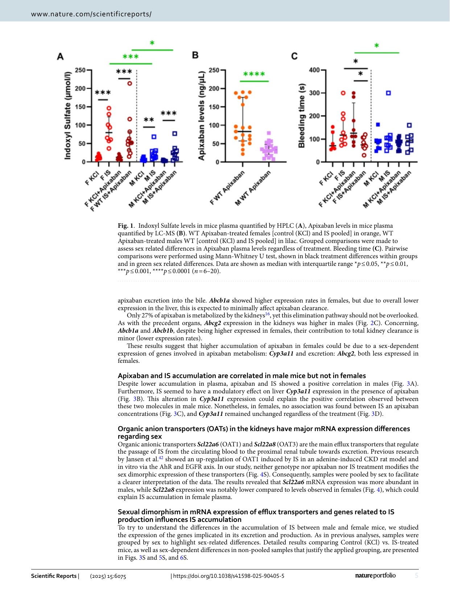
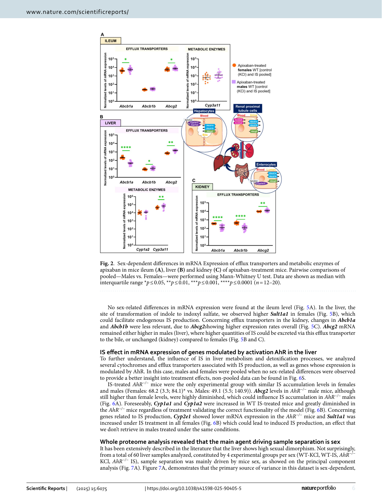
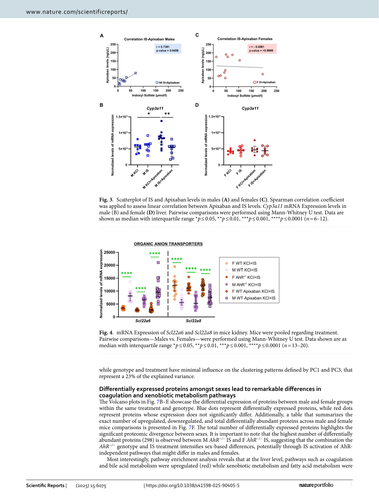
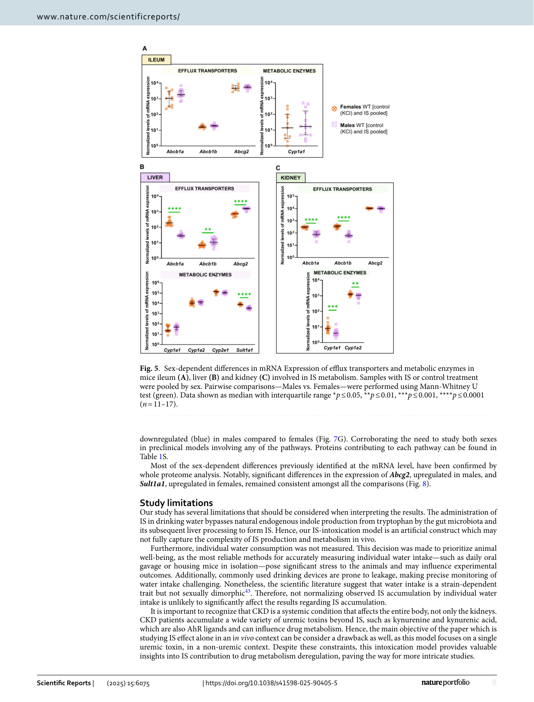
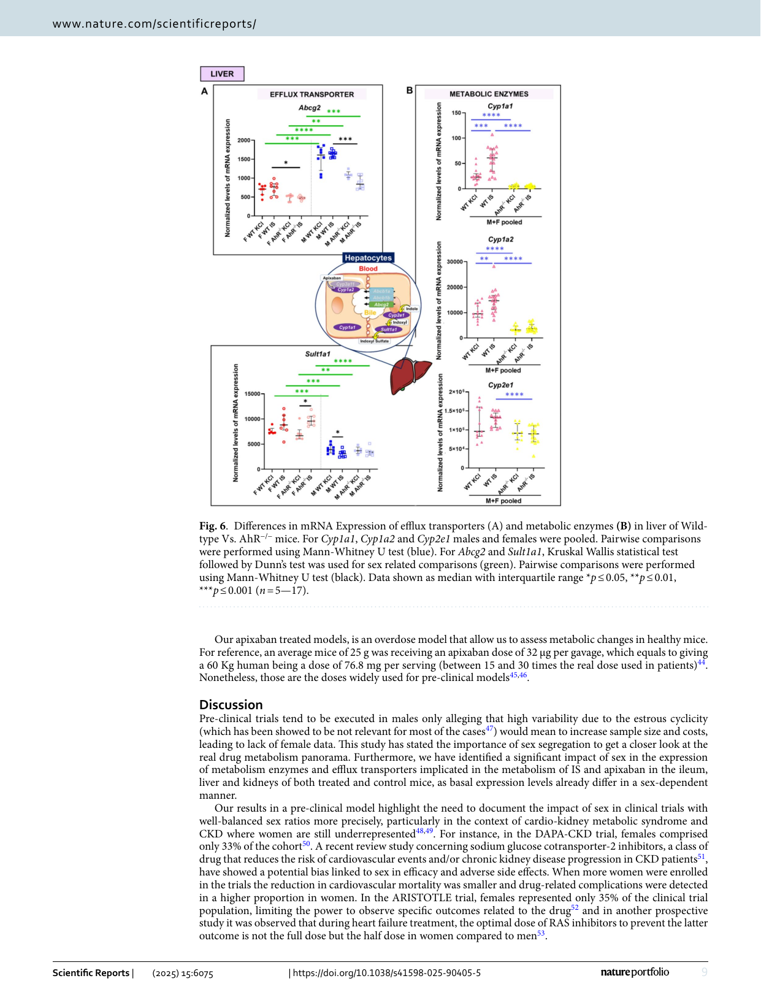
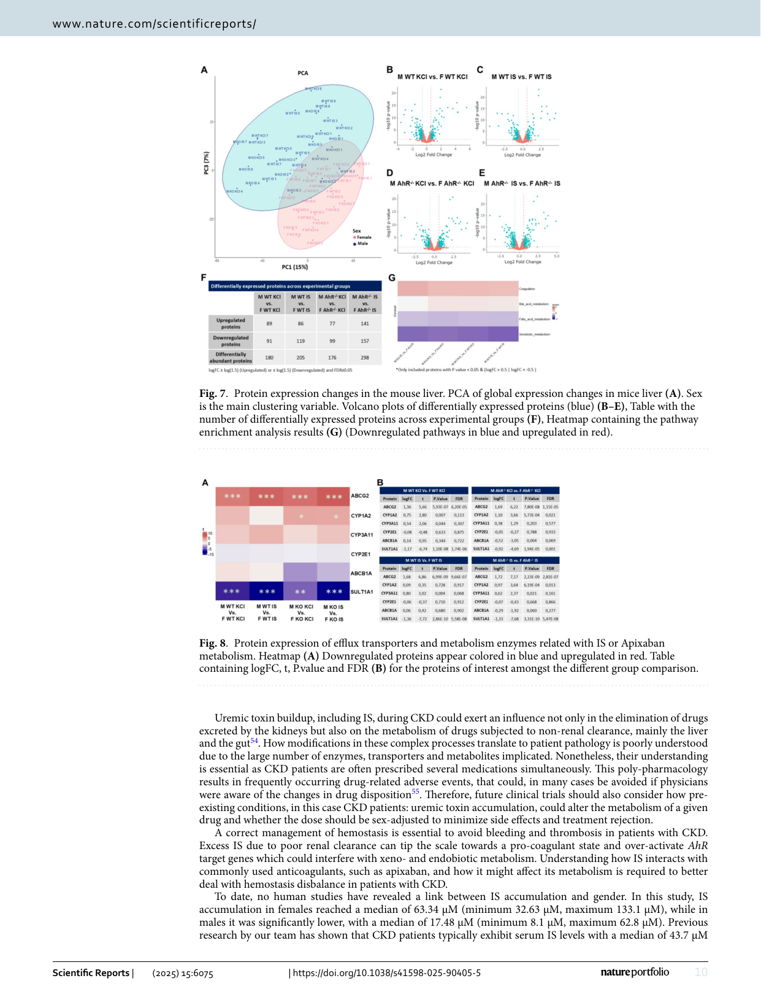

www.nature.com/scientificreports 

# **OPEN Unveiling the role of sex in the metabolism of indoxyl sulfate and apixaban** 

**Blanca Pina-Beltran****1** **, Daniel Dimitrov****2** **, Nathalie McKay****1** **, Matthieu Giot****3** **, Zbyněk Zdráhal****4,5** **, David Potěšil****4** **, Václav Pustka****4** **, Jorge Peinado-Izaguerri****6** **, Julio Saez-Rodriguez****2,7** **, Stéphane Poitevin****1,9** **& Stéphane Burtey****1,8,9** 

**Chronic Kidney Disease (CKD) is associated with heightened risk of thrombosis. Prescription of anticoagulants is key to manage it; however, CKD patients have shown an increased risk of bleeding under anticoagulation therapy compared to non-CKD patients. We hypothesized that the sex could modify the metabolism of indoxyl sulfate (IS), a uremic toxin and Apixaban. Our intoxication model shows that higher doses of IS and apixaban accumulate in the plasma of female mice because of expression differences in efflux transporters and cytochromes in the liver, ileum and kidneys, when compared to males. Furthermore, we found that accumulation of apixaban in females contributes to increased bleeding. Transcriptional analysis of liver samples revealed elevated** **_Sult1a1_ but reduced** **_Abcg2_ and** **_Cyp3a11_ in female mice, while in the kidneys the expression rates of** **_Oat1_ and** **_Oat3_ were respectively lower and higher than those observed in males, potentially affecting drug clearance. Whole proteomics liver analysis confirmed the previous transcriptional results at the protein level and revealed that sex had a major influence in regulating both coagulation and drug metabolism pathways. Thus, our findings underline the need for inclusive clinical and preclinical trials to accurately reflect sexspecific metabolic variations, and to consider CKD-specific changes to optimize dosing, minimize side effects, and improve patient outcomes.** 

Chronic kidney disease (CKD) can be defined as structural or functional abnormalities of the kidneys, regardless of presenting a decreased glomerular filtration rate (GFR), or as a GFR < 60 mL/min/1.73m2 for ≥ 3 months irrespective of visible kidney damage1 . CKD is a widespread condition with a prevalence between 9.1 and 13.4%2 . Sex has been shown to affect both prevalence and disease progression: while women are more prone to develop CKD, men are more likely to reach end-stage kidney failure3 and face a higher risk of death compared to women with CKD4 . CKD is associated with several comorbidities such as hypertension, diabetes and most importantly cardiovascular disease (CVD)5 - the main cause of death in developed countries6 . Therefore, CKD should be viewed as a whole-body affliction and considered from a global perspective. Traditional cardiovascular risk factors are insufficient to explain the elevated rates of CVD, rising uremic toxins as a potential link between CKD and CVD outcomes. Uremic toxins are compounds excreted by the kidneys under physiological conditions. Nevertheless, they accumulate in the blood and tissues of patients with CKD due to inadequate renal clearance7 . 

Hemostasis is dysregulated in patients with CKD. Indeed, an increased risk of thrombosis in the arterial and venous bed coexists with an enlarged bleeding risk, further exacerbated in more advanced stages of CKD8,9 . All the phases of the hemostasis cascade: primary hemostasis, coagulation and fibrinolysis, are impaired during CKD10 . Although the prime cause of this imbalance is yet to be discerned, it is plausible that uremic toxins play a significant role in its development. Two major cardiovascular disorders, atrial fibrillation (AF) and venous thromboembolism (VTE), are associated with thrombotic events and require preventive and/ or curative anticoagulation. Both conditions exhibit higher frequencies in CKD patients11,12 . Hence, correct 

1Faculté de pharmacie, Aix Marseille Univ, INSERM, INRAE, C2VN, Bd Jean Moulin, Marseille 13005, France. 2Faculty of Medicine, and Heidelberg University Hospital, Institute for Computational Biomedicine, Heidelberg University, BioQuant,  Heidelberg, Germany.3 Centre de Néphrologie, Medipole Saint-Roch, Cabestany, France. 4Central European Institute of Technology (CEITEC), Masaryk University, Brno, Czech Republic. 5National Centre for Biomolecular Research, Masaryk University, Brno, Czech Republic.6 School of Biodiversity, One Health and Veterinary Medicine, University of Glasgow, Glasgow, UK.7 European Molecular Biology Laboratory, European Bioinformatics Institute (EMBL-EBI), Hinxton, Cambridgeshire, UK.8 Centre de Néphrologie et Transplantation Rénale, Aix Marseille Univ, AP-HM Hôpital de la Conception, Marseille, France.9 Stéphane Poitevin and Stéphane Burtey contributed equally to this work. email: stephane.burtey@univ-amu.fr 

**Scientific Reports** |         (2025) 15:6075 

1 

| https://doi.org/10.1038/s41598-025-90405-5 

www.nature.com/scientificreports/ 

coagulation management is vital to avoid stroke on AF or pulmonary embolism on VTE and haemorrhage in both conditions. Different anticoagulants have been used in these patients over the years. Warfarin, a vitamin K antagonist (VKA), is one of the most widely prescribed despite showing enhanced bleeding risk at later CKD stages, calciphylaxis and high discontinuation rates13,14 . Lately, apixaban, an oral direct factor Xa inhibitor, has gained increasing popularity as the preferred anticoagulation treatment for CKD patients, in both early and later stages15 . This preference stems from two primary reasons: kidney clearance amounts only up to 27%16 while having similar efficacy and a superior safety profile than warfarin17 . Furthermore, among CKD patients, apixaban shows a reduction in bleeding risk when compared to VKA treatment. Nonetheless, bleeding risk is increased with the use of apixaban in patients with CKD in comparison with non-CKD patients18 . Concerning its pharmacokinetics, apixaban is mainly metabolized by cytochrome 450 (CYP) 3A4 (CYP3A11 in mice) and to a lesser extent by CYP1A2 and excreted by efflux transporters such as P-glycoprotein (P-gp) and breast cancer resistance protein (BCRP) (Fig. 1S)16 . 

CKD is associated with numerous alterations in drug pharmacodynamics and pharmacokinetics19 . Among various mechanisms, activation of Aryl hydrocarbon Receptor (AhR) by uremic toxins is proposed as an essential process to understand how CKD impairs drug metabolism20 . AhR is a ligand-inducible transcription factor that regulates both nutrient metabolism and xeno- and endobiotic detoxification by inducing its target genes, among them CYP1A1, CYP1A2 and CYP1B1 (Fig. 1S)21 . . Amidst the AhR agonists’ we find Indoxyl sulfate (IS), a protein-bound, tryptophan-derived uremic toxin22 Tryptophan is an essential amino acid, commonly found in human diet, present in poultry, nuts, eggs and other daily consumed products. Tryptophanase-expressing bacteria metabolize tryptophan into indole, an intermediate metabolite which is absorbed in the gut and further processed in the liver by CYP2E1 transforming indole into indoxyl23 . Indoxyl is then sulfonated by the Sulfotransferase 1A1 (SULT1A1) to produce IS24 . Indole is a highly toxic compound25 so the production of IS could be a mechanism to reduce its toxicity. In healthy individuals, IS is taken up by organic anion transporters (OAT) 1 and 3 (OAT1 and OAT3) in the proximal tubular cells and excreted through the urine (Fig. 1S)26 . However, as CKD progresses, the impeded kidney function leads to tissue . and plasma accumulation of IS, provoking deleterious effects27 

In excess, IS is considered a pro-inflammatory, pro-oxidative and pro-coagulant molecule, which is also related to endothelial dysfunction28 . Plasma levels of IS positively correlate with circulating tissue factor levels, whose concentration and activity increase as CKD advances. Furthermore, indolic uremic solutes increase tissue factor production in endothelial and peripheral blood mononuclear cells _via_ AhR activation, stimulating the activation of the coagulation cascade22 . When IS accumulates in the liver, it can activate the expression of efflux transporter: P-gp, in hepatocytes also through AhR activation29 . P-gp is responsible for the efflux of neutral and cationic drugs many of which are substrates of CYP3A4 like apixaban30 . An alteration in its expression and activity could therefore modify drug metabolism and pharmacokinetics29 . 

Our goal is to test the hypothesis that indoxyl sulfate accumulation can modulate the expression of key metabolic enzymes and efflux transporters, thereby influencing apixaban metabolism and bleeding risk. Additionally, we aim to explore potential sex-related differences in gene expression, both at baseline and in response to treatment with apixaban, indoxyl sulfate, or their combination. 

## **Materials and methods** 

### **Mice trial** 

C57BL/6J wild-type (WT) mice and _Ahr_−/− mice (B6.129-Ahrtm1Bra/J)31 were purchased from Jackson Laboratories and maintained as a breeding colony in the animal care facility at the Faculty of Pharmacy of Aix-Marseille Université. Genotypes were confirmed by polymerase chain reaction analysis of DNA from ear clippings obtained at 4 weeks of age (KAPA Mouse Genotyping Kit, KapaBiosystems). Mice were fed _ad libitum_ with a regular diet (A04 standard, SAFE) during the whole trial. Both male and female mice were used in this study and comparisons were made between age-matched groups. 

Six groups of mice per sex were created: Ahr−/− KCl, Ahr−/− IS, WT KCl, WT IS, WT KCl + Apixaban and WT IS + Apixaban. 

The animal experiments were performed in compliance with the Directive 2010/63/EU of the European Parliament and were approved by the local Ethics Committee (“Comité d’Ethique en Expérimentation Animale de Marseille”, C2EA-14; ethics approval number: APAFIS#29595-2021020514483381 v4; approval date:04/16/2021). 

All the animal experiments follow ARRIVE guidelines 2.032 . All methods were performed in accordance with the relevant guidelines and regulations. 

### **Indoxyl sulfate (IS) administration** 

At 10 weeks of age, mice drinking water was substituted by a 5% sucrose water solution with either 0.1% IS (Sigma-Aldrich, France) or KCl (Sigma-Aldrich, France) at the equivalent concentration as control treatment since IS is commercialised as a potassium salt. This solution was administered for 1-week prior to sacrifice. 

### **Apixaban administration** 

To study the impact of IS on Apixaban metabolism, mice that were following the aforementioned procedure received an Apixaban (Eliquis® , Bristol-Meyers Squibb/Pzizer EEIG) solution (0.16 mg/mL). A 5 mg pill was solubilised in 0.6 mL of DMSO (SIGMA® Life Science) and diluted to the 50th in filtered tap water. Gavage was performed twice a day (morning-afternoon) with a volume of 8 µL per g of weight, starting 48 h before sacrifice. The last dose was given 4 h prior the sacrifice. 

**Scientific Reports** |         (2025) 15:6075 

2 

| https://doi.org/10.1038/s41598-025-90405-5 

www.nature.com/scientificreports/ 

### **Tail bleeding time, blood and tissue collection** 

At 11 weeks, mice were anesthetized (ketamine 125 mg/kg, xylazine 12.5 mg/kg, atropine 0.25 mg/kg; intraperitoneally ( _i.p._ ) and placed on a hot plate maintained at 37 °C. A fragment 5 mm away from the tip of the tail was excised with a razor blade. The tail was immediately immersed in a saline solution at 37 °C. The time to establish cessation of bleeding (no rebleeding within 30 s) was visually determined. If necessary, bleeding was stopped at 5 min, mice that bled beyond this endpoint were counted as 5 min. Immediately after, blood samples (500 µL) were obtained from blood drawn via cardiac puncture. 60 µL of citrate (0,109 mM, BD Vacutainer® , Becton, Dickinson and Company) were added to the blood extracts to avoid coagulation. Mice were sacrificed by cervical dislocation under general anesthesia, before liver, ileum, and kidney samples were extracted. Organs were bathed in PBS to reduce blood contamination and frozen either in an RNAprotect Tissue Reagent (Qiagen) and kept at -20 °C for RNA analysis or Snap frozen in liquid Nitrogen for protein conservation, then kept at -80 °C. 

### **Obtention of platelet-free plasma (PFP)** 

Whole blood was centrifuged at 2500 G for 15 min and then at 10,000 G for 10 min to obtain platelet-free plasma. Aliquots of PFP were stored at -80 °C. 

### **Indoxyl sulfate plasma concentrations** 

IS was measured in PFP plasma by high-performance liquid chromatography (HPLC) using a reversed-phase column, an ion-pairing mobile phase, and an isocratic flow, as previously described33 . The limit of detection for indoxyl sulfate using this method is 0.72 µM. 

### **Apixaban plasma concentrations** 

Analyses evaluating apixaban levels were conducted at the Laboratoire de Pharmacocinétique et Toxicologie, CHU de Timone, Assistance Publique–Hôpitaux de Marseille (APHM). PFP diluted 1:2 in a pool of normal human plasma and quantified by LC-MS34 . The limit of detection for apixaban is 1 ng/mL. 

### **Organ dissection, RNA extraction and RT-qPCR analysis of mRNA expression** 

Mice kidneys, liver and ileum that were kept in the RNAprotect Tissue Reagent (Qiagen), were thawed on ice, immersed in QIAzol Lysis Reagent (Qiagen) and ground with TissueRuptor system (Qiagen). RNA was purified by chloroform extraction and isopropanol precipitation. Reverse transcription (RT) was performed on 500ng of total RNA using the PrimeScript™ RT Reagent Kit (Takara® ), followed by quantitative polymerase chain reaction (qPCR) on 25 ng of cDNA using the Taqman® Universal Master Mix II, no UNG (Applied biosystems™ by Thermo Fisher Scientific) reaction mixture. Taqman® gene expression assays (Applied biosystems™ by Thermo Fisher Scientific) were used as probes to quantify the mRNA expression of the following genes: _Abcb1a_ , _Abcb1b_ , _Abcg2_ , _Cyp1a1_ , _Cyp1a2_ , _Cyp3a11_ , _Cyp1b1_ , _Cyp2e1_ , _Sult1a1_ , _Scl22a6_ and _Scl22a8_ (Table 1SM, Supplementary materials). 

All PCR reactions were performed using the Applied Biosystems™ StepOnePlus™ Real-Time PCR System (Thermo Fisher Scientific). The data was acquired by StepOne™software v2.3 (©2012 Life Technologies Corporation) and Relative Quantification (RQ) Application Module on Thermo Fisher Connect Platform (Thermo Fisher Scientific). 

mRNA results are presented as normalized mRNA levels that reflect the variation in a target gene across samples. The 2−ΔΔCT normalization method as presented by Livak et al.35 is a derivation of the equation that describes the exponential amplification of PCR where the amount of target gene is normalized to an endogenous reference and expressed relative to a calibrator. This method assumes that the efficiency of the PCR is close to 1 and the PCR efficiency of the target gene is similar to the internal control gene. A modified version of this method described by Smadja et al.36 was used in this study (equation shown below). 

Thus, target gene mRNA expression levels were normalized based on the _Gusb_ expression (endogenous control) of each sample: N target = 2−ΔCtsample where Δ _C_ t represents the _value of the threshold cycle that leads to the amplification_ of the target gene minus the value of the _threshold cycle that leads to the amplification_ of the endogenous control (Gusb). Unlike the traditional 2−ΔΔCT approach, where normalized mRNA expression is relative to a calibrator sample, here the expression is relative to the normalized smallest measurable amount of target gene mRNA in the dataset (Ct value = 35), designated as N target smallest. 

### **Protein extraction and whole proteome analysis of liver samples** 

Approximately 10 mg of tissue was combined with 150 µL 1× SDT buffer. Samples were disrupted by glass beads in the sonicator Bioruptor® Pico (Diagenode). 50 µg of protein were loaded onto the FASP (Filter assisted sample preparation) membrane, 30 kDa cut-off filters were used. Protein reduction (DTT) and alkylation (iodoacetamide) were performed, and samples were incubated with trypsin for 18 h at 37 °C. The peptide mixture was cleaned-up using ethylacetate extraction to remove potential residual SDS prior to LC-MS analyses. LC-MS/MS analyses were done using nanoElute (Bruker) online connected to timsTOF Pro system (Bruker): 90 min long linear LC gradient. MS and MS/MS spectra were recorded in a time of flight (TOF) analyzer using data-independent acquisition (DIA) mode utilizing trapped ion mobility (TIMS) in the precursor m/z range of 400–1000. All peptide mixtures were analyzed separately. 

DIA LC-MS data processing was done using DIA-NN application (version 1.8):  h t t p s : / / g i t h u b . c o m / v d e m i c h e v / D i a N N ) . Library free search mode was used using the following protein databases: 

**Scientific Reports** |         (2025) 15:6075 

3 

| https://doi.org/10.1038/s41598-025-90405-5 

www.nature.com/scientificreports/ 

- cRAP contaminant database (version 170518). 

- based on http://www.thegpm.org/crap/. 

- 111 protein sequences in total. 

- UniProtKB_Mouse (version from 16.6.2021). 

- taxonomy: Mus musculus. 

- taxon ID: 10,090. 

- download link: ft  p : / / ft  p . u n i p r o t . o r g / p u b / d a t a b a s e s / u n i p r o t / c u r r e n t _ r e l e a s e / k n o w l e d g e b a s e / r e f e r e n c e _ p r o t e o m e s / E u k a r y o t a / U P 0 0 0 0 0 0 5 8 9 / U P 0 0 0 0 0 0 5 8 9 _ 1 0 0 9 0 . f a s t a . g z. 

- 22,001 protein sequences in total. 

Match between runs (MBR) used across the whole dataset. Database search results were set to follow these false discovery rate (FDR) thresholds, precursor level: 1% FDR and protein group level: 1% FDR. The default protein inference algorithm implemented in DIA-NN was used to construct the protein groups list utilizing proteotypic (i.e. peptides unique for the given protein within the whole protein database) and non-proteotypic peptides. 

LC-MS data evaluation: More than 6000 proteins were identified across all 60 samples. Proteins with no proteotypic peptides, no UniProtKB ID to gene symbol match (Omnipath37 ), or with more than 90% of missing values across samples were discarded. Samples: M KO IS 6 and the most prominent F WT IS 4 and F WT IS 6, were considered outliers and excluded from the posterior analysis. These samples exhibited abnormal separation in the PCA plot, clustering distinctly away from their main respective groups. Variance stabilizing normalization (Vsn)38 was used to normalize the filtered dataset, followed by row-mean imputation of missing values. Moderated t-test using LIMMA package in R39 was used to perform differential expression analysis, P values adjustment on multiple hypothesis testing was done using Benjamini & Hochberg method. Comparisons are mentioned as subtractions of two compared sample types as it was done on log2-transformed data. The comparisons performed were the following: M WT KCl – F WT KCl, M WT IS - F WT IS, M KO KCl - F KO KCl, and M KO IS - F KO IS. Volcano plots for the selected comparisons were created to determine differentially expressed proteins (FDR: 0.5 and FC: ±1.5). Pathway enrichment of differentially expressed proteins with cutoff values of Uncorrected P value < 0.05 and logFC > 0.5 or logFC <  – 0.5, was performed using univariate linear models (ulm) in DecoupR40 and the MsigDB hallmark database for Mus Musculus41 . 

### **Statistical analysis** 

Data was presented as scatter plots (median +/- interquartile range). Statistical analyses were performed using GraphPad Prism version 9.1.2. (GraphPad Software Inc, San Diego, CA, USA). Statistical tests for non-parametric data were chosen since the number of mice per group was insufficient to assume a Gaussian distribution. Mann– Whitney U test was used for comparisons between two groups, P values ≤ 0.05 were considered significant. For comparisons between more than two groups, Kruskal–Wallis test followed by a Dunn’s test for comparisons between more than two groups was used. Spearman correlation coefficient (r) was used to measure linear correlation between two variables. All methods were performed in accordance with the relevant guidelines and regulations. 

## **Results** 

### **IS and apixaban accumulate in WT female mice** 

IS concentration was increased in all the groups under IS treatment, with the accumulation of IS being higher in females compared to males (Fig. 1A). Females also showed a higher overall accumulation of apixaban in plasma when compared to males despite the dose being adjusted to weight and regardless of being under control or IS treatment (Fig. 1B) (non-pooled data is found in Fig. 2S). These results were also consistent with altered coagulation processes in females, as apixaban-treated females have higher bleeding times than males under the same treatment. If apixaban is administrated together with IS, bleeding time returns to basal levels (Fig. 1C). In males, bleeding time remains stable regardless of treatment. 

### **Apixaban accumulation in female mice is related to sex-dependent differences in mRNA expression of efflux transporters and metabolic enzymes** 

To further investigate the possible cause of apixaban accumulation in female plasma, we analyzed the expression of efflux transporters **_Abcb1a_** , **_Abcb1b_** and **_Abcg2_** that mediate the excretion of apixaban as well as that of **_Cyp1a2_** and **_Cyp3a11_** , which are the main enzymes that metabolize it (especially the latter). These results presented in the Fig. 3S, which display ungrouped data, demonstrate that most of the observed changes in gene expression were primarily driven by sex rather than by apixaban and/or IS treatment, both of which had relatively weak effects. We highlight sex as the most important source of variability. Hence, to properly analyse the data. We grouped mice by sex to analyze its effect on the expression of genes involved in drug metabolism and apixaban accumulation (Fig. 2). 

The first barrier that apixaban faces before entering the bloodstream is the intestinal epithelium of the ileum: Higher expression of **_Abcb1a_** and **_Abcg2_** was observed in males compared to females (Fig. 2A). In addition, we observed an increase in **_Abcb1a_** in both males and females treated with apixaban when compared to their respective KCl controls (Fig. 3S). 

Due to apixaban being mainly metabolized in the liver, higher **_Cyp3a11_** mRNA expression in males (Fig. 2B) could help reduce circulating apixaban levels. Furthermore, higher **_Abcg2_** levels in males would promote 

**Scientific Reports** |         (2025) 15:6075 

4 

| https://doi.org/10.1038/s41598-025-90405-5 

nature portfolio 

nature portfolio 

nature portfolio 

nature portfolio 

nature portfolio 

nature portfolio 

www.nature.com/scientificreports/ 

(minimum 0.2 µM, maximum 256.2 µM) in CKD stages 3–556 . Given the normal renal function of the mice, low to negligible IS accumulation was anticipated. Hence, the observed sex differences—particularly the higher accumulation in females, comparable to levels seen in mild CKD—were surprising. These findings are quite relevant, particularly in the case of females, as IS levels exceed the threshold necessary to activate AhR and its target genes56 . 

Concerning apixaban, it is unclear whether its levels differ with gender in humans or not, and the implications it might have16,57 . According to the review work of Byon et al.16 , despite apixaban accumulation in female subjects being up to 18% higher, no clinically relevant effects were observed. This could be due to the adherence not being closely monitored in some of the studies included and to a poorer collection of bleeding events. In our study, female mice showed a higher accumulation of IS (except from the AhR−/− mice treated with IS) and apixaban in plasma. Uneven efflux transporters expression, especially in the liver, could be behind this phenomenon. U.S Food and Drug Administration (FDA) recommends avoiding strong inhibitors and inducers of CYP3A and P-gp during treatment with apixaban (ELIQUIS (apixaban) tablets for oral use Initial U.S. Approval: 2012), nonetheless no dose adjustment is considered for patients at a higher apixaban accumulation/metabolism risk. Yet, several studies show that inhibition or genetic variation in the drug transporter gene ABCG2 affects the pharmacokinetics of apixaban54,59 , which in some cases leads to increased bleeding risk60 . 

The gut, a major drug absorption site, can be affected by sex-dependent differences in efflux transporter expression and metabolism disturbances caused by exogenous molecules like apixaban or IS, as seen in our study: Higher expression of **_Abcb1a_** , and **_Abcg2_** was observed in males compared to females under apixaban treatment. could potentially limit apixaban absorption. This might be the first step to explaining the lower levels of apixaban observed in males. Thus, when treating patients on multiple medications, addressing these factors is crucial to prevent treatment failure. 

In the liver, females showed higher **_Abcb1a_** levels than males, however, this difference could not compensate for the fact that **_Abcg2_** showed greater expression rates in all males, which is over 10 times greater than **_Abcb1a_** , and which would contribute to the excretion of apixaban and IS in the bile quicker. Furthermore, apixabantreated males showed higher **_Cyp3a11_** than females, which implies that apixaban metabolism rates could be enhanced. Moreover, apixaban induced **_Cyp3a11_** expression in male liver, which would lead to even higher metabolism rates that could explain the lower accumulation but could also lead to treatment ineffectiveness. Nonetheless, both effects disappear when apixaban is given in combination with IS, showing how these two compounds interact with each other metabolism. 

It’s widely known that _AhR_ activation induces **_Cyp1a1_** and **_Cyp1a2_** transcription21 . Hence, an increased in their expression in both male and female IS-treated mice comes as no surprise. CYP1A2 accounts for approximately 13% of the P450 cytochrome enzymes in the human liver61 , and plays a key role in the metabolism of several substances, including caffeine, nonsteroidal anti-inflammatory drugs (e.g., naproxen), antidepressants, and antipsychotics62 . Its relevance in drug metabolism studies is particularly significant in the context of CKD, where metabolic processes are often altered. For instance, an in vivo study in 5/6 nephrectomised rats indicated that CYP1A2 protein levels in the liver and the kidney increased by 55% and 168% respectively, when compared to non-CKD controls63 . 

Additionally, the study of CYP1A2 remains important even beyond the context of CKD, as there are clinically relevant CYP1A2 polymorphisms known to alter the cytochrome activity in adults, such as CYP1A2*1F (associated with reduced enzyme activity) (Laika et al., 2009) and CYP1A2*1D (associated with increased activity) (Uslu et al., 2010) that have been shown to influence the metabolism of drugs processed by CYP1A2. Alleles with reduced enzyme activity are mimicked by our _AhR_−/− mice, that present a significant downregulation of both **_Cyp1a1_** and **_Cyp1a2_** . 

Furthermore, in the liver of _AhR_−/− mice, IS decreases **_Abcg2_** expression (main efflux transporter) in both males and females. We hypothesize that when a drug inhibits AhR at the hepatic level, if IS concentration is high enough, a lower clearing rate could occur through the bile duct of such drug or others that are cleared through the affected transporters. 

The whole liver proteomic analysis provided valuable insights into sex-dimorphism. In this context, PCA revealed that samples clustered distinctly by sex, rather than by genotype or treatment. It is noteworthy to mention that PC1 and PC3 together accounted only for 23% of the explained variance. While this proportion may seem modest, it reflects the high-dimensional nature of the dataset, where variance is distributed across many dimensions—a common feature in proteomics. Multiple biological factors, such as genotype, treatment, and environmental influences, along with technical noise, also contribute to this distribution. Nonetheless, this level of explained variance is sufficient to illustrate biologically meaningful separations, such as the sex-driven clustering. 

In line with the PCA findings, specific proteins of interest, such as **_Abcg2_** (upregulated in males) and **_Sult1a1_** (upregulated in females), displayed patterns consistent with the observations at the mRNA level. These results reinforce the idea that sexual dimorphism has a major impact in drug metabolism and subsequently in the accumulation of compounds in the bloodstream, including apixaban and IS. Beyond individual proteins, pathway enrichment analysis revealed that key liver functions exhibited sex-dependent regulation: Coagulation and bile acid metabolism pathways were upregulated in males, whereas xenobiotic metabolism and fatty acid metabolism pathways were downregulated in males compared to females. Overall, these findings demonstrate that sex remains the most significant driver of liver proteome differences, irrespective of treatment or genotype, which highlights the importance of studying both sexes in pre-clinical models to ensure robust results. 

On a different note, proximal tubule cells in the kidney have been previously described by Jansen et al.42 to be implicated in remote metabolite sensing, particularly in response to IS in vivo (healthy volunteers and adenine-induced CKD rats). Organic anion transporters OAT1 and OAT3, that import IS and apixaban from the bloodstream onto the kidney, show sex-dependent differences, a fact widely described in the literature both 

**Scientific Reports** |         (2025) 15:6075 

11 

| https://doi.org/10.1038/s41598-025-90405-5 

www.nature.com/scientificreports/ 

at the mRNA and the protein level, that seems to be due to testosterone production64,65 . If **_Scl22a6_ (OAT1)** and **_Scl22a8_ (OAT3)** were known to have dissimilar transportation rates for apixaban and/or IS, they could play a very significant role in the plasma accumulation of the substances in females. 

In humans, OAT1 and OAT3 are the second and first transporters of the Scl22a family with the highest mRNA expression, and this would be the equivalent to our female mice situation. Jansen et al. demonstrated that OAT1 activity and expression was modulated via AhR and EGFR signalling. Interestingly, in their adenine-induced CKD male rat model, gavage with IS over seven weeks was able to increase renal IS clearance (4.4 ± 0.7 mL/min compared to 0.1 ± 0.02 mL/min in controls) and upregulate OAT1 mRNA expression. In contrast, in our study, IS was administered in drinking water for one week, the shorter period together with the use of non-CKD mice might explain why a similar rise in OAT1 expression was not observed. Thus, in our case, sex differences prevail over the effects of treatment and genotype also in the kidneys. Furthermore, other studies show that, hOAT1 mRNA was significantly lower in the kidney of patients with renal disease compared to healthy controls66 , which could be one of the factors that could explain increasing IS accumulation as CKD progresses. 

In addition, several studies demonstrate that Oat1 knockout mice show an increase in IS plasma levels, that has not been observed in Oat3 knockout mice and that IS accumulation has been seen to inhibit OAT1 in vitro67 . The kinetic parameters for rat OATs have been previously described: IS had a 10-fold greater _K_ m value for rOat3 than rOat1 ( _K_ m = 174 µmol/L and _K_ m = 18 µmol/L respectively). Moreover, kinetic analysis of the IS uptake by human kidney slices revealed two saturable components with _K_ m1 =24 µmol/L and _K_ m2 = 196 µmol/L similar to those of rOat1 and rOat368 . Therefore, higher affinity of IS for OAT1 could be playing a major role in its excretion. 

Mice bleeding time is higher in females treated with KCl + Apixaban than in males which could be due to the plasma accumulation of apixaban. Females treated with IS + Apixaban showed lower bleeding time than those treated with IS or apixaban alone. An IS-rich milieu, could lead to endothelial damage and increased tissue factor and activation of coagulation22 , which could increase platelet activation69 making them more reactive at the time of an injury, and therefore, lowering the bleeding time. These results suggest that during a procoagulant state, like CKD, the hemorrhagic effect of the accumulation of apixaban could be mitigated by the activation of coagulation. However, translating these findings into a CKD context is complex, as there are multiple contributing factors involved and the buildup of various uremic toxins, not just IS, which could further alter haemostasis and drug metabolism. Therefore, monitoring of the thrombotic and bleeding risk during CKD is a real challenge and better identification of specific risk patients could reduce the chances of under- or overtreatment. 

IS and apixaban are both known to bind to human serum albumin (HSA) in plasma, the most abundant plasma protein. HSA exhibits a remarkable capacity to bind and transport a wide range of endogenous molecules and drugs regulating their bioavailability and therefore, their therapeutic effect and safety in the latter. The two most important binding sites on HSA are Sudlow sites I (located in subdomain IIA) and II ( located in subdomain IIIA)70 . Research shows that IS primarily binds to subdomain IIIA (ratio 1:1) with high affinity, while it can also bind to subdomain IIA (ratio 2:1), albeit with much lower affinity71 . In contrast, Apixaban has a high affinity for Sudlow’s site I72 . Hence, minimal competition is expected between IS and apixaban under normal conditions, as they do not directly compete for the same binding site72 . Nonetheless, one can speculate that the presence of high concentrations of IS, as observed in uremic conditions, could promote IS binding at site I, competing then with apixaban for HSA binding, increasing the free fraction, and therefore significantly altering its bioavailability. Higher apixaban free doses, could lead to higher haemorrhagic risk, which could be related with why CKD patients present higher haemorrhagic risk under anticoagulant treatment than nonCKD individuals18 . Furthermore, in the context of CKD, the radical different plasma metabolome may compete for the available binding sites. This competition could explain why IS exhibits much lower affinity in plasma. Additionally, molecules such as fatty acids, typically transported by HSA, can further interfere, impeding IS binding to HSA73 . Regarding the effects of sex on the affinity of the various binding sites of HAS we did not find any relevant literature. 

Further studies need to be carried out to assess the efficiency of the different efflux transporters and metabolism enzymes to better determine the cause of the apixaban and IS accumulation in female mice. Specifically, since our study is focused on short term effects and non-CKD mice, it would be interesting to see if this accumulation has any deleterious long-term effects. Moreover, recognizing the impact of sex differences in drug management is crucial for improving the care provided to women. It is essential to be correctly represented in clinical trials, so that possible underlying biological divergences related to sex can be regarded to better understand renal pathophysiology, disease progression and drug metabolism in both men and women. 

## **Data availability** 

The mass spectrometry proteomics data have been deposited to the ProteomeXchange Consortium via the PRIDE [67] partner repository with the dataset identifier PXD053404. 

Received: 20 August 2024; Accepted: 12 February 2025 

## **Acknowledgements** 

This work was supported by the European Union’s Horizon 2020 research and innovation program (860329 Marie-Curie ITN “STRATEGY-CKD”) (SB, JSR) and the EU Horizon 2020 program Epic-XS (project 0000432) (BPB, SP, SB). 

## **Author contributions** 

B.P.B., S.B and S.P. wrote the main manuscript. B.P.B prepared all the figures. B.P.B., M.G. and S.P. performed animal experiments. D.D., J.P. and J.S.R. performed the bioinformatic analysis. Z.Z., D.P. and V.P. performed the proteomic analysis. B.P.B. and N.M. performed expression analysis. S.B. had the idea of the work. All authors reviewed the manuscript. 

## **Competing interests** 

The authors declare no competing interests. 

## **Additional information** 

**Supplementary Information** The online version contains supplementary material available at  h t t p s : / / d o i . o r g / 1 0 . 1 0 3 8 / s 4 1 5 9 8 - 0 2 5 - 9 0 4 0 5 - 5 . 

**Correspondence** and requests for materials should be addressed to S.B. 

**Reprints and permissions information** is available at www.nature.com/reprints. 

**Publisher’s note** Springer Nature remains neutral with regard to jurisdictional claims in published maps and institutional affiliations. 

**Open Access** This article is licensed under a Creative Commons Attribution-NonCommercial-NoDerivatives 4.0 International License, which permits any non-commercial use, sharing, distribution and reproduction in any medium or format, as long as you give appropriate credit to the original author(s) and the source, provide a link to the Creative Commons licence, and indicate if you modified the licensed material. You do not have permission under this licence to share adapted material derived from this article or parts of it. The images or other third party material in this article are included in the article’s Creative Commons licence, unless indicated otherwise in a credit line to the material. If material is not included in the article’s Creative Commons licence and your intended use is not permitted by statutory regulation or exceeds the permitted use, you will need to obtain permission directly from the copyright holder. To view a copy of this licence, visit  h t t p : / / c r e a t i v e c o m m o n s . o r g / l i c e n s e s / b y - n c - n d / 4 . 0 / . 

© The Author(s) 2025 

**Scientific Reports** |         (2025) 15:6075 

15 

| https://doi.org/10.1038/s41598-025-90405-5 
