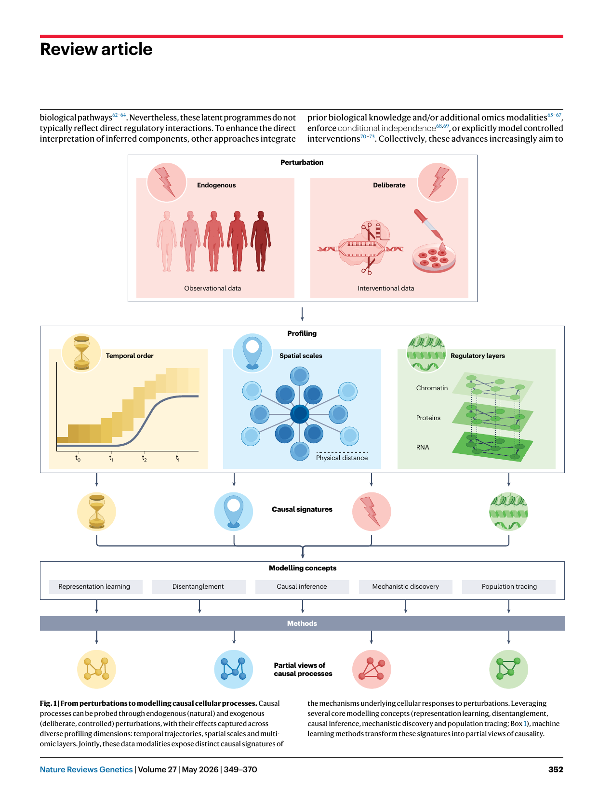
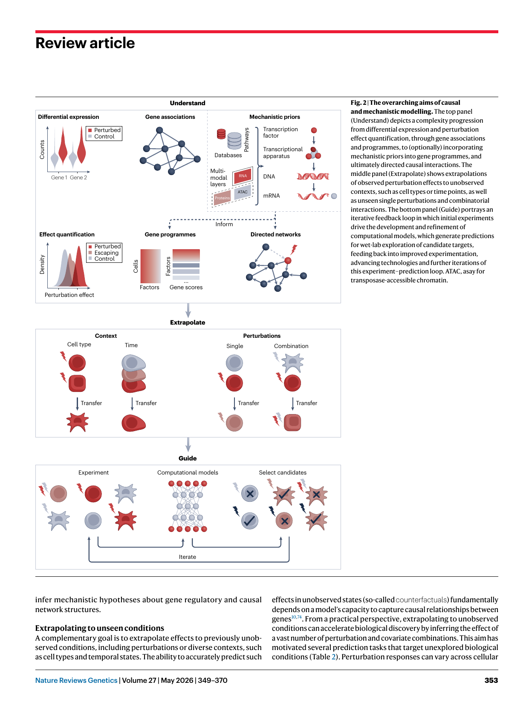
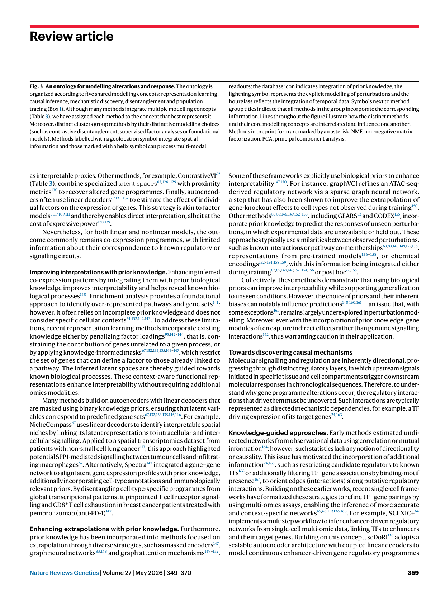

https://doi.org/10.1038/s41576-025-00920-4 

Check for updates 

### **nature reviews** genetics 

###### **Review article** 

# Interpretation, extrapolation and perturbation of single cells 

**Daniel Dimitrov****1,2,5** **, Stefan Schrod****1,2,5** **, Martin Rohbeck****2,3** **& Oliver Stegle****1,2,4** 

###### **Abstract** 

###### **Sections** 

Single-cell analyses have transitioned from descriptive atlasing towards inferring causal effects and mechanistic relationships that capture cellular logic. Technological advances and the growing scale of observational and interventional datasets have fuelled the development of machine learning methods aimed at identifying such dependencies and extrapolating perturbation effects. Here, we review and connect these approaches according to their modelling concepts (including representation learning, causal inference, mechanistic discovery, disentanglement and population tracing), underlying assumptions and downstream tasks. We propose a unifying ontology to guide practitioners in selecting the most suitable methods for a given biological question, with detailed technical descriptions provided in an online resource. Finally, we identify promising computational directions and underexplored data properties that could pave the way for future developments. 

Introduction Aims of causal modelling A unifying ontology — from alteration to causal response Modelling and evaluation challenges Outlook and conclusions 

> 1Genome Biology Unit, European Molecular Biology Laboratory, Heidelberg, Germany. 2Division of Computational Genomics and Systems Genetics, German Cancer Research Center (DKFZ), Heidelberg, Germany.3 Heidelberg University, Heidelberg, Germany.4 Wellcome Sanger Institute, Wellcome Genome Campus, Hinxton, UK. 

> 5These authors contributed equally: Daniel Dimitrov, Stefan Schrod. e-mail: daniel.dimitrov@embl.de; stefan.schrod@embl.de; oliver.stegle@embl.de 

Nature Reviews Genetics | Volume 27 | May 2026 | 349–370 

**349** 

## **Review article** 

##### **Introduction** 

Cellular function varies across developmental stages, tissue types and disease states, leading to molecular interactions that are highly context-dependent. To capture this heterogeneity, single-cell technologies have yielded high-resolution atlases of cell types, their transitions and spatial organization in tissues1,2 . The construction of these foundational maps has been empowered by computational innovations that align and integrate single-cell and, more recently, spatially resolved omics data3–8 . As these approaches mature, attention is increasingly shifting towards computational models that yield causal and mechanistic insights, to explain not just how but why cells differ. Causal modelling frameworks, including causal graph models9 and latent variable (or latent factor) approaches10 , move beyond correlative insights and aim to infer cause–effect relationships and/or generalize across conditions. In causal graph models, nodes represent variables (such as genes, disease or cell states) and edges encode potential causal dependencies, whereas latent variable approaches estimate hidden factors that structure the observed data and can be linked to causal hypotheses under specific assumptions. Mechanistic models offer a complementary strategy that builds on such directed dependencies by explicitly modelling biochemical interactions11 , such as transcription factor (TF) binding, post-translational modifications or intercellular interactions. 

Both causal and mechanistic modelling strategies are tightly coupled to advances in experimental designs that provide the data for inference. Observational atlases, in particular those covering multiple tissues, donors and pathologies, offer an expanded view of cellular heterogeneity1,2 . This intrinsic variability, driven, for example, by genetic factors12,13 or disease states14,15 , constitutes a rich set of ‘natural’ perturbations that can be leveraged to model causal effects and reveal mechanisms across contexts. Nevertheless, the inherent complexity of atlas-scale observational data and the unknown nature of such endogenous shifts hinder the direct inference of causal links and therefore require strong modelling assumptions10 . 

Experimental designs that capture temporal, spatial or multimodal information offer complementary structural constraints, reflecting intrinsic variation across multiple molecular layers and spatiotemporal scales16,17 . Time-series data provide a natural ordering of events, which enables the inference of directional effects by testing whether past states can predict future ones18 . Spatial omics assays account for spatial proximity and microenvironmental effects19 by preserving the physical context of cells within tissues20 . These spatial cues are critical for decoding cell–cell communication21 and signalling across scales22 . Multimodal assays, such as the joint profiling of gene expression and chromatin accessibility23 , provide opportunities to further enrich mechanistic hypotheses by linking expression to upstream regulatory elements24 . 

In addition to the rich set of signatures captured by observational data, targeted pharmacological25–27 or genetic28–30 interventions combined with single-cell readouts enable the direct, high-throughput probing of causal dependencies9,31–34 (Table 1). Through the deliberate manipulation of specific signalling components, these interventional assays can expose the role of each individual target. Currently, such experiments are predominantly carried out in tractable in vitro systems, such as immortalized cell lines25,28–30 , induced pluripotent stem cells35,36 or, more recently, organoid models37 . Moreover, applying these assays in combinatorial settings enables the systematic mapping of joint perturbation effects that can reveal higher-order interactions30 , such as epistasis or potentiation. Finally, with recent high-throughput advances in combinatorial indexing25,27 , it has been 

possible to extend the sequencing scale to millions of cells across thousands of perturbations. 

Collectively, these different experimental designs and profiling technologies reveal distinct yet complementary causal signatures that can be systematically harnessed to model cellular responses (Fig. 1). However, even the most advanced profiling technologies do not directly yield robust causal insights, as any technology is subject to inaccuracies, incomplete coverage and assay noise. For example, off-target effects and heterogeneous intervention efficacy introduce technical variability38 , necessitating computational28,39–44 or experimental44–46 mitigation strategies. These challenges, together with common biological factors, such as intrinsic cellular variation or buffering mechanisms36 , can obscure causal links10 . More fundamentally, the space of all possible interventions is virtually unbounded, especially when considering combinatorial perturbations, interactions between perturbants and their context-dependent properties. Therefore, computational approaches are needed that can infer context-sensitive responses from observational data under suitable assumptions or generalize from interventional data. 

Over the past years, the field has witnessed the adoption of diverse computational strategies to translate the observed signatures of cellular responses into descriptive, causal and mechanistic insights. Statistical inference remains essential to characterize differential responses47 , either at the level of individual genes48 or coordinated effects of gene programmes49 . Building on these foundations, gene regulatory network inference and causal graph models aim to reveal directed relationships, either by using multi-modal data and prior knowledge24 or by making strong assumptions regarding the data-generating processes38 . Simultaneously, progress in deep learning has given rise to a variety of nonlinear models that infer flexible, data-driven representations, enabling the extrapolation of perturbation effects to unseen conditions31 . Ongoing research further seeks to combine the expressive modelling capabilities of such generative frameworks with causal assumptions10 . Another prominent family of models, based on optimal transport, proposes a principled approach to align populations of cells across conditions and modalities, providing a versatile framework to study temporal, spatial and perturbational responses50,51 . Finally, foundation models, typically based on transformer architectures52,53 , are advancing as a versatile approach for learning generalizable cell representations from large-scale data, with growing interest in integrating causal reasoning32,54,55 and multimodal readouts56 . 

Here, we review and systematically connect methods for causal and mechanistic modelling to the signatures they leverage, their overarching goals, their intended computational task and the modelling concepts they share. Combined, these elements give rise to a multi-layered ontology of current methods, which highlights commonalities across otherwise disparate approaches, guiding method selection and benchmarking. 

##### **Aims of causal modelling** 

Alterations and causal responses are modelled broadly for three aims: to understand and characterize the effects of cellular perturbation, to extrapolate perturbation effects to unseen conditions, and to guide future perturbation experiments (Fig. 2). 

###### **Understanding perturbation responses** 

Understanding biological processes often involves characterization at multiple levels, with differential expression analysis of transcriptomics data commonly serving as a starting point47,48 . To better capture 

Nature Reviews Genetics | Volume 27 | May 2026 | 349–370 

**350** 

## **Review article** 

###### **Table 1 | Interventional single-cell and spatial experimental technologies and their key parameters** 

|**Technology**|**Description**|**Modality**|**Cells (****_n_)**|**Perturbations (****_n_)**|**Features measured**|**Refs.**|
|---|---|---|---|---|---|---|
|Perturb-seq|Large-scale pooled experiments combining scRNA-seq and CRISPR-based perturbations|RNA|From tens of thousands up to several million cells Experiments often performed in cell line models|From ~100 to ~10,000 (genome-scale) targeted single genes Available combinatorial screens reach only ~100 gene combinations|Whole transcriptome|28–30, 36,39, 42|
|FiCS Perturb-seq|Industrialized workflow that chemically fixes and cryopreserves cells prior to scRNA-seq. Deep sequencing was shown to enable dose-dependent effect estimation via gRNA abundance|RNA|~8,000,000 cells captured in two experiments|Transcriptome-wide, targeting all human protein-coding genes|Whole transcriptome Deeply sequenced capturing over 16,000 UMIs per cell|46|
|ECCITE-Seq|Multimodal assay that extends the scope of single-cell CRISPR screens by simultaneously profiling transcriptomes, cell surface protein expression (via CITE-seq) and CRISPR perturbations (gRNAs), with optional recovery of antigen receptor clonotypes|RNA Protein Clonotypes (optional)|Tens of thousands (can scale beyond that)|Up to ~100 genes|Whole transcriptome From several up to ~50 (typically) surface proteins (recent CITE-seq panels provide higher coverage)|40,266|
|Perturb-Multi|In vivo pooled CRISPR screening platform combining Perturb-seq and spatially resolved, multiplexed RNA and/or protein imaging|RNA Protein Morphology (imaging)|~55,000 for Perturb-seq ~79,000 for imaging data|~200 genes|~200 RNAs and 14 proteins for spatial imaging Transcriptome-wide for dissociated data|263|
|CROP-Seq|CRISPR screening method that combines pooled genetic perturbations with single-cell transcriptome profiling. It pioneered the direct detection of gRNAs by standard scRNA-seq protocols|RNA|Thousands to tens of thousands in early applications|~10s to ~100s of genes in early experiments|Whole transcriptome|274,275|
|Mix-seq|Platform that uses SNP-based demultiplexing to profile CRISPR and chemical perturbations across pooled panels|RNA|~14,000 cells in ~100 cancer cell lines|13 chemical compounds; 1 genetic perturbation|Whole transcriptome|26|
|Mosaic platform|Chemical perturbation screen that combines up to 50 cancer cell lines as spheroids and uses combinatorial barcodes to identify perturbations, and SNP-based demultiplexing to identify the cell line of origin|RNA|~100 million cells|379 distinct drugs across ~1,100 drug-dose combinations|Whole transcriptome|25|
|Perturb-Map|Spatially resolved pooled screen that links CRISPR knockouts to in situ phenotypes using expressed protein barcodes, which are then characterized by integrated multiplexed imaging and spatial transcriptomics|RNA Protein Morphology (imaging)|Millions of cells in imagining; thousands of spots in spatial transcriptomics|~30–40 perturbations|Few dozen proteins (imaging) per cell or whole transcriptome per spot (multicellular wells)|262|
|PERTURB-CAST|Spatially resolved, pooled perturbation screen using transposon-delivered, barcoded constructs to generate and map higher-order combinatorial interventions and their spatial phenotypes|RNA Morphology (imaging)|~2,000–5,000 spots per 10X Visium slide (12 in total)|8 perturbations, yielding potentially 256 genotype combinations across tumour foci|Whole-transcriptome gene expression per spot|264|
|CRISPRmap|Spatially resolved pooled CRISPR screen that links genetic perturbations to protein and RNA phenotypes by sequential imaging (immunofluorescence)|RNA Protein Morphology (imaging)|Hundreds of thousands of cells per study|~100 s perturbations per study|~10–20 transcripts and RNAs measured at single-cell and subcellular resolution|261|

For more details, please see expert reviews on interventional technologies33,34 . CITE-seq, cellular indexing of transcriptomes and epitopes by sequencing; ECCITE-seq, expanded CRISPR-compatible cellular indexing of transcriptomes and epitopes by sequencing; FiCS, fix-cryopreserve-single-cell RNA sequencing; gRNA, guide RNA; scRNA-seq, single-cell RNA sequencing; SNP, single-nucleotide polymorphism; UMI, unique molecular identifier. 

coordinated responses, expression profiles are often represented as latent variables or gene programmes, which reflect the co-expression patterns of biological systems57,58 . However, although latent-factor approaches can capture hidden structure in single-cell data, they 

often cannot distinguish genuine biological signals from confounding variation59–61 . Recent methods address this challenge by applying disentanglement principles to separate cellular variation into distinct components that reflect specific perturbations, cell-type identities or 

Nature Reviews Genetics | Volume 27 | May 2026 | 349–370 

**351** 

## **Review article** 

biological pathways62–64 . Nevertheless, these latent programmes do not typically reflect direct regulatory interactions. To enhance the direct interpretation of inferred components, other approaches integrate 

prior biological knowledge and/or additional omics modalities65–67 , enforce conditional independence68,69 , or explicitly model controlled interventions70–73 . Collectively, these advances increasingly aim to 

**Fig. 1 | From perturbations to modelling causal cellular processes.** Causal processes can be probed through endogenous (natural) and exogenous (deliberate, controlled) perturbations, with their effects captured across diverse profiling dimensions: temporal trajectories, spatial scales and multiomic layers. Jointly, these data modalities expose distinct causal signatures of 

the mechanisms underlying cellular responses to perturbations. Leveraging several core modelling concepts (representation learning, disentanglement, causal inference, mechanistic discovery and population tracing; Box 1), machine learning methods transform these signatures into partial views of causality. 

Nature Reviews Genetics | Volume 27 | May 2026 | 349–370 

**352** 

## **Review article** 

###### **Fig. 2 | The overarching aims of causal** 

**and mechanistic modelling.** The top panel (Understand) depicts a complexity progression from differential expression and perturbation effect quantification, through gene associations and programmes, to (optionally) incorporating mechanistic priors into gene programmes, and ultimately directed causal interactions. The middle panel (Extrapolate) shows extrapolations of observed perturbation effects to unobserved contexts, such as cell types or time points, as well as unseen single perturbations and combinatorial interactions. The bottom panel (Guide) portrays an iterative feedback loop in which initial experiments drive the development and refinement of computational models, which generate predictions for wet-lab exploration of candidate targets, feeding back into improved experimentation, advancing technologies and further iterations of this experiment–prediction loop. ATAC, asay for transposase-accessible chromatin. 

infer mechanistic hypotheses about gene regulatory and causal network structures. 

###### **Extrapolating to unseen conditions** 

A complementary goal is to extrapolate effects to previously unobserved conditions, including perturbations or diverse contexts, such as cell types and temporal states. The ability to accurately predict such 

effects in unobserved states (so-called counterfactuals) fundamentally depends on a model’s capacity to capture causal relationships between genes10,74 . From a practical perspective, extrapolating to unobserved conditions can accelerate biological discovery by inferring the effect of a vast number of perturbation and covariate combinations. This aim has motivated several prediction tasks that target unexplored biological conditions (Table 2). Perturbation responses can vary across cellular 

Nature Reviews Genetics | Volume 27 | May 2026 | 349–370 

**353** 

## **Review article** 

**Table 2 | Computational tasks and tools to model molecular alterations and cellular responses to perturbations** 

|**Task**|**Subcategory**|**Description**|**Methods**|**Further** **reading**|
|---|---|---|---|---|
|Quantify response|Differential analysis|Identify features (i.e., genes) whose expression changes across conditions|CellDrift96; scMAGeCK100; Mixscale42; Memento90; Taichi105; River98; Perturbation Score99; SCEPTRE43; Vespucci106; MiloDE93; AUGUR101; scDIST103; LEMUR94|48,91, 92,241|
||Perturbation responsiveness|Quantify the effectiveness of a successful (intended) intervention or the responsiveness to a perturbant|SC-VAE126; ContrastiveVI+127; CINEMA-OT37; CellOT80; Mixscale42; MELD102; scRANK104; Taichi105; MUSIC41; Mixscape40; Perturbation Score99; SCEPTRE43; Vespucci106; AUGUR101; scDIST103|34,40, 253|
|Latent structures|Linear gene programmes|Group features into co-expression modules under linear assumptions|MOFA+3; MEFISTO5; STAMP7; slalom144; cPCA195; CSMF200; cLVM199; scPCA197; PCPCA196; CPLVMs110; GSFA109; scINSIGHT201; CellCap131; Expimap132; ontoVAE135; VEGA133; NicheCompass67; EXPORT146; MuVi143; scETM134; Spectra142; Waddington-OT227; GEDI95; Memento90; scITD114; scRANK104; MUSIC41; Mixscape40; MOFAcell115; DIALOGUE116; Decipher137; LEMUR94; scDoRI136|3,49, 107|
||Nonlinear gene programmes|Group features into co-expression modules under nonlinear assumptions|scVI4; scArches8; spaVAE6; ContrastiveVI62; MultiGroupVI129; inVAE128; scDSA112; sVAE+59; ContrastiveVI+127; DRVI64; scDisInFact203; SIMVI97; scFoundation124; GEASS169; Hotspot130; SubCell272; scGPT85Geneformer183; GeneCompass125; scGenePT216; CellDISECT204|52,108, 130|
|Discover mechanisms|Feature relationships|Infer associations between molecular features|Celcomen173; MISTy172; SpaCeNet68; Kasumi171; Memento90; Hotspot130|21|
||Gene regulatory networks|Reconstruct directed regulatory interactions among transcription factors and their putative target genes|Geneformer183; scGPT85; LPM209; scGenePT216; GeneCompass125; scPrint123; LINGER119; SCENIC+66; CellOracle65; Dictys168; RiTINI82; scRANK104; FLeCS72; RENGE35; scDoRI136|24,164|
||Causal structure|Uncover the causal graph structures of gene regulation|SAMS-VAE86; svae-ligr79; sVAE+59; CausCell222; GSFA109; CIV180; NOTEARS69; NOTEARS-MLP177; DAG-GNN178; DCDI71; NODAGS-Flow182; Bicycle70; discrepancy-VAE212; DCD-FG73; Dictys168; AVICI181; DCI175; SEA179; SENA147; RiTINI82; FLeCS72; RENGE35; SCCVAE224|10,38, 59|
|Disentan- glement|Unsupervised|Learn independent latent factors without supervision to capture distinct sources of biological variation|MichiGAN187; sparseVAE188; Celcomen173; DRVI64; SIMVI97; CINEMA-OT37; Decipher137; MOFA+3; MEFISTO5; STAMP7|61,186|
||Contrastive|Optimize the latent space to reveal case-control differences by contrasting perturbed and baseline samples (cells)|cPCA195; CSMF200; cLVM199; cVAE; scPCA197; PCPCA196; CPLVMs110; ContrastiveVI62; mmVAE202; MultiGroupVI129; scDSA112; SC-VAE126; ContrastiveVI+127; scDisInFact203; scINSIGHT201; CellDISECT204|62,195, 198|
||Multi-component|Decompose data into multiple latent components, each representing a different process, such as perturbations or covariates|inVAE128; SAMS-VAE86; svae-ligr79; sVAE+59; CausCell222; SOFA111; GSFA109; TarDis205; FCR208; CellCap131; Biolord63; Spectra142; scPrint123; discrepancy-VAE212; SENA147; SpatialDIVA273; CPA78; MultiCPA206; CellCap131; ChemCPA153;|63,109|
|Predict effects|Context|Transfer perturbation effects across different contexts or covariates (e.g., cell types, species, modalities or patients)|svae-ligr79; CausCell222; TarDis205; trVAE77; Dr.VAE211; scGEN76; CellBox232; CPA78; ChemCPA153; CODEX155; PrePR-CT151; PDGrapher148; Biolord63; graphVCI150; Squidiff88; CellOT80; CondOT89; GWOT267; MMFM81; MFM228; scDiffusion240; CFGen231; cellFlow158; RiTINI82; SubCell272; VirTues268; OmiCLIP269; Prophet271; FLeCS72; RENGE35; scPRAM225; Prescient239; CellDISECT204|76,243|
||Seen|Predict cellular responses to perturbations that were seen during training, including different drug dosage and severity|MichiGAN187; SAMS-VAE86; svae-ligr79; sVAE+59; CausCell222; FCR208; scDisInFact203; trVAE77; Dr.VAE211; CellBox232; scPreGan207; LEMUR94; MMFM81; MFM228; scELMo214; discrepancy-VAE212; SENA147; Prescient239|94,203|
||Unseen|Predict novel perturbations not encountered during training|ChemCPA153; GEARS83; AttentionPert149; PRNet; CODEX155; PDGrapher148; Biolord63; cycleCDR152; Squidiff88; CondOT89; cellFlow158; scGPT85; C2S-Scale270; LPM209; scGenePT216; scFoundation124; GeneCompass125; LLM + GP157; Prophet271; IterPert156; SCCVAE224|83,85|
||Combinatorial|Predict the combined effects of multiple simultaneous perturbations|MichiGAN187; SAMS-VAE86; CausCell222; scDisInFact203; CellBox232; CPA78; MultiCPA206; GEARS83; AttentionPert149; CODEX155; PDGrapher148; Biolord63; SALT&PEPER84; Squidiff88; CondOT89; cellFlow158; scGPT85; C2S-Scale270; LPM209; scGenePT216; scFoundation124; GeneCompass125; discrepancy-VAE212; SENA147; IterPert156; State210|84,213, 221|
|Trace cell po|pulations|Infer couplings between cell states across conditions or timepoints using optimal transport, flow matching or Schrödinger bridges|CINEMA-OT37; CellOT80; CondOT89; GWOT267; MMFM81; MFM228; CFGen231; cellFlow158; Waddington-OT227; OT-CFM229; MioFlow276; moscot226; scPRAM225; CoSpar277; Prescient239; ARTEMIS236; SBalign237; DeepROUT238| 50,51, 226|

Nature Reviews Genetics | Volume 27 | May 2026 | 349–370 

**354** 

## **Review article** 

contexts75 ; therefore, transferring perturbational effects to unseen covariates, such as cell type63,76–78 , studies79 , patients80 and species76,80 , as well as time points35,72,81,82 , is essential to capture context-sensitive outcomes. A related challenge is that distinct perturbations can exhibit non-additive interactions30 , which models attempt to address by predicting their combinatorial effects83–86 . Finally, perturbants with similar characteristics often elicit comparable responses87 , which facilitates the prediction of entirely unobserved perturbations83,85,88,89 . 

###### **Guiding future experiments** 

Although extrapolating to new biological contexts enables the prediction of unobserved responses, many methods rely on sophisticated nonlinear architectures to enhance their predictive capacity. This non-linearity aligns with and is motivated by the complex, multi-scale nature of biological systems, but it often comes at the cost of reduced interpretability, particularly in deep learning models, thus limiting their utility in generating actionable hypotheses. Nevertheless, to effectively guide future experiments, an ideal model must balance capturing nonlinear, emergent cellular behaviours and providing clear insights into their causal mechanisms32,54 . 

##### **A unifying ontology — from alteration to causal response** 

To achieve the progressively complex goals of understanding and extrapolating effects and ultimately guide future experiments, many methods build on and integrate common modelling concepts to address specific biological questions. At the same time, the diversity of experimental technologies and their associated causal signatures has led to a proliferation of computational tools, with terminology and foundational concepts being fragmented across specialized fields. To highlight common principles, we position current methods along the causal signatures they use (Fig. 1), the computational tasks they address (Table 2), and the recurring modelling concepts representation learning (also known as feature learning), causal inference, mechanistic discovery, disentanglement and population tracing (Box 1). Together, these axes and the underlying assumptions of each method yield an ontology that conveys a taxonomy of existing methods with varying causal complexity. (Fig. 3). 

The ontology begins with single-gene alterations, moves to the gene programmes that integrate these alterations, and, ultimately, the directed regulatory mechanisms that govern them. Moreover, it highlights methods that isolate causal signals and track cellular states across conditions, enabling robust prediction of perturbation effects in previously unseen conditions. Detailed information, along with technical descriptions of individual methods, is available as a queryable and extendable online resource. 

###### **Examining alterations to decode effects** 

Causal and mechanistic models often build on insights from single-gene alterations, which have long provided a foundation for understanding biological processes (Table 2); indeed, statistical inference and differential gene expression analysis usually represent the first go-to tools for practitioners47 . In observational single-cell studies, comparative case-control analyses have been central to characterize gene expression changes across conditions48 , with existing methods accounting for challenges such as scalability90 , pseudoreplication91,92 and continuous cell heterogeneity93–95 . Nevertheless, differential expression analysis is by design descriptive and does not reveal causal structures. Recent methodological advances attempt to address this limitation 

by explicitly integrating perturbation-induced variation with temporal or spatial information. For example, CellDrift96 combines temporal order with case-versus-control statistics to explain alterations specific to cell types, perturbations and their interactions. In spatial contexts, SIMVI97 isolates gene expression variability into intrinsic cellular factors and extrinsic spatial influences to identify genes driving perturbation-related niches. Furthermore, River98 reframes differential statistical testing as a classification task to identify spatially coherent, disease-relevant genes, for example, _Prm1_ and _Prm2_ , which were linked to spermatogenesis pathology in diabetic mice98 . 

Unlike observational studies, interventional assays perturb defined targets and thus enable the controlled inference of expression changes (Table 1). However, technical artefacts, most notably variation in guide RNA efficiency and delivery, can confound identified effects28,39 . Multiple approaches exist for the estimation of intervention effectiveness, which enable the identification and exclusion of cells that ‘escape’ the intervention28,39–43,99,100 . For example, mixscape40 estimates a perturbation score by comparing perturbed cells to their closest non-perturbed neighbours, and classifies escaping cells using a Gaussian mixture model. More advanced frameworks incorporate effectiveness estimates directly into significance testing42,43 ; for example, Mixscale42 extends mixscape’s40 binary (‘perturbed’ or ‘not perturbed’) cell classifications to continuous perturbation scores, which are used to weigh cell contributions in subsequent differential expression testing (Table 3). 

Inspired by studies showing that the same perturbations can induce cell-state-specific responses14,36 , another class of methods, including AUGUR101 and MELD102 , aims to quantify their context dependency at cell-type37,80,101,103,104 or single-cell resolution102,105,106 . More recently, Taichi105 and Vespucci106 have quantified responsiveness in tissue niches from observational, spatially resolved data. For instance, Taichi105 combines spatially informed cell representations with label smoothing across neighbouring cells to estimate spatial regions that are most affected by a perturbation and delineate perturbed and healthy niches. 

Taken together, these approaches are designed to capture observable alterations in the data but generally offer limited insights into the coordinated responses underlying biological systems57,58 . 

###### **Capturing gene programmes** 

Gene expression changes commonly manifest as tightly co-expressed programmes57,58 that can be captured as latent structures (Table 2) or low-dimensional representations (Box 1), often using factor models107 or variational autoencoders108 . Early representation-learning methods3–8 , including linear models such as MOFA+3 or nonlinear counterparts such as scVI4 , focused on sample4,8 and modality integration3,5 and have since been extended to model temporal trajectories5 or embed spatial information5–7 . 

**Linear gene programmes.** Building on these approaches, recent frameworks use perturbation and covariate annotations to disentangle altered gene programmes59,62,109–112 . For example, GSFA109 , a supervised factor model, enhances factor decomposition with sparse multivariate regression to estimate the impact of each perturbation on the latent factors and their associated gene sets (Table 3). Although such perturbation-aware models can reveal intervention-associated patterns, understanding how gene programmes manifest across cell populations requires tissue-scale14,113 or organ-scale15 data. To extract such multicellular programmes, recent methods often aggregate gene 

Nature Reviews Genetics | Volume 27 | May 2026 | 349–370 

**355** 

## **Review article** 

#### **Box 1 | Shared machine learning concepts that underpin causal and mechanistic modelling methods** 

**Representation learning.** Within a single experiment, it is possible to profile whole transcriptomes of millions of cells2,25 . However, the resulting high-dimensional expression matrices are inherently noisy and sparse241 . Representation learning (also known as feature learning) addresses this issue by embedding high-dimensional count data into compact latent spaces that retain biological structures while attenuating technical variance and improving interpretability278 (see the figure). As a result, representation learning underpins methods routinely used for preprocessing and visualization48,241 as well as cross-sample4,8 and cross-modal integration3,5,6 . Building on these approaches, recent methods isolate perturbation-specific 

latent spaces59,62,63,78,109 , delineate gene modules67,109,114 and extrapolate perturbation effects78,83,85 . Recently, foundation models85,123,124,183 , trained on millions of cells, have been shown to capture shared cell and gene manifolds across diverse experiments. These versatile representations can then be readily adapted to different downstream tasks85,123,124,183 , unifying the capabilities of earlier, task-specific models within a single framework. 

Assumptions: representation learning assumes the existence of a manifold structure within the data and shared low-dimensional patterns across cells. Without additional assumptions, it provides purely associational structures that lack causal orientation. 

Nature Reviews Genetics | Volume 27 | May 2026 | 349–370 

**356** 

## **Review article** 

###### _(continued from previous page)_ 

**Causal inference.** Causal inference, as formalized in Pearl’s do-calculus framework, defines causal effects in terms of explicit interventions to a system9 . In single-cell omics, CRISPR perturbations or drug treatments serve as experimental do-operations, enabling direct estimation of how such interventions affect cellular transcriptomes. However, high-dimensional readouts alone rarely satisfy causal sufficiency74 , as measured genes capture only a subset of molecular causes, whereas confounders, such as the microenvironment or cell-cycle stage, can still affect estimated effects279 . To overcome these challenges, it is essential to learn representations that are both disentangled from confounding factors and invariant across different regimes, for example, via causal representation learning10 . Once such representations are identified, they support counterfactual reasoning by enabling predictions of responses under hypothetical conditions (see the figure), for example, the combined effect of two CRISPR edits. 

Assumptions: causal inference methods assume that, after adjusting for confounders, the observed interventions are the primary drivers of observed differences between control and perturbed samples. By explicitly modelling these interventions, the estimated perturbation effects provide insights that extend beyond the correlational patterns typically uncovered by representation learning. 

**Mechanistic discovery.** Mechanistic discovery builds on causal inference and seeks to infer directed, causal interactions (edges) between specific molecules, for example, identifying transcription factor binding events that drive target-gene expression (see the figure). Early mechanistic models used time-series or perturbation-based protein and phosphoprotein data, combined with prior knowledge and mathematical formalisms such as ordinary differential equations280 or logic-based models11 . By contrast, single-cell experiments typically produce high-dimensional static snapshots of transcriptomic states, which necessitate the inference of signalling networks from co-expression alone. These challenges have spurred the development of diverse methods and strategies, such as integrating multimodal and knowledge priors66,119,168 , causal graph models69,175 , temporal35,82 and spatial constraints68,173 , in silico graph interventions70–73 and pre-training119,123,181 , to obtain generalizable regulatory interactions. 

Assumptions: mechanistic discovery necessitates that the causal relationships between molecules are accurately estimated from the data. This process relies on observing all variables (molecules), the generalizability of prior biological knowledge (if incorporated) and the specificity of interventions to their intended targets, among other factors. 

expression across cell types and samples, typically via pseudo-bulk approaches48 , followed by representation learning114–116 . Independent adaptations of MOFA+3 , a multi-omics data integration method based on multi-view factor analysis, have recently identified key gene programmes across cell types in cardiovascular disease115,117 and multiple sclerosis118 , offering a tissue-centric perspective of disease outcomes49 . 

**Nonlinear gene programmes.** Perturbation responses often exhibit nonlinear changes due to feedback, saturation or threshold effects, which cannot be captured by linear models. To model such responses, 

**Disentanglement.** Cellular states are concurrently shaped by overlapping biological processes, such as cell-cycle progression144 , cell differentiation227 and microenvironmental signalling19 . The observed gene-expression counts are thus a mix of entangled transcriptional programmes. Disentanglement seeks to decompose this mixture into individual generalizable components, corresponding to meaningful, known processes (see the figure). Representation learning is commonly used for disentanglement, with unsupervised methods attempting to isolate gene programmes via statistical independence185 , regularization techniques97,187,189 or sparsity constraints3,59,109,143 . Alternatively, when cell annotations are available, supervised and semi-supervised methods can incorporate such information to contrast case-control scenarios62,195 or simultaneously disentangle multiple perturbations and covariates63,78,208 . 

Assumptions: disentanglement posits that the diverse sources of variation in the data, such as inter-sample differences, can be decomposed to yield distinct and meaningful factors that correspond to individual, biologically relevant components. 

**Population tracing.** Single-cell assays typically provide only a snapshot of gene expression, as each cell is destroyed during profiling, preventing paired (before–after) observations for the same cell. Hence, estimating a cell’s specific changes induced by an intervention cannot be directly computed. Optimal transport provides a mathematically well-posed framework to pair potential counterfactuals and learn transport maps that capture both cellular heterogeneity and condition effects51 (see the figure). Many specialized optimal transport solutions have been proposed to model perturbations80,81,89 , temporal trajectories81,227,235 and clonal lineages277 , and align multimodal data231,267,276 . Given its wide usage, computational frameworks implementing optimal transport with various cost metrics have been introduced281 and tailored for single-cell data226 . Furthermore, a family of distribution-alignment approaches, such as flow matching81,158,229 , diffusion models88,240 and Schrödinger bridges236–238 , has been proposed to model complex cellular dynamics and distributional shifts. 

Assumptions: population tracing via optimal transport and related approaches commonly assumes smooth, continuous transitions between observed snapshots or condition states across cell populations. Moreover, many methods leverage the derived counterfactual mappings for extrapolation and other causal tasks, making the validity of subsequent inferences highly dependent on the accuracy of these mappings. 

variational autoencoders and other nonlinear generative models have been proposed. A downside of their increased flexibility is that effects cannot be directly attributed to individual genes, necessitating additional strategies to identify the most relevant features (genes). A common solution to estimate the importance of each feature59,98,112,119 is to apply post hoc metrics120–122 that quantify the contribution of each gene to the model’s predictions. Alternatively, some deep learning models are designed to provide directly interpretable representations. For example, recent transformer-based models85,123–125 , such as scGPT85 and scPRINT123 , use attention weights to infer gene associations and programmes, effectively utilizing learned attention maps 

Nature Reviews Genetics | Volume 27 | May 2026 | 349–370 

**357** 

## **Review article** 

Nature Reviews Genetics | Volume 27 | May 2026 | 349–370 

**358** 

## **Review article** 

**Fig. 3 | An ontology for modelling alterations and response.** The ontology is organized according to five shared modelling concepts: representation learning, causal inference, mechanistic discovery, disentanglement and population tracing (Box 1). Although many methods integrate multiple modelling concepts (Table 3), we have assigned each method to the concept that best represents it. Moreover, distinct clusters group methods by their distinctive modelling choices (such as contrastive disentanglement, supervised factor analyses or foundational models). Methods labelled with a geolocation symbol integrate spatial information and those marked with a helix symbol can process multi-modal 

as interpretable proxies. Other methods, for example, ContrastiveVI62 (Table 3), combine specialized latent spaces62,126–129 with proximity metrics130 to recover altered gene programmes. Finally, autoencoders often use linear decoders67,131–137 to estimate the effect of individual factors on the expression of genes. This strategy is akin to factor models3,5,7,109,111 and thereby enables direct interpretation, albeit at the cost of expressive power138,139 . 

Nevertheless, for both linear and nonlinear models, the outcome commonly remains co-expression programmes, with limited information about their correspondence to known regulatory or signalling circuits. 

**Improving interpretations with prior knowledge.** Enhancing inferred co-expression patterns by integrating them with prior biological knowledge improves interpretability and helps reveal known biological processes140 . Enrichment analysis provides a foundational approach to identify over-represented pathways and gene sets141 ; however, it often relies on incomplete prior knowledge and does not consider specific cellular contexts24,132,142,143 . To address these limitations, recent representation learning methods incorporate existing knowledge either by penalizing factor loadings95,142–144 , that is, constraining the contribution of genes unrelated to a given process, or by applying knowledge-informed masks67,132,133,135,145–147 , which restrict the set of genes that can define a factor to those already linked to a pathway. The inferred latent spaces are thereby guided towards known biological processes. These context-aware functional representations enhance interpretability without requiring additional omics modalities. 

Many methods build on autoencoders with linear decoders that are masked using binary knowledge priors, ensuring that latent variables correspond to predefined gene sets67,132,133,135,145,146 . For example, NicheCompass67 uses linear decoders to identify interpretable spatial niches by linking its latent representations to intracellular and intercellular signalling. Applied to a spatial transcriptomics dataset from patients with non-small cell lung cancer113 , this approach highlighted potential SPP1-mediated signalling between tumour cells and infiltrating macrophages67 . Alternatively, Spectra142 integrated a gene–gene network to align latent gene expression profiles with prior knowledge, additionally incorporating cell-type annotations and immunologically relevant priors. By disentangling cell-type-specific programmes from global transcriptional patterns, it pinpointed T cell receptor signalling and CD8⁺ T cell exhaustion in breast cancer patients treated with pembrolizumab (anti-PD-1)142 . 

**Enhancing extrapolations with prior knowledge.** Furthermore, prior knowledge has been incorporated into methods focused on extrapolation through diverse strategies, such as masked encoders147 , graph neural networks83,148 and graph attention mechanisms149–152 . 

readouts; the database icon indicates integration of prior knowledge, the lightning symbol represents the explicit modelling of perturbations and the hourglass reflects the integration of temporal data. Symbols next to method group titles indicate that all methods in the group incorporate the corresponding information. Lines throughout the figure illustrate how the distinct methods and their core modelling concepts are interrelated and influence one another. Methods in preprint form are marked by an asterisk. NMF, non-negative matrix factorization; PCA, principal component analysis. 

Some of these frameworks explicitly use biological priors to enhance interpretability147,150 . For instance, graphVCI refines an ATAC-seqderived regulatory network via a sparse graph neural network, a step that has also been shown to improve the extrapolation of gene-knockout effects to cell types not observed during training150 . Other methods83,89,148,149,152–158 , including GEARS83 and CODEX155 , incorporate prior knowledge to predict the responses of unseen perturbations, in which experimental data are unavailable or held out. These approaches typically use similarities between observed perturbations, such as known interactions or pathway co-memberships63,83,148,149,155,156 , representations from pre-trained models156–158 , or chemical encodings152–154,158,159 , with this information being integrated either during training83,89,148,149,152–154,156 or post hoc63,155 . 

Collectively, these methods demonstrate that using biological priors can improve interpretability while supporting generalization to unseen conditions. However, the choice of priors and their inherent biases can notably influence predictions140,160,161 — an issue that, with some exceptions161 , remains largely underexplored in perturbation modelling. Moreover, even with the incorporation of prior knowledge, gene modules often capture indirect effects rather than genuine signalling interactions162 , thus warranting caution in their application. 

###### **Towards discovering causal mechanisms** 

Molecular signalling and regulation are inherently directional, progressing through distinct regulatory layers, in which upstream signals initiated in specific tissue and cell compartments trigger downstream molecular responses in chronological sequences. Therefore, to understand why gene programme alterations occur, the regulatory interactions that drive them must be uncovered. Such interactions are typically represented as directed mechanistic dependencies, for example, a TF driving expression of its target genes24,163 . 

**Knowledge-guided approaches.** Early methods estimated undirected networks from observational data using correlation or mutual information164 ; however, such statistics lack any notion of directionality or causality. This issue has motivated the incorporation of additional information24,165 , such as restricting candidate regulators to known TFs166 or additionally filtering TF–gene associations by binding-motif presence167 , to orient edges (interactions) along putative regulatory interactions. Building on these earlier works, recent single-cell frameworks have formalized these strategies to refine TF–gene pairings by using multi-omics assays, enabling the inference of more accurate and context-specific networks65,66,119,136,168 . For example, SCENIC+66 implements a multistep workflow to infer enhancer-driven regulatory networks from single-cell multi-omic data, linking TFs to enhancers and their target genes. Building on this concept, scDoRI136 adopts a scalable autoencoder architecture with coupled linear decoders to model continuous enhancer-driven gene regulatory programmes 

Nature Reviews Genetics | Volume 27 | May 2026 | 349–370 

**359** 

## **Review article** 

###### **Table 3 | Applications and trade-offs of representative methods** 

|**Method**|**Concepts**|**Causal signatures**|**Summary and application**|**Trade-ofs**|**Ref.**|
|---|---|---|---|---|---|
|Mixscale|Causal inference|Perturbations|Quantifies heterogeneous perturbation effects by projecting cells onto a perturbation vector and using weighted regression. Applied to Perturb-seq across six cell lines, identifying context-specific and shared gene programmes|Increased power for gene alteration detection; may overlook biological heterogeneity or inflate effects by downweighing weakly perturbed cells|42|
|CINEMA-OT|Population tracing, disentanglement, representation learning, causal inference|Perturbations|Uses ICA to remove confounding signals and OT to align perturbed/control cells. Applied to airway organoids and PBMCs, revealing shared, cell-type- specific, and synergistic responses|Robust to cell-type abundance differences; limited to observed cell pairs, cannot extrapolate to unmeasured cell types or perturbations|37|
|Dictys|Mechanistic discovery|Multi-modal, prior knowledge|Infers GRNs from single-cell multi-omics and TF footprints, by solving the steady state of the Ornstein–Uhlenbeck process, smoothed with Gaussian processes Applied to human blood, identifying cell-type and time-dependent regulatory shifts|Biologically constrained edges improve interpretability; results are unstable across runs|168|
|GSFA|Representation learning, causal inference|Perturbations|Bayesian factor analysis linking perturbations to latent gene modules Applied to CRISPR repression in neural progenitors, identifying novel autism risk gene effects|High power and interpretability; limited scalability due to Gibbs sampling, which is computationally intensive|109|
|ContrastiveVI|Disentanglement, representation learning|Perturbations, multimodal (optional)|Variational autoencoder that separates shared versus salient latent spaces to capture condition-specific changes Applied to Mix-seq and ECCITE-seq, recovering perturbation-induced programmes|Focuses on condition-specific programmes rather than individual genes; limited to case-control comparisons|62|
|SAMS-VAE|Disentanglement, causal inference, representation learning|Perturbations|Generative model that disentangles perturbation effects from background using sparse additive shifts; it can be seen as a generalization of contrastive approaches to multiple interventions Applied to CRISPR activation screens, predicting unseen perturbation combinations|Flexible causal representation; nonlinear architecture limits interpretability|86|
|scGPT|Representation learning, causal inference, mechanistic discovery|Perturbations (via fine-tuning)|Foundation (transformer-based) model processes each cell as a gene sequence, including expression and condition tokens. Fine-tuned on Perturb-seq to recover attention-based GRNs and pathway programmes|Powerful embeddings; interpretation relies on post-processing|85|
|FLeCS|Mechanistic discovery, population tracing|Perturbations, temporal order, prior knowledge, multimodal (optional)|Infers GRNs from time-resolved data via ODEs and OT Applied to myeloid progenitor development, revealing lineage-specific dynamics|Linear GRNs are interpretable but can miss complex trajectories or stochasticity|72|
|CellFlow|Population tracing, causal inference|Perturbations, temporal order (optional), prior knowledge (optional)|Maps control/perturbed populations with OT and neural ODEs, transferring effects to new contexts Applied to PBMCs and zebrafish embryo knockouts|Transfers effects between samples; showed that performance depends on sufficient observed conditions and quality of OT maps|158|

An expanded version of this table can be found as Supplementary information. GRN, gene regulatory network; ICA, independent component analysis; ODE, ordinary differential equation; OT, optimal transport; PBMCs, peripheral blood mononuclear cells; TF, transcription factor. 

across cell types in an end-to-end manner. Applied to a single-nucleus RNA and chromatin accessibility multi-ome glioblastoma atlas, this model was shown to uncover disease-associated TF–enhancer–gene networks, including previously unknown MYT1L-mediated repression as a barrier to glioblastoma plasticity136 . 

**Spatiotemporal approaches.** Incorporating temporal and spatial scales can aid in distinguishing direct from indirect associations169 . Recent methods leverage temporal information from measured time-series trajectories35,72,82 or inferred cellular progressions, such as pseudotime72,82,168 or RNA velocity-derived trajectories170 , 

thereby modelling regulatory-network dynamics that emerge or fade during cell differentiation or following perturbation response. For instance, as reported in a recent preprint, FLeCS72 describes time-resolved perturbation states using ordinary differential equations to infer static regulatory networks from interventional data (Table 3). Moreover, by incorporating spatial information, some methods68,171–173 , including SpaCeNet68 and Kasumi171 , aim to disentangle intrinsic regulatory interactions from those mediated by neighbouring cells. This separation of intrinsic regulatory programmes from microenvironment-driven signals is critical for inferring mechanisms of cell–cell communication21 . 

Nature Reviews Genetics | Volume 27 | May 2026 | 349–370 

**360** 

## **Review article** 

**Causal graph approaches.** Alternatively, constraint-based causal graph algorithms174 can be used to remove spurious correlations and derive a set of directed graphs from observational data, without relying on mechanistic or spatiotemporal information. However, the conditional independence tests these methods often build on are computationally demanding and tend to be statistically unstable when applied to sparse, high-dimensional single-cell data174–176 . As a more computationally tractable alternative, score-based causal models use continuous optimization to automatically orient edges69,177,178 , or select only those regulatory links whose direct, conditional associations differ across conditions175 . Another limitation of many causal graph methods, such as NOTEARS69 and DCI175 , is that they assume acyclicity to infer interaction direction69,71,175,177–181 — a simplification that contradicts biological self-regulation and feedback loops. Moreover, in particular for methods that solely rely on observational measurements69,177,178 , it is common that multiple causal graphs can explain the data equally well. Consequently, the inferred causal dependencies may not be identifiable and are potentially ambiguous74,174 . 

Interventional data, and particularly targeted genetic perturbations, can further elucidate causal processes and improve the inference of regulatory interactions70,71,73,182 . A perfect CRISPR–Cas9 knockout, in the case of a TF, eliminates its expression and theoretically its activity, effectively removing its direct regulatory edges, which can be modelled by deleting all its causal parents in the graph. By contrast, CRISPR interference29 represses but does not eliminate mRNA production, which is typically modelled as altered TF expression180 . By replicating interventions in learned graphs, recent methods70,82,182 , for example, BICYCLE70 , can recover cyclic causal relationships while also facilitating the extrapolation to unseen perturbations and combinatorial effects, without relying on additional prior knowledge70,182 . However, in practice, both knockout and interference screens often only partially perturb target TF activity and may introduce off-target effects33 — challenges that current graph intervention methods overlook38 . 

**Pre-trained foundational approaches.** Most mechanistic discovery methods generate causal hypotheses solely from the data at hand. However, recent foundation models attempt to learn universal gene– gene structures by training on large-scale compendia85,119,123–125,183 . scPRINT123 , for example, demonstrated that such foundational representations, when integrated with domain-specific priors, can enhance the agreement between inferred context-specific networks and known interactions, chromatin accessibility, and perturbation data. Another method, LINGER119 , pre-trained on large-scale bulk gene expression and chromatin accessibility data, showed that fine-tuning using single-cell multi-omic data can prioritize cell-type-specific, diseaserelevant regulators, such as STAT1 and FOSB in inflammatory bowel disease, with STAT1’s predicted targets being significantly enriched for known genetic risk loci. Similarly, recent amortized causal graph frameworks179,181 , pre-trained on large simulated perturbation data with known ground-truth networks, were shown to enable faster and more stable interaction inference when fine-tuned using real single-cell data. 

Collectively, mechanistic discovery approaches typically leverage curated knowledge or causal graphs to infer directed regulatory interactions in high-dimensional, noisy single-cell data, with recent extensions further integrating spatiotemporal scales, perturbations and pre-training strategies, or combinations thereof. However, no proposed approach integrates the full suite of causal signatures, leaving critical gaps when inferring true mechanistic regulatory networks. 

###### **Isolating entangled cellular processes** 

At its core, any form of causal inference relies on disentangling direct effects from background variability and confounding influences9 . This approach includes removing technical factors, such as batch or sample effects128,184 . Furthermore, isolating biologically meaningful signals requires isolating perturbation-specific and covariate-specific programmes from intrinsic heterogeneity. Disentanglement methods, such as independent component analysis (ICA)185 , achieve this aim by factorizing variation into statistically independent and interpretable components186 . One example is CINEMA-OT37 , which uses ICA as a pre-processing step to derive shared representations of control and perturbed cells; these are then coupled via optimal transport (Box 1), allowing the model to perform counterfactual inference tasks, such as estimating the synergistic effects of combined treatments (Table 3). 

Besides the independence assumptions used in ICA185 , contemporary latent-variable methods commonly impose different regularization terms (penalties) to separate the distinct sources of variation without supervision64,97,137,187,188 . Examples of such regularizations include applying sparsity priors3,143,188 , promoting latent independence137 and explicitly reducing inter-factor correlations97,187,189 . For instance, DRVI64 extends the popular probabilistic framework scVI4,190 with additive decoders that explain each latent factor separately, facilitating the isolation and interpretation of genetic perturbation effects, disease-specific variation and developmental signals64 . 

However, such unsupervised approaches are limited. Although ICA can, under certain assumptions, recover disentangled latent variables, its inherent linearity restricts its flexibility in capturing complex dependencies186 . Conversely, nonlinear methods capture data complexity; however, without additional information or strong assumptions, it can be difficult to recover the true latent variables60,61,191–193 , which might compromise the quality of latent cell representations59 . Therefore, incorporating supervision into disentanglement models, for example, by leveraging known cell groupings or perturbation labels, can offer a robust and effective approach to isolate expected variations. 

Much of the observed variability in perturbation studies arises from background effects, such as lineage, cell cycle and other intrinsic sources of heterogeneity. By isolating these background effects, researchers can, in theory, obtain unconfounded perturbation processes37,62 . Recent methods have considered the contrast between perturbed (case) and unperturbed (control) cells to learn latent representations that distinguish shared background variation from perturbation-induced effects. Motivated by early contrastive mixture models194 , contrastive principal component analysis195 and its extensions196,197 isolate the variation enriched in a target condition by subtracting the shared (background) variation. In an application to pre-transplantation and post-transplantation bone marrow mononuclear cells from patients with leukaemia, contrastive principal component analysis was able to isolate shared processes associated with stem cell transplants across patients195 . Since then, multiple extensions of the general contrastive framework195,198 have been proposed, incorporating different probabilistic priors110,196,199 , non-negativity constraints110,200,201 , non-linearities62,112,198,199,202 and count-based likelihoods62,110,127,129 . Some of these contrastive methods explicitly partition the latent space into ‘shared’ variables, capturing common variation, and ‘salient’ variables, encoding perturbation-specific signals62,110,112,126,127,198,199,202 . A core assumption of these models is that both perturbed and control cells contribute to learning the shared background representation, whereas only perturbed cells inform the salient representation. Broadly, these implementations include 

Nature Reviews Genetics | Volume 27 | May 2026 | 349–370 

**361** 

## **Review article** 

factor models110,199 and variational autoencoders112,126,127,198,199,202 , with the latter often further enhancing perturbation-specific signal isolation through statistical independence constraints62,127,198,202,203 , auxiliary neural networks112 or a combination thereof126 . A notable example is ContrastiveVI62 , which builds on scVI-tools4,190 and contrastive autoencoders198,199,202 to disentangle perturbation-specific signals from transcriptomic and CITE-seq perturbation screens (Table 3). Inspired by ContrastiveVI62 and in line with statistical frameworks that incorporate intervention effectiveness42,43 , recent methods126,127 introduced auxiliary classifier networks to estimate the probability of the intended perturbation in each cell, thus further facilitating the isolation of perturbed gene programmes. 

Although contrastive methods are effective for partitioning the learned representations into perturbation-specific and background components, this binary grouping has limitations when multiple perturbations or a richer set of covariates are considered. Multiple methods address multi-condition disentanglement by learning structured representations. Some methods, such as scDisInFact203 and MultiGroupVI129 , partition latent space into perturbation-specific components along with a shared background space129,201,203 whereas others also explicitly model covariate-specific effects, such as those observed across different cell types or cell lines63,78,150,153,154,204 . Many methods, including Biolord63 and SOFA111 , also account for residual variation from basal and/or unknown sources78,86,111,128,131,150,152,153,204–207 whereas others explicitly model the interactions between perturbations and covariates112,208 . 

###### **Predicting counterfactual effects** 

Perturbation responses vary across individual cells, cell types and tissues, driven by both stochastic fluctuations and intrinsic cues75,99 . To accurately predict how cells might behave under unobserved conditions and to make valid counterfactual predictions, methods must identify the underlying causal mechanisms of cellular processes9 . Ideally, this task requires preserving both single-cell heterogeneity and population-wide effects. In turn, achieving this necessitates overcoming the destructive nature of single-cell sequencing, which prevents the longitudinal tracking of the same cell. Although some methods, such as regressor-based151,154,155 or generator-based63,83,148,149,151,209 approaches, focus on estimating the population-average effects of perturbations by randomly matching control and treated cells or primarily relying on cell annotations, they may smooth over cellular heterogeneity and overlook cell-specific responses210 . To address this challenge, other methods attempt to attribute variation across cells to specific sources, such as treatment effects versus cell type-specific or basal expression, thus disentangling them and enabling extrapolation59,78,86,131,150,152,153,206,207 . Another class of approaches computationally traces cell populations to map their distributions across conditions, thereby naturally capturing general trends and individual-cell variability50,51 , while also providing a framework that can be adapted for counterfactual predictions80,89,158 . 

**Isolating and extrapolating perturbation effects.** Disentanglement provides one approach to capture heterogeneity, thereby potentially improving not only interpretability but also accuracy for prediction tasks such as predicting cellular responses78 . As such, it bridges the gap between understanding (What is?) and extrapolating (What could have been?). 

Early autoencoder-based methods drew inspiration from case-control analyses to isolate population-level perturbation effects. These methods first compress high-dimensional expression profiles 

into a shared latent space. Using latent space arithmetic, they then quantify the perturbation effect as the difference between the control and perturbed cells76,77,203,211 . A prime example is scGEN, which computes a latent difference vector that is linearly added to the representation of unperturbed cells and then decoded to predict their (counterfactual) perturbed state, enabling, for instance, the prediction of cell-type-specific IFNβ response in unseen cell types76 . 

Building upon these early autoencoder approaches and introducing explicit disentanglement, recent methods isolate perturbationspecific or covariate-specific effects within latent embeddings, separating them from background expression78,86,131,150,152,153,204,206,208 . To achieve this, CPA78 adopted an adversarial strategy that encourages perturbation-specific and covariate-specific information to be captured exclusively within their dedicated embeddings rather than in the basal representation. In turn, this approach enables the prediction - of previously unseen combinations of conditions, including combi natorial perturbations78 . Since then, multiple methods with distinct disentanglement strategies have been proposed131,150,152,204,205,207,208 . For instance, some generate virtual counterfactuals147,150,212 or use sequential autoencoders for case and control samples to construct disentangled latent states152 . Note that accurately capturing the effects of the perturbations requires effectively disentangled states. However, this remains a challenging task, in which suboptimal strategies can compromise predictions60,61,192,193,213 . 

In contrast to methods that learn a mapping of transcriptomic data into lower-dimensional latent representations, another class of approaches63,83,148,149,151,209 primarily relies on perturbation and covariate labels to generate counterfactual cell profiles. Given an experiment with balanced and unconfounded condition assignments, these models can learn disentangled representations for observed or known attributes, thereby bypassing the need to isolate entangled cell-count profiles and potentially enhancing extrapolation performance63,83,149 . Nevertheless, although this strategy simplifies the generative process, it is constrained to known cell annotations, which might limit the capacity to account for subtle, cell-specific heterogeneity63,150,210 . One such approach, GEARS83 , leverages gene co-expression networks and computes prior-knowledge similarities between genes, based on shared gene ontology annotations, to enable the extrapolation to unseen perturbations. Applied to a CRISPR activation screen with both single and paired gene perturbations30 , GEARS recapitulated single-gene perturbations and combinatorial responses in which one or both target genes were unobserved83 . 

Complementary to these specialist models, foundation models are pre-trained on millions of single-cell profiles from diverse experiments85,123–125,183,210 and often additional priors123,125 , with the aim to learn versatile and context-specific representations. Their resulting cell and gene embeddings, when combined with perturbation models, such as CPA78 or GEARS83 , were shown to improve extrapolation performance compared with these specialist models alone124,125,157,213,214 . Therefore, foundational models potentially provide a distinct form of context-aware priors that capture complementary biological facets161,215,216 . 

Some foundational models also treat perturbation prediction as an in silico editing problem, by altering gene-level inputs (silencing, overexpressing or re-ranking genes) to infer perturbation effects125,183 , a strategy that parallels in silico predictions from observational data using network-propagation approaches65,66,104,119 or some generative models135,173 . Other foundational models combine or fine-tune their representations, pre-trained on observational data, 

Nature Reviews Genetics | Volume 27 | May 2026 | 349–370 

**362** 

## **Review article** 

with perturbation effects estimated using subsets of randomly paired control-perturbed cell profiles85,210 . This approach enables scGPT85 to learn the transition from baseline to perturbed states, which, combined with perturbation tokens and its pre-learnt gene-to-gene interactions, allows the prediction of unseen post-perturbation expression profiles without the need for additional priors (Table 3). 

Although these advanced generative models have pushed the theoretical boundaries of predicting perturbation effects, it is critical to ground their promise in empirical reality. Recent benchmarks have shown that simpler linear or additive baselines can match or outperform these models, even in challenging extrapolation tasks that should favour complex, nonlinear methods84,217–221 . 

**Learning causal representations.** The recently formalized field of causal representation learning sits at the intersection of disentanglement and causal inference, combining latent spaces generated using deep generative models with causal semantics10 . Inspired by this field, emerging methods learn causally disentangled gene programmes and align each factor with known interventions59,79,86,147,212,222 . 

Building on the theory that interventions affect only a sparse subset of mechanisms193 , SVAE+59 proposed a variational autoencoder architecture in which each perturbation is modelled as a sparse on–off mask over subsets of latent factors. This effectively maps explicit graph interventions to latent spaces, yielding representations in which perturbations act on shared biological processes59 . A recent extension79 further enabled the prediction of tumour expression alterations under specific gene knockouts or cell-state shifts. Closely related methods86,222 , for example, SAMS-VAE86 (Table 3), proposed modelling intervention effects as linear or sparse additive shifts that form a graph, whose combined effects enable the prediction of unobserved combinatorial perturbations86,222 . Notably, the sparsity priors of these methods193 mirror a rich tradition223 of factor models3,109–111,143,144 , in which, in particular, GSFA109 uses known perturbation labels to infer a linear graph from interventions through factors to genes (Table 3). 

Beyond constructing intervention-to-latent factor graphs, some methods also learn links directly among latent programmes73,147,212,224 . For instance, DCD-FG73 learns interpretable low-dimensional graphs from perturbation data. In IFNγ-treated melanoma cells, it recovered an anticipated IFN-response programme, further linking its upstream drivers IFNGR1/2 and JAK2 to downstream antigen-presentation genes73 . Similarly, discrepancyVAE212 constructs latent causal graphs by aligning virtual counterfactuals with observed interventions, while enforcing disentanglement between control and perturbed states to enable reliable counterfactual predictions for combinatorial perturbations. SENA, its pathway-informed successor147 , further connects latent dimensions to curated biological knowledge, shown to improve interpretability without sacrificing predictive performance. 

By projecting high-dimensional expression profiles into compact, perturbation-aware latent spaces, these methods markedly improve scalability over conventional causal frameworks174,176 . They also generalize robustly under out-of-distribution shifts59,73,222,224 , while retaining some mechanistic interpretability through the direct mapping of interventions and learned biological processes. 

**Tracing and extrapolating across conditions.** Optimal transport provides a framework for connecting unpaired samples across pre-defined sample groups, such as control and perturbed cells37,80,89,225 , cells across time points81,226–228 , or cells across spatial scales226 (Table 2). These optimal transport maps preserve the natural variability of cellular 

populations and individual-level effects by re-establishing relationships between control and perturbed cell states, as well as ancestral pairs51 . For instance, to model the development and estimate proliferation and death rates for induced pluripotent stem cells, a pioneering work227 established optimal transport maps between successive time points, allowing the identification of TFs and paracrine signals driving cell-fate decisions. To generalize across contexts, recent work has proposed learning parameterized transport maps80,89 in which CellOT trains a pair of convex neural networks that enable the transfer of perturbation effects to unseen species, patients and cell types80 . A recent extension89 further considers perturbation covariates, such as drug identity or dosage, to learn a context-conditioned global map, enabling it to generalize to unseen treatments and perturbation combinations. 

Optimal transport mappings are also routinely used to generate counterfactual cell pairs as a pre-processing step by specialized flow matching frameworks that trace each cell’s optimal transport trajectory with neural differential equations81,158,228–231 . These frameworks can model data-driven geodesics through the gene expression space228 or further condition the learned flows on experimental perturbations to capture treatment-specific dynamics81,158 or on cell-type labels to model lineage-specific trajectories158,231 . Therefore, in contrast to approaches that approximate dynamics by modelling regulatory associations or perturbations in static data70,168,182,232 , flow matching naturally extends to longitudinal settings, allowing drug-perturbation or genetic-perturbation responses to be modelled over time81,158 . For instance, CellFlow158 uses conditional flows to predict the effects of chemical compounds and developmental genetic perturbations (Table 3). 

However, because most observational and interventional screens often lack temporal ordering or contain only widely spaced discrete time points, flow matching commonly uses linear trajectories between time series or pre-perturbation and post-perturbation cell states as its prior80,158,228,229 . Pseudotime or velocity estimates, albeit being inferred proxies of transcriptional dynamics, offer a more granular view on potential cellular progression paths233,234 and can thus facilitate learning nonlinear state transitions. For example, TrajectoryNet235 penalizes the gradient of the learnt flow if it diverges from the RNA velocity estimate, thereby ensuring that the inferred trajectories align with the expected dynamics of gene expression. Similarly, FLeCS72 uses optimal transport combined with linear differential equations to align cell states across consecutive pseudotime bins and refines prior knowledge networks to capture perturbation-dependent cell dynamics (Table 3). 

Although flow matching assumes deterministic trajectories, cellular development is a highly stochastic process, subject to unmeasurable extrinsic influences and intrinsic biological noise. Recent frameworks couple cell states using Schrödinger Bridges236–238 or generate biological data with diffusion processes88,222,239 . Schrödinger Bridges infer probabilistic cell trajectories — making them a fitting choice to model stochastic processes, such as differentiation and bifurcation236,238 . Diffusion models, on the other hand, are nonlinear generative models that typically use iterative denoising steps to transform random noise into structured data88,222,240 . Furthermore, cellular differentiation can be directly represented using a diffusion process; for instance, PRESCIENT239 models the evolution of cellular states using a drift term in combination with Brownian noise to predict both cell-fate transitions and outcomes of genetic perturbations. Moreover, CausCell222 integrates a causal graph with a diffusion model to disentangle causally related biological patterns and enable the controllable generation of counterfactuals. Applied to mouse brain single-cell data, CausCell extrapolated cell profiles 

Nature Reviews Genetics | Volume 27 | May 2026 | 349–370 

**363** 

## **Review article** 

in later time points, recovering known gene expression trends and ageing signatures222 . 

Taken together, these distribution-alignment approaches offer an alternative to disentanglement-focused generative methods78,86,131,150,152,153,206,208 , providing a principled solution to model perturbation effects and describe cellular transition dynamics72,81,158 . However, tracing cell populations often relies on optimal transport formulations, which are typically computationally costly in high-dimensional spaces and can result in suboptimal mappings for highly divergent cell populations50,51 . 

##### **Modelling and evaluation challenges** 

A notable challenge for many methods is the mismatch between model complexity and the completeness of information available in the data. Although single-cell datasets are rapidly growing in size and conditions covered2,25,46 , they remain noisy48,241 , composed of pseudo-replicates91,92 , and confounded by technical40 and biological artefacts220 . Additionally, large-scale atlases capture realistic tissue contexts but are typically not amenable to targeted perturbations. Conversely, although perturbation processes have an impact on entire tissues and organs in live organisms242 , interventional screens cannot capture the full biological context217,243 as they typically rely on simplified models, such as cell lines or organoids, providing incomplete coverage of systems-level dynamics163 , interactions across molecular layers24 and spatial scales22 . Therefore, inferring causal dependencies is compounded by a lack of causal sufficiency74 , as essential factors — including temporal order, post-translational modifications and microenvironmental cues — are typically unmeasured17 . Finally, as the expression of individual cells can generally be measured only once, most single-cell assays capture unpaired transcriptomic snapshots. These gaps allow spurious patterns to appear as causal links160,174,244 , affecting both interpretation and extrapolation. Consequently, many computational methods inherit these limitations and, without incorporating further assumptions or data signatures, remain restricted to observable gene alterations42,90,93,96,98,100 or co-expression programmes67,109,110,114,142,143 . 

To move beyond simple co-expression patterns, methods often incorporate curated biological databases and established regulatory relationships into their predictions66,67,72,82,95,119,123,132–136,142–144,146,147,166,168,183 . 

However, recent findings suggest that the observed performance benefits may be attributable to implicit network sparsity encoded by such priors rather than the biological information they contain245 . Additionally, relying on existing curated knowledge can bias the results towards well-studied biological pathways140 , often lacking cell-type specificity24,132,142,143 . By contrast, causal graph methods69–71,82,175,179–182 - infer directed regulatory interactions from observational and inter ventional data without relying on prior knowledge. However, these approaches are often computationally demanding and tend to impose strong assumptions. Moreover, the uniqueness of their inferred causal relationships cannot be guaranteed in practice, often leading to unstable and divergent results74,160,174 . Finally, even advanced mechanistic discovery methods, incorporating multi-omics data or perturbational readouts, often fail to recover expected regulatory relationships160,176,244 . 

Despite their differences, many extrapolation-focused approaches rely on deep learning models and shared principles. Commonly, perturbations are assumed to induce sparse effects that are confined to a subset of genes or pathways59,86 , or to bring about cellular transitions that evolve smoothly and incrementally80 . However, these assumptions falter under experimental settings that involve broad 

transcriptional changes, such as distant time points or large-scale tissue reorganization51,59 . Furthermore, although the expressive capacity of deep learning is well-suited to model the inherently nonlinear signalling cascades, the non-independence of pseudoreplicates, limited coverage and confounding sources of variation may render models prone to overfitting. Therefore, although current methods perform adequately when evaluated on data closely resembling their training distribution, their extrapolative performance degrades when applied to unobserved conditions, such as unseen perturbations or cell types. These concerns are reinforced by recent benchmarks reporting that simple linear or additive baselines often match or outperform state-ofthe-art specialist and foundation models when predicting unseen conditions217–221,246 or combinatorial perturbations84,213,220,221 . Specifically, several studies found that foundation models underperform, even after fine-tuning218,221 , suggesting their representations may fall short of being generalist217,218,221,247 . Although the strong comparative performance of simple baselines may partially arise from suboptimal evaluation metrics220,248 , these results possibly reveal a core limitation: current methods capture systematic differences arising from confounders or selection biases while omitting the specificity of perturbations220 , and by extension, their context-dependent effects. 

Collectively, these challenges underscore the importance of standardized model evaluation and benchmarking efforts249 . To objectively assess and quantify methodological advances, common baselines213,221 , biologically relevant metrics184,213,219,220,248,250 , representative benchmark datasets243 and reliable ground-truth information160,176 will be essential. Furthermore, adopting existing benchmarking frameworks160,164,176,213,217 , platforms251 and community challenges243,252 can provide an additional level of transparency and reproducibility, thus facilitating the uptake of emerging best practices or methods, and ultimately accelerating their translation into clinical workflows249 . 

##### **Outlook and conclusions** 

Single-cell resources have grown exponentially, with high-throughput perturbation screens25,29,46 , curated compendia34,253,254 and automated agentic workflows255 continuously expanding the volume of available data. Building on these resources, there are major opportunities to model the causal programmes that govern cellular alterations and extrapolate responses to unseen conditions. In silico predictions are already used to guide future experiments, with new datasets in turn facilitating the evaluation and refinement of existing models. The field is also progressing towards a more automated, closed ‘experiment–prediction’ loop32,54 , as demonstrated by proof-ofconcept studies that build on active learning strategies156,180 or autonomous agents256 . Currently, these iterative processes remain limited by fragmented and context-specific views17 ; although some methods incorporate spatial scales, temporal dynamics or multi-layered regulatory interactions, none can currently address all these dimensions simultaneously. Advances therefore require integrating diverse data types and causal signatures to resolve when, where and through which molecular layers perturbations propagate. 

Longitudinal experimental designs, along with inferred cellular progressions233,234 , are increasingly used to model cellular dynamics across time and under endogenous or deliberate perturbations35,72,81,82,96,158,168 . Complementing inference from such snapshot designs, technologies, such as clonal lineage tracing257 or non-destructive live-cell sequencing258 and microscopy-based profiling259 , can provide temporal resolution through progenitor fate mapping and direct cell tracking. In parallel, recent experiments further add 

Nature Reviews Genetics | Volume 27 | May 2026 | 349–370 

**364** 

## **Review article** 

###### **Glossary** 

###### Agentic workflows 

###### Counterfactual 

A computational process in which multiple task-specific models (agents) autonomously collaborate to plan and execute a sequence of tasks, attempting to achieve a complex common objective with minimal human intervention. 

A hypothetical outcome representing what would have occurred under alternative conditions or different interventions from those actually observed. 

###### Diffusion models 

###### Autoencoders 

A class of generative models that systematically introduce noise into data and attempt to reverse this process to generate new data by modelling complex probability distributions. 

Types of neural networks that learn a compressed, low-dimensional representation (encoding) of input data and then reconstruct (decode) the original input from the (typically) compressed encoding. 

###### Embeddings 

Low-dimensional vector (or matrix) representations of an entity, such as a sample, feature or condition, that capture its relevant properties and relationships. 

###### Causal graph models 

Statistical models that represent cause–and–effect relationships through a structured graph in which variables are represented by nodes and causal influences by directed edges. 

###### Factor models 

Statistical models that represent observed variables as linear combinations of lower-dimension latent factors plus noise, in which each factor captures shared variation among the variables. 

###### Causal mechanisms 

Directed, causal interactions between specific molecules through which signals propagate. 

###### Causal signatures 

###### Gene programmes 

A set of observable variables that reflect the underlying causal processes, such as perturbations, cellular heterogeneity, regulatory layers, and temporal and spatial scales. 

A coordinated set of genes that represent shared biological functions and responses. 

###### Generalize 

To maintain performance and validity across datasets or conditions beyond those used during development or training, indicating robustness and broader applicability. 

###### Conditional independence 

The mutual status of two variables that no longer provide information about each other once other variables are accounted for. 

###### Generative models 

###### Confounders 

Models designed to learn the underlying distributions of datasets, in order to generate new, similar data from them. 

Extraneous factors that, if not controlled for, can produce misleading or spurious associations between variables of interest. 

three-dimensional spatial mapping at consecutive time points260 , permitting the alignment of spatiotemporal cell trajectories226 . Together, these advances promise an integrated, dynamic view of continuous, context-specific regulatory networks that not only trace the directed signalling sequences triggered by perturbations35,72,82,158,168 but also reveal the niches within which these signals manifest. To translate these context-specific networks into causal insights, experiments must also resolve tractable interventions in vivo. Recent advances in CRISPR-based perturbation technologies induce genetic interventions 

###### Identifiable 

###### Prior knowledge 

Information about a biological system, such as molecular interactions, pathways or phenotypic relationships, collected or estimated from diverse experiments and data modalities. 

A model’s parameters or solutions are identifiable if they can be uniquely determined from the available data under the assumed model. 

###### Interventions 

###### Pseudotime 

Deliberate actions to manipulate a biological variable or process within a system to observe their effects. 

An estimate that orders cells along a continuous trajectory, such as differentiation, by using the similarities in their gene expression profiles. 

###### Latent spaces 

Abstract representations of the data that capture the essential features and relationships in low dimensions. 

###### RNA velocity 

An estimate of the time derivative of gene expression states, commonly calculated by analysing the ratios of spliced to unspliced messenger RNAs. 

###### Latent variable 

A hidden or unobservable variable that cannot be measured directly but is inferred from observable data, ideally representing the underlying factors or structures influencing the observed measurements. 

###### Spurious correlations 

Relationships between pairs of variables that seem to be causal but are solely coincidental or owing to the influence of third variables linking them. 

###### Optimal transport 

A method used to pair distributions of cells (for example, control and perturbed) in a cost-efficient way, while preserving overall mass. 

###### Supervised 

A machine learning paradigm in which a model is trained on input features paired with known labels or outcomes. 

Ordinary differential equations Equations or sets of equations that describe a rate of change of a quantity (for example, RNA degradation rate). 

###### Transformer 

A neural network architecture based on attention that processes data by computing pairwise relationships between elements in parallel. 

###### Perturbations 

Disturbances or deviations from a system’s normal or steady state, which can be intentional or unintentional. 

###### Unsupervised 

A machine learning paradigm in which a model learns from input data without access to known labels or categories. 

in living mouse models, which, when coupled with subsequent spatial profiling261–264 , enable the probing of how tissue-scale heterogeneity and controlled interventions interact. To fully leverage these perturbations, existing spatially informed methods68,171–173 can be adapted to model intervention status, spatial niches and cell–cell interactions, thereby decomposing post-perturbation readouts into intracellular and intercellular causal networks. 

Complementary to such spatially resolved data, multi-omics information continues to have a key role for inferring mechanisms from 

Nature Reviews Genetics | Volume 27 | May 2026 | 349–370 

**365** 

## **Review article** 

observational data65,66,119,136 , with emerging interventional multi-modal atlases further providing direct causal anchors across layers40,263,265,266 . These resources will also help advance methods for cross-modal prediction, opening up less accessible molecular readouts for mechanistic analysis206,231,267–269 . Technically, foundational models are already able to learn representations from gene expression and biological text270 or predict diverse readouts271 , with the promise of generalizing across studies and modalities. In addition, whole-slide images are increasingly used to complement omics layers, with recent methods aligning image data with molecular profiles to obtain versatile representations of multiplexed readouts and tissues268,269,272 , disentangle spatial cues273 , and support generalization to unseen molecules, tissues or patients268,269 . 

Finally, as interventional atlases become available in relevant contexts, we foresee new opportunities for integrating single-cell profiles with natural genetic variants from (observational) population studies36,44,90 . Among other insights, this will advance our understanding of variant effects across cellular scales and reveal the molecular makeup of genetic risk factors for human disease. 

In conclusion, technological and methodological advances remain inseparable. However, current datasets reveal only partial views of the causal landscape, leading existing models to conflate correlation with causation, thus limiting their mechanistic insights and extrapolative capabilities. Resolving this gap will require new experimental designs and models that jointly span multiple causal signatures — extending current genome-wide screens towards combinatorial and context-dependent perturbations, further embedding them in spatially and temporally resolved settings, and integrating multi-omic layers or curated priors. In the near term, progress will likely focus on integrating the signatures that are already within reach and, over time, combining them into unified models spanning the full spectrum of causal evidence. 

Published online: 2 January 2026 

## **Review article** 

53. Consens, M. E. et al. Transformers and genome language models. _Nat. Mach. Intell._ **7** , 346–362 (2025). 

54. Bunne, C. et al. How to build the virtual cell with artificial intelligence: Priorities and opportunities. _Cell_ **187** , 7045–7063 (2024). 

55. Lobentanzer, S., Rodriguez-Mier, P., Bauer, S. & Saez-Rodriguez, J. Molecular causality in the advent of foundation models. _Mol. Syst. Biol._ **20** , 848–858 (2024). 

56. Cui, H. et al. Towards multimodal foundation models in molecular cell biology. _Nature_ **640** , 623–633 (2025). 

57. Stuart, J. M., Segal, E., Koller, D. & Kim, S. K. A gene-coexpression network for global discovery of conserved genetic modules. _Science_ **302** , 249–255 (2003). 

58. Segal, E. et al. Module networks: identifying regulatory modules and their condition-specific regulators from gene expression data. _Nat. Genet._ **34** , 166–176 (2003). 

59. Lopez, R. et al. Learning causal representations of single cells via sparse mechanism shift modeling. In _Proc. 2nd Conference on Causal Learning and Reasoning_ (eds van der Schaar, M. et al.) 662–691 (PMLR, 2023). 

**This work uses sparse mechanism shifts to provide interpretable causal effects on learned latent variables.** 

60. Träuble, F. et al. On disentangled representations learned from correlated data. In _Proc. 38th International Conference on Machine Learning_ 10401–10412 (PMLR, 2021). 

61. Locatello, F. et al. Challenging common assumptions in the unsupervised learning of disentangled representations. In _Proc. 36th International Conference on Machine Learning_ (eds Chaudhuri, K. & Salakhutdinov, R.) 4114–4124 (PMLR, 2019). 

62. Weinberger, E., Lin, C. & Lee, S.-I. Isolating salient variations of interest in single-cell data with contrastiveVI. _Nat. Methods_ **20** , 1336–1345 (2023). 

   - **This work builds on a series of contrastive autoencoder frameworks to isolate variations of interest, such as perturbation-induced changes, from ‘background’ biological signals using single-cell omics data.** 

63. Piran, Z., Cohen, N., Hoshen, Y. & Nitzan, M. Disentanglement of single-cell data with biolord. _Nat. Biotechnol._ **42** , 1678–1683 (2024). 

64. Moinfar, A. A. & Theis, F. J. Unsupervised deep disentangled representation of single-cell omics with DRVI. In _Proc. Learning Meaningful Representations of Life Workshop at ICLR_ (ICLR, 2025). 

65. Kamimoto, K. et al. Dissecting cell identity via network inference and in silico gene perturbation. _Nature_ **614** , 742–751 (2023). 

66. Bravo González-Blas, C. et al. SCENIC+: single-cell multiomic inference of enhancers and gene regulatory networks. _Nat. Methods_ **20** , 1355–1367 (2023). 

67. Birk, S. et al. Quantitative characterization of cell niches in spatially resolved omics data. _Nat. Genet._ **57** , 897–909 (2025). 

68. Schrod, S. et al. Spatial Cellular Networks from omics data with SpaCeNet. _Genome Res._ **34** , 1371–1383 (2024). 

69. Zheng, X., Aragam, B. & Ravikumar, P. K. DAGs with NO TEARS: Continuous optimization for structure learning. In _Advances in Neural Information Processing Systems_ 31 (eds Bengio, S. et al.) (2018). 

70. Rohbeck, M. et al. Bicycle: intervention-based causal discovery with cycles. In _Proc. 3rd Conference on Causal Learning and Reasoning_ 209–242 (PMLR, 2024). 

71. Brouillard, P., Lachapelle, S., Lacoste, A., Lacoste-Julien, S. & Drouin, A. Differentiable causal discovery from interventional data. In _Proc. 34th International Conference on Neural Information Processing Systems_ (eds Larochelle, H. et al.) 21865–21877 (Curran, 2020). 

72. Bertin, P. et al. A scalable gene network model of regulatory dynamics in single cells. Preprint at https://doi.org/10.48550/arXiv.2503.20027 (2025). 

   - **This work combines optimal transport and pseudotime inference to model perturbation-dependent gene regulatory networks and cellular differentiation using ordinary differential equations.** 

73. Lopez, R., Hütter, J. C., Pritchard, J. & Regev, A. Large-scale differentiable causal discovery of factor graphs. In _Proc. 36th International Conference on Neural Information Processing Systems_ (eds Koyejo, S. et al.) 19290–19303 (Curran, 2022). 

74. Peters, J., Janzing, D. & Schölkopf, B. _Elements of Causal Inference: Foundations and Learning Algorithms (Adaptive Computation and Machine Learning series)_ 288 (MIT Press, 2017). 

75. Subramanian, A. et al. A next generation connectivity map: L1000 platform and the first 1,000,000 profiles. _Cell_ **171** , 1437–1452.e17 (2017). 

76. Lotfollahi, M., Wolf, F. A. & Theis, F. J. scGen predicts single-cell perturbation responses. _Nat. Methods_ **16** , 715–721 (2019). 

77. Lotfollahi, M., Naghipourfar, M., Theis, F. J. & Wolf, F. A. Conditional out-of-distribution generation for unpaired data using transfer VAE. _Bioinformatics_ **36** , i610–i617 (2020). 

78. Lotfollahi, M. et al. Predicting cellular responses to complex perturbations in high-throughput screens. _Mol. Syst. Biol._ **19** , e11517 (2023). 

   - **This work introduces the concept of explicitly disentangling and combining perturbational, covariate and background effects using autoencoder frameworks in single-cell data.** 

79. Hediyeh-zadeh, S., Fischer, T. & Theis, F. J. Disentanglement via mechanism sparsity by replaying realizations of the past. In _Proc. ICLR 2024 Workshop on Machine Learning for Genomics Explorations_ (ICLR, 2024). 

80. Bunne, C. et al. Learning single-cell perturbation responses using neural optimal transport. _Nat. Methods_ **20** , 1759–1768 (2023). 

81. Rohbeck, M. et al. Modeling complex system dynamics with flow matching across time and conditions. In _Proc. 13th International Conference on Learning Representations_ (ICLR, 2025). 

82. Bhaskar, D., et al. Inferring dynamic regulatory interaction graphs from time series data with perturbations. In _Proc. 2nd Learning on Graphs Conference_ (eds Villar, S. & Chamberlain, B.) 22:1–22:21 (PMLR, 2024). 

83. Roohani, Y., Huang, K. & Leskovec, J. Predicting transcriptional outcomes of novel multigene perturbations with GEARS. _Nat. Biotechnol._ **42** , 927–935 (2024). 

   - **This work shows that co-expressions and prior knowledge representations can be used to relate gene perturbations, thus improving the extrapolation of unobserved perturbations.** 

84. Gaudelet, T. et al. Season combinatorial intervention predictions with Salt & Peper. In _ICLR 2024 Workshop on Machine Learning for Genomics Explorations_ (ICLR, 2024). 

85. Cui, H. et al. scGPT: toward building a foundation model for single-cell multi-omics using generative AI. _Nat. Methods_ **21** , 1470–1480 (2024). 

86. Bereket, M. & Karaletsos, T. Modelling cellular perturbations with the sparse additive mechanism shift variational autoencoder. In _Proc. 37th Conference on Neural Information Processing Systems_ (eds Oh, A. et al.) 1–12 (Curran, 2023). 

87. Slack, M. D., Martinez, E. D., Wu, L. F. & Altschuler, S. J. Characterizing heterogeneous cellular responses to perturbations. _Proc. Natl Acad. Sci. USA_ **105** , 19306–19311 (2008). 

88. He, S. et al. Squidiff: predicting cellular development and responses to perturbations using a diffusion model. _Nat. Methods_ https://doi.org/10.1038/s41592-025-02877-y (2025). 

89. Bunne, C., Krause, A. & Cuturi, M. Supervised training of conditional monge maps. In _Proc. 36th International Conference on Neural Information Processing Systems_ (eds Koyejo, S. et al.) 35, 6859–6872 (Curran, 2022). 

   - **This work builds on CellOT to introduce a context-aware optimal transport method that enables the extrapolation to novel perturbations and combinatorial effects.** 

90. Kim, M. C. et al. Method of moments framework for differential expression analysis of single-cell RNA sequencing data. _Cell_ **187** , 6393–6410.e16 (2024). 

91. Squair, J. W. et al. Confronting false discoveries in single-cell differential expression. _Nat. Commun._ **12** , 5692 (2021). 

92. Neufeld, A., Gao, L. L., Popp, J., Battle, A. & Witten, D. Inference after latent variable estimation for single-cell RNA sequencing data. _Biostatistics_ **25** , 270–287 (2023). 

93. Missarova, A., Dann, E., Rosen, L., Satija, R. & Marioni, J. Leveraging neighborhood representations of single-cell data to achieve sensitive DE testing with miloDE. _Genome Biol._ **25** , 189 (2024). 

94. Ahlmann-Eltze, C. & Huber, W. Analysis of multi-condition single-cell data with latent embedding multivariate regression. _Nat. Genet._ **57** , 659–667 (2025). 

95. Madrigal, A., Lu, T., Soto, L. M. & Najafabadi, H. S. A unified model for interpretable latent embedding of multi-sample, multi-condition single-cell data. _Nat. Commun._ **15** , 6573 (2024). 

96. Jin, K. et al. CellDrift: inferring perturbation responses in temporally sampled single-cell data. _Brief. Bioinform._ **23** , bbac324 (2022). 

97. Dong, M., Su, D. G., Kluger, H., Fan, R. & Kluger, Y. SIMVI disentangles intrinsic and spatial-induced cellular states in spatial omics data. _Nat. Commun._ **16** , 2990 (2025). 

98. Cui, Y. & Yuan, Z. Prioritizing perturbation-responsive gene patterns using interpretable deep learning. _Nat. Commun._ **16** , 6095 (2025). 

99. Song, B. et al. Decoding heterogeneous single-cell perturbation responses. _Nat. Cell Biol._ **27** , 493–504 (2025). 

100. Yang, L. et al. scMAGeCK links genotypes with multiple phenotypes in single-cell CRISPR screens. _Genome Biol._ **21** , 19 (2020). 

101. Skinnider, M. A. et al. Cell type prioritization in single-cell data. _Nat. Biotechnol._ **39** , 30–34 (2021). 

102. Burkhardt, D. B. et al. Quantifying the effect of experimental perturbations at single-cell resolution. _Nat. Biotechnol._ **39** , 619–629 (2021). 

103. Nicol, P. B. et al. Robust identification of perturbed cell types in single-cell RNA-seq data. _Nat. Commun._ **15** , 7610 (2024). 

104. Li, C. et al. scRank infers drug-responsive cell types from untreated scRNA-seq data using a target-perturbed gene regulatory network. _Cell Rep. Med._ **5** , 101568 (2024). 

105. Cui, Y. & Yuan, Z. Scalable condition-relevant cell niche analysis of spatial omics data with Taichi. Preprint at _bioRxiv_ https://doi.org/10.1101/2024.05.30.596656 (2024). 

106. Teo, A. Y. Y. et al. Identification of perturbation-responsive regions and genes in comparative spatial transcriptomics atlases. Preprint at _bioRxiv_ https://doi.org/ 10.1101/2024.06.13.598641 (2024). 

107. Stein-O’Brien, G. L. et al. Enter the matrix: factorization uncovers knowledge from omics. _Trends Genet._ **34** , 790–805 (2018). 

108. Lopez, R., Gayoso, A. & Yosef, N. Enhancing scientific discoveries in molecular biology with deep generative models. _Mol. Syst. Biol._ **16** , e9198 (2020). 

109. Zhou, Y., Luo, K., Liang, L., Chen, M. & He, X. A new Bayesian factor analysis method improves detection of genes and biological processes affected by perturbations in single-cell CRISPR screening. _Nat. Methods_ **20** , 1693–1703 (2023). 

   - **This work proposes a supervised factor model that allows the direct mapping of interventions to latent factors and associated genes.** 

110. Jones, A., Townes, F. W., Li, D. & Engelhardt, B. E. Contrastive latent variable modeling with application to case-control sequencing experiments. _Ann. Appl. Stat._ **16** , 1268–1291 (2022). 

111. Capraz, T. et al. Semi-supervised Omics Factor Analysis (SOFA) disentangles known sources of variation from latent factors in multi-omics data. Preprint at _bioRxiv_ https://doi.org/10.1101/2024.10.10.617527 (2025). 

Nature Reviews Genetics | Volume 27 | May 2026 | 349–370 

**367** 

## **Review article** 

112. Moeed, A. et al. Identifying effects of disease on single-cells with domain-invariant generative modeling. In _Proc. Causal Representation Learning Workshop at NeurIPS_ (NeurIPS, 2023). 

113. He, S. et al. High-plex imaging of RNA and proteins at subcellular resolution in fixed tissue by spatial molecular imaging. _Nat. Biotechnol._ **40** , 1794–1806 (2022). 

114. Mitchel, J. et al. Coordinated, multicellular patterns of transcriptional variation that stratify patient cohorts are revealed by tensor decomposition. _Nat. Biotechnol._ **43** , 1192–1201 (2025). 

115. Ramirez Flores, R. O., Lanzer, J. D., Dimitrov, D., Velten, B. & Saez-Rodriguez, J. Multicellular factor analysis of single-cell data for a tissue-centric understanding of disease. _eLife_ **12** , e93161 (2023). 

116. Jerby-Arnon, L. & Regev, A. DIALOGUE maps multicellular programs in tissue from single-cell or spatial transcriptomics data. _Nat. Biotechnol._ **40** , 1467–1477 (2022). 

117. Pekayvaz, K. et al. Multiomic analyses uncover immunological signatures in acute and chronic coronary syndromes. _Nat. Med._ **30** , 1696–1710 (2024). 

118. Macnair, W. et al. snRNA-seq stratifies multiple sclerosis patients into distinct white matter glial responses. _Neuron_ **113** , 396–410.e9 (2025). 

119. Yuan, Q. & Duren, Z. Inferring gene regulatory networks from single-cell multiome data using atlas-scale external data. _Nat. Biotechnol._ **43** , 247–257 (2025). 

120. Lundberg, S. M. & Lee, S. I. A unified approach to interpreting model predictions. In _Proc. 31st International Conference on Neural Information Processing Systems_ (eds von Luxburg, U. et al.) 4768–4777 (Curran, 2017). 

121. Shrikumar, A., Greenside, P. & Kundaje, A. Learning important features through propagating activation differences. In _Proc. 34th International Conference on Machine Learning_ (eds Precup, D. & Teh, Y. W.) 3145–3153 (PMLR, 2017). 

122. Sundararajan, M., Taly, A. & Yan, Q. Axiomatic attribution for deep networks. In _Proc. 34th International Conference on Machine Learning_ (eds Precup, D. & Teh, Y. W.) 3319–3328 (PMLR, 2017). 

123. Kalfon, J., Samaran, J., Peyré, G. & Cantini, L. scPRINT: pre-training on 50 million cells allows robust gene network predictions. _Nat. Commun._ **16** , 3607 (2025). 

**This work introduces a foundational model that combines the learned representations with diverse prior knowledge to evaluate and improve gene regulatory network inference.** 

124. Hao, M. et al. Large-scale foundation model on single-cell transcriptomics. _Nat. Methods_ **21** , 1481–1491 (2024). 

125. Yang, X. et al. GeneCompass: deciphering universal gene regulatory mechanisms with a knowledge-informed cross-species foundation model. _Cell Res._ **34** , 830–845 (2024). 

126. Tu, X. et al. A supervised contrastive framework for learning disentangled representations of cell perturbation data. In _Proc. 18th Machine Learning in Computational Biology Meeting_ (eds Knowles, D. A. & Mostafavi, S.) 90–100 (PMLR, 2024). 

127. Weinberger, E., Conrad, R. & Ashuach, T. Modeling variable guide efficiency in pooled CRISPR screens with ContrastiveVI+. In _Proc. NeurIPS 2024 Workshop on AI for New Drug Modalities_ (NeurIPS, 2024). 

128. Aliee, H. et al. inVAE: conditionally invariant representation learning for generating multivariate single-cell reference maps. Preprint at _bioRxiv_ https://doi.org/10.1101/ 2024.12.06.627196 (2024). 

129. Weinberger, E., Lopez, R., Huetter, J.-C. & Regev, A. Disentangling shared and group-specific variations in single-cell transcriptomics data with multiGroupVI. In _Proc. 17th Machine Learning in Computational Biology Meeting_ 16–32 (PMLR, 2022). 

130. DeTomaso, D. & Yosef, N. Hotspot identifies informative gene modules across modalities of single-cell genomics. _Cell Syst._ **12** , 446–456.e9 (2021). 

131. Xu, Y., Fleming, S., Tegtmeyer, M., McCarroll, S. A. & Babadi, M. Explainable modeling of single-cell perturbation data using attention and sparse dictionary learning. _Cell Syst._ **16** , 101245 (2025). 

132. Lotfollahi, M. et al. Biologically informed deep learning to query gene programs in single-cell atlases. _Nat. Cell Biol._ **25** , 337–350 (2023). 

133. Seninge, L., Anastopoulos, I., Ding, H. & Stuart, J. VEGA is an interpretable generative model for inferring biological network activity in single-cell transcriptomics. _Nat. Commun._ **12** , 5684 (2021). 

134. Zhao, Y., Cai, H., Zhang, Z., Tang, J. & Li, Y. Learning interpretable cellular and gene signature embeddings from single-cell transcriptomic data. _Nat. Commun._ **12** , 5261 (2021). 

135. Doncevic, D. & Herrmann, C. Biologically informed variational autoencoders allow predictive modeling of genetic and drug-induced perturbations. _Bioinformatics_ **39** , btad387 (2023). 

136. Saraswat, M. et al. Decoding plasticity regulators and transition trajectories in glioblastoma with single-cell multiomics. Preprint at _bioRxiv_ https://doi.org/ 10.1101/2025.05.13.653733 (2025). 

137. Nazaret, A. et al. Joint representation and visualization of derailed cell states with Decipher. _Genome Biol._ **26** , 219 (2025). 

138. Svensson, V., Gayoso, A., Yosef, N. & Pachter, L. Interpretable factor models of single-cell RNA-seq via variational autoencoders. _Bioinformatics_ **36** , 3418–3421 (2020). 

139. Lucas, J., Tucker, G., Grosse, R. B. & Norouzi, M. Don’t blame the ELBO! a linear VAE perspective on posterior collapse. In _Proc. 33rd International Conference on Neural Information Processing Systems_ (eds Wallach, H. M.) 9408–9418 (Curran, 2019). 

140. Garrido-Rodriguez, M., Zirngibl, K., Ivanova, O., Lobentanzer, S. & Saez-Rodriguez, J. Integrating knowledge and omics to decipher mechanisms via large-scale models of signaling networks. _Mol. Syst. Biol._ **18** , e11036 (2022). 

141. Badia-I-Mompel, P. et al. decoupleR: ensemble of computational methods to infer biological activities from omics data. _Bioinform. Adv._ **2** , vbac016 (2022). 

142. Kunes, R. Z., Walle, T., Land, M., Nawy, T. & Pe’er, D. Supervised discovery of interpretable gene programs from single-cell data. _Nat. Biotechnol._ **42** , 1084–1095 (2024). 

143. Qoku, A. & Buettner, F. Encoding domain knowledge in multi-view latent variable models: a Bayesian approach with structured sparsity. In _Proc. 26th International Conference on Artificial Intelligence and Statistics_ 11545–11562 (PMLR, 2023). 

144. Buettner, F., Pratanwanich, N., McCarthy, D. J., Marioni, J. C. & Stegle, O. f-scLVM: scalable and versatile factor analysis for single-cell RNA-seq. _Genome Biol._ **18** , 212 (2017). 

145. Gut, G., Stark, S. G., Rätsch, G. & Davidson, N. R. pmVAE: learning interpretable single-cell representations with pathway modules. Preprint at _bioRxiv_ https://doi.org/ 10.1101/2021.01.28.428664 (2021). 

146. Niyakan, S., Luo, X., Yoon, B.-J. & Qian, X. Biologically interpretable VAE with supervision for transcriptomics data under ordinal perturbations. In _ICLR 2024 Workshop on Machine Learning for Genomics Explorations_ (ICLR, 2024). 

147. de la Fuente Cedeño, J. et al. Interpretable causal representation learning for biological data in the pathway space. In _Proc. 13th International Conference on Learning Representations_ (eds Yue, Y. et al.) (ICLR, 2025). 

148. Gonzalez, G. et al. Combinatorial prediction of therapeutic perturbations using causally inspired neural networks. _Nat. Biomed. Eng._ https://doi.org/10.1038/s41551-025-01481-x (2025). 

149. Bai, D., Ellington, C. N., Mo, S., Song, L. & Xing, E. P. AttentionPert: accurately modeling multiplexed genetic perturbations with multi-scale effects. _Bioinformatics_ **40** , i453–i461 (2024). 

150. Wu, Y., et al. Predicting cellular responses with variational causal inference and refined relational information. In _Proc. 11th International Conference on Learning Representations_ (ICLR, 2023). 

151. Alsulami, R. et al. PrePR-CT: predicting perturbation responses in unseen cell types using cell-type-specific graphs. Preprint at _bioRxiv_ https://doi.org/10.1101/ 2024.07.24.604816 (2024). 

152. Huang, W. & Liu, H. Predicting single-cell cellular responses to perturbations using cycle consistency learning. _Bioinformatics_ **40** , i462–i470 (2024). 

153. Hetzel, L. et al. Predicting cellular responses to novel drug perturbations at a single-cell resolution. In _Proc. 36th International Conference on Neural Information Processing Systems_ (eds Koyejo, S. et al.) 26711–26722 (Curran, 2022). 

154. Qi, X. et al. Predicting transcriptional responses to novel chemical perturbations using deep generative model for drug discovery. _Nat. Commun._ **15** , 9256 (2024). 

155. Schrod, S., Zacharias, H. U., Beißbarth, T., Hauschild, A.-C. & Altenbuchinger, M. CODEX: COunterfactual Deep learning for the in silico EXploration of cancer cell line perturbations. _Bioinformatics_ **40** , i91–i99 (2024). 

156. Huang, K. et al. Sequential optimal experimental design of perturbation screens guided by multi-modal priors. In _28th Annual Conference on Research in Computational Molecular Biology_ (ed. Ma, J.) 17–37 (Springer-Verlag, 2024). 

157. Märtens, K., Donovan-Maiye, R. & Ferkinghoff-Borg, J. Enhancing generative perturbation models with LLM-informed gene embeddings. In _Proc. Workshop on Machine Learning for Genomics Explorations_ (ICLR, 2024). 

158. Klein, D. et al. CellFlow enables generative single-cell phenotype modeling with flow matching. Preprint at _bioRxiv_ https://doi.org/10.1101/2025.04.11.648220 (2025). 

159. Hetzel, L. et al. Predicting cellular responses to novel drug perturbations at a single-cell resolution. In _Advances in Neural Information Processing Systems_ 35, 26711–26722 (NeurIPS, 2025). 

160. Badia-i-Mompel, P. et al. Comparison and evaluation of methods to infer gene regulatory networks from multimodal single-cell data. Preprint at _bioRxiv_ https://doi.org/10.1101/2024.12.20.629764 (2025). 

161. Hasanaj, E. et al. Multimodal benchmarking of foundation model representations for cellular perturbation response prediction. Preprint at _bioRxiv_ https://doi.org/ 10.1101/2025.06.26.661186 (2025). 

162. Szalai, B. & Saez-Rodriguez, J. Why do pathway methods work better than they should? _FEBS Lett._ **594** , 4189–4200 (2020). 

163. Barabási, A.-L. & Oltvai, Z. N. Network biology: understanding the cell’s functional organization. _Nat. Rev. Genet._ **5** , 101–113 (2004). 

164. Pratapa, A., Jalihal, A. P., Law, J. N., Bharadwaj, A. & Murali, T. M. Benchmarking algorithms for gene regulatory network inference from single-cell transcriptomic data. _Nat. Methods_ **17** , 147–154 (2020). 

165. Gao, S. & Wang, X. Quantitative utilization of prior biological knowledge in the Bayesian network modeling of gene expression data. _BMC Bioinform._ **12** , 359 (2011). 

166. Huynh-Thu, V. A., Irrthum, A., Wehenkel, L. & Geurts, P. Inferring regulatory networks from expression data using tree-based methods. _PLoS One_ **5** , e12776 (2010). 

167. Aibar, S. et al. SCENIC: single-cell regulatory network inference and clustering. _Nat. Methods_ **14** , 1083–1086 (2017). 

168. Wang, L. et al. Dictys: dynamic gene regulatory network dissects developmental continuum with single-cell multiomics. _Nat. Methods_ **20** , 1368–1378 (2023). 

169. Dong, M. & Kluger, Y. GEASS: neural causal feature selection for high-dimensional biological data. In _Proc. 11th International Conference on Learning Representations_ (ICLR, 2023). 

170. Wang, W. et al. RegVelo: gene-regulatory-informed dynamics of single cells. Preprint at _bioRxiv_ https://doi.org/10.1101/2024.12.11.627935 (2024). 

171. Tanevski, J. et al. Learning tissue representation by identification of persistent local patterns in spatial omics data. _Nat. Commun._ **16** , 4071 (2025). 

Nature Reviews Genetics | Volume 27 | May 2026 | 349–370 

**368** 

## **Review article** 

172. Tanevski, J., Flores, R. O. R., Gabor, A., Schapiro, D. & Saez-Rodriguez, J. Explainable multiview framework for dissecting spatial relationships from highly multiplexed data. _Genome Biol._ **23** , 97 (2022). 

173. Megas, S. et al. Estimation of single-cell and tissue perturbation effect in spatial transcriptomics via spatial causal disentanglement. In _Proc. 13th International Conference on Learning Representations_ (ICLR, 2024). 

174. Wen, Y. et al. Applying causal discovery to single-cell analyses using CausalCell. _eLife_ **12** , e81464 (2023). 

175. Belyaeva, A., Squires, C. & Uhler, C. DCI: learning causal differences between gene regulatory networks. _Bioinformatics_ **37** , 3067–3069 (2021). 

176. Chevalley, M., Roohani, Y. H., Mehrjou, A., Leskovec, J. & Schwab, P. A large-scale benchmark for network inference from single-cell perturbation data. _Commun. Biol._ **8** , 412 (2025). 

177. Zheng, X., Dan, C., Aragam, B., Ravikumar, P. & Xing, E. Learning sparse nonparametric DAGs. In _Proc. 23rd International Conference on Artificial Intelligence and Statistics_ (eds Chiappa, S. & Calandra, R.) 3414–3425 (PMLR, 2020). 

178. Yu, Y., Chen, J., Gao, T. & Yu, M. DAG-GNN: DAG structure learning with graph neural networks. In _Proc. 36th International Conference on Machine Learning_ 7154–7163 (PMLR, 2019). 

179. Wu, M., Bao, Y., Barzilay, R. & Jaakkola, T. Sample, estimate, aggregate: a recipe for causal discovery foundation models. In _Transactions on Machine Learning Research_ (eds Kamath, G. et al.) 10 (TMLR, 2025). 

180. Zhang, J., Cammarata, L., Squires, C., Sapsis, T. P. & Uhler, C. Active learning for optimal intervention design in causal models. _Nat. Mach. Intell._ **5** , 1066–1075 (2023). **This work introduces an early active learning scheme that uses a causal graph model to guide the experimental exploration of genetic perturbations.** 

181. Lorch, L., Sussex, S., Rothfuss, J., Krause, A. & Schölkopf, B. In _Proc. 36th International Conference on Neural Information Processing Systems_ (eds Koyejo, S. et al.) 13104–13118 (Curran, 2022). 

182. Sethuraman, M. G. et al. NODAGS-Flow: nonlinear cyclic causal structure learning. In _Proc. 26th International Conference on Artificial Intelligence and Statistics_ (eds Ruiz, F. et al.) 6371–6387 (PMLR, 2023). 

183. Theodoris, C. V. et al. Transfer learning enables predictions in network biology. _Nature_ **618** , 616–624 (2023). 

184. Luecken, M. D. et al. Benchmarking atlas-level data integration in single-cell genomics. _Nat. Methods_ **19** , 41–50 (2022). 

185. Comon, P. Independent component analysis, a new concept? _Signal Process._ **36** , 287–314 (1994). 

186. Hyvärinen, A. & Oja, E. Independent component analysis: algorithms and applications. _Neural Netw._ **13** , 411–430 (2000). 

187. Yu, H. & Welch, J. D. MichiGAN: sampling from disentangled representations of single-cell data using generative adversarial networks. _Genome Biol._ **22** , 158 (2021). 

188. Moran, G. E., Sridhar, D., Wang, Y. & Blei, D. Identifiable deep generative models via sparse decoding. In _Transactions on Machine Learning Research_ (eds Kamath, G. et al.) 182 (TMLR, 2022). 

189. Lopez, R., Regier, J., Jordan, M. I. & Yosef, N. Information constraints on auto-encoding variational Bayes. In _Proc. 32nd International Conference on Neural Information Processing Systems_ (eds Bengio, S. et al.) 6117–6128 (Curran, 2018). 

190. Gayoso, A. et al. A Python library for probabilistic analysis of single-cell omics data. _Nat. Biotechnol._ **40** , 163–166 (2022). 

**This work combines a series of variational autoencoder extensions that build on scVI into a centralized Python framework that aims to accelerate the development of probabilistic (autoencoder) models for single-cell omics data analysis.** 

191. Hyvärinen, A. & Pajunen, P. Nonlinear independent component analysis: Existence and uniqueness results. _Neural Netw._ **12** , 429–439 (1999). 

192. Hyvärinen, A., Khemakhem, I. & Morioka, H. Nonlinear independent component analysis for principled disentanglement in unsupervised deep learning. _Patterns_ **4** , 100844 (2023). 

193. Lachapelle, S. et al. Disentanglement via mechanism sparsity regularization: a new principle for nonlinear ICA. In _First Conference on Causal Learning and Reasoning_ (eds Schölkopf, B. et al.) **177** , 428–484 (2022). 

194. Zou, J. Y., Hsu, D. J., Parkes, D. C. & Adams, R. P. Contrastive learning using spectral methods. In _Proc. 27th International Conference on Neural Information Processing Systems - Volume 2_ (eds Burges, C. J. C. et al.) 2238–2246 (Curran, 2013). 

195. Abid, A., Zhang, M. J., Bagaria, V. K. & Zou, J. Exploring patterns enriched in a dataset with contrastive principal component analysis. _Nat. Commun._ **9** , 2134 (2018). 

196. Li, D., Jones, A. & Engelhardt, B. Probabilistic contrastive dimension reduction for case-control study data. _Ann. Appl. Stat._ **18** , 2207–2229 (2024). 

197. Boileau, P., Hejazi, N. S. & Dudoit, S. Exploring high-dimensional biological data with sparse contrastive principal component analysis. _Bioinformatics_ **36** , 3422–3430 (2020). 

198. Abid, A. & Zou, J. Contrastive variational autoencoder enhances salient features. Preprint at https://doi.org/10.48550/arXiv.1902.04601 (2019). 

199. Severson, K. A., Ghosh, S. & Ng, K. Unsupervised learning with contrastive latent variable models. In _Proc. AAAI Conference on Artificial Intelligence_ **33** , 4862–4869 (AAAI, 2019). 

200. Zhang, L. & Zhang, S. Learning common and specific patterns from data of multiple interrelated biological scenarios with matrix factorization. _Nucleic Acids Res._ **47** , 6606–6617 (2019). 

201. Qian, K., Fu, S., Li, H. & Li, W. V. scINSIGHT for interpreting single-cell gene expression from biologically heterogeneous data. _Genome Biol._ **23** , 82 (2022). 

202. Weinberger, E., Beebe-Wang, N. & Lee, S.-I. Moment matching deep contrastive latent variable models. In _Proc. 25th International Conference on Artificial Intelligence and Statistics_ 2354–2371 (PMLR, 2022). 

203. Zhang, Z., Zhao, X., Bindra, M., Qiu, P. & Zhang, X. scDisInFact: disentangled learning for integration and prediction of multi-batch multi-condition single-cell RNA-sequencing data. _Nat. Commun._ **15** , 912 (2024). 

204. Megas, S. et al. Integrating multi-covariate disentanglement with counterfactual analysis on synthetic data enables cell type discovery and counterfactual predictions. Preprint at _bioRxiv_ https://doi.org/10.1101/2025.06.03.657578 (2025). 

205. Inecik, K., Kara, A., Rose, A., Haniffa, M. & Theis, F. J. TarDis: achieving robust and structured disentanglement of multiple covariates. In _Proc. Research in Computational Molecular Biology: 29th International Conference, RECOMB 2025_ (ed. Sankararaman, S.) 285–289 (Springer, 2025). 

206. Inecik, K., Uhlmann, A., Lotfollahi, M. & Theis, F. MultiCPA: multimodal compositional perturbation autoencoder. Preprint at _bioRxiv_ https://doi.org/10.1101/2022.07.08.499049 (2022). 

207. Wei, X., Dong, J. & Wang, F. scPreGAN, a deep generative model for predicting the response of single-cell expression to perturbation. _Bioinformatics_ **38** , 3377–3384 (2022). 

208. Mao, H. et al. Learning identifiable factorized causal representations of cellular responses. In _Advances in Neural Information Processing Systems 37 (NeurIPS 2024)_ (eds Globerson, A. et al.) 121630–121669 (NeurIPS, 2024). 

209. Miladinovic, D. et al. In silico biological discovery with large perturbation models. _Nat. Comput. Sci._ **5** , 1029–1040 (2025). 

210. Adduri, A. K. et al. Predicting cellular responses to perturbation across diverse contexts with State. Preprint at _bioRxiv_ https://doi.org/10.1101/2025.06.26.661135 (2025). 

211. Rampášek, L., Hidru, D., Smirnov, P., Haibe-Kains, B. & Goldenberg, A. Dr.VAE: improving drug response prediction via modeling of drug perturbation effects. _Bioinformatics_ **35** , 3743–3751 (2019). 

212. Zhang, J. et al. Identifiability guarantees for causal disentanglement from soft interventions. In _Proc. 37th International Conference on Neural Information Processing Systems_ (eds Oh, A. et al.) 50254–50292 (Curran, 2023). 

213. Wu, Y. et al. PerturBench: benchmarking machine learning models for cellular perturbation analysis. In _NeurIPS 2024 Workshop on AI for New Drug Modalities_ (NeurIPS, 2024). 

214. Liu, T. et al. scELMo: embeddings from language models are good learners for single-cell data analysis. Preprint at _bioRxiv_ https://doi.org/10.1101/2023.12.07.569910 (2023). 

215. Zhong, J., Li, L., Dannenfelser, R. & Yao, V. Benchmarking gene embeddings from sequence, expression, network, and text models for functional prediction tasks. Preprint at _bioRxiv_ https://doi.org/10.1101/2025.01.29.635607 (2025). 

216. Istrate, A.-M., Li, D. & Karaletsos, T. scGenePT: is language all you need for modeling singlecell perturbations? Preprint at _bioRxiv_ https://doi.org/10.1101/2024.10.23.619972 (2024). 

217. Wenteler, A. et al. PertEval-scFM: benchmarking single-cell foundation models for perturbation effect prediction. In _42nd International Conference on Machine Learning_ (ICML, 2025). 

218. Csendes, G., Sanz, G., Szalay, K. Z. & Szalai, B. Benchmarking foundation cell models for post-perturbation RNA-seq prediction. _BMC Genom._ **26** , 393 (2025). 

219. Kernfeld, E., Yang, Y., Weinstock, J. S., Battle, A. & Cahan, P. A comparison of computational methods for expression forecasting. _Genome Biol._ **26** , 388 (2025). 

220. Viñas Torné, R. et al. Systema: a framework for evaluating genetic perturbation response prediction beyond systematic variation. _Nat. Biotechnol._ https://doi.org/10.1038/ s41587-025-02777-8 (2025). 

221. Ahlmann-Eltze, C., Huber, W. & Anders, S. Deep-learning-based gene perturbation effect prediction does not yet outperform simple linear baselines. _Nat. Methods_ **22** , 1657–1661 (2025). 

222. von Kügelgen, J., Ketterer, J., Shen, X., Meinshausen, N. & Peters, J. Representation learning for distributional perturbation extrapolation. In _Learning Meaningful Representations of Life (LMRL) Workshop at ICLR_ (ICLR, 2025). 

223. Carvalho, C. M. et al. High-dimensional sparse factor modeling: applications in gene expression genomics. _J. Am. Stat. Assoc._ **103** , 1438–1456 (2008). 

224. Liu, E., Zhang, J. & Uhler, C. Learning genetic perturbation effects with variational causal inference. Preprint at _bioRxiv_ https://doi.org/10.1101/2025.06.05.657988 (2025). 

225. Jiang, Q., Chen, S., Chen, X. & Jiang, R. scPRAM accurately predicts single-cell gene expression perturbation response based on attention mechanism. _Bioinformatics_ **40** , btae265 (2024). 

226. Klein, D. et al. Mapping cells through time and space with moscot. _Nature_ **638** , 1065–1075 (2025). 

227. Schiebinger, G. et al. Optimal-transport analysis of single-cell gene expression identifies developmental trajectories in reprogramming. _Cell_ **176** , 928–943.e22 (2019). 

228. Kapuńniak, K. et al. Metric flow matching for smooth interpolations on the data manifold. In _Proc. 38th International Conference on Neural Information Processing Systems_ (eds Globerson, A. et al.) 135011–135042 (Curran, 2024). 

229. Tong, A. et al. Improving and generalizing flow-based generative models with minibatch optimal transport. In _Transactions on Machine Learning Research_ (eds Kamath, G. et al.) 1768 (TMLR, 2024). 

230. Erbe, R., Stein-O’Brien, G. & Fertig, E. J. Transcriptomic forecasting with neural ordinary differential equations. _Patterns_ **4** , 100793 (2023). 

231. Palma, A. et al. Multi-modal and multi-attribute generation of single cells with CFGen. In _Proc. 13th International Conference on Learning Representations_ (ICLR, 2025). 

232. Yuan, B. et al. CellBox: interpretable machine learning for perturbation biology with application to the design of cancer combination therapy. _Cell Syst._ **12** , 128–140.e4 (2021). 

Nature Reviews Genetics | Volume 27 | May 2026 | 349–370 

**369** 

## **Review article** 

233. Aivazidis, A. et al. Cell2fate infers RNA velocity modules to improve cell fate prediction. _Nat. Methods_ **22** , 698–707 (2025). 

234. Qiu, X. et al. Mapping transcriptomic vector fields of single cells. _Cell_ **185** , 690–711.e45 (2022). 

235. Tong, A., Huang, J., Wolf, G., van Dijk, D. & Krishnaswamy, S. Trajectorynet: a dynamic optimal transport network for modeling cellular dynamics. _Proc. Mach. Learn. Res._ **119** , 9526–9536 (2020). 

236. Alatkar, S. A. & Wang, D. ARTEMIS integrates autoencoders and Schrödinger Bridges to predict continuous dynamics of gene expression, cell population, and perturbation from time-series single-cell data. _Bioinformatics_ **41** , i189–i197 (2025). 

237. Somnath, V. R. et al. Aligned diffusion Schrödinger bridges. In _Proc. 39th Conference on Uncertainty in Artificial Intelligence_ 1985–1995 (PMLR, 2023). 

238. Zhang, Z., Li, T. & Zhou, P. Learning stochastic dynamics from snapshots through regularized unbalanced optimal transport. In _Proc. 13th International Conference on Learning Representations_ (ICLR, 2025). 

239. Yeo, G. H. T., Saksena, S. D. & Gifford, D. K. Generative modeling of single-cell time series with PRESCIENT enables prediction of cell trajectories with interventions. _Nat. Commun._ **12** , 3222 (2021). 

240. Luo, E., Hao, M., Wei, L. & Zhang, X. scDiffusion: conditional generation of high-quality single-cell data using diffusion model. _Bioinformatics_ **40** , btae518 (2024). 

241. Luecken, M. D. & Theis, F. J. Current best practices in single-cell RNA-seq analysis: a tutorial. _Mol. Syst. Biol._ **15** , e8746 (2019). 

242. Huang, S., Soto, A. M. & Sonnenschein, C. The end of the genetic paradigm of cancer. _PLoS Biol._ **23** , e3003052 (2025). 

243. Szałata, A. et al. A benchmark for prediction of transcriptomic responses to chemical perturbations across cell types. In _Proc. 38th International Conference on Neural Information Processing Systems_ (eds Globerson, A. et al.) 20566–20616 (Curran, 2024). 

244. Kernfeld, E., Keener, R., Cahan, P. & Battle, A. Transcriptome data are insufficient to control false discoveries in regulatory network inference. _Cell Syst._ **15** , 709–724.e13 (2024). 

245. Caranzano, I. et al. Sparsity is all you need: rethinking biological pathway-informed approaches in deep learning. Preprint at https://doi.org/10.48550/arXiv.2505.04300 (2025). 

246. Radig, J. et al. Tracking biological hallucinations in single-cell perturbation predictions using scArchon, a comprehensive benchmarking platform. Preprint at _bioRxiv_ https://doi.org/10.1101/2025.06.23.661046 (2025). 

247. Kedzierska, K. Z., Crawford, L., Amini, A. P. & Lu, A. X. Zero-shot evaluation reveals limitations of single-cell foundation models. _Genome Biol._ **26** , 101 (2025). 

248. Mejia, G. M. et al. Diversity by design: addressing mode collapse improves scRNA-seq perturbation modeling on well-calibrated metrics. In _ICML 2025 Generative AI and Biology Workshop_ (ICML, 2025). 

249. Mahmood, F. A benchmarking crisis in biomedical machine learning. _Nat. Med._ **31** , 1060 (2025). 

250. Ji, Y. et al. Optimal distance metrics for single-cell RNA-seq populations. Preprint at _bioRxiv_ https://doi.org/10.1101/2023.12.26.572833 (2023). 

251. Luecken, M. D. et al. Defining and benchmarking open problems in single-cell analysis. _Nat. Biotechnol._ **43** , 1035–1040 (2025). 

252. Roohani, Y. H. et al. Virtual Cell Challenge: toward a Turing test for the virtual cell. _Cell_ **188** , 3370–3374 (2025). 

253. Heumos, L. et al. Pertpy: an end-to-end framework for perturbation analysis. Preprint at _bioRxiv_ https://doi.org/10.1101/2024.08.04.606516 (2024). 

254. CZI Cell Science Program et al. CZ CELLxGENE Discover: a single-cell data platform for scalable exploration, analysis and modeling of aggregated data. _Nucleic Acids Res._ **53** , D886–D900 (2025). 

255. Youngblut, N. D. et al. scBaseCamp: an AI agent-curated, uniformly processed, and continually expanding single cell data repository. Preprint at _bioRxiv_ https://doi.org/ 10.1101/2025.02.27.640494 (2025). 

256. Roohani, Y. et al. BioDiscoveryAgent: an AI agent for designing genetic perturbation experiments. The _13th International Conference on Learning Representations_ (ICLR, 2024). 

257. Weinreb, C., Rodriguez-Fraticelli, A., Camargo, F. D. & Klein, A. M. Lineage tracing on transcriptional landscapes links state to fate during differentiation. _Science_ **367** , eaaw3381 (2020). 

258. Chen, W. et al. Live-seq enables temporal transcriptomic recording of single cells. _Nature_ **608** , 733–740 (2022). 

259. Kobayashi-Kirschvink, K. J. et al. Prediction of single-cell RNA expression profiles in live cells by Raman microscopy with Raman2RNA. _Nat. Biotechnol._ **42** , 1726–1734 (2024). 

260. Reynolds, D. E. et al. Temporal and spatial omics technologies for 4D profiling. _Nat. Methods_ **22** , 1408–1419 (2025). 

261. Gu, J. et al. Mapping multimodal phenotypes to perturbations in cells and tissue with CRISPRmap. _Nat. Biotechnol._ **43** , 1101–1115 (2025). 

262. Dhainaut, M. et al. Spatial CRISPR genomics identifies regulators of the tumor microenvironment. _Cell_ **185** , 1223–1239.e20 (2022). 

263. Saunders, R. A. et al. A platform for multimodal in vivo pooled genetic screens reveals regulators of liver function. Preprint at _bioRxiv_ https://doi.org/10.1101/2024.11.18.624217 (2025). 

264. Breinig, M. et al. Integrated in vivo combinatorial functional genomics and spatial transcriptomics of tumours to decode genotype-to-phenotype relationships. _Nat. Biomed. Eng._ https://doi.org/10.1038/s41551-025-01437-1 (2025). 

265. Metzner, E., Southard, K. M. & Norman, T. M. Multiome Perturb-seq unlocks scalable discovery of integrated perturbation effects on the transcriptome and epigenome. _Cell Syst._ **16** , 101161 (2025). 

266. Mimitou, E. P. et al. Multiplexed detection of proteins, transcriptomes, clonotypes and CRISPR perturbations in single cells. _Nat. Methods_ **16** , 409–412 (2019). 

267. Ryu, J., Lopez, R., Bunne, C., Pinello, L. & Regev, A. Cross-modality matching and prediction of perturbation responses with labeled Gromov-Wasserstein optimal transport. In _ICML 2024 AI for Science Workshop_ (ICML, 2024). 

268. Wenckstern, J. et al. AI-powered virtual tissues from spatial proteomics for clinical diagnostics and biomedical discovery. In _Proc. Learning Meaningful Representations of Life (LMRL) Workshop at ICLR_ (ICLR, 2025). 

269. Chen, W. et al. A visual-omics foundation model to bridge histopathology with spatial transcriptomics. _Nat. Methods_ **22** , 1568–1582 (2025). 

270. Rizvi, S. A. et al. Scaling large language models for next-generation single-cell analysis. Preprint at _bioRxiv_ https://doi.org/10.1101/2025.04.14.648850 (2025). 

271. Ji, Y. et al. Scalable and universal prediction of cellular phenotypes. Preprint at _bioRxiv_ https://doi.org/10.1101/2024.08.12.607533 (2025). 

272. Gupta, A. et al. SubCell: vision foundation models for microscopy capture single-cell biology. Preprint at _bioRxiv_ https://doi.org/10.1101/2024.12.06.627299 (2025). 

273. Maan, H. et al. Multi-modal disentanglement of spatial transcriptomics and 

   - histopathology imaging. In _Learning Meaningful Representations of Life (LMRL) Workshop at ICLR_ (ICLR, 2025). 

274. Datlinger, P. et al. Pooled CRISPR screening with single-cell transcriptome readout. _Nat. Methods_ **14** , 297–301 (2017). 

275. Lalli, M. A., Avey, D., Dougherty, J. D., Milbrandt, J. & Mitra, R. D. High-throughput single-cell functional elucidation of neurodevelopmental disease-associated genes reveals convergent mechanisms altering neuronal differentiation. _Genome Res._ **30** , 1317–1331 (2020). 

276. Huguet, G. et al. Manifold interpolating optimal-transport flows for trajectory inference. _Adv. Neural Inf. Process. Syst._ **35** , 29705–29718 (2022). 

277. Wang, S.-W., Herriges, M. J., Hurley, K., Kotton, D. N. & Klein, A. M. CoSpar identifies early cell fate biases from single-cell transcriptomic and lineage information. _Nat. Biotechnol._ **40** , 1066–1074 (2022). 

278. Heimberg, G., Bhatnagar, R., El-Samad, H. & Thomson, M. Low dimensionality in gene expression data enables the accurate extraction of transcriptional programs from shallow sequencing. _Cell Syst._ **2** , 239–250 (2016). 

279. VanderWeele, T. J. & Shpitser, I. On the definition of a confounder. _Ann. Stat._ **41** , 196–220 (2013). 

280. Fröhlich, F. et al. Efficient parameter estimation enables the prediction of drug response using a mechanistic pan-cancer pathway model. _Cell Syst._ **7** , 567–579.e6 (2018). 

281. Cuturi, M. et al. Optimal Transport Tools (OTT): a JAX toolbox for all things Wasserstein. Preprint at https://doi.org/10.48550/arXiv.2201.12324 (2022). 

###### **Acknowledgements** 

The authors thank S. Müller-Dott, P. S. L. Schäfer, P. Rodriguez Mier, A. Moeed, M. Garrido Rodriguez-Cordoba, R. O. Ramirez Flores, R. Abdulhamid and J. Saez-Rodriguez for their feedback on the initial draft. The authors’ work is supported through state funds approved by the State Parliament of Baden-Württemberg for the Innovation Campus Health + Life Science alliance Heidelberg Mannheim, the Data Science Collaborative Research Programme 2022 by the Novo Nordisk Foundation (grant NNF22OC0076414), and the European Research Council (Synergy Grant DECODE 810296). The authors also acknowledge funding from GSK through the EMBL-GSK collaboration framework (3000038350). 

###### **Author contributions** 

D.D., S.S. and M.R. researched the literature. D.D., S.S. and O.S. contributed substantially to discussions of the content. All authors wrote the article and reviewed and/or edited the manuscript. 

###### **Competing interests** 

O.S. is a paid consultant of Insitro. The other authors declare no competing interests. 

###### **Additional information** 

**Supplementary information** The online version contains supplementary material available at https://doi.org/10.1038/s41576-025-00920-4. 

**Peer review information** _Nature Reviews Genetics_ thanks the anonymous reviewer(s) for their contribution to the peer review of this work. 

**Publisher’s note** Springer Nature remains neutral with regard to jurisdictional claims in published maps and institutional affiliations. 

Springer Nature or its licensor (e.g. a society or other partner) holds exclusive rights to this article under a publishing agreement with the author(s) or other rightsholder(s); author self-archiving of the accepted manuscript version of this article is solely governed by the terms of such publishing agreement and applicable law. 

###### **Related links** 

**Online resource:** https://interp-extrap-perturb.readthedocs.io 

© Springer Nature Limited 2026 

Nature Reviews Genetics | Volume 27 | May 2026 | 349–370 

**370** 
