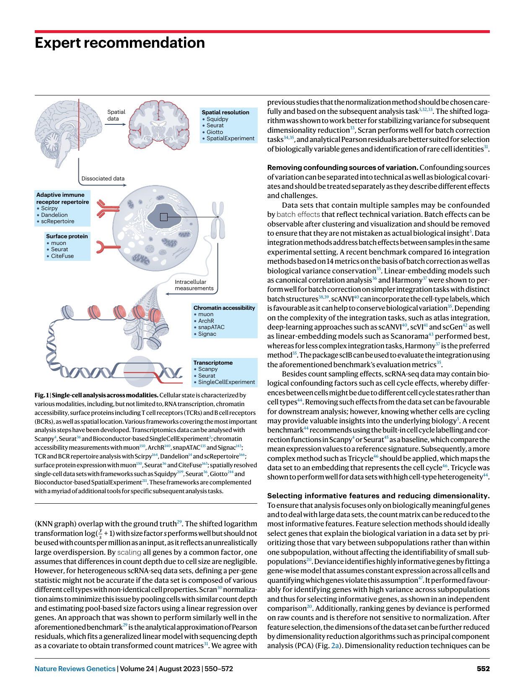
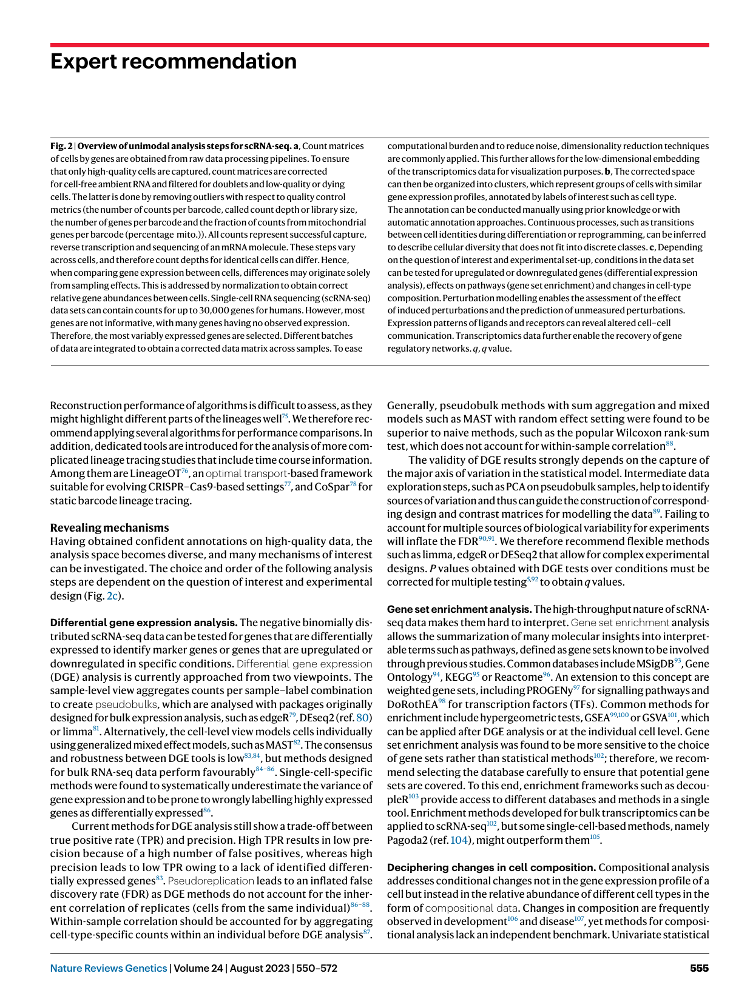
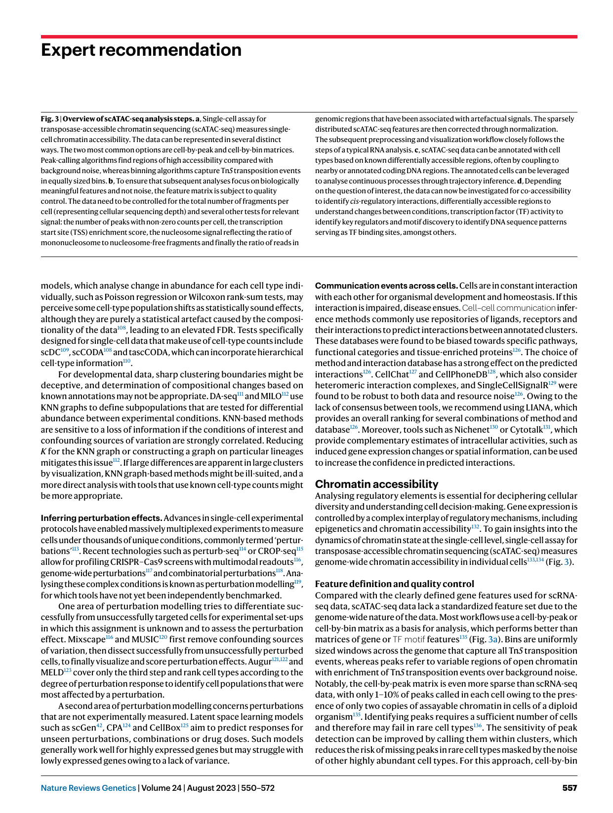
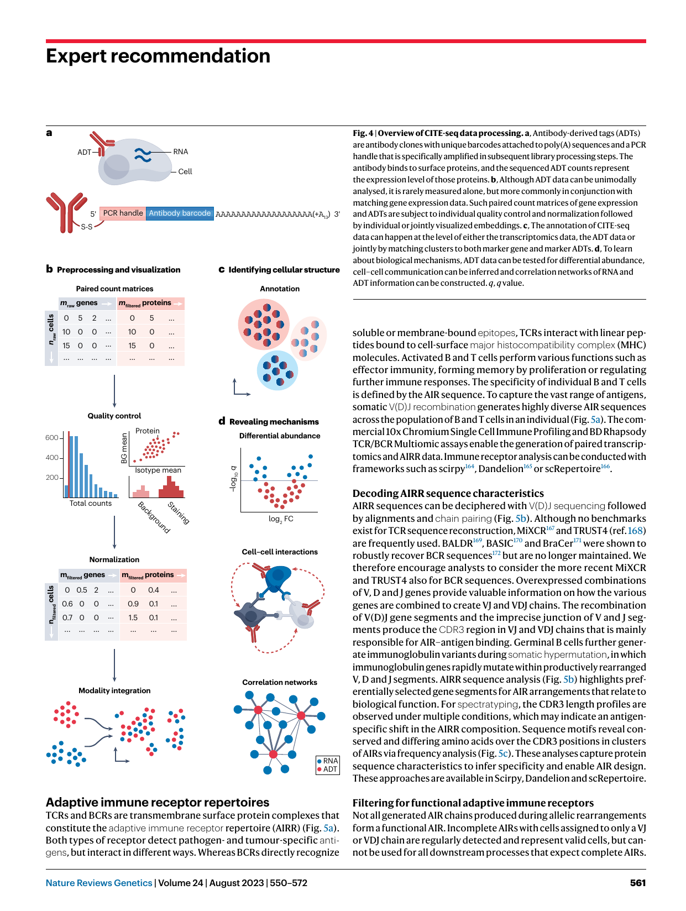
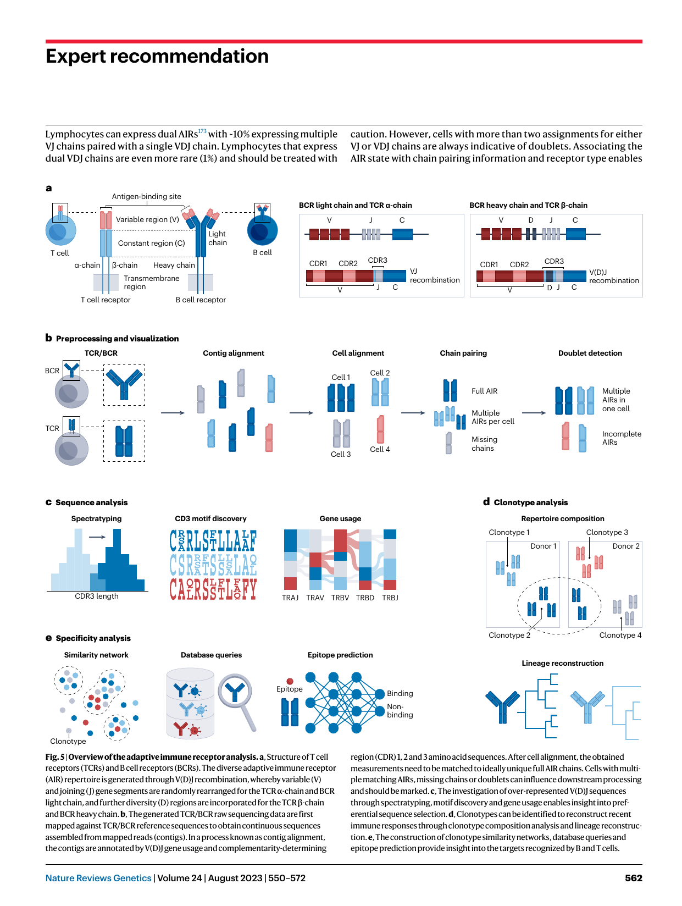
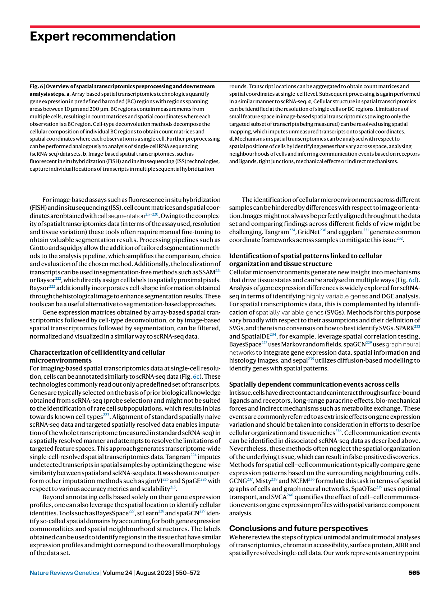

https://doi.org/10.1038/s41576-023-00586-w 

Check for updates 

### **nature reviews** genetics 

##### **Expert recommendation** 

# Best practices for single-cell analysis across modalities 

**Lukas Heumos****1,2,3,28** **, Anna C. Schaar****1,4,5,28** **, Christopher Lance****1,6** **, Anastasia Litinetskaya****1,4** **, Felix Drost****1,3** **, Luke Zappia****1,4** **, Malte D. Lücken****1,7** **, Daniel C. Strobl****1,3,8,9** **, Juan Henao****1** **, Fabiola Curion****1,4** **, Single-cell Best Practices Consortium*, Herbert B. Schiller****2** **& Fabian J. Theis****1,3,4,5** 

##### **Abstract** 

##### **Sections** 

Recent advances in single-cell technologies have enabled highthroughput molecular profiling of cells across modalities and locations. Single-cell transcriptomics data can now be complemented by chromatin accessibility, surface protein expression, adaptive immune receptor repertoire profiling and spatial information. The increasing availability of single-cell data across modalities has motivated the development of novel computational methods to help analysts derive biological insights. As the field grows, it becomes increasingly difficult to navigate the vast landscape of tools and analysis steps. Here, we summarize independent benchmarking studies of unimodal and multimodal single-cell analysis across modalities to suggest comprehensive best-practice workflows for the most common analysis steps. Where independent benchmarks are not available, we review and contrast popular methods. Our article serves as an entry point for novices in the field of single-cell (multi-)omic analysis and guides advanced users to the most recent best practices. 

Introduction 

Transcriptome 

Chromatin accessibility 

Surface protein expression Adaptive immune receptor repertoires 

Single-cell data resolved in space 

Conclusions and future perspectives 

> 1Institute of Computational Biology, Department of Computational Health, Helmholtz Munich, Munich, Germany. 

> 2Institute of Lung Health and Immunity and Comprehensive Pneumology Center, Helmholtz Munich; Member of the German Center for Lung Research (DZL), Munich, Germany.3 TUM School of Life Sciences Weihenstephan, Technical University of Munich, Munich, Germany.4 Department of Mathematics, School of Computation, Information and Technology, Technical University of Munich, Garching, Germany.5 Munich Center for Machine Learning, Technical University of Munich, Garching, Germany.6 Department of Paediatrics, Dr von Hauner Children’s Hospital, University Hospital, Ludwig-Maximilians-Universität München, Munich, Germany.7 Institute of Lung Health and Immunity, Helmholtz Munich, Munich, Germany.8 Institute of Clinical Chemistry and Pathobiochemistry, School of Medicine, Technical University of Munich, Munich, Germany.9 TranslaTUM, Center for Translational Cancer Research, Technical University of Munich, Munich, Germany.28 These authors contributed equally: Lukas Heumos, Anna C. Schaar. *A list of authors and their affiliations appears at the end of the paper. e-mail: fabian.theis@helmholtz-muenchen.de 

Nature Reviews Genetics | Volume 24 | August 2023 | 550–572 

**550** 

## **Expert recommendation** 

#### **Introduction** 

Single-cell RNA sequencing (scRNA-seq) technologies have revolution- ized molecular biology by enabling the measurement of transcrip tome profiles at unprecedented scale and resolution. Advancements in experimental technology have motivated large-scale innovation in computational methods, leading to more than 1,400 tools currently being available to analyse scRNA-seq data1 . Computational frameworks and software repositories, such as Bioconductor2 , Seurat3 and Scanpy4 , complemented by method benchmarks and best-practice workflows2,5,6 have allowed data analysts to navigate this space and build analysis pipelines. This interplay of experimental and computational innovation has enabled biological landmark discoveries that uncover tissue cellular heterogeneity7,8 . 

However, scRNA-seq captures only one layer of the complex regulatory machinery that governs cellular function and signalling. To complement this, considerable efforts have been made to measure other modalities at single-cell resolution, including chromatin accessibility9 , surface proteins10 , T cell receptor (TCR)/B cell receptor (BCR) repertoires11 and spatial location12 , enabling findings such as type 2 diabetes mellitus regulatory signatures13 , dysregulated response of the innate14 and adaptive15 immune system against severe acute respiratory syndrome coronavirus 2 (SARS-CoV-2) and better understanding of immunosuppressive effects of the tumour microenvironment at spatial resolution16 . Experimental innovation has led to the development of many new computational tools for various single-cell omic modalities, yet a lack of best-practice workflows makes navigation of the vast landscape of novel tools challenging. Moreover, although computational best practices and tool recommendations have previously been outlined for scRNA-seq2,5,6,17 , they are either outdated or incomplete. 

Here, we guide the reader through the various steps of unimodal as well as multimodal single-cell data analysis and discuss analysis pitfalls and recommendations (Fig. 1). Where best practices cannot be determined owing to the novelty of tools or lack of independent benchmarks, we list popular tools and community recommendations. We organize the article into modality-specific sections and groups of analysis steps instead of a single workflow, which in modern single-cell analysis rarely exists anymore owing to the diversity of tasks. For further reading, we provide a more extensive and regularly updated (but not peer-reviewed) Single-Cell Best Practices online book with more than 50 chapters including detailed code examples, analysis templates as well as an assessment of computational requirements. 

#### **Transcriptome** 

scRNA-seq measures the abundance of mRNA molecules per cell. Extracted biological tissue samples constitute the input for singlecell experiments. Tissues are digested during single-cell dissociation, followed by single-cell isolation to profile the mRNA per cell separately. Plate-based protocols isolate cells into wells on a plate, whereas dropletbased methods capture cells in microfluidic droplets18 . In this article, we focus on droplet-based assays owing to their popularity. 

The obtained mRNA sequence reads are mapped to genes and cells of origin in raw data processing pipelines that use either cellular barcodes or unique molecular identifiers (UMIs) and a reference genome to produce a count matrix of cells by genes (Fig. 2a). For a detailed comparison of various raw data processing tools, we refer to Lafzi et al.19 and consider count matrices as the starting point for our analysis workflow of unimodal scRNA-seq data. 

###### **From raw count matrices to high-quality cellular data** 

Advances in scRNA-seq led to high-quality runs with high throughputs. However, scRNA-seq data sets contain systematic and random noise (such as from poor-quality cells) that obscures the biological signal. Preprocessing of scRNA-seq data attempts to remove these confounding sources of variation. This involves quality control, normalization, data correction and feature selection (Fig. 2a). 

**Filtering low-quality cells and noise correction.** Most analysis tasks assume that each droplet contains RNA from an intact single cell. This assumption is commonly violated through low-quality cells, contamination from cell-free RNA or the capture of multiple cells (Fig. 2a). Cells with a low number of detected genes, a low count depth and a high fraction of mitochondrial counts are typically termed low-quality cells as they can represent dying cells with broken membranes. Low-quality cells are identified and filtered by manually setting thresholds as recommended in a previous guide5 or sample-wise automatic filtering based on the number of median absolute deviations20 . These metrics are considered jointly to prevent the misinterpretation of cellular signals5 . Quality control is performed at the sample level as thresholds can vary substantially between samples. 

Cell-free RNA can be present in the cell solution and will be assigned to a cell’s native RNA during library construction. Ambient RNA contamination can lead to cell-type-specific marker gene transcripts being detectable also in other cell populations, which can blend different cell populations together21 . Popular methods such as SoupX estimate the cell-specific contamination fraction on the basis of the expression profiles of otherwise ‘empty’ droplets and cell clusters in the data set21 . CellBender formulates the removal of ambient RNA as an unsupervised Bayesian model that requires no prior knowledge of cell-type-specific gene expression profiles22 . Even in the absence of a systematic benchmark, one should consider removing ambient RNA as an initial analysis step in quality control to improve downstream analyses for many tissues21–23 . 

Empty droplets and doublets (droplets containing two cells) violate the assumption that each droplet contains a single cell. Doublets formed by different cell types (heterotypic doublets) are hard to annotate and can lead to wrong cell-type labels. Common doublet detection methods generate artificial doublets by combining two randomly sampled cells and comparing them against measured cells. scDblFinder24 leverages this idea and can additionally be combined with prior knowledge on known doublets. Several benchmarks have highlighted that scDblFinder outperforms other methods in terms of doublet detection accuracy and computational efficiency25–27 . Additionally, it can be beneficial to apply multiple doublet detection methods and compare the results to increase the accuracy of doublet detection27 . 

The selected quality control strategy often needs to be reassessed during downstream analysis when low-quality cells and doublets cluster together. We therefore recommend setting permissive thresholds initially and potentially removing more cells as necessary during (re-) analysis. 

**Normalization and variance stabilization.** Cells can have different numbers of gene counts owing to differences in mRNA-containing volume (cell size) or purely randomly during sequencing. Count normalization makes cellular profiles comparable. Subsequent variance stabilization ensures that outlier profiles have limited effect on the overall data structure28 (Fig. 2a). A recent benchmark compared 22 transformations for single-cell data based on the _K_ nearest-neighbours graph 

Nature Reviews Genetics | Volume 24 | August 2023 | 550–572 

**551** 

## **Expert recommendation** 

**Fig. 1 | Single-cell analysis across modalities.** Cellular state is characterized by various modalities, including, but not limited to, RNA transcription, chromatin accessibility, surface proteins including T cell receptors (TCRs) and B cell receptors (BCRs), as well as spatial location. Various frameworks covering the most important analysis steps have been developed. Transcriptomics data can be analysed with Scanpy4 , Seurat36 and Bioconductor-based SingleCellExperiment2 ; chromatin accessibility measurements with muon150 , ArchR140 , snapATAC135 and Signac143 ; TCR and BCR repertoire analysis with Scirpy164 , Dandelion14 and scRepertoire166 ; surface protein expression with muon150 , Seurat36 and CiteFuse163 ; spatially resolved single-cell data sets with frameworks such as Squidpy209 , Seurat36 , Giotto244 and Bioconductor-based SpatialExperiment211 . These frameworks are complemented with a myriad of additional tools for specific subsequent analysis tasks. 

(KNN graph) overlap with the ground truth29 . The shifted logarithm transformation log( _<u>ys</u>_ + 1) with size factor _s_ performs well but should not be used with counts per million as an input, as it reflects an unrealistically large overdispersion. By scaling all genes by a common factor, one assumes that differences in count depth due to cell size are negligible. However, for heterogeneous scRNA-seq data sets, defining a per-gene statistic might not be accurate if the data set is composed of various different cell types with non-identical cell properties. Scran30 normalization aims to minimize this issue by pooling cells with similar count depth and estimating pool-based size factors using a linear regression over genes. An approach that was shown to perform similarly well in the aforementioned benchmark29 is the analytical approximation of Pearson residuals, which fits a generalized linear model with sequencing depth as a covariate to obtain transformed count matrices31 . We agree with 

previous studies that the normalization method should be chosen carefully and based on the subsequent analysis task5,32,33 . The shifted logarithm was shown to work better for stabilizing variance for subsequent dimensionality reduction33 , Scran performs well for batch correction tasks34,35 , and analytical Pearson residuals are better suited for selection of biologically variable genes and identification of rare cell identities31 . 

**Removing confounding sources of variation.** Confounding sources of variation can be separated into technical as well as biological covariates and should be treated separately as they describe different effects and challenges. 

Data sets that contain multiple samples may be confounded by batch effects that reflect technical variation. Batch effects can be observable after clustering and visualization and should be removed to ensure that they are not mistaken as actual biological insight5 . Data integration methods address batch effects between samples in the same experimental setting. A recent benchmark compared 16 integration methods based on 14 metrics on the basis of batch correction as well as biological variance conservation35 . Linear-embedding models such as canonical correlation analysis36 and Harmony37 were shown to perform well for batch correction on simpler integration tasks with distinct batch structures38,39 . scANVI40 can incorporate the cell-type labels, which is favourable as it can help to conserve biological variation35 . Depending on the complexity of the integration tasks, such as atlas integration, deep-learning approaches such as scANVI40 , scVI41 and scGen42 as well as linear-embedding models such as Scanorama43 performed best, whereas for less complex integration tasks, Harmony37 is the preferred method35 . The package scIB can be used to evaluate the integration using the aforementioned benchmark’s evaluation metrics35 . 

Besides count sampling effects, scRNA-seq data may contain biological confounding factors such as cell cycle effects, whereby differences between cells might be due to different cell cycle states rather than cell types44 . Removing such effects from the data set can be favourable for downstream analysis; however, knowing whether cells are cycling may provide valuable insights into the underlying biology5 . A recent benchmark44 recommends using the built-in cell cycle labelling and correction functions in Scanpy4 or Seurat45 as a baseline, which compare the mean expression values to a reference signature. Subsequently, a more complex method such as Tricycle46 should be applied, which maps the data set to an embedding that represents the cell cycle46 . Tricycle was shown to perform well for data sets with high cell-type heterogeneity44 . 

**Selecting informative features and reducing dimensionality.** To ensure that analysis focuses only on biologically meaningful genes and to deal with large data sets, the count matrix can be reduced to the most informative features. Feature selection methods should ideally select genes that explain the biological variation in a data set by prioritizing those that vary between subpopulations rather than within one subpopulation, without affecting the identifiability of small subpopulations20 . Deviance identifies highly informative genes by fitting a gene-wise model that assumes constant expression across all cells and quantifying which genes violate this assumption47 . It performed favourably for identifying genes with high variance across subpopulations and thus for selecting informative genes, as shown in an independent comparison20 . Additionally, ranking genes by deviance is performed on raw counts and is therefore not sensitive to normalization. After feature selection, the dimensions of the data set can be further reduced by dimensionality reduction algorithms such as principal component analysis (PCA) (Fig. 2a). Dimensionality reduction techniques can be 

Nature Reviews Genetics | Volume 24 | August 2023 | 550–572 

**552** 

## **Expert recommendation** 

used for either visualization or summarization of the underlying data topology. On the basis of other studies, PCA can be used for data summarization and t-SNE, UMAP and PHATE for more flexible visualization of scRNA-seq data5,48 . Notably, a recent study showed that relying only on 2D embeddings can lead to misinterpretation of the relationships between cells, and results should not be formulated only on the basis of visual inspection of these representations, but should be combined with quantitative assessments49 . 

###### **From clusters to cell identities** 

After preprocessing, unwanted effects have been removed from the data set and the signal-to-noise ratio improved. Thus, one can now start asking biologically relevant questions. As a next analysis milestone, different cellular populations can be identified to further guide and structure the analysis (Fig. 2b). 

**From single cells to clusters.** The first step towards identifying cellular populations is to cluster cells into groups with similar expression profiles that explain the heterogeneity in the data. Independent benchmarks5,50,51 showed that community detection based on graph modularity optimization via the Louvain algorithm works best for cluster identification. However, the Louvain algorithm can lead to arbitrarily poorly connected communities52 . Louvain’s successor Leiden circumvents this issue by yielding guaranteed connected communities and is computationally more efficient52 . Both methods are applied to the KNN graph computed on a low-dimensional representation of the data and can be run at different resolutions to control the number of identified clusters. We recommend using the Leiden algorithm at different resolutions to obtain an ideal clustering for annotating cells5 . 

**Mapping cell clusters to cell identities.** Annotation is the process of giving detected cell clusters a biological interpretation such as cell type (Fig. 2b). It can be performed with manual or automatic approaches. A three-step approach is recommended that leverages automated annotation, followed by expert manual annotation and a last step of verification to obtain the ideal annotation result53 . The first step, automated cell-type annotation, can be separated into classifier-based methods and reference mapping. Annotation results obtained with pre-trained classifiers are strongly affected by the classifier type and the quality of the training data used to create the classifier54,55 . Furthermore, it can be difficult to assess the resulting annotation without additionally inspecting individual markers. Examples of classifiers that are trained on previously annotated data sets or atlases and that consider a large set of genes are CellTypist56 and Clustifyr57 . The second group of automated annotation approaches is mapping to existing, annotated single-cell references and performing label transfer on the resulting joint embedding. References can be either individual samples of the data set or, ideally, well-curated existing atlases. Query-to-reference mapping can then be performed with methods such as scArches58 , Symphony59 or Azimuth3 . Similar to classifier-based approaches, the quality of the transferred annotations depends on the quality of the reference data, the model and the suitability to the data set. The second step, manual annotation, leverages gene signatures of each cluster to annotate cell clusters. These gene signatures are commonly known as marker genes and can be identified using simple differential expression testing approaches such as _t_ -tests or Wilcoxon rank-sum tests. The statistical test is applied to two groups of clusters to find genes that are upregulated or downregulated in a cluster of interest. For this purpose, Wilcoxon rank-sum tests performed best, but 

owing to the nature of clustering, _P_ values can be inflated and might lead to false discoveries, as the same data are used to define the labels that we test for differences between60,61 . The obtained markers are then compared with marker genes from well-annotated references to annotate cell clusters. As a last step, the annotation should be verified by experts, especially for data sets with high complexity or studies that involve rare cell subpopulations for which references might not be available53 . 

**From discrete states to continuous processes.** In non-stationary, biological processes such as differentiation, cells traverse a continuous space of cellular states. Using single-cell data to understand cell fate — and genes regulating it in this landscape — is challenging as measurements are only snapshots. The underlying trajectories can be cyclic, linear, a tree or, most generally, a graph. Models that order cells along a trajectory based on similarities in their expression patterns are known as trajectory inference or pseudotime analysis methods. The performance of trajectory inference approaches depends on the type of trajectory present in the data set. Although Slingshot62 performed better for simple topologies, PAGA63 and RaceID/StemID64 scored better for complex trajectories65 . We therefore recommend using _dyn_ guidelines to select an applicable method65 . When the expected topology is unknown, trajectories and downstream hypotheses should be confirmed by multiple trajectory inference methods using different underlying assumptions. Inferred trajectories might not necessarily have biological meaning5 . Incorporating more complex methods and sources of information through, for example, RNA velocity measurements, can be beneficial to recover further evidence of actual biological processes. 

To infer dynamic, directed information, velocyto66 and scVelo67 model splicing kinetics using unspliced and spliced reads to infer RNA velocity: if a gene is being activated, unspliced RNA precedes the spliced RNA, which can be visualized in the phase portrait67 . Obtained RNA velocity fields serve as input for CellRank68 to estimate cellular fates. RNA velocity inference assumes gene independence and constant rates of transcription, splicing and degradation. Under the assumption of constant rates, phase portraits form an almond shape with induction (upper half/arc) and repression (lower half/arc) phases. We therefore recommend checking whether the model assumptions hold by examining phase portraits of genes with high likelihoods determined by the dynamic model of scVelo. If phase portraits lack the expected shape, RNA velocity may be inferred incorrectly. Moreover, if a gene includes multiple, pronounced kinetics, lineage-specific models are more appropriate69 . Cases in which RNA velocity is inferred incorrectly include the presence of transcriptional bursts70,71 . Additionally, steady-state populations pose further challenges where RNA velocity infers erroneous directions between independent, terminal cell populations70,71 . 

Although pseudotime-based methods do not have any timescale limitations as long as the process is covered in sufficiently fine-grained steps, RNA velocity cannot cover all time scales. As it is splicing kinetics that are modelled, the observed process must also occur during this time frame70 . 

Retrospective experimental lineage tracing approaches use variability observed in cells, such as naturally occurring genetic mutations, to infer a model of their lineage, summarizing the cell division history in a clonal population. Analysis of lineage tracing data can be conducted with Cassiopeia72 , which implements several reconstruction algorithms including classic approaches such as UPGMA73 or neighbour joining74 as well as newer approaches for CRISPR–Cas9 lineage tracing data. 

Nature Reviews Genetics | Volume 24 | August 2023 | 550–572 

**553** 

## **Expert recommendation** 

Nature Reviews Genetics | Volume 24 | August 2023 | 550–572 

**554** 

## **Expert recommendation** 

**Fig. 2 | Overview of unimodal analysis steps for scRNA-seq. a** , Count matrices of cells by genes are obtained from raw data processing pipelines. To ensure that only high-quality cells are captured, count matrices are corrected for cell-free ambient RNA and filtered for doublets and low-quality or dying cells. The latter is done by removing outliers with respect to quality control metrics (the number of counts per barcode, called count depth or library size, the number of genes per barcode and the fraction of counts from mitochondrial genes per barcode (percentage  mito.)). All counts represent successful capture, reverse transcription and sequencing of an mRNA molecule. These steps vary across cells, and therefore count depths for identical cells can differ. Hence, when comparing gene expression between cells, differences may originate solely from sampling effects. This is addressed by normalization to obtain correct relative gene abundances between cells. Single-cell RNA sequencing (scRNA-seq) data sets can contain counts for up to 30,000 genes for humans. However, most genes are not informative, with many genes having no observed expression. Therefore, the most variably expressed genes are selected. Different batches of data are integrated to obtain a corrected data matrix across samples. To ease 

Reconstruction performance of algorithms is difficult to assess, as they might highlight different parts of the lineages well75 . We therefore recommend applying several algorithms for performance comparisons. In addition, dedicated tools are introduced for the analysis of more complicated lineage tracing studies that include time course information. Among them are LineageOT76 , an optimal transport-based framework suitable for evolving CRISPR–Cas9-based settings77 , and CoSpar78 for static barcode lineage tracing. 

###### **Revealing mechanisms** 

Having obtained confident annotations on high-quality data, the analysis space becomes diverse, and many mechanisms of interest can be investigated. The choice and order of the following analysis steps are dependent on the question of interest and experimental design (Fig. 2c). 

**Differential gene expression analysis.** The negative binomially distributed scRNA-seq data can be tested for genes that are differentially expressed to identify marker genes or genes that are upregulated or downregulated in specific conditions. Differential gene expression (DGE) analysis is currently approached from two viewpoints. The sample-level view aggregates counts per sample–label combination to create pseudobulks, which are analysed with packages originally designed for bulk expression analysis, such as edgeR79 , DEseq2 (ref. 80) or limma81 . Alternatively, the cell-level view models cells individually using generalized mixed effect models, such as MAST82 . The consensus and robustness between DGE tools is low83,84 , but methods designed for bulk RNA-seq data perform favourably84–86 . Single-cell-specific methods were found to systematically underestimate the variance of gene expression and to be prone to wrongly labelling highly expressed genes as differentially expressed86 . 

Current methods for DGE analysis still show a trade-off between true positive rate (TPR) and precision. High TPR results in low precision because of a high number of false positives, whereas high precision leads to low TPR owing to a lack of identified differentially expressed genes83 . Pseudoreplication leads to an inflated false discovery rate (FDR) as DGE methods do not account for the inherent correlation of replicates (cells from the same individual)86–88 . Within-sample correlation should be accounted for by aggregating cell-type-specific counts within an individual before DGE analysis87 . 

computational burden and to reduce noise, dimensionality reduction techniques are commonly applied. This further allows for the low-dimensional embedding of the transcriptomics data for visualization purposes. **b** , The corrected space can then be organized into clusters, which represent groups of cells with similar gene expression profiles, annotated by labels of interest such as cell type. The annotation can be conducted manually using prior knowledge or with automatic annotation approaches. Continuous processes, such as transitions between cell identities during differentiation or reprogramming, can be inferred to describe cellular diversity that does not fit into discrete classes. **c** , Depending on the question of interest and experimental set-up, conditions in the data set can be tested for upregulated or downregulated genes (differential expression analysis), effects on pathways (gene set enrichment) and changes in cell-type composition. Perturbation modelling enables the assessment of the effect of induced perturbations and the prediction of unmeasured perturbations. Expression patterns of ligands and receptors can reveal altered cell–cell communication. Transcriptomics data further enable the recovery of gene regulatory networks. _q_ , _q_ value. 

Generally, pseudobulk methods with sum aggregation and mixed models such as MAST with random effect setting were found to be superior to naive methods, such as the popular Wilcoxon rank-sum test, which does not account for within-sample correlation88 . 

The validity of DGE results strongly depends on the capture of the major axis of variation in the statistical model. Intermediate data exploration steps, such as PCA on pseudobulk samples, help to identify sources of variation and thus can guide the construction of corresponding design and contrast matrices for modelling the data89 . Failing to account for multiple sources of biological variability for experiments will inflate the FDR90,91 . We therefore recommend flexible methods such as limma, edgeR or DESeq2 that allow for complex experimental designs. _P_ values obtained with DGE tests over conditions must be corrected for multiple testing5,92 to obtain _q_ values. 

**Gene set enrichment analysis.** The high-throughput nature of scRNAseq data makes them hard to interpret. Gene set enrichment analysis allows the summarization of many molecular insights into interpretable terms such as pathways, defined as gene sets known to be involved through previous studies. Common databases include MSigDB93 , Gene Ontology94 , KEGG95 or Reactome96 . An extension to this concept are weighted gene sets, including PROGENy97 for signalling pathways and DoRothEA98 for transcription factors (TFs). Common methods for enrichment include hypergeometric tests, GSEA99,100 or GSVA101 , which can be applied after DGE analysis or at the individual cell level. Gene set enrichment analysis was found to be more sensitive to the choice of gene sets rather than statistical methods102 ; therefore, we recommend selecting the database carefully to ensure that potential gene sets are covered. To this end, enrichment frameworks such as decoupleR103 provide access to different databases and methods in a single tool. Enrichment methods developed for bulk transcriptomics can be applied to scRNA-seq102 , but some single-cell-based methods, namely Pagoda2 (ref. 104), might outperform them105 . 

**Deciphering changes in cell composition.** Compositional analysis addresses conditional changes not in the gene expression profile of a cell but instead in the relative abundance of different cell types in the form of compositional data. Changes in composition are frequently observed in development106 and disease107 , yet methods for compositional analysis lack an independent benchmark. Univariate statistical 

Nature Reviews Genetics | Volume 24 | August 2023 | 550–572 

**555** 

## **Expert recommendation** 

Nature Reviews Genetics | Volume 24 | August 2023 | 550–572 

**556** 

## **Expert recommendation** 

**Fig. 3 | Overview of scATAC-seq analysis steps. a** , Single-cell assay for transposase-accessible chromatin sequencing (scATAC-seq) measures singlecell chromatin accessibility. The data can be represented in several distinct ways. The two most common options are cell-by-peak and cell-by-bin matrices. Peak-calling algorithms find regions of high accessibility compared with background noise, whereas binning algorithms capture Tn _5_ transposition events in equally sized bins. **b** , To ensure that subsequent analyses focus on biologically meaningful features and not noise, the feature matrix is subject to quality control. The data need to be controlled for the total number of fragments per cell (representing cellular sequencing depth) and several other tests for relevant signal: the number of peaks with non-zero counts per cell, the transcription start site (TSS) enrichment score, the nucleosome signal reflecting the ratio of mononucleosome to nucleosome-free fragments and finally the ratio of reads in 

- models, which analyse change in abundance for each cell type indi vidually, such as Poisson regression or Wilcoxon rank-sum tests, may perceive some cell-type population shifts as statistically sound effects, although they are purely a statistical artefact caused by the compositionality of the data108 , leading to an elevated FDR. Tests specifically designed for single-cell data that make use of cell-type counts include scDC109 , scCODA108 and tascCODA, which can incorporate hierarchical cell-type information110 . 

For developmental data, sharp clustering boundaries might be deceptive, and determination of compositional changes based on known annotations may not be appropriate. DA-seq111 and MILO112 use KNN graphs to define subpopulations that are tested for differential abundance between experimental conditions. KNN-based methods are sensitive to a loss of information if the conditions of interest and confounding sources of variation are strongly correlated. Reducing _K_ for the KNN graph or constructing a graph on particular lineages mitigates this issue112 . If large differences are apparent in large clusters by visualization, KNN graph-based methods might be ill-suited, and a more direct analysis with tools that use known cell-type counts might be more appropriate. 

**Inferring perturbation effects.** Advances in single-cell experimental protocols have enabled massively multiplexed experiments to measure cells under thousands of unique conditions, commonly termed ‘perturbations’113 . Recent technologies such as perturb-seq114 or CROP-seq115 allow for profiling CRISPR–Cas9 screens with multimodal readouts116 , genome-wide perturbations117 and combinatorial perturbations118 . Analysing these complex conditions is known as perturbation modelling119 , for which tools have not yet been independently benchmarked. 

One area of perturbation modelling tries to differentiate successfully from unsuccessfully targeted cells for experimental set-ups in which this assignment is unknown and to assess the perturbation effect. Mixscape116 and MUSIC120 first remove confounding sources of variation, then dissect successfully from unsuccessfully perturbed cells, to finally visualize and score perturbation effects. Augur121,122 and MELD123 cover only the third step and rank cell types according to the degree of perturbation response to identify cell populations that were most affected by a perturbation. 

A second area of perturbation modelling concerns perturbations that are not experimentally measured. Latent space learning models such as scGen42 , CPA124 and CellBox125 aim to predict responses for unseen perturbations, combinations or drug doses. Such models generally work well for highly expressed genes but may struggle with lowly expressed genes owing to a lack of variance. 

genomic regions that have been associated with artefactual signals. The sparsely distributed scATAC-seq features are then corrected through normalization. The subsequent preprocessing and visualization workflow closely follows the steps of a typical RNA analysis. **c** , scATAC-seq data can be annotated with cell types based on known differentially accessible regions, often by coupling to nearby or annotated coding DNA regions. The annotated cells can be leveraged to analyse continuous processes through trajectory inference. **d** , Depending on the question of interest, the data can now be investigated for co-accessibility to identify _cis_ -regulatory interactions, differentially accessible regions to understand changes between conditions, transcription factor (TF) activity to identify key regulators and motif discovery to identify DNA sequence patterns serving as TF binding sites, amongst others. 

**Communication events across cells.** Cells are in constant interaction with each other for organismal development and homeostasis. If this interaction is impaired, disease ensues. Cell–cell communication inference methods commonly use repositories of ligands, receptors and their interactions to predict interactions between annotated clusters. These databases were found to be biased towards specific pathways, functional categories and tissue-enriched proteins126 . The choice of method and interaction database has a strong effect on the predicted interactions126 . CellChat127 and CellPhoneDB128 , which also consider heteromeric interaction complexes, and SingleCellSignalR129 were found to be robust to both data and resource noise126 . Owing to the lack of consensus between tools, we recommend using LIANA, which provides an overall ranking for several combinations of method and database126 . Moreover, tools such as Nichenet130 or Cytotalk131 , which provide complementary estimates of intracellular activities, such as induced gene expression changes or spatial information, can be used to increase the confidence in predicted interactions. 

#### **Chromatin accessibility** 

Analysing regulatory elements is essential for deciphering cellular diversity and understanding cell decision-making. Gene expression is controlled by a complex interplay of regulatory mechanisms, including epigenetics and chromatin accessibility132 . To gain insights into the dynamics of chromatin state at the single-cell level, single-cell assay for transposase-accessible chromatin sequencing (scATAC-seq) measures genome-wide chromatin accessibility in individual cells133,134 (Fig. 3). 

###### **Feature definition and quality control** 

Compared with the clearly defined gene features used for scRNAseq data, scATAC-seq data lack a standardized feature set due to the genome-wide nature of the data. Most workflows use a cell-by-peak or cell-by-bin matrix as a basis for analysis, which performs better than matrices of gene or TF motif features135 (Fig. 3a). Bins are uniformly sized windows across the genome that capture all Tn _5_ transposition events, whereas peaks refer to variable regions of open chromatin with enrichment of Tn _5_ transposition events over background noise. Notably, the cell-by-peak matrix is even more sparse than scRNA-seq data, with only 1–10% of peaks called in each cell owing to the presence of only two copies of assayable chromatin in cells of a diploid organism135 . Identifying peaks requires a sufficient number of cells and therefore may fail in rare cell types136 . The sensitivity of peak detection can be improved by calling them within clusters, which reduces the risk of missing peaks in rare cell types masked by the noise of other highly abundant cell types. For this approach, cell-by-bin 

Nature Reviews Genetics | Volume 24 | August 2023 | 550–572 

**557** 

## **Expert recommendation** 

matrices that do not rule out genomic regions serve as a basis for clustering136 . 

The most common entry point of scATAC-seq quality control is fragment files that contain all sequenced DNA fragments generated by two adjacent Tn _5_ transposition events. These are used to calculate a set of scATAC-seq-specific quality metrics to determine low-quality cells (Fig. 3b). Comparable to sequencing depth in scRNA-seq data, the total number of sequenced fragments per cell, the log total number of fragments and the transcription start site (TSS) enrichment score (a metric that captures the signal-to-noise ratio in each cell based on generally more open promoter regions compared with non-promoter regions) are examined. Low-quality cells often form a cluster combining low counts and low TSS enrichment scores that should be removed137 . Additionally, the nucleosome signal is used to evaluate the fragment length distribution137 . It is further recommended to verify the ratio of reads mapped to genomic regions associated with artefactual signals138 . After peak calling, the number of detected features per cell is controlled with data set-dependent minimum thresholds. Moreover, low numbers of reads in peak versus non-peak regions are indicators for low signal-to-noise ratios similar to TSS scores9 . 

To score doublets, we suggest following the recommendation by Germain et al.24 to use two orthogonal methods specifically designed for scATAC-seq data and consider both scores in downstream analysis. The first method is an adjustment of scDblFinder that reduces correlated features into a small set to use the complete information while making count data more continuous24 . The second, AMULET139 , leverages the diploidy of the chromosomes and scores cells with an unexpectedly high number of positions with more than two counts as a doublet, which can further capture homotypic doublets139 . 

###### **Learning a low-dimensional representation** 

The sparse scATAC-seq data require normalization, analogous to scRNAseq. In scATAC-seq data, the most common normalization strategy is binarization of peaks136,140,141 . However, this may also remove biological information and therefore modelling of scATAC counts directly has been suggested142 . Dimensionality reduction methods based on latent semantic indexing (ArchR140 and Signac143 ), latent Dirichlet allocation (cisTopic141 ) and spectral embedding (snapATAC136 ) were shown to perform best for downstream clustering and cell annotation135 . Concerning batch correction, LIGER was shown to perform best for scATAC-seq data35 . Recently, deep-learning models such as PeakVI144 or MultiVI145 have been proposed for scATAC-seq data as combined dimensionality reduction and batch correction methods. After a corrected low-dimensional representation is obtained, we recommend Leiden clustering based on its good performance in scRNA-seq-derived representations. 

###### **Annotating cell identities based on accessible regions** 

Annotation of cell clusters can be performed on the basis of differentially accessible regions (DARs) and gene activity scores (Fig. 3c). DARs can be obtained by differential testing methods similar to scRNA-seq. Analogous differences in sequencing depth need to be accounted for by treating total counts as a confounder143 or by selecting a comparative group of bias-matched cells with respect to total count and potentially other quality control metrics such as the TSS score140 . Although the performance on scATAC-seq data has not been benchmarked yet, existing benchmarks on bulk ATAC-seq data recommend edgeR for the determination of DARs when sample size is limited and DESeq2 in the case of large sample sizes146 . DARs might contain informative sequence patterns such as known _cis_ -regulatory elements (CREs) or can 

- be linked to proximal genes, which is leveraged in functional enrich ment analysis tools such as GREAT147 , LOLA148 or GIGGLE149 . Chromatin accessibility of CREs associated with a gene can be summarized into an estimate of gene expression (gene activity scores). This can be achieved by summing up counts within genes and a certain distance upstream of the TSS136,143,150 . More complex models additionally integrate signals from distal regions either in a weighting-by-distance scheme140 or by integrating co-accessibility networks151 (Fig. 3d). To guide cell-type annotation, simple models are often sufficient, and visualization can be enhanced by smoothing gene activity scores among neighbouring cells, which is often performed using MAGIC152 . 

###### **Unravelling identities with TF motifs and footprinting** 

TF-motif enrichment facilitates the characterization of cell identity and can be conducted on a cluster level using a hypergeometric test on cluster-specific DARs140 . To obtain enrichment scores per cell, chromVAR can be used to calculate the deviation of accessibility across all motifcontaining peaks per cell while correcting for the insertion bias of the Tn _5_ transposase, which emerges from sequence binding preferences of the transposase153 . The TF markers facilitate cluster annotation and represent top candidates for regulatory proteins determining cell state. Once TFs of interest have been identified, scATAC-seq data allow for additional validation of the TF impact through footprinting, which indicates whether the TF is binding in the given cell cluster. To perform this analysis, clusterwise pseudobulks are generated to reduce sparsity, and the number of Tn _5_ insertions around the motif of interest is plotted140 . In the case of active binding of the TF in the given cell cluster, the binding site itself is protected from Tn _5_ transposition events while the nucleosomes in close proximity are displaced, resulting in a peak–valley–peak accessibility profile. As this profile is also affected by the Tn _5_ insertion bias, current footprinting tools often correct for this bias using a _k_ -mer model that estimates the bias by the number of cleavage sites within each _k_ -mer relative to the number of genome-wide occurrences140,143,154 . 

###### **Linking single-cell chromatin accessibility and transcriptomics** 

Assays such as the proprietary 10x Multiome, sci-CAR155 or scCAT-seq156 allow joint profiling of gene expression and chromatin accessibility. Current workflows use established methods for unimodal quality control and take the intersection of high-quality cells of all modalities for integrative analysis136,140,143 . Once high-quality cells are selected, a joint representation of cells capturing the variability of both modalities can be learned whereby confounding sources of variation are removed (Box 1). As no optimal method for this integration has been identified, we recommend performing unimodal analysis including cell-type annotation first. This enables evaluation of the joint representation by comparing updated clustering results with cell-type labels of the unimodal analysis. A high-quality multimodal representation then serves as input for most unimodal analysis methods including cell-type annotation, differential testing and trajectory analysis. 

Paired scRNA-seq and scATAC-seq data also enable the use of new joint methods to identify regulators of gene expression and cell states. To identify potential CREs, correlation-based methods are used to link peaks to genes within clusters of cells140,143,156 . This approach can be extended by inferring active TFs using SCENIC followed by matching the corresponding motifs with peak regions to add additional interpretability156 . To gain insights into whether the local or global chromatin landscape influences the expression of a gene in a specific cell state, the predictability of expression based on the local neighbourhood 

Nature Reviews Genetics | Volume 24 | August 2023 | 550–572 

**558** 

~~a~~ 

## **Expert recommendation** 

_(continued from previous page)_ of more than two modalities and is the winner of the NeurIPS 2021 multimodal single-cell data integration challenge252 . 

###### **Integrating joint and disjoint measurements: mosaic integration** 

Capture of several modalities from the same cell simultaneously is still challenging despite advancements in experimental assays. Profiling individual modalities on different populations of cells from the same biological sample is more common, leading to completely missing data matrices245 . The integration of data in such set-ups is known as ‘mosaic integration’, for which tools recently started to emerge (see the figure, part **c** ). Although totalVI and MultiVI can also be used for mosaic integration, they are both applicable only to CITE-seq and Multiome data, respectively. Alternative methods for all modality combinations are Stabmap253 , which traverses the shortest path along the mosaic topology by projecting all cells onto reference coordinates, and Multigrate254 , which leverages transfer learning to impute missing modalities. 

and the genome-wide chromatin states can be compared157 . Methods to infer gene regulatory networks leveraging both modalities, such as FigR154 or Pando158 , are currently being developed (Fig. 3d). 

###### **Query-to-reference mapping in a multimodal scenario** 

A recent development in the field is the advent of multi-omic reference data sets and therefore the possibility for unimodal and multimodal queries against multimodal references (see the figure, part **d** ). By applying supervised principal components analysis (PCA)255 to references built with WNN, single-cell RNA sequencing (scRNA-seq) query cells can be mapped onto multimodal references, visualized and annotated3 . Alternatively, Multigrate learns a joint latent space of paired and unpaired measurements. Combined with transfer learning, Multigrate can map unimodal and multimodal query data sets to multi-omic references while imputing missing modalities254 . The imputed modalities may pose further important sources of information. Bridge integration poses a third option that uses a multiomic data set as a molecular bridge to create a dictionary of cells that is used to reconstruct unimodal data sets that get transformed into a shared embedding256 . Although flexible, a disadvantage of bridge integration is the requirement for the bridge data set, which may not always be available. 

integration of ADT data across several studies can lead to strong batch effects that should be corrected for160 . 

###### **Accounting for ADT composition biases** 

#### **Surface protein expression** 

Transcription and chromatin accessibility are proxies for cellular state, activity and regulation. The actual generated products, the proteins, take on either intracellular or extracellular tasks, and a subset of proteins are presented on the cell surface. Surface protein expression helps with the identification of cell types such as haematopoietic cells of the immune system, the annotation of which is based on markers that are usually used in flow cytometry or mass cytometry experiments. They can be further used to validate specific genetically knocked-out genes using, for example, the aforementioned Mixscape pipeline. The most widely used protocols for combined scRNA-seq and surface protein profiling are CITE-seq10 and REAP-seq159 , with the main difference being the antibody-derived tags (ADTs) that are used to quantify surface protein expression levels (Fig. 4a). 

###### **Correcting ADT counts** 

Contrary to the negative binomial distribution of gene counts, ADT data are less sparse. For droplet-based assays, non-zero counts are commonly observed for ADTs owing to ambient contamination and nonspecific antibody binding. Most markers exhibit a bimodal distribution with a ‘negative’ (low count) peak for nonspecific antibody binding and a ‘positive’ peak that resembles enrichment of cell-surface proteins in specific cell types160 . Libraries with zero counts for all or most of the antibody panel should be removed; however, removing cells with a low total ADT count may remove cell types that do not express a specific set of proteins or express only a few2 . CITE-seq experiments can also contain isotype controls, which are non-target-specific antibodies that are used to measure nonspecific binding per cell (such as antibody aggregates). Large isotype counts can be detected in outlier cells, which should then be removed. Owing to these considerations, careful evaluation of individual quality control metrics should be carried out in the ADT modality, and joint measurements of RNA and ADTs should be quality controlled separately. As antibody efficacy is variable, the 

Cell characteristics can lead to heterogeneous capture efficiency that causes cell composition biases. Only cells expressing the targeted proteins result in increases in the tag count, which are possibly only particular cell types2 . This can be accounted for by normalizing using the centred log-ratio (CLR) transformation10 or denoised and scaled by background (DSB)161 . DSB uses background droplets that represent protein background noise to correct values in cells while removing cell-to-cell variation by combining isotype control levels with the specific background level of the respective cell. The authors of DSB found that this approach removes more noise owing to the availability of the background distribution in the raw counts161 . 

###### **Jointly analysing transcriptomics and ADT data** 

The unimodal downstream analysis of the ADT data follows a similar pipeline to unimodal RNA analysis where annotated clusters can be tested for differential abundance (Figs. 2b and 4b). However, ADT data provide the most insight when analysed jointly with other modalities such as transcriptomics measurements. After the respective preprocessing, joint embedding can be obtained with generally applicable multimodal integration tooling (Box 1) or the CITE-seq specific, deeplearning-based totalVI162 , which learns a joint probabilistic representation of paired measurements that also accounts for noise and technical biases, including batch effects per modality. An alternative approach is to use CiteFuse163 , which normalizes ADTs using CLR and combines both modality matrices with a similarity network fusion algorithm. The joint embedding can then be clustered using Leiden and annotated based on differentially expressed RNA and ADT using Wilcoxon rank-sum tests by comparing clusters against all other clusters163 (Fig. 4c). Both modalities can be used for downstream tasks such as the investigation of cell–cell communication in which the RNA expression of the ligand cluster and the protein expression of the receptor cluster are considered, or RNA and ADT correlation analysis (Fig. 4d) using CiteFuse. The obtained results are visualized on the joint embedding. 

Nature Reviews Genetics | Volume 24 | August 2023 | 550–572 

**560** 

## **Expert recommendation** 

#### **Adaptive immune receptor repertoires** 

TCRs and BCRs are transmembrane surface protein complexes that constitute the adaptive immune receptor repertoire (AIRR) (Fig. 5a). Both types of receptor detect pathogen- and tumour-specific antigens, but interact in different ways. Whereas BCRs directly recognize 

**Fig. 4 | Overview of CITE-seq data processing. a** , Antibody-derived tags (ADTs) are antibody clones with unique barcodes attached to poly(A) sequences and a PCR handle that is specifically amplified in subsequent library processing steps. The antibody binds to surface proteins, and the sequenced ADT counts represent the expression level of those proteins. **b** , Although ADT data can be unimodally analysed, it is rarely measured alone, but more commonly in conjunction with matching gene expression data. Such paired count matrices of gene expression and ADTs are subject to individual quality control and normalization followed by individual or jointly visualized embeddings. **c** , The annotation of CITE-seq data can happen at the level of either the transcriptomics data, the ADT data or jointly by matching clusters to both marker gene and marker ADTs. **d** , To learn about biological mechanisms, ADT data can be tested for differential abundance, cell–cell communication can be inferred and correlation networks of RNA and ADT information can be constructed. _q_ , _q_ value. 

soluble or membrane-bound epitopes, TCRs interact with linear peptides bound to cell-surface major histocompatibility complex (MHC) molecules. Activated B and T cells perform various functions such as effector immunity, forming memory by proliferation or regulating further immune responses. The specificity of individual B and T cells is defined by the AIR sequence. To capture the vast range of antigens, somatic V(D)J recombination generates highly diverse AIR sequences across the population of B and T cells in an individual (Fig. 5a). The commercial 10x Chromium Single Cell Immune Profiling and BD Rhapsody TCR/BCR Multiomic assays enable the generation of paired transcriptomics and AIRR data. Immune receptor analysis can be conducted with frameworks such as scirpy164 , Dandelion165 or scRepertoire166 . 

###### **Decoding AIRR sequence characteristics** 

AIRR sequences can be deciphered with V(D)J sequencing followed by alignments and chain pairing (Fig. 5b). Although no benchmarks exist for TCR sequence reconstruction, MiXCR167 and TRUST4 (ref. 168) are frequently used. BALDR169 , BASIC170 and BraCer171 were shown to robustly recover BCR sequences172 but are no longer maintained. We therefore encourage analysts to consider the more recent MiXCR and TRUST4 also for BCR sequences. Overexpressed combinations of V, D and J genes provide valuable information on how the various genes are combined to create VJ and VDJ chains. The recombination of V(D)J gene segments and the imprecise junction of V and J segments produce the CDR3 region in VJ and VDJ chains that is mainly responsible for AIR–antigen binding. Germinal B cells further generate immunoglobulin variants during somatic hypermutation, in which immunoglobulin genes rapidly mutate within productively rearranged V, D and J segments. AIRR sequence analysis (Fig. 5b) highlights preferentially selected gene segments for AIR arrangements that relate to biological function. For spectratyping, the CDR3 length profiles are observed under multiple conditions, which may indicate an antigenspecific shift in the AIRR composition. Sequence motifs reveal conserved and differing amino acids over the CDR3 positions in clusters of AIRs via frequency analysis (Fig. 5c). These analyses capture protein sequence characteristics to infer specificity and enable AIR design. These approaches are available in Scirpy, Dandelion and scRepertoire. 

###### **Filtering for functional adaptive immune receptors** 

Not all generated AIR chains produced during allelic rearrangements form a functional AIR. Incomplete AIRs with cells assigned to only a VJ or VDJ chain are regularly detected and represent valid cells, but cannot be used for all downstream processes that expect complete AIRs. 

Nature Reviews Genetics | Volume 24 | August 2023 | 550–572 

**561** 

## **Expert recommendation** 

Lymphocytes can express dual AIRs173 with ~10% expressing multiple VJ chains paired with a single VDJ chain. Lymphocytes that express dual VDJ chains are even more rare (1%) and should be treated with 

caution. However, cells with more than two assignments for either VJ or VDJ chains are always indicative of doublets. Associating the AIR state with chain pairing information and receptor type enables 

**Fig. 5 | Overview of the adaptive immune receptor analysis. a** , Structure of T cell receptors (TCRs) and B cell receptors (BCRs). The diverse adaptive immune receptor (AIR) repertoire is generated through V(D)J recombination, whereby variable (V) and joining (J) gene segments are randomly rearranged for the TCR α-chain and BCR light chain, and further diversity (D) regions are incorporated for the TCR β-chain and BCR heavy chain. **b** , The generated TCR/BCR raw sequencing data are first mapped against TCR/BCR reference sequences to obtain continuous sequences assembled from mapped reads (contigs). In a process known as contig alignment, the contigs are annotated by V(D)J gene usage and complementarity-determining 

region (CDR) 1, 2 and 3 amino acid sequences. After cell alignment, the obtained measurements need to be matched to ideally unique full AIR chains. Cells with multiple matching AIRs, missing chains or doublets can influence downstream processing and should be marked. **c** , The investigation of over-represented V(D)J sequences through spectratyping, motif discovery and gene usage enables insight into preferential sequence selection. **d** , Clonotypes can be identified to reconstruct recent immune responses through clonotype composition analysis and lineage reconstruction. **e** , The construction of clonotype similarity networks, database queries and epitope prediction provide insight into the targets recognized by B and T cells. 

Nature Reviews Genetics | Volume 24 | August 2023 | 550–572 

**562** 

## **Expert recommendation** 

task-specific AIR selection during downstream analysis to ensure that as much data as possible are used (Fig. 5b). For example, orphan VDJ chains can still be used for database queries based on CDR3-VDJ chains, but not for queries based on the full AIR. The distribution of chain pairings and receptor types can be visualized over groups such as samples or conditions, and outlier clusters with excessive quality issues should be removed. 

###### **Identifying and classifying clonotypes** 

Groups of T or B cells that are descended from the same ancestral cell form a clonotype and are generally in a dormant state until receiving an external signal or stimulation from autocrine agents. Hence, the specific cells proliferate dramatically to fulfil their respective predefined defence response during clonal expansion174 . The persistence of clonally expanded T or B cells serves as a biomarker of recent immune response. Clonotypes can be identified by identical V gene and identical nucleic acid sequences for VJ and VDJ CDR3 for TCRs or based on distance as implemented in the analysis frameworks for lineage reconstruction of BCRs accounting for somatic hypermutation (Fig. 5d). 

During analysis, the requirement to match V genes may be omitted, and cells with orphan chains may be assigned to related clonotypes. Owing to somatic hypermutation, B cells from clonal lineages are typically grouped with a Hamming distance-based homology of more than 80% in their CDR3 amino acid sequence175 . Public clonotypes appear in more than one donor and can represent shared immunological response. By contrast, private clonotypes represent patient-specific clonal responses that might be valuable for personalized medicine. The sample-wise abundance of clonotypes can be further used to compare AIRRs through Jaccard distances, diversity measurements or hierarchical clustering (Fig. 5d). 

###### **Determining cell specificity** 

The most influencing positions of the AIR–antigen interaction, reflecting specificity, are contained in the CDR3 of the VDJ chain and to a lesser degree the CDR3 in the VJ chain176 . Antigen specificity in T cells is driven by an epitope sequence and the entire AIR–epitope complex. Although AIR specificity can be experimentally determined using barcoded antigens177,178 , several approaches attempt to infer it computationally (Fig. 5e). First, the sequences can be queried against databases that contain AIR–epitope pairs from existing studies directly or through Scirpy or immunarch179 . Commonly used databases are IEDB180 , PIRD181 , vdjDB182 (TCRs only) or SAbDab (BCRs only). Similarly to clonotype assignment, database queries can be conducted with varying strictness by considering either the VDJ CDR3 sequence alone, or additionally the VJ CDR3 sequence, which decreases the FDR. A second approach compares AIRs using distance metrics applied to the CDR3 sequences directly or an embedding of the sequences, as AIRs with similar sequences are likely to have common specificity183 . Although the Hamming distance is often used for BCRs because it mimics somatic hypermutation, specialized methods are more commonly employed for TCRs, such as TCRdist, which compares all CDR3 sequences of two TCRs via transformation cost and gap penalties184 , or TCRmatch, which uses _k_ -mers to compare the overlap in motifs based on their CDR3β sequences185 . As a third strategy, recent approaches directly predict binding between AIRs and an epitope using machine learning tools such as ERGO-II176 . All three approaches suffer from reliance on public databases that contain data primarily from commonly researched diseases and a lack of information on MHCs to decipher T cell antigen specificity. 

###### **Integrating adaptive immunoreceptors with transcriptomic measurements** 

AIRR sequencing is typically combined with other omics layers such as surface protein and transcriptomics measurements, enabling a detailed view of cell fate following infection or vaccination165 . The presence of AIRs can guide cell-type annotation by separating immune cell clusters and facilitating detailed T cell annotations. For paired data (Box 1), phenotypic AIRR analysis can be performed on AIR conditions such as specificity or clonotype networks using cell-type clusters with Scirpy and scRepertoire. Owing to inherent structural differences of the modalities, novel approaches such as TESSA186 , mvTCR187 or Conga188 for TCR data and Benisse189 for BCR data aim to integrate both modalities for easier joint annotations and visualizations. 

#### **Single-cell data resolved in space** 

Up to this point, all discussed modalities were dissociation-based singlecell omics technologies that characterize cellular identities and tissue states. However, in multicellular organisms cells interact and form spatially structured microenvironments that can vary across samples and conditions. Cellular organization bridges the gap between tissue biology and pathology, which enables the discovery of new cellular functionalities and creates new computational challenges for which distinct analysis methods are required190–192 . Spatial omics resolves features and cellular identities by adding two additional modalities to - single-cell genomics: histological imaging and spatial profiling measure ments. Spatial localization of individual cells helps to disentangle tissue microenvironments and their functional dependencies. Beyond leveraging the spatial coordinates of cells to generate a better understanding of tissue structures, one can also use the non-molecular features of the histological image. Adding information extracted from the imaging data can enhance, for example, cell identification193,194 or the resolution of the molecular features195 , or can help to identify spatial patterns of variation196 . Technologies developed for gene expression profiling in space vary in spatial resolution (subcellular versus barcode region, where features are aggregated across regions), detection efficiency, throughput192,197 and the modality resolved in space198–200 . Most analysis methods developed so far are tailored to spatial transcriptomics and we therefore focus our recommendations on these measurements. The two major spatial molecular profiling technologies are array-based201,202 (Fig. 6a) and image-based approaches203–205 (Fig. 6b). Various reviews provide a detailed overview of different experimental techniques192,206–208 . Analysing spatial data sets requires analysis tools specifically tailored to this modality, which can be conducted with frameworks such as Squidpy209 , Giotto210 , Seurat45 or SpatialExperiment211 . 

###### **Obtaining count matrices and spatial coordinates of cells** 

Both array-based and image-based spatial transcriptomics require specific tools to assign measured molecules to single cells. As array-based assays do not capture single-cell resolution, the gene expression profile of spots reflects cell-type composition rather than distinct cell types. Various methods have been proposed to decompose gene expression profiles in array-based gene expression profiles. Cell2location212 , SpatialDWLS213 and RCTD214 estimates the cell-type composition per spot based on the gene expression profile of the cell populations in - a single-cell-resolved reference. For simulated data sets, cell2loca tion outperformed other approaches for cell-type deconvolution, but requires more computational resources, whereas for real data sets, SpatialDWLS and RCTD performed best in terms of the overall accuracy score based on four different accuracy metrics215,216 . 

Nature Reviews Genetics | Volume 24 | August 2023 | 550–572 

**563** 

## **Expert recommendation** 

###### **b  Image-based spatial transcriptomics** 

###### **a  Array-based spatial transcriptomics** 

###### **Count matrix and coordinates of barcode regions** 

||**_m_ra**|**w gen**|**es**||**_x_**|**_y_**|
|---|---|---|---|---|---|---|
|**Cs**|0|5|2|...|–10|3|
|**_n_raw B**|10|0|0|...|–5|7|
||15|0|0|...|2|3|
||...|...|...|...|...|...|

###### **Coordinates and counts of transcript** 

||**_x_**|**_y_**|**Count**|**Cell**|
|---|---|---|---|---|
|**gene1**|–10|3|15|1|
|**gene2**|–15|4|2|1|
|**gene1**|2|3|5|2|
|**gene2**|4|2|10|2|
|**gene1**|–12|10|3|3|
|**gene2**|–14|8|1|3|
|**...**|...|...|...|...|

###### **Cell count matrix and cell coordinates** 

###### **Cell count matrix and cell coordinates** 

||**_m_raw **|**genes**|**_x_**|**_y_**||**_m_raw**|**genes**|**_x_**|**_y_**|
|---|---|---|---|---|---|---|---|---|---|
|**_n_raw cells**|0.1 7.2|3.5 ... 0.2 ...|–10 –5|3 7|**_n_raw cells**|15 5|2 ... 10 ...|–12 3|3 2|
||11.1|0.3 ...|2|3||3|1 ...|–13|9|
||...|... ...|...|...||...|... ...|...|...|

###### **c  Identifying cellular structure** 

**Analogous preprocessing to scRNA-seq** 

Nature Reviews Genetics | Volume 24 | August 2023 | 550–572 

**564** 

## **Expert recommendation** 

###### **Fig. 6 | Overview of spatial transcriptomics preprocessing and downstream** 

**analysis steps. a** , Array-based spatial transcriptomics technologies quantify gene expression in predefined barcoded (BC) regions with regions spanning areas between 10 μm and 200 μm. BC regions contain measurements from multiple cells, resulting in count matrices and spatial coordinates where each observation is a BC region. Cell-type deconvolution methods decompose the cellular composition of individual BC regions to obtain count matrices and spatial coordinates where each observation is a single cell. Further preprocessing can be performed analogously to analysis of single-cell RNA sequencing (scRNA-seq) data sets. **b** , Image-based spatial transcriptomics, such as fluorescent in situ hybridization (FISH) and in situ sequencing (ISS) technologies, capture individual locations of transcripts in multiple sequential hybridization 

For image-based assays such as fluorescence in situ hybridization (FISH) and in situ sequencing (ISS), cell count matrices and spatial coordinates are obtained with cell segmentation217–220 . Owing to the complexity of spatial transcriptomics data (in terms of the assay used, resolution and tissue variation) these tools often require manual fine-tuning to obtain valuable segmentation results. Processing pipelines such as Giotto and squidpy allow the addition of tailored segmentation methods to the analysis pipeline, which simplifies the comparison, choice and evaluation of the chosen method. Additionally, the localization of transcripts can be used in segmentation-free methods such as SSAM221 or Baysor222 , which directly assign cell labels to spatially proximal pixels. Baysor222 additionally incorporates cell-shape information obtained through the histological image to enhance segmentation results. These tools can be a useful alternative to segmentation-based approaches. 

Gene expression matrices obtained by array-based spatial transcriptomics followed by cell-type deconvolution, or by image-based spatial transcriptomics followed by segmentation, can be filtered, normalized and visualized in a similar way to scRNA-seq data. 

###### **Characterization of cell identity and cellular microenvironments** 

For imaging-based spatial transcriptomics data at single-cell resolution, cells can be annotated similarly to scRNA-seq data (Fig. 6c). These technologies commonly read out only a predefined set of transcripts. Genes are typically selected on the basis of prior biological knowledge obtained from scRNA-seq (probe selection) and might not be suited to the identification of rare cell subpopulations, which results in bias towards known cell types223 . Alignment of standard spatially naive scRNA-seq data and targeted spatially resolved data enables imputation of the whole transcriptome (measured in standard scRNA-seq) in a spatially resolved manner and attempts to resolve the limitations of targeted feature spaces. This approach generates transcriptome-wide single-cell-resolved spatial transcriptomics data. Tangram224 imputes undetected transcripts in spatial samples by optimizing the gene-wise similarity between spatial and scRNA-seq data. It was shown to outperform other imputation methods such as gimVI225 and SpaGE226 with respect to various accuracy metrics and scalability215 . 

Beyond annotating cells based solely on their gene expression profiles, one can also leverage the spatial location to identify cellular identities. Tools such as BayesSpace227 , stLearn228 and spaGCN229 identify so-called spatial domains by accounting for both gene expression commonalities and spatial neighbourhood structures. The labels obtained can be used to identify regions in the tissue that have similar expression profiles and might correspond to the overall morphology of the data set. 

rounds. Transcript locations can be aggregated to obtain count matrices and spatial coordinates at single-cell level. Subsequent processing is again performed in a similar manner to scRNA-seq. **c** , Cellular structure in spatial transcriptomics can be identified at the resolution of single cells or BC regions. Limitations of small feature space in image-based spatial transcriptomics (owing to only the targeted subset of transcripts being measured) can be resolved using spatial mapping, which imputes unmeasured transcripts onto spatial coordinates. **d** , Mechanisms in spatial transcriptomics can be analysed with respect to spatial positions of cells by identifying genes that vary across space, analysing neighbourhoods of cells and inferring communication events based on receptors and ligands, tight junctions, mechanical effects or indirect mechanisms. 

The identification of cellular microenvironments across different samples can be hindered by differences with respect to image orientation. Images might not always be perfectly aligned throughout the data set and comparing findings across different fields of view might be challenging. Tangram224 , GridNet230 and eggplant231 generate common coordinate frameworks across samples to mitigate this issue232 . 

###### **Identification of spatial patterns linked to cellular organization and tissue structure** 

Cellular microenvironments generate new insight into mechanisms that drive tissue states and can be analysed in multiple ways (Fig. 6d). Analysis of gene expression differences is widely explored for scRNAseq in terms of identifying highly variable genes and DGE analysis. For spatial transcriptomics data, this is complemented by identification of spatially variable genes (SVGs). Methods for this purpose vary broadly with respect to their assumptions and their definition of SVGs, and there is no consensus on how to best identify SVGs. SPARK233 and SpatialDE234 , for example, leverage spatial correlation testing, BayesSpace227 uses Markov random fields, spaGCN229 uses graph neural networks to integrate gene expression data, spatial information and histology images, and sepal235 utilizes diffusion-based modelling to identify genes with spatial patterns. 

###### **Spatially dependent communication events across cells** 

In tissue, cells have direct contact and can interact through surface-bound ligands and receptors, long-range paracrine effects, bio-mechanical forces and indirect mechanisms such as metabolite exchange. These events are commonly referred to as extrinsic effects on gene expression variation and should be taken into consideration in efforts to describe cellular organization and tissue niches236 . Cell communication events can be identified in dissociated scRNA-seq data as described above. Nevertheless, these methods often neglect the spatial organization of the underlying tissue, which can result in false-positive discoveries. Methods for spatial cell–cell communication typically compare gene expression patterns based on the surrounding neighbouring cells. GCNG237 , Misty238 and NCEM236 formulate this task in terms of spatial graphs of cells and graph neural networks, SpaOTsc239 uses optimal transport, and SVCA240 quantifies the effect of cell–cell communication events on gene expression profiles with spatial variance component analysis. 

#### **Conclusions and future perspectives** 

We here review the steps of typical unimodal and multimodal analyses of transcriptomics, chromatin accessibility, surface protein, AIRR and spatially resolved single-cell data. Our work represents an entry point 

Nature Reviews Genetics | Volume 24 | August 2023 | 550–572 

**565** 

## **Expert recommendation** 

##### **Glossary** 

###### Adaptive immune receptor 

(AIR). Transmembrane complex of proteins expressed on T and B cells that is key for the recognition of potential hazardous antigens and pathogens invading the body. 

###### Ambient RNA 

mRNA counts that originate from other lysed cells in the input solution and do not belong to the cell captured in the droplet itself. 

###### Antibody-derived tags 

(ADTs). Antibodies (also known as soluble immunoglobulins) are Y-shaped proteins used by the immune system to identify and neutralize pathogens by recognizing antigens. ADTs are directly conjugated DNA-barcode oligonucleotides that can be used to recover expressed surface proteins. 

###### Antigens 

Substances recognized as non-self that induce an immune response and lead to the production of antibodies. 

###### Barcodes 

Unique known nucleic acid sequences of fixed length used to label individual cells to enable tracking through space and time. 

###### Batch effects 

Confounding effects that result from technical differences in data generation across different batches, such as samples obtained through different experimental set-ups or from different laboratories. 

###### CDR3 

Whereas complementarity-determining region 1 (CDR1) and CDR2 are encoded in the germline V genes, CDR3 loops are assembled from V(D)J segments, giving rise to the variability of adaptive immune receptors. 

###### Cell fate 

A cell’s final cell type that is established by corresponding, specific transcriptional programmes. 

###### Cell–cell communication 

Interactions of cells through secreted ligands and plasma membrane receptors, secreted enzymes, extracellular matrix proteins or cell–cell adhesion proteins and gap junctions. 

###### Cell-type deconvolution 

Decomposing the cell-type composition of individual barcode regions based on a reference data set to obtain abundances or proportions of individual cells within a barcode region. 

###### Cell segmentation 

Processing of microscopic image domains into segments that represent individual cells. 

###### Chain pairing 

Assignment of cells to V(D)J chain types such as orphans, single pair, extra VJ/VDJ or multichains. 

###### _Cis_ -regulatory elements 

(CREs). Regions of non-coding DNA — such as promoters, enhancers and silencers — that control the transcription of nearby genes. 

###### Clonotype 

Collection of T or B cells that descended from an antecedent cell, have the same adaptive immune receptors and henceforth recognize the same epitopes. 

###### Compositional data 

Comprises multi-dimensional data points (for example, cell-type composition) in which each component (or part) carries only proportional or relative abundance information about some whole. 

###### Confounding sources of variation 

Technical artefacts that arise from library preparation and sequencing, and biological confounders such as cell cycle status, which cause systematic bias and may distort biological findings. 

Differential gene expression (DGE). The inference of statistically significant differences in expression between groups such as healthy and diseased. 

###### Epitopes 

The parts of antigens that are recognized by antibodies, B cells or T cells to potentially stimulate immune responses. 

###### Gene set enrichment 

Grouping genes with shared characteristics together and testing for over-representation. 

###### Graph neural networks 

A deep-learning approach to do inference on input data represented in the form of a graph. For example, in spatial transcriptomics, cells are typically represented as nodes in graphs obtained through spatial proximity. 

###### Highly variable genes 

A measure to identify genes that vary in terms of gene expression across all cells present in the data set. 

###### _K_ nearest-neighbours graph 

(KNN graph). A computational data structure in which cells are represented as nodes in a graph. Based on distance metrics such as the Euclidean distance on a principal-component reduced expression, cells are connected to their _K_ most similar cells. _K_ is commonly set to be between 5 and 100 depending on the data set. 

Latent semantic indexing (LSI). A dimension reduction method that uses term frequency inverse document frequency transformation (TFIDF) followed by singular value decomposition (SVD). 

###### Lineage tracing 

Tracking physiological or pathological changes by exogenous or endogenous cell markers such as DNA mutations. 

###### Major histocompatibility complex 

(MHC). Surface proteins that display or ‘present’ small peptides (epitopes) on the cell surface for T and B cells to potentially react to. Presented endogenous self-antigens prevent the immune system from targeting its own cells, whereas presented pathogenderived peptides alarm nearby immune cells. 

###### Nucleosome signal 

The ratio of long fragments resulting from one or multiple histones bound between the Tn _5_ transposition sites and short nucleosome-free fragments; the ratio is small in high-quality singlecell assay for transposase-accessible chromatin sequencing (scATAC-seq) data. 

###### Optimal transport 

Mathematical framework to estimate the optimal transport plan of mass between two (discrete) distributions. 

###### Phase portrait 

For any given gene, the phase portrait visualizes splicing kinetics as a parametric curve (with time as a parameter). 

###### Pseudobulks 

Aggregated cells within a biological replicate whereby the data from every single cell is combined via sum or mean of counts into a single pseudo-sample to resemble a bulk RNA experiment. 

###### Pseudoreplication 

Also known as subsampling. Pseudoreplication occurs when replicates are not statistically independent, but are treated as if they were, such as cell samples from a single individual. 

###### Reference mapping 

The process of leveraging and transferring information from a reference data set to a query. 

Nature Reviews Genetics | Volume 24 | August 2023 | 550–572 

**566** 

## **Expert recommendation** 

##### **Glossary (continued)** 

###### RNA velocity 

hypermutation is triggered when 

Ratios of spliced mRNA, unspliced mRNA and mRNA degradation. Positive ratios (velocities) indicate recent increases in unspliced transcripts followed by upregulation of spliced transcripts. Negative velocities indicate downregulation. Examining velocities across genes can provide insight into future states of individual cells. 

B cells engage antigens, which results in the introduction of point mutations in the variable regions of the V(D)J genes. Cells harbouring mutagenized antibodies with a high affinity for the antigen proliferate preferentially (known as affinity maturation). 

###### Spatially variable genes 

(SVGs). Genes with variable expression Scaling levels between individual locations in Normalization of gene expression levels the spatial transcriptomics data set. 

Normalization of gene expression levels that scales gene counts to zero mean and unit variance. 

###### Spectratyping 

Measuring the heterogeneity of Somatic hypermutation complementarity-determining region 3 Mechanism of B cell receptors to (CDR3) regions by their length diversity allow the immune system to adapt its across different cell types or conditions. 

Mechanism of B cell receptors to allow the immune system to adapt its response to unseen threats. Somatic 

for newcomers into the field, while updating experienced analysts on recent analytical best practices. All recommendations are based on independent benchmarks, which inevitably lag behind the latest method developments. With further published benchmarks, the individual tool recommendations might change and require regular updates to ensure best-practice single-cell analysis. Therefore, we refer to our Single-Cell Best Practices online book, which provides detailed method descriptions, demonstrates how to put our recommendations into practice and serves as an analysis template. Our online book will incorporate regular updates and serve as a flexible and up-to-date guideline for newcomers and experts in the field of multi-omic singlecell analysis. Nevertheless, we expect that the outlined analysis workflows in this article will largely remain valid and correspond to the most widely used analysis workflows. 

Beyond the growing number of methods, the number of generated single-cell data sets is also increasing, and we expect that learning from large-scale data sets such as integrated atlases will become even more important. Large-scale data sets enable the development of models that describe cellular and individual heterogeneity through, for example, latent space embeddings. Latent representations, as learned by frameworks such as single-cell variational inference41 , can be used for batch correction, clustering, visualization and DGE analysis. They simplify the analysis of single-cell data by skipping manual quality control steps. Models built on these latent spaces become predictive with queryto-reference mapping approaches, which will create a shift from the unsupervised, exploratory analysis approach to single-cell analysis complemented by supervised predictions. Constructing multimodal reference atlases will further enable the characterization of cell states on several layers at the same time to provide multimodal insights even for unimodal queries. 

Understanding the effects of perturbations on these multi-omic cellular states will become increasingly important. Highly parallel perturbation screens, such as genome-scale Perturb-seq117 , already measure genome-wide perturbation effects. Coupling genome-scale 

###### Trajectory inference 

error between the updated prior probability (posterior) and its parametric approximation (variational posterior). 

Also known as pseudotime analysis. Ordering of cells along a trajectory based on gene expression similarity. 

###### V(D)J recombination 

###### Transcription factor motif 

Somatic recombination in developing lymphocytes whereby variable (V), diversity (D) and joining (J) segments are randomly selected and joined to form the V region of a full-length receptor. 

(TF motif). DNA sequence pattern that is specifically recognized by a sequencespecific TF. It is commonly represented as a logo diagram representing the most informative DNA positions by height. 

###### V(D)J sequencing 

Determination of protein sequence of the adaptive immune receptor (AIR) for both chains, from which the variable (V), diversity (D), joining (J) and constant (C) sequences are determined in addition to the complementarity-determining region (CDR) sequences. 

###### Variational autoencoders 

A generative artificial neural network architecture that allows for statistical inference. Input data are sampled from a parameterized distribution (prior), and an encoder and decoder are trained jointly to minimize the reconstruction 

Perturb-seq with further modalities enables the systematic exploration of the genetic landscape to unveil context-specific gene regulatory - networks. This further extends single-cell genomics to pharmacologi cal applications such as drug target screens. We expect more analysis methods to be introduced that dissect successful and failed perturbations and infer gene regulatory networks from multimodal data, such as CellOracle241 or SCENIC+242 (Fig. 2c). Moreover, new molecular measurements are becoming available such as the young and fastevolving field of single-cell proteomics243 . Methods for the analysis of these measurements are sparse, selectively benchmarked, and best practices have yet to be developed. 

For single-cell multi-omics to have a strong clinical impact, the inclusion of patient covariates from, for example, electronic health records can prove vital. Tools for their exploratory analysis, the integration with omics data sets and the mapping of omics measurements to phenotype information are lacking, and we expect further developments in this direction. We foresee such integrative workflows to build upon the foundation that we have established for multimodal single-cell analysis. 

Published online: 31 March 2023 

## **Expert recommendation** 

7. Sikkema, L. et al. An integrated cell atlas of the human lung in health and disease. _bioRxiv_ https://doi.org/10.1101/2022.03.10.483747 (2022). 

8. Eraslan, G. et al. Single-nucleus cross-tissue molecular reference maps toward understanding disease gene function. _Science_ **376** , eabl4290 (2022). 

9. Baek, S. & Lee, I. Single-cell ATAC sequencing analysis: from data preprocessing to hypothesis generation. _Comput. Struct. Biotechnol. J._ **18** , 1429–1439 (2020). **This article serves as an introduction to the scATAC-seq analysis workflow.** 

10. Stoeckius, M. et al. Simultaneous epitope and transcriptome measurement in single cells. _Nat. Methods_ **14** , 865–868 (2017). **This article introduces CITE-seq, which is one of the two essential assays for surface protein measurements.** 

11. Han, A., Glanville, J., Hansmann, L. & Davis, M. M. Linking T-cell receptor sequence to functional phenotype at the single-cell level. _Nat. Biotechnol._ **32** , 684–692 (2014). 

12. Larsson, L., Frisén, J. & Lundeberg, J. Spatially resolved transcriptomics adds a new dimension to genomics. _Nat. Methods_ **18** , 15–18 (2021). 

13. Rai, V. et al. Single-cell ATAC-seq in human pancreatic islets and deep learning upscaling of rare cells reveals cell-specific type 2 diabetes regulatory signatures. _Mol. Metab._ **32** , 109–121 (2020). 

14. Unterman, A. et al. Single-cell multi-omics reveals dyssynchrony of the innate and adaptive immune system in progressive COVID-19. _Nat. Commun._ **13** , 440 (2022). 

15. Gangaev, A. et al. Identification and characterization of a SARS-CoV-2 specific CD8+ T cell response with immunodominant features. _Nat. Commun._ **12** , 2593 (2021). 

16. Dhainaut, M. et al. Spatial CRISPR genomics identifies regulators of the tumor microenvironment. _Cell_ **185** , 1223–1239.e20 (2022). 

17. Stuart, T. & Satija, R. Integrative single-cell analysis. _Nat. Rev. Genet._ **20** , 257–272 (2019). **A review of the advent of multimodal single-cell data with a focus on the experimental assays and data integration.** 

18. Mereu, E. et al. Benchmarking single-cell RNA-sequencing protocols for cell atlas projects. _Nat. Biotechnol._ **38** , 747–755 (2020). 

19. Lafzi, A., Moutinho, C., Picelli, S. & Heyn, H. Tutorial: guidelines for the experimental design of single-cell RNA sequencing studies. _Nat. Protoc._ **13** , 2742–2757 (2018). 

20. Germain, P.-L., Sonrel, A. & Robinson, M. D. pipeComp, a general framework for the evaluation of computational pipelines, reveals performant single cell RNA-seq preprocessing tools. _Genome Biol._ **21** , 227 (2020). 

21. Young, M. D. & Behjati, S. SoupX removes ambient RNA contamination from droplet-based single-cell RNA sequencing data. _Gigascience_ **9** , giaa151 (2020). 

22. Fleming, S. J. et al. Unsupervised removal of systematic background noise from dropletbased single-cell experiments using CellBender. _bioRxiv_ https://doi.org/10.1101/791699 (2022). 

23. Yang, S. et al. Decontamination of ambient RNA in single-cell RNA-seq with DecontX. _Genome Biol._ **21** , 57 (2020). 

24. Germain, P.-L., Lun, A., Garcia Meixide, C., Macnair, W. & Robinson, M. D. Doublet identification in single-cell sequencing data using scDblFinder. _F1000Res._ **10** , 979 (2021). 

25. Xi, N. M. & Li, J. J. Protocol for executing and benchmarking eight computational doubletdetection methods in single-cell RNA sequencing data analysis. _Star. Protoc._ **2** , 100699 (2021). 

26. Xi, N. M. & Li, J. J. Benchmarking computational doublet-detection methods for single-cell RNA sequencing data. _Cell Syst._ **12** , 176–194.e6 (2021). 

27. Neavin, D. et al. Demuxafy: improvement in droplet assignment by integrating multiple single-cell demultiplexing and doublet detection methods. _bioRxiv_ https://doi.org/10.1101/ 2022.03.07.483367 (2022). 

28. Vallejos, C. A., Risso, D., Scialdone, A., Dudoit, S. & Marioni, J. C. Normalizing single-cell RNA sequencing data: challenges and opportunities. _Nat. Methods_ **14** , 565–571 (2017). 

29. Ahlmann-Eltze, C. & Huber, W. Comparison of transformations for single-cell RNA-seq data. _bioRxiv_ https://doi.org/10.1101/2021.06.24.449781 (2022). 

30. Lun, A. T. L., Bach, K. & Marioni, J. C. Pooling across cells to normalize single-cell RNA sequencing data with many zero counts. _Genome Biol._ **17** , 75 (2016). 

31. Lause, J., Berens, P. & Kobak, D. Analytic Pearson residuals for normalization of single-cell RNA-seq UMI data. _Genome Biol._ **22** , 258 (2021). 

32. Ahlmann-Eltze, C. & Huber, W. Comparison of transformations for single-cell RNA-seq data. _bioRxiv_ https://doi.org/10.1101/2021.06.24.449781 (2022). 

33. Sina Booeshaghi, A., Hallgrímsdóttir, I. B., Gálvez-Merchán, Á. & Pachter, L. Depth normalization for single-cell genomics count data. _bioRxiv_ https://doi.org/10.1101/ 2022.05.06.490859 (2022). 

34. Vieth, B., Parekh, S., Ziegenhain, C., Enard, W. & Hellmann, I. A systematic evaluation of single cell RNA-seq analysis pipelines. _Nat. Commun._ **10** , 4667 (2019). 

35. Luecken, M. D. et al. Benchmarking atlas-level data integration in single-cell genomics. _Nat. Methods_ **19** , 41–50 (2022). 

36. Butler, A., Hoffman, P., Smibert, P., Papalexi, E. & Satija, R. Integrating single-cell transcriptomic data across different conditions, technologies, and species. _Nat. Biotechnol._ **36** , 411–420 (2018). 

37. Korsunsky, I. et al. Fast, sensitive and accurate integration of single-cell data with Harmony. _Nat. Methods_ **16** , 1289–1296 (2019). 

38. Tran, H. T. N. et al. A benchmark of batch-effect correction methods for single-cell RNA sequencing data. _Genome Biol._ **21** , 12 (2020). 

39. Chazarra-Gil, R., van Dongen, S., Kiselev, V. Y. & Hemberg, M. Flexible comparison of batch correction methods for single-cell RNA-seq using BatchBench. _Nucleic Acids Res._ **49** , e42 (2021). 

40. Xu, C. et al. Probabilistic harmonization and annotation of single-cell transcriptomics data with deep generative models. _Mol. Syst. Biol._ **17** , e9620 (2021). 

41. Lopez, R., Regier, J., Cole, M. B., Jordan, M. I. & Yosef, N. Deep generative modeling for single-cell transcriptomics. _Nat. Methods_ **15** , 1053–1058 (2018). 

42. Lotfollahi, M., Wolf, F. A. & Theis, F. J. scGen predicts single-cell perturbation responses. _Nat. Methods_ **16** , 715–721 (2019). 

43. Hie, B., Bryson, B. & Berger, B. Efficient integration of heterogeneous single-cell transcriptomes using Scanorama. _Nat. Biotechnol._ **37** , 685–691 (2019). 

44. Chervov, A. & Zinovyev, A. Computational challenges of cell cycle analysis using single cell transcriptomics. _arXiv_ https://doi.org/10.48550/arXiv.2208.05229 (2022). 

45. Hafemeister, C. & Satija, R. Normalization and variance stabilization of single-cell RNA-seq data using regularized negative binomial regression. _Genome Biol._ **20** , 296 (2019). 

46. Zheng, S. C. et al. Universal prediction of cell-cycle position using transfer learning. _Genome Biol._ **23** , 41 (2022). 

47. Townes, F. W., Hicks, S. C., Aryee, M. J. & Irizarry, R. A. Feature selection and dimension reduction for single-cell RNA-seq based on a multinomial model. _Genome Biol._ **20** , 295 (2019). 

48. Moon, K. R. et al. Visualizing structure and transitions in high-dimensional biological data. _Nat. Biotechnol._ **37** , 1482–1492 (2019). 

49. Chari, T., Banerjee, J. & Pachter, L. The specious art of single-cell genomics. _bioRxiv_ https://doi.org/10.1101/2021.08.25.457696 (2022). 

50. Duò, A., Robinson, M. D. & Soneson, C. A systematic performance evaluation of clustering methods for single-cell RNA-seq data. _F1000Res._ **7** , 1141 (2018). 

51. Freytag, S., Tian, L., Lönnstedt, I., Ng, M. & Bahlo, M. Comparison of clustering tools in R for medium-sized 10x Genomics single-cell RNA-sequencing data. _F1000Res._ **7** , 1297 (2018). 

52. Traag, V. A., Waltman, L. & van Eck, N. J. From Louvain to Leiden: guaranteeing well-connected communities. _Sci. Rep._ **9** , 5233 (2019). 

53. Clarke, Z. A. et al. Tutorial: guidelines for annotating single-cell transcriptomic maps using automated and manual methods. _Nat. Protoc._ **16** , 2749–2764 (2021). 

54. Abdelaal, T. et al. A comparison of automatic cell identification methods for single-cell RNA sequencing data. _Genome Biol._ **20** , 194 (2019). 

55. Pasquini, G., Rojo Arias, J. E., Schäfer, P. & Busskamp, V. Automated methods for cell type annotation on scRNA-seq data. _Comput. Struct. Biotechnol. J._ **19** , 961–969 (2021). 

56. Domínguez Conde, C. et al. Cross-tissue immune cell analysis reveals tissue-specific features in humans. _Science_ **376** , eabl5197 (2022). 

57. Fu, R. et al. clustifyr: an R package for automated single-cell RNA sequencing cluster classification. _F1000Research_ **9** , 223 (2020). 

58. Lotfollahi, M., Naghipourfar, M. & Luecken, M. D. Mapping single-cell data to reference atlases by transfer learning. _Nat Biotechnol_ **40** , 121–130 (2022) _._ 

59. Kang, J. B. et al. Efficient and precise single-cell reference atlas mapping with Symphony. _Nat. Commun._ **12** , 5890 (2021). 

60. Pullin, J. M. & McCarthy, D. J. A comparison of marker gene selection methods for single-cell RNA sequencing data. _bioRxiv_ https://doi.org/10.1101/2022.05.09.490241 (2022). 

61. Zhang, J. M., Kamath, G. M. & Tse, D. N. Valid post-clustering differential analysis for single-cell RNA-seq. _Cell Syst._ **9** , 383–392.e6 (2019). 

62. Street, K. et al. Slingshot: cell lineage and pseudotime inference for single-cell transcriptomics. _BMC Genomics_ **19** , 477 (2018). 

63. Wolf, F. A. et al. PAGA: graph abstraction reconciles clustering with trajectory inference through a topology preserving map of single cells. _Genome Biol._ **20** , 59 (2019). 

64. Grün, D. et al. De novo prediction of stem cell identity using single-cell transcriptome data. _Cell Stem Cell_ **19** , 266–277 (2016). 

65. Saelens, W., Cannoodt, R., Todorov, H. & Saeys, Y. A comparison of single-cell trajectory inference methods: towards more accurate and robust tools. _Nat. Biotechnol._ **37** , 547–554 (2019). 

66. La Manno, G. et al. RNA velocity of single cells. _Nature_ **560** , 494–498 (2018). 67. Bergen, V., Lange, M., Peidli, S., Wolf, F. A. & Theis, F. J. Generalizing RNA velocity to transient cell states through dynamical modeling. _Nat. Biotechnol._ **38** , 1408–1414 (2020). 

68. Lange, M. et al. CellRank for directed single-cell fate mapping. _Nat. Methods_ **19** , 159–170 (2022). 

69. Weiler, P., Van den Berge, K., Street, K. & Tiberi, S. A guide to trajectory inference and RNA velocity. _Methods Mol. Biol._ **2584** , 269–292 (2023). 

70. Bergen, V., Soldatov, R. A., Kharchenko, P. V. & Theis, F. J. RNA velocity-current challenges and future perspectives. _Mol. Syst. Biol._ **17** , e10282 (2021). 

71. Gorin, G., Fang, M., Chari, T. & Pachter, L. RNA velocity unraveled. _PLoS Comput. Biol._ **18** , e1010492 (2022). 

72. Jones, M. G. et al. Inference of single-cell phylogenies from lineage tracing data using Cassiopeia. _Genome Biol._ **21** , 92 (2020). 

73. Sokal, R. & Michener, C. A statistical method for evaluating systematic relationships. _Univ. Kans., Sci. Bull._ **38** , 1409–1438 (1958). 

74. Saitou, N. & Nei, M. The neighbor-joining method: a new method for reconstructing phylogenetic trees. _Mol. Biol. Evol._ **4** , 406–425 (1987). 

75. Gong, W. et al. Benchmarked approaches for reconstruction of in vitro cell lineages and in silico models of _C. elegans_ and _M. musculus_ developmental trees. _Cell Syst._ **12** , 810–826.e4 (2021). 

76. Forrow, A. & Schiebinger, G. LineageOT is a unified framework for lineage tracing and trajectory inference. _Nat. Commun._ **12** , 4940 (2021). 

77. McKenna, A. & Gagnon, J. A. Recording development with single cell dynamic lineage tracing. _Development_ **146** , dev169730 (2019). 

Nature Reviews Genetics | Volume 24 | August 2023 | 550–572 

**568** 

## **Expert recommendation** 

78. Wang, S.-W., Herriges, M. J., Hurley, K., Kotton, D. N. & Klein, A. M. CoSpar identifies early cell fate biases from single-cell transcriptomic and lineage information. _Nat. Biotechnol._ **40** , 1066–1074 (2022). 

79. Robinson, M. D., McCarthy, D. J. & Smyth, G. K. edgeR: a Bioconductor package for differential expression analysis of digital gene expression data. _Bioinformatics_ **26** , 139–140 (2010). 

80. Love, M. I., Huber, W. & Anders, S. Moderated estimation of fold change and dispersion for RNA-seq data with DESeq2. _Genome Biol._ **15** , 550 (2014). 

81. Ritchie, M. E. et al. limma powers differential expression analyses for RNA-sequencing and microarray studies. _Nucleic Acids Res._ **43** , e47 (2015). 

82. Finak, G. et al. MAST: a flexible statistical framework for assessing transcriptional changes and characterizing heterogeneity in single-cell RNA sequencing data. _Genome Biol._ **16** , 278 (2015). 

83. Wang, T., Li, B., Nelson, C. E. & Nabavi, S. Comparative analysis of differential gene expression analysis tools for single-cell RNA sequencing data. _BMC Bioinformatics_ **20** , 40 (2019). 

84. Das, S., Rai, A., Merchant, M. L., Cave, M. C. & Rai, S. N. A comprehensive survey of statistical approaches for differential expression analysis in single-cell RNA sequencing studies. _Genes_ **12** , 1947 (2021). 

85. Soneson, C. & Robinson, M. D. Bias, robustness and scalability in single-cell differential expression analysis. _Nat. Methods_ **15** , 255–261 (2018). 

86. Squair, J. W. et al. Confronting false discoveries in single-cell differential expression. _Nat. Commun._ **12** , 5692 (2021). 

87. Zimmerman, K. D., Espeland, M. A. & Langefeld, C. D. A practical solution to pseudoreplication bias in single-cell studies. _Nat. Commun._ **12** , 738 (2021). 

88. Junttila, S., Smolander, J. & Elo, L. L. Benchmarking methods for detecting differential states between conditions from multi-subject single-cell RNA-seq data. _Brief. Bioinform._ **23** , bbac286 (2022). 

89. Law, C. W. et al. A guide to creating design matrices for gene expression experiments. _F1000Res._ **9** , 1444 (2020). 

90. Thurman, A. L., Ratcliff, J. A., Chimenti, M. S. & Pezzulo, A. A. Differential gene expression analysis for multi-subject single cell RNA sequencing studies with aggregateBioVar. _Bioinformatics_ **37** , 3243–3251 (2021). 

91. Lähnemann, D. et al. Eleven grand challenges in single-cell data science. _Genome Biol._ **21** , 31 (2020). 

92. Benjamini, Y. & Hochberg, Y. Controlling the false discovery rate: a practical and powerful approach to multiple testing. _J. R. Stat. Soc. Ser. B Stat. Methodol._ **57** , 289–300 (1995). 

93. Liberzon, A. et al. Molecular signatures database (MSigDB) 3.0. _Bioinformatics_ **27** , 1739–1740 (2011). 

94. Ashburner, M. et al. Gene ontology: tool for the unification of biology. _Nat. Genet._ **25** , 25–29 (2000). 

95. Kanehisa, M., Furumichi, M., Tanabe, M., Sato, Y. & Morishima, K. KEGG: new perspectives on genomes, pathways, diseases and drugs. _Nucleic Acids Res._ **45** , D353–D361 (2017). 

96. Gillespie, M. et al. The reactome pathway knowledgebase 2022. _Nucleic Acids Res._ **50** , D687–D692 (2022). 

97. Schubert et al. Perturbation-response genes reveal signaling footprints in cancer gene expression. _Nat. Commun._ **9** , 20 (2018). 

98. Garcia-Alonso, L., Holland, C. H., Ibrahim, M. M., Turei, D. & Saez-Rodriguez, J. Benchmark and integration of resources for the estimation of human transcription factor activities. _Genome Res._ **29** , 1363–1375 (2019). 

99. Korotkevich, G. et al. Fast gene set enrichment analysis. _bioRxiv_ https://doi.org/10.1101/ 060012 (2021). 

100. Subramanian, A. et al. Gene set enrichment analysis: a knowledge-based approach for interpreting genome-wide expression profiles. _Proc. Natl Acad. Sci. USA_ **102** , 15545–15550 (2005). 

101. Hänzelmann, S., Castelo, R. & Guinney, J. GSVA: gene set variation analysis for microarray and RNA-seq data. _BMC Bioinformatics_ **14** , 7 (2013). 

102. Holland, C. H. et al. Robustness and applicability of transcription factor and pathway analysis tools on single-cell RNA-seq data. _Genome Biol._ **21** , 36 (2020). 

103. Badia-i-Mompel, P. et al. decoupleR: ensemble of computational methods to infer biological activities from omics data. _Bioinform. Adv._ **2** , vbac016 (2022). 

104. Barkas, N., Pethukov, V., Kharchenko, P. and Biederstedt, E. _pagoda2: Single Cell Analysis and Differential Expression_ , https://github.com/kharchenkolab/pagoda2 (2021). 

105. Zhang, Y. et al. Benchmarking algorithms for pathway activity transformation of singlecell RNA-seq data. _Comput. Struct. Biotechnol. J._ **18** , 2953–2961 (2020). 

106. Pijuan-Sala, B. et al. A single-cell molecular map of mouse gastrulation and early organogenesis. _Nature_ **566** , 490–495 (2019). 

107. Smillie, C. S. et al. Intra- and inter-cellular rewiring of the human colon during ulcerative colitis. _Cell_ **178** , 714–730.e22 (2019). 

108. Büttner, M., Ostner, J., Müller, C. L., Theis, F. J. & Schubert, B. scCODA is a Bayesian model for compositional single-cell data analysis. _Nat. Commun._ **12** , 6876 (2021). 

109. Cao, Y. et al. scDC: single cell differential composition analysis. _BMC Bioinformatics_ **20** (Suppl. 19), 721 (2019). 

110. Ostner, J., Carcy, S. & Müller, C. L. tascCODA: Bayesian tree-aggregated analysis of compositional amplicon and single-cell data. _Front. Genet._ **12** , 766405 (2021). 

111. Zhao, J. et al. Detection of differentially abundant cell subpopulations in scRNA-seq data. _Proc. Natl Acad. Sci. USA_ **118** , e2100293118 (2021). 

112. Dann, E., Henderson, N. C., Teichmann, S. A., Morgan, M. D. & Marioni, J. C. Differential abundance testing on single-cell data using k-nearest neighbor graphs. _Nat. Biotechnol._ **40** , 245–253 (2022). 

113. Srivatsan, S. R. et al. Massively multiplex chemical transcriptomics at single-cell resolution. _Science_ **367** , 45–51 (2020). 

114. Dixit, A. et al. Perturb-seq: dissecting molecular circuits with scalable single-cell RNA profiling of pooled genetic screens. _Cell_ **167** , 1853–1866.e17 (2016). 

115. Datlinger, P. et al. Ultra-high-throughput single-cell RNA sequencing and perturbation screening with combinatorial fluidic indexing. _Nat. Methods_ **18** , 635–642 (2021). 

116. Papalexi, E. et al. Characterizing the molecular regulation of inhibitory immune checkpoints with multimodal single-cell screens. _Nat. Genet._ **53** , 322–331 (2021). 

117. Replogle, J. M. et al. Mapping information-rich genotype–phenotype landscapes with genome-scale Perturb-seq. _Cell_ **185** , 2559–2575.e28 (2022). 

118. Wessels, H.-H. et al. Efficient combinatorial targeting of RNA transcripts in single cells with Cas13 RNA Perturb-seq. _Nat. Methods_ **20** , 86–94 (2023). 

119. Ji, Y., Lotfollahi, M., Wolf, F. A. & Theis, F. J. Machine learning for perturbational single-cell omics. _Cell Syst._ **12** , 522–537 (2021). 

120. Duan, B. et al. Model-based understanding of single-cell CRISPR screening. _Nat. Commun._ **10** , 2233 (2019). 

121. Squair, J. W., Skinnider, M. A., Gautier, M., Foster, L. J. & Courtine, G. Prioritization of cell types responsive to biological perturbations in single-cell data with Augur. _Nat. Protoc._ **16** , 3836–3873 (2021). 

122. Skinnider, M. A. et al. Cell type prioritization in single-cell data. _Nat. Biotechnol._ **39** , 30–34 (2021). 

123. Burkhardt, D. B. et al. Quantifying the effect of experimental perturbations at single-cell resolution. _Nat. Biotechnol._ **39** , 619–629 (2021). 

124. Lotfollahi, M. et al. Learning interpretable cellular responses to complex perturbations in high-throughput screens. _bioRxiv_ https://doi.org/10.1101/2021.04.14.439903 (2021). 

125. Yuan, B. et al. CellBox: interpretable machine learning for perturbation biology with application to the design of cancer combination therapy. _Cell Syst._ **12** , 128–140.e4 (2021). 

126. Dimitrov, D. et al. Comparison of methods and resources for cell-cell communication inference from single-cell RNA-seq data. _Nat. Commun._ **13** , 3224 (2022). 

127. Jin, S. et al. Inference and analysis of cell-cell communication using CellChat. _Nat. Commun._ **12** , 1088 (2021). 

128. Efremova, M., Vento-Tormo, M., Teichmann, S. A. & Vento-Tormo, R. CellPhoneDB: inferring cell–cell communication from combined expression of multi-subunit ligand–receptor complexes. _Nat. Protoc._ **15** , 1484–1506 (2020). 

129. Cabello-Aguilar, S. et al. SingleCellSignalR: inference of intercellular networks from single-cell transcriptomics. _Nucleic Acids Res._ **48** , e55 (2020). 

130. Browaeys, R., Saelens, W. & Saeys, Y. NicheNet: modeling intercellular communication by linking ligands to target genes. _Nat. Methods_ **17** , 159–162 (2020). 

131. Hu, Y., Peng, T., Gao, L. & Tan, K. CytoTalk: de novo construction of signal transduction networks using single-cell transcriptomic data. _Sci. Adv._ **7** , eabf1356 (2021). 

132. Isbel, L., Grand, R. S. & Schübeler, D. Generating specificity in genome regulation through transcription factor sensitivity to chromatin. _Nat. Rev. Genet._ **23** , 728–740 (2022). 

133. Cusanovich, D. A. et al. Multiplex single-cell profiling of chromatin accessibility by combinatorial cellular indexing. _Science_ **348** , 910–914 (2015). 

134. Buenrostro, J. D. et al. Single-cell chromatin accessibility reveals principles of regulatory variation. _Nature_ **523** , 486–490 (2015). 

135. Chen, H. et al. Assessment of computational methods for the analysis of single-cell ATAC-seq data. _Genome Biol._ **20** , 241 (2019). 

136. Fang, R. et al. Comprehensive analysis of single cell ATAC-seq data with SnapATAC. _Nat. Commun._ **12** , 1337 (2021). 

137. Ou, J. et al. ATACseqQC: a Bioconductor package for post-alignment quality assessment of ATAC-seq data. _BMC Genomics_ **19** , 169 (2018). 

138. Amemiya, H. M., Kundaje, A. & Boyle, A. P. The ENCODE blacklist: identification of problematic regions of the genome. _Sci. Rep._ **9** , 9354 (2019). 

139. Thibodeau, A. et al. AMULET: a novel read count-based method for effective multiplet detection from single nucleus ATAC-seq data. _Genome Biol._ **22** , 252 (2021). 

140. Granja, J. M. et al. ArchR is a scalable software package for integrative single-cell chromatin accessibility analysis. _Nat. Genet._ **53** , 403–411 (2021). 

141. Bravo González-Blas, C. et al. cisTopic: cis-regulatory topic modeling on single-cell ATAC-seq data. _Nat. Methods_ **16** , 397–400 (2019). 

142. Martens, L. D., Fischer, D. S., Theis, F. J. & Gagneur, J. Modeling fragment counts improves single-cell ATAC-seq analysis. _bioRxiv_ https://doi.org/10.1101/2022.05.04.490536 (2022). 

143. Stuart, T., Srivastava, A., Madad, S., Lareau, C. A. & Satija, R. Single-cell chromatin state analysis with Signac. _Nat. Methods_ **18** , 1333–1341 (2021). 

144. Ashuach, T., Reidenbach, D. A., Gayoso, A. & Yosef, N. PeakVI: a deep generative model for single-cell chromatin accessibility analysis. _Cell Rep. Methods_ **2** , 100182 (2022). 

145. Ashuach, T., Gabitto, M. I., Jordan, M. I. & Yosef, N. MultiVI: deep generative model for the integration of multi-modal data. Preprint at https://doi.org/10.1101/2021.08.20.457057. 

146. Gontarz, P. et al. Comparison of differential accessibility analysis strategies for ATAC-seq data. _Sci. Rep._ **10** , 10150 (2020). 

147. McLean, C. Y. et al. GREAT improves functional interpretation of cis-regulatory regions. _Nat. Biotechnol._ **28** , 495–501 (2010). 

148. Sheffield, N. C. & Bock, C. LOLA: enrichment analysis for genomic region sets and regulatory elements in R and Bioconductor. _Bioinformatics_ **32** , 587–589 (2016). 

149. Layer, R. M. et al. GIGGLE: a search engine for large-scale integrated genome analysis. _Nat. Methods_ **15** , 123–126 (2018). 

150. Bredikhin, D., Kats, I. & Stegle, O. MUON: multimodal omics analysis framework. _Genome Biol._ **23** , 42 (2022). 

Nature Reviews Genetics | Volume 24 | August 2023 | 550–572 

**569** 

## **Expert recommendation** 

151. Pliner, H. A. et al. Cicero predicts cis-regulatory DNA interactions from single-cell chromatin accessibility data. _Mol. Cell_ **71** , 858–871.e8 (2018). 

152. van Dijk, D. et al. Recovering gene interactions from single-cell data using data diffusion. _Cell_ **174** , 716–729.e27 (2018). 

153. Schep, A. N., Wu, B., Buenrostro, J. D. & Greenleaf, W. J. chromVAR: inferring transcriptionfactor-associated accessibility from single-cell epigenomic data. _Nat. Methods_ **14** , 975–978 (2017). 

154. Kartha, V. K. et al. Functional inference of gene regulation using single-cell multi-omics. _Cell Genom._ **2** , 100166 (2022). 

155. Cao, J. et al. Joint profiling of chromatin accessibility and gene expression in thousands of single cells. _Science_ **361** , 1380–1385 (2018). 

156. Liu, L. et al. Deconvolution of single-cell multi-omics layers reveals regulatory heterogeneity. _Nat. Commun._ **10** , 470 (2019). 

157. Lynch, A.W., Theodoris, C.V., Long, H.W. et al. MIRA: joint regulatory modeling of multimodal expression and chromatin accessibility in single cells. _Nat. Methods_ **19** , 1097–1108 (2022). 

158. Fleck, J. S. et al. Inferring and perturbing cell fate regulomes in human brain organoids. _Nature_ https://doi.org/10.1038/s41586-022-05279-8 (2022). 

159. Peterson, V. M. et al. Multiplexed quantification of proteins and transcripts in single cells. _Nat. Biotechnol._ **35** , 936–939 (2017). 

160. Zheng, Y., Jun, S.-H., Tian, Y., Florian, M. & Gottardo, R. Robust normalization and integration of single-cell protein expression across CITE-seq datasets. Preprint at https:// doi.org/10.1101/2022.04.29.489989. 

161. Mulè, M. P., Martins, A. J. & Tsang, J. S. Normalizing and denoising protein expression data from droplet-based single cell profiling. _Nat. Commun._ **13** , 2099 (2022). 

162. Gayoso, A. et al. Joint probabilistic modeling of single-cell multi-omic data with totalVI. _Nat. Methods_ **18** , 272–282 (2021). 

163. Kim, H. J., Lin, Y., Geddes, T. A., Yang, J. Y. H. & Yang, P. CiteFuse enables multi-modal analysis of CITE-seq data. _Bioinformatics_ **36** , 4137–4143 (2020). 

164. Sturm, G. et al. Scirpy: a Scanpy extension for analyzing single-cell T-cell receptor-sequencing data. _Bioinformatics_ **36** , 4817–4818 (2020). 

165. Stephenson, E. et al. Single-cell multi-omics analysis of the immune response in COVID-19. _Nat. Med._ **27** , 904–916 (2021). 

166. Borcherding, N., Bormann, N. L. & Kraus, G. scRepertoire: an R-based toolkit for single-cell immune receptor analysis. _F1000Res._ **9** , 47 (2020). 

167. Bolotin, D. A. et al. MiXCR: software for comprehensive adaptive immunity profiling. _Nat. Methods_ **12** , 380–381 (2015). 

168. Song, L. et al. TRUST4: immune repertoire reconstruction from bulk and single-cell RNA-seq data. _Nat. Methods_ **18** , 627–630 (2021). 

169. Upadhyay, A. A. et al. BALDR: a computational pipeline for paired heavy and light chain immunoglobulin reconstruction in single-cell RNA-seq data. _Genome Med._ **10** , 20 (2018). 

170. Canzar, S., Neu, K. E., Tang, Q., Wilson, P. C. & Khan, A. A. BASIC: BCR assembly from single cells. _Bioinformatics_ **33** , 425–427 (2017). 

171. Lindeman, I. et al. BraCeR: B-cell-receptor reconstruction and clonality inference from single-cell RNA-seq. _Nat. Methods_ **15** , 563–565 (2018). 

172. Andreani, T. et al. Benchmarking computational methods for B-cell receptor reconstruction from single-cell RNA-seq data. _NAR Genom. Bioinform._ **4** , lqac049 (2022). 

173. Schuldt, N. J. & Binstadt, B. A. Dual TCR T cells: identity crisis or multitaskers? _J. Immunol._ **202** , 637–644 (2019). 

174. Polonsky, M., Chain, B. & Friedman, N. Clonal expansion under the microscope: studying lymphocyte activation and differentiation using live-cell imaging. _Immunol. Cell Biol._ **94** , 242–249 (2016). 

175. Greiff, V., Miho, E., Menzel, U. & Reddy, S. T. Bioinformatic and statistical analysis of adaptive immune repertoires. _Trends Immunol._ **36** , 738–749 (2015). 

   - **This article reviews the assumptions and scope of high-throughput immune repertoire data in the context of statistical analysis.** 

176. Springer, I., Tickotsky, N. & Louzoun, Y. Contribution of T cell receptor alpha and beta CDR3, MHC typing, V and J genes to peptide binding prediction. _Front. Immunol._ **12** , 664514 (2021). 

177. Setliff, I. et al. High-throughput mapping of B cell receptor sequences to antigen specificity. _Cell_ **179** , 1636–1646.e15 (2019). 

178. Zhang, S.-Q. et al. High-throughput determination of the antigen specificities of T cell receptors in single cells. _Nat. Biotechnol._ https://doi.org/10.1038/nbt.4282 (2018). 

179. Nazarov, V. I. et al. immunarch: bioinformatics analysis of T-cell and B-cell immune repertoires (immunarch, 2022). 

180. Fleri, W. et al. The immune epitope database and analysis resource in epitope discovery and synthetic vaccine design. _Front. Immunol._ **8** , 278 (2017). 

181. Zhang, W. et al. PIRD: pan immune repertoire database. _Bioinformatics_ **36** , 897–903 (2020). 

182. Shugay, M. et al. VDJdb: a curated database of T-cell receptor sequences with known antigen specificity. _Nucleic Acids Res._ **46** , D419–D427 (2018). 

183. Glanville, J. et al. Identifying specificity groups in the T cell receptor repertoire. _Nature_ **547** , 94–98 (2017). 

184. Dash, P. et al. Quantifiable predictive features define epitope-specific T cell receptor repertoires. _Nature_ **547** , 89–93 (2017). 

185. Chronister, W. D. et al. TCRMatch: predicting T-cell receptor specificity based on sequence similarity to previously characterized receptors. _Front. Immunol._ **12** , 640725 (2021). 

186. Zhang, Z., Xiong, D., Wang, X., Liu, H. & Wang, T. Mapping the functional landscape of T cell receptor repertoires by single-T cell transcriptomics. _Nat. Methods_ **18** , 92–99 (2021). 

187. An, Y., Drost, F., Theis, F., Schubert, B. & Lotfollahi, M. Jointly learning T-cell receptor and transcriptomic information to decipher the immune response. Preprint at https://doi.org/ 10.1101/2021.06.24.449733. 

188. Schattgen, S. A. et al. Integrating T cell receptor sequences and transcriptional profiles by clonotype neighbor graph analysis (CoNGA). _Nat. Biotechnol._ **40** , 54–63 (2022). 

189. Zhang, Z. et al. Interpreting the B-cell receptor repertoire with single-cell gene expression using Benisse. _Nat. Mach. Intell._ **4** , 596–604 (2022). 

190. Palla, G., Fischer, D. S., Regev, A. & Theis, F. J. Spatial components of molecular tissue biology. _Nat. Biotechnol._ **40** , 308–318 (2022). 

   - **This review highlights both the importance of different spatial profiling technologies and computational challenges for single-cell data resolved in space.** 

191. Dries, R. et al. Advances in spatial transcriptomic data analysis. _Genome Res._ **31** , 1706–1718 (2021). 

192. Asp, M., Bergenstråhle, J. & Lundeberg, J. Spatially resolved transcriptomes-next generation tools for tissue exploration. _Bioessays_ **42** , e1900221 (2020). 

193. Tan, X., Su, A., Tran, M. & Nguyen, Q. SpaCell: integrating tissue morphology and spatial gene expression to predict disease cells. _Bioinformatics_ **36** , 2293–2294 (2020). 

194. He, B. et al. Integrating spatial gene expression and breast tumour morphology via deep learning. _Nat. Biomed. Eng._ **4** , 827–834 (2020). 

195. Bergenstråhle, L. et al. Super-resolved spatial transcriptomics by deep data fusion. _Nat. Biotechnol._ **40** , 476–479 (2022). 

196. Velten, B. et al. Identifying temporal and spatial patterns of variation from multimodal data using MEFISTO. _Nat. Methods_ **19** , 179–186 (2022). 

197. Liao, J., Lu, X., Shao, X., Zhu, L. & Fan, X. Uncovering an organ’s molecular architecture at single-cell resolution by spatially resolved transcriptomics. _Trends Biotechnol._ **39** , 43–58 (2021). 

198. Deng, Y. et al. Spatial profiling of chromatin accessibility in mouse and human tissues. _Nature_ **609** , 375–383 (2022). 

199. Liu, S. et al. Spatial maps of T cell receptors and transcriptomes reveal distinct immune niches and interactions in the adaptive immune response. _Immunity_ **55** , 1940–1952.e5 (2022). 

200. Lundberg, E. & Borner, G. H. H. Spatial proteomics: a powerful discovery tool for cell biology. _Nat. Rev. Mol. Cell Biol._ **20** , 285–302 (2019). 

201. Ståhl, P. L. et al. Visualization and analysis of gene expression in tissue sections by spatial transcriptomics. _Science_ **353** , 78–82 (2016). 

202. Rodriques, S. G. et al. Slide-seq: a scalable technology for measuring genome-wide expression at high spatial resolution. _Science_ **363** , 1463–1467 (2019). 

203. Lubeck, E., Coskun, A. F., Zhiyentayev, T., Ahmad, M. & Cai, L. Single-cell in situ RNA profiling by sequential hybridization. _Nat. Methods_ **11** , 360–361 (2014). 

204. Chen, K. H., Boettiger, A. N., Moffitt, J. R., Wang, S. & Zhuang, X. RNA imaging. Spatially resolved, highly multiplexed RNA profiling in single cells. _Science_ **348** , aaa6090 (2015). 

205. Ke, R. et al. In situ sequencing for RNA analysis in preserved tissue and cells. _Nat. Methods_ **10** , 857–860 (2013). 

206. Crosetto, N., Bienko, M. & van Oudenaarden, A. Spatially resolved transcriptomics and beyond. _Nat. Rev. Genet._ **16** , 57–66 (2015). 

207. Zhang, M. et al. Spatial molecular profiling: platforms, applications and analysis tools. _Brief. Bioinform._ **22** , bbaa145 (2021). 

208. Zhuang, X. Spatially resolved single-cell genomics and transcriptomics by imaging. _Nat. Methods_ **18** , 18–22 (2021). 

209. Palla, G. et al. Squidpy: a scalable framework for spatial omics analysis. _Nat. Methods_ **19** , 171–178 (2022). 

210. Dries, R. et al. Giotto: a toolbox for integrative analysis and visualization of spatial expression data. _Genome Biol._ **22** , 78 (2021). 

211. Righelli, D. et al. SpatialExperiment: infrastructure for spatially resolved transcriptomics data in R using Bioconductor. _Bioinformatics_ **38** , 3128–3131 (2022). 

212. Kleshchevnikov, V. et al. Cell2location maps fine-grained cell types in spatial transcriptomics. _Nat. Biotechnol._ **40** , 661–671 (2022). 

213. Dong, R. & Yuan, G.-C. SpatialDWLS: accurate deconvolution of spatial transcriptomic data. _Genome Biol._ **22** , 145 (2021). 

214. Cable, D. M. et al. Robust decomposition of cell type mixtures in spatial transcriptomics. _Nat. Biotechnol._ **40** , 517–526 (2022). 

215. Li, B. et al. Benchmarking spatial and single-cell transcriptomics integration methods for transcript distribution prediction and cell type deconvolution. _Nat. Methods_ **19** , 662–670 (2022). 

216. Yan, L. & Sun, X. Benchmarking and integration of methods for deconvoluting spatial transcriptomic data. _Bioinformatics_ **39** , btac805 (2023). 

217. Schindelin, J. et al. Fiji: an open-source platform for biological-image analysis. _Nat. Methods_ **9** , 676–682 (2012). 

218. McQuin, C. et al. CellProfiler 3.0: Next-generation image processing for biology. _PLoS Biol._ **16** , e2005970 (2018). 

219. Berg, S. et al. ilastik: interactive machine learning for (bio)image analysis. _Nat. Methods_ **16** , 1226–1232 (2019). 

220. Stringer, C., Wang, T., Michaelos, M. & Pachitariu, M. Cellpose: a generalist algorithm for cellular segmentation. _Nat. Methods_ **18** , 100–106 (2021). 

221. Park, J. et al. Cell segmentation-free inference of cell types from in situ transcriptomics data. _Nat. Commun._ **12** , 3545 (2021). 

222. Petukhov, V. et al. Cell segmentation in imaging-based spatial transcriptomics. _Nat. Biotechnol._ **40** , 345–354 (2022). 

Nature Reviews Genetics | Volume 24 | August 2023 | 550–572 

**570** 

## **Expert recommendation** 

|223. Kuemmerle, L. B. et al. Probe set selection for targeted spatial transcriptomics. Prerint athtts://doior/101101/20220816504115|
|---|
|pp.g..... 224. Biancalani, T. et al. Deep learning and alignment of spatially resolved single-cell transcriptomes with Tangram._Nat. Methods_ **18**, 1352–1362 (2021).|
|225. Lopez, R. et al. A joint model of unpaired data from scRNA-seq and spatial transcriptomics |
|for imputing missing gene expression measurements._arXiv_ https://doi.org/10.48550/ arXiv.1905.02269(2019).|
| 226. Abdelaal, T., Mourragui, S., Mahfouz, A. & Reinders, M. J. T. SpaGE: spatial gene enhancement using scRNA-seq._Nucleic Acids Res._ **48**, e107 (2020).|
|227. Zhao, E. et al. Spatial transcriptomics at subspot resolution with BayesSpace._Nat. Biotechnol._|
| **39**1375–1384 (2021)|
|,  . 228. Pham, D. et al. stLearn: integrating spatial location, tissue morphology and gene|
|expression to find cell types cell-cell interactions and spatial trajectories within|
|, undissociated tissues._bioRxiv_ https://doi.org/10.1101/2020.05.31.125658(2020).|
|229. Hu, J. et al. SpaGCN: integrating gene expression, spatial location and histology to|
| identify spatial domains and spatially variable genes by graph convolutional network. |
|_Nat. Methods_ **18**, 1342–1351 (2021). 230. Daly, A. C., Geras, K. J. & Bonneau, R. A. A convolutional neural network for common coordinate registration of high-resolution histology images._Bioinformatics_ **37**, |
|4216–4226 (2021). 231. Andersson, A. et al. A landmark-based common coordinate framework for spatial titi dt_biRi_htt//di/101101/20211111468178(2021)|
|ranscrpomcs aa._oxv_ ps:o.org..... 232. Rood, J. E. et al. Toward a common coordinate framework for the human body._Cell_ **179**, 1455–1467 (2019)|
|. 233. Sun, S., Zhu, J. & Zhou, X. Statistical analysis of spatial expression patterns for spatially resolved transcriptomic studies._Nat. Methods_ **17**, 193–200 (2020).|
| 234 Svensson V Teichmann S A & Stele O SatialDE: identification of satiall variable|
|. , ., , . .  g, . p   py genes._Nat. Methods_ **15**, 343–346 (2018).|
|235. Anderson, A. & Lundeberg, J. sepal: identifying transcript profiles with spatial patterns by|
| difusion-based modelin_Bioinformatics_**37**2644–2650 (2021)|
|g. ,  . 236. Fischer, D. S., Schaar, A. C. & Theis, F. J. Modeling intercellular communication in tissues|
|using spatial graphs of cells._Nat. Biotechnol._ https://doi.org/10.1038/s41587-022-01467-z |
|(2022). 237. Yuan, Y. & Bar-Joseph, Z. GCNG: graph convolutional networks for inferring gene interaction from spatial transcriptomics data_Genome Biol_**21**300 (2020)|
|._._ ,  . 238. Tanevski, J., Flores, R. O. R., Gabor, A., Schapiro, D. & Saez-Rodriguez, J. Explainable multiview framework for dissecting spatial relationships from highly multiplexed data. _Genome Biol_**23**97 (2022)|
|_._ ,  . 239. Cang, Z. & Nie, Q. Inferring spatial and signaling relationships between cells from single cell transcriptomic data._Nat. Commun._ **11**, 2084 (2020).|
| 240. Arnol, D., Schapiro, D., Bodenmiller, B., Saez-Rodriguez, J. & Stegle, O. Modeling cell-cell |
|interactions from spatial molecular data with spatial variance component analysis. _Cell Rep_**29**202–211e6 (2019)|
|_._ , . . 241. Kamimoto, K., Stringa, B., Hofmann, C.M. et al. Dissecting cell identity via network |
|inference and in silico gene perturbation._Nature_ **614**, 742–751 (2023). 242. González-Blas, C. B. et al. SCENIC+: single-cell multiomic inference of enhancers and |
|gene regulatory networks._bioRxiv_ https://doi.org/10.1101/2022.08.19.504505(2022). 243. Brunner, A.-D. et al. Ultra-high sensitivity mass spectrometry quantifies single-cell roteome chanes uon erturbation_Mol Sst Biol_**18**e10798 (2022)|
|p g p p._. y. ._ ,  . 244. Del Rossi, N., Chen, J. G., Yuan, G.-C. & Dries, R. Analyzing spatial transcriptomics data using Giotto_Curr Protoc_**2**e405 (2022)|
|._. ._ ,  . 245 Alt R C A S E Stl O & Mii J C Cttil iil d|
|. rgeague, ., uomo, . . ., ege, .  aron, . . ompuaona prncpes an challenges in single-cell data integration._Nat. Biotechnol._ **39**, 1202–1215 (2021).|
|246. Mimitou, E. P. et al. Scalable, multimodal profiling of chromatin accessibility, gene|
| expression and protein levels in single cells._Nat. Biotechnol._ **39**, 1246–1258 (2021). |
|**A review on multimodal data integration that further categorizes methods into** **diferent types of data integration task as for example used here**|
|**.** 247. Lake, B. B. et al. Integrative single-cell analysis of transcriptional and epigenetic states in the human adult brain._Nat. Biotechnol._ **36**, 70–80 (2018).|
| 248. Argelaguet, R. et al. MOFA+: a statistical framework for comprehensive integration of |
|multi-modal single-cell data._Genome Biol._ **21**, 111 (2020). 249. Demetci, P., Santorella, R., Sandstede, B., Noble, W. S. & Singh, R. SCOT: single-cell mlti-omics alinment with otimal transort_J Comt Biol_**29**3–18 (2022)|
|u g  p p._. pu. ._ ,  . 250. Cao, K., Bai, X., Hong, Y. & Wan, L. Unsupervised topological alignment for single-cell multi-omics integration._Bioinformatics_**36**i48–i56 (2020).|
|, 251. Cao, ZJ., Gao, G. Multi-omics single-cell data integration and regulatory inference with graph-linked embedding._Nat. Biotechnol._ **40**, 1458–1466 (2022).|
|252. Lance, C. et al. Multimodal single cell data integration challenge: results and lessons |
|learned. in_Proceedings of the NeurIPS 2021 Competitions and Demonstrations Track_ (eds Kiela, D., Ciccone, M. & Caputo, B.) vol. 176 162–176 (PMLR, 2022).|
| 253 Ghazanfar S Guibentif C & Marioni J C StabMa mosaic sinle cell data interation|
|. , ., , .  , . . p:  g   g using non-overlapping features._bioRxiv_ https://doi.org/10.1101/2022.02.24.481823|
|(2022).|

254. Lotfollahi, M., Litinetskaya, A. & Theis, F. J. Multigrate: single-cell multi-omic data integration. _bioRxiv_ https://doi.org/10.1101/2022.03.16.484643 (2022). 

255. Barshan, E., Ghodsi, A., Azimifar, Z. & Zolghadri Jahromi, M. Supervised principal component analysis: visualization, classification and regression on subspaces and submanifolds. _Pattern Recognit._ **44** , 1357–1371 (2011). 

256. Hao, Y. et al. Dictionary learning for integrative, multimodal, and scalable single-cell analysis. _bioRxiv_ https://doi.org/10.1101/2022.02.24.481684 (2022). 

###### **Acknowledgements** 

The authors acknowledge Y. Chen for editing the single-cell RNA-sequencing discussions, Y. Ji for editing the perturbation modelling discussions, A. McKenna for editing the lineage tracing discussions, C. N. Talavera Lopez for providing helpful suggestions for the adaptive immune receptor repertoire discussion, L. B. Kuemmerle for editing the spatial omics discussions, and all members of the Theis group for reviews and helpful discussion. This work was supported by the German Federal Ministry of Education and Research (BMBF) under grant no. 01IS18053A, by the Bavarian Ministry of Science and the Arts in the framework of the Bavarian Research Association “ForInter” (Interaction of human brain cells), by the Wellcome Trust grant 108413/A/15/D and by the Helmholtz Association’s Initiative and Networking Fund through Helmholtz AI (grant number: ZT-I-PF-5-01). Main author list, individual acknowledgements: F.D. is supported by the Helmholtz Association under the joint research school Munich School for Data Science and by the Joachim Herz Stiftung. F.C. acknowledges support from a German Research Foundation (DFG) (SFB-TRR 338/1 2021-452881907), Bavarian Ministry of Science and the Arts in the framework of the Bavarian Research Association “ForInter” (Interaction of human brain cells) and by the Deutsche Forschungsgemeinschaft. A.C.S., F.C. and L.Z. acknowledge support from the Bavarian Ministry of Science and the Arts in the framework of the Bavarian Research Association “ForInter” (Interaction of human brain cells). C.L. is supported by the Helmholtz Association under the joint research school Munich School for Data Science. Single-cell Best Practices Consortium, individual acknowledgements: G.P. and L.D. are supported by the Joachim Herz Stiftung. G.P. is supported by the Helmholtz Association under the joint research school Munich School for Data Science. R.P. acknowledges funding from US NIH (R01 HG009937) and US National Science Foundation (CCF-1750472, and CNS-1763680). L. Hetzel and L.D.M. are supported by the Helmholtz Association under the joint research school Munich School for Data Science. B.S. acknowledges funding from (DFG, German Research Foundation) Projektnummer 490846870-TRR355/1 TPZ02. 

###### **Author contributions** 

Main author list: A.C.S., L. Heumos and F.J.T. conceived the project. L. Heumos and A.C.S. contributed equally and have the right to list their name first in their curriculum vitae. A.C.S., L. Heumos, C.L. and F.D. wrote the manuscript. L.Z. and M.D.L. provided expertise for the discussion on transcriptomics; C.L. on chromatin accessibility; D.C.S. on surface protein expression; F.D., J.H. and F.C. on adaptive immune receptor repertoire analysis; and A.L. and F.C. on multimodal data integration. F.J.T. and H.B.S. supervised the work. Single-cell Best Practices Consortium: A.F., H.A., I.L.I., L.D., L.S., M.B., M.L., P.W., S.H.-z., Z.P., M.G.J., A.S., H.S., D.H., E.D., J.O., I.V., D.D., R.P., C.L.M., J.S.-R., J.H., P.B.M. and M.N. provided expertise for the discussion on transcriptomics; L.D.M. and I.L.I. on chromatin accessibility; C.R.-S. on surface protein expression; B.S. on adaptive immune receptor repertoire analysis; and G.P., L. Hetzel, J.T. and J.S.-R. on single-cell data resolved in space. M.A. contributed to the figure design. All authors read, edited and approved the final manuscript. 

###### **Competing interests** 

Main author list: M.D.L. has received speaker’s honoraria from Pfizer and Janssen, and received consulting fees from Chan-Zuckerberg Initiative. F.J.T. consults for Immunai Inc., Singularity Bio B.V., CytoReason Ltd and Omniscope Ltd, and has ownership interest in Dermagnostix GmbH and Cellarity. M.G.J. consults for and has ownership interests in Vevo Therapeutics. L. Heumos has received speaker’s honorarium from Vesalius Therapeutics. Single-Cell Best Practices Consortium: M.G.J. consults for and has ownership interests in Vevo Therapeutics. R.P. is co-founder of Ocean Genomics, Inc. The other authors declare no competing interests. 

###### **Additional information** 

**Peer review information** _Nature Reviews Genetics_ thanks Francesca Finotello, Jong-Eun Park and the other, anonymous, reviewer(s) for their contribution to the peer review of this work. 

**Publisher’s note** Springer Nature remains neutral with regard to jurisdictional claims in published maps and institutional affiliations. 

Springer Nature or its licensor (e.g. a society or other partner) holds exclusive rights to this article under a publishing agreement with the author(s) or other rightsholder(s); author selfarchiving of the accepted manuscript version of this article is solely governed by the terms of such publishing agreement and applicable law. 

###### **Related links** 

**_Single-Cell Best Practices_ online book:** https://sc-best-practices.org 

© Springer Nature Limited 2023 

Nature Reviews Genetics | Volume 24 | August 2023 | 550–572 

**571** 

## **Expert recommendation** 

###### **Single-cell Best Practices Consortium** 

**Hananeh Aliee****1** **, Meshal Ansari****1,2** **, Pau Badia-i-Mompel****10** **, Maren Büttner****1,11,12** **, Emma Dann****13** **, Daniel Dimitrov****10** **, Leander Dony****1,3,14** **, Amit Frishberg****1** **, Dongze He****15,16** **, Soroor Hediyeh-zadeh****1** **, Leon Hetzel****1,4,5** **, Ignacio L. Ibarra****1** **, Matthew G. Jones****17** **, Mohammad Lotfollahi****1,13** **, Laura D. Martens****1,18** **, Christian L. Müller****1,19,20** **, Mor Nitzan****21,22** **, Johannes Ostner****1,19** **, Giovanni Palla****1,3** **, Rob Patro****23** **, Zoe Piran****21** **, Ciro Ramírez-Suástegui****1,24** **, Julio Saez-Rodriguez****10,25** **, Hirak Sarkar****26** **, Benjamin Schubert****1,4** **, Lisa Sikkema****1,3** **, Avi Srivastava****27** **, Jovan Tanevski****10** **, Isaac Virshup****1** **& Philipp Weiler****1,4** 

10Institute for Computational Biomedicine, Heidelberg University and Heidelberg University Hospital, Heidelberg, Germany. 11Genomics and Immunoregulation, Life & Medical Sciences (LIMES) Institute, University of Bonn, Bonn, Germany.12 Systems Medicine, Deutsches Zentrum für Neurodegenerative Erkrankungen (DZNE), Bonn, Germany.13 Wellcome Sanger Institute, Hinxton, Cambridge, UK.14 Department of Translational Psychiatry, Max Planck Institute of Psychiatry, and International Max Planck Research School for Translational Psychiatry (IMPRS-TP), Munich, Germany. 15Department of Cell Biology and Molecular Genetics, University of Maryland, College Park, MD, USA. 16Center for Bioinformatics and Computational Biology, University of Maryland, College Park, MD, USA.17 Center for Personal Dynamic Regulomes, Stanford University School of Medicine, Stanford, CA, USA.18 Department of Computer Science, School of Computation, Information and Technology, Technical University of Munich, Garching, Germany. 19Department of Statistics, Ludwig-Maximilians-Universität München, Munich, Germany. 20Center for Computational Mathematics, Flatiron Institute, New York, NY, USA.21 School of Computer Science and Engineering, The Hebrew University of Jerusalem, Jerusalem, Israel.22 Racah Institute of Physics, The Hebrew University of Jerusalem, Jerusalem, Israel.23 Department of Computer Science, University of Maryland, College Park, MD, USA.24 La Jolla Institute for Immunology, La Jolla, CA, USA.25 Joint Research Centre for Computational Biomedicine (JRC-COMBINE), Faculty of Medicine, RWTH Aachen University, Aachen, Germany.26 Department of Biomedical Informatics, Harvard Medical School, Boston, MA, USA.27 New York Genome Center, New York, NY, USA. 

Nature Reviews Genetics | Volume 24 | August 2023 | 550–572 

**572** 
